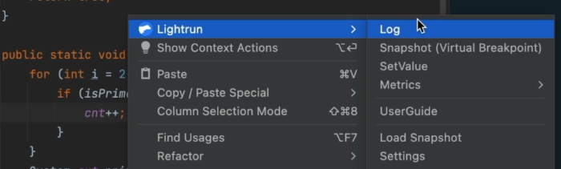
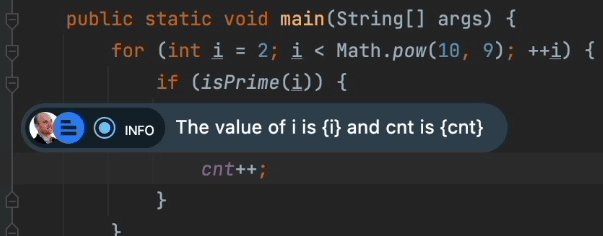
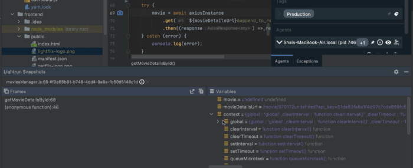
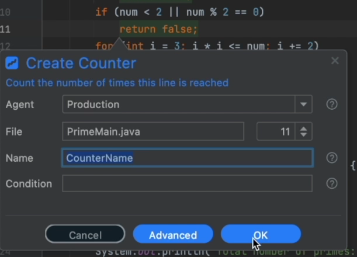

In this post, we'll go over remote debugging. Debugging production with developer observability tools and debugging asynchronous code which presents its own unique challenges!

This is actually material from four separate videos because I wanted to pool some ideas together into a single blog post and the asynchronous stuff got pulled in. So without further ado, these are the applicable videos... Read on for the analysis and discussion:
> 🦆 Duckling the 15th:  
>
> Remote debugging is a powerful yet risky tool. In this video I explain the process, the risks and a partial workaround of SSH tunneling [#CodeNewbie](https://twitter.com/hashtag/CodeNewbie?src=hash&ref_src=twsrc%5Etfw) [#140SecondDucklings](https://twitter.com/hashtag/140SecondDucklings?src=hash&ref_src=twsrc%5Etfw) [pic.twitter.com/nPZaJuKeIs](https://t.co/nPZaJuKeIs)
>
> --- Shai Almog (@debugagent) [May 17, 2022](https://twitter.com/debugagent/status/1526578220174393345?ref_src=twsrc%5Etfw)

> 🦆 Duckling the 17th:  
>
> Add metrics to measure production performance and usage for a specific line or block of code. Without code changes!
>
> Harden your production with PII reduction and blocklists.[#CodeNewbie](https://twitter.com/hashtag/CodeNewbie?src=hash&ref_src=twsrc%5Etfw) [#140SecondDucklings](https://twitter.com/hashtag/140SecondDucklings?src=hash&ref_src=twsrc%5Etfw) [pic.twitter.com/0nhJz03iXe](https://t.co/0nhJz03iXe)
>
> --- Shai Almog (@debugagent) [May 31, 2022](https://twitter.com/debugagent/status/1531653268639825923?ref_src=twsrc%5Etfw)

## Remote Debugging Session

A remote debugger is a feature of pretty much any programming language or platform, but it's pretty common in Java using the [JDWP protocol which we discussed in the past](https://talktotheduck.dev/psa-the-risks-of-remote-jdwp-debugging). As a refresher, JDWP standard for Java Remote Debugging Protocol. It's a wire agnostic protocol that defines the connection between the IDE and the JVM when debugging.

Notice that the real value proposition of remote debugging is on local and not on a remote machine. The value is in connecting to a running process that's outside of our development environment. E.g. in a docker container, etc.

We can launch a remote process in debug mode using code such as this in the command prompt:

```bash
java -agentlib:jdwp=transport=dt_socket,server=y,address=9000 ApplicationName
```

But this is a bit of a problem. JDWP is VERY insecure. As a partial workaround, we can pipe the connection via SSH to the debug target like this:

```bash
ssh remoteUser@remoteHost -L 9000:127.0.0.1:9000 -N
```

Alternatively, with Kubernetes, we can use port forwarding like this:

```bash
kubectl port-forward podname 9000:9000
```

Once we do that, we can use the usual debugging features by connecting directly to the remote server from the IDE by creating a remote debugging target and just running it. Notice that you can do all of that in visual studio code, as discussed [here](https://lightrun.com/debugging/how-to-debug-remotely-in-vs-code/).



We now have a debug session of the application as if we launched it directly from the IDE!

## Production Debugging

Now we might be tempted to just open a JDWP port, but this approach has many problems:

* Restart Process - You need to restart the process to enable debugging - this might not be something you can do in production
* Breakpoints Break - They can stop execution in its place and cause problems in a production environment
* Security - JDWP and more remote debugging protocols are remarkably insecure. Risks include remote code execution, access to source files and much more...
* Stability - This can easily cause a crash of the remote process because of minor mistakes such as a badly crafted expression or even a watch variable
* Privacy issues - imagine a malicious developer from your organization placing a breakpoint in the used login section of the code and siphoning credentials. Or using "set value" to increase his privileges. 60% of security breaches are internal and this removes all checks/balances. It might violate regulations/laws for many industries!
* Scale - we have multiple machines in the cluster. How do we know which machine to debug right now? A request might hit any machine

This is obviously not good. But we need a solution that will address all these issues. After all, the value of tracking a bug on a truly remote machine is tremendous!

### Developer Observability

Observability lets us monitor the production environment without shipping new code. It has been a part of the DevOps toolchain for a while now. At today's scale, managing a cluster without observability is simply impossible.

Developer observability takes these ideas and shifts them left. From the DevOps team to the R\&D team. It gives us the programming language level of observability, directly at the "line of code" level. So it feels like a debugger instance in IntelliJ/IDEA or Visual Studio code. But it's an observability tool that you can use safely without compromising the integrity of the production environment.

Unlike DevOps oriented observability, these tools integrate into the standard development tools, such as IDEs, etc.

We can use the [free version of Lightrun](https://lightrun.com/free) to get started and learn how these tools work. You need to install the Lightrun plugin in the IDE and then set up the agent into production servers. Unlike JDWP, the agent is secure and segregated. We'll discuss this further... But first let's discuss the capabilities.

### Logs

The most simple thing you can do with most developer observability tools is log injection. This lets you add a new log to a running process through an IDE context menu.



We can pipe the log to the debug console in the IDE or we can leave the default which logs it as if you wrote it in the code. This means the log will show up with all your other logs.

Using Elastic or a similar tool?

The log will be ingested like the other logs and will appear in the right order!

Furthermore, you can print variables, method return values, etc. Expression evaluation is done in your programming language of choice, e.g. Java for JVM apps. That way we can print variable values as we do here:



This raises two important concerns:

* Mutability - what if a method invocation changes application state?
* Performance - what if this log brings down performance?

The answer for this differs based on the tool. However, Lightrun specifically runs these expressions in a sandbox. Every expression is analyzed to make sure it's read only and doesn't affect execution. When in doubt, you will get an error and the action won't be performed.

This sandbox also verifies performance. If a specific quota of CPU usage is exceeded, the action is suspended until further details.

The integrity of the remote process server code is kept!

### Snapshots

As I mentioned before, regular breakpoints are an immense problem when debugging production. The core problem is that they "break". Snapshots (AKA Captures or Non-Breaking Breakpoints), solve this problem by not breaking.

They provide us with information similar to the typical breakpoints in source code, which is remarkably useful. We can analyze the stack trace and variable values all around for this point in time. They even support conditional expressions similar to conditional breakpoints. We can grab a snapshot for a specific use case only.



The snapshot is the workhorse of such remote debugging tools. With it, we can get an insight into the production that's normally reserved only for local development tools. Amazingly, we can get this insight without compromising the integrity of the remote machine.

### Tags

Scale is probably one of the biggest challenges with remote debugging. Developer observability tools let us bind any action (log, snapshot or metric) to a tag. This is tantamount to adding the action to all the agents (servers) in the tag.

E.g. you can have a tag based on the platform, e.g. Ubuntu 20. Or based on the type of deployment "Green" etc. This lets you debug at a huge scale, removing the need to guess the remote device that will experience the bug next.

### Counter

Have you ever asked yourself:

Are users actually using this method I've been working so hard to fix/write?

Is this use case even applicable?

Does a user with this flag ever reach this method? If so, then how many?

Getting these deep, low-level insights into the code can completely change the way you code. Why take on a complex task for something that isn't used?

Or maybe we should put more effort into this code since it's such a focal point!

APMs provide some insight, but they provide very coarse grained information. For many cases, I would just add a variable, increment it every time a condition happens and log that information. This is OK for a simple project, but it requires deploying such "hacks" and incurs a lot of noise in the project. That's something most of us don't want.

Counter works just like that, without the hassle and without deploying. You can use conditional counters as you can with every action to count fine grained usage.



### TicToc \& Method Duration

Similarly, we might be curious about the overhead of a specific method or a block of code. The latter is exactly what tictoc enables. It's the equivalent of storing the current time before the code starts. Then logging "current time - start time" when reaching the block end.

The only difference is that this requires no code changes, doesn't affect production and lets us add conditions to the limit.

The output from all the metrics can be piped to statsd/Grafana and plotted to help in the decision-making process.

### PII Reduction and Blocklists

The sandbox is only one part of the security. As we discussed earlier, one of the biggest risks for such a deployment is from internal developers siphoning off data intentionally or not. Furthermore, there are regulatory and legal requirements we need to abide by.

To solve these problems, we have two separate tools. The first is PII Reduction.

Personal Identifiable Information (PII) is a legal term used to qualify private user data that should be kept secure. A great example is a credit card number. Say our User object includes a credit card number field in cache. We log the user object and effectively place the user's credit card number into logs that get ingested everywhere!

This might violate regulations and laws. It's also disallowed by credit card processing and might result in sanctions against the company. PII reduction blocks well-known patterns (credit cards, emails etc.) from appearing in the logs. This prevents potential abuse since more people are exposed to the logs than to the database.

Blocklists let us block specific files/classes from action insertion. That means we can prohibit a developer from adding a snapshot/log etc. to a file that might be risky. E.g. a file that handles the login process should be blocked by default. With these two features, we can harden the deployment further.

## Summary

In the section titled "Production Debugging" above, I listed a few problems in remote debugging. This is how developer observability solves these problems:

* Restart Process - A developer observability tool can run always without increasing security concerns
* Breakpoints Break - Snapshots don't break
* Security - It doesn't open an external port and is connected to a secure management server. As such, it doesn't expose an attack vector
* Stability - This depends on the tool. Some do impact stability while others don't. Tools that include a sandbox (such as Lightrun) remove some of that concern
* Privacy issues - Blocklists and PII Reduction solve those
* Scale - Tags solve that

As you can see, there are many configuration options and capabilities in these developer tools. We can leverage them to solve all the inherent problems in JDWP and fix defective code faster.

With this post, the 140 Second Duckling series on basic debugging is going on hiatus. I'm going to use the summer months to evaluate the impact of this series and decide whether we want to do another series. I like the format and enjoyed doing the videos/posts and I hope to revisit this format moving forward.
