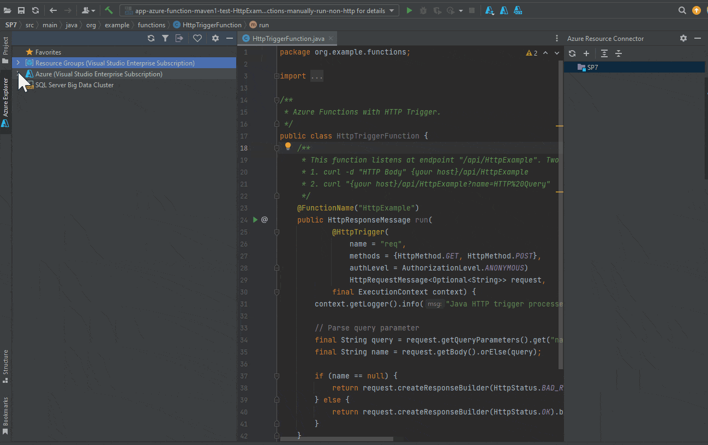
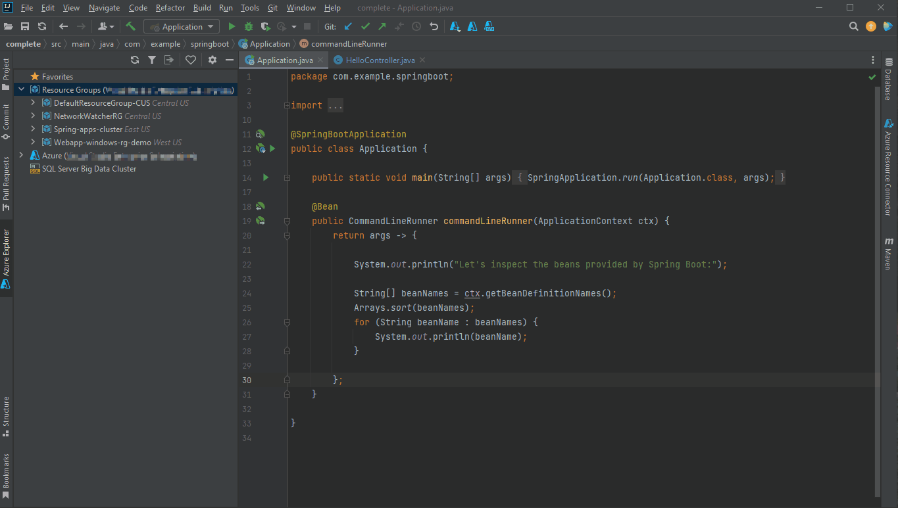
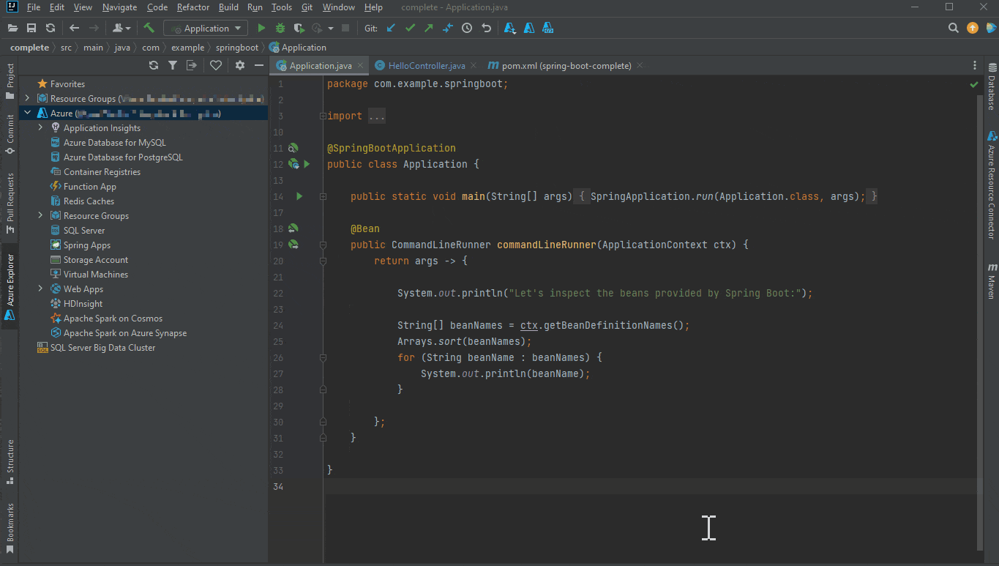
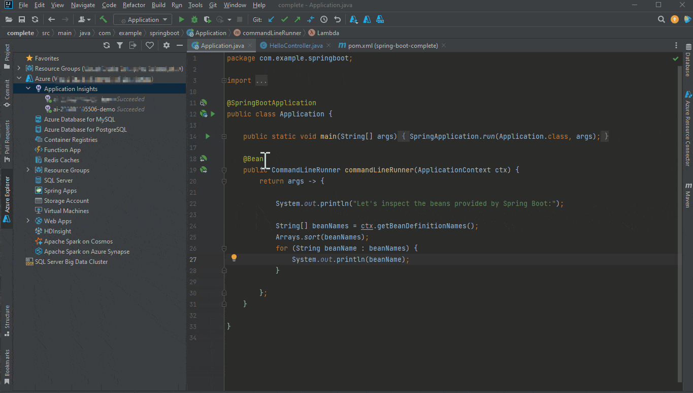
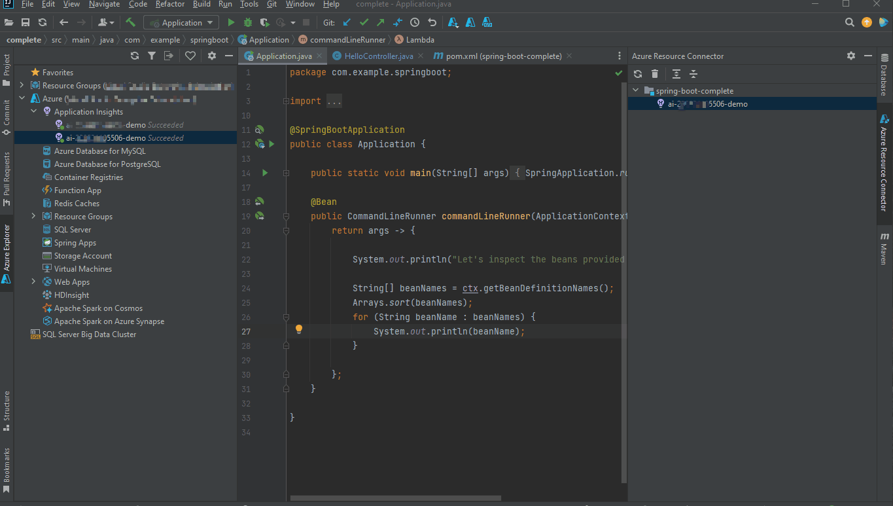
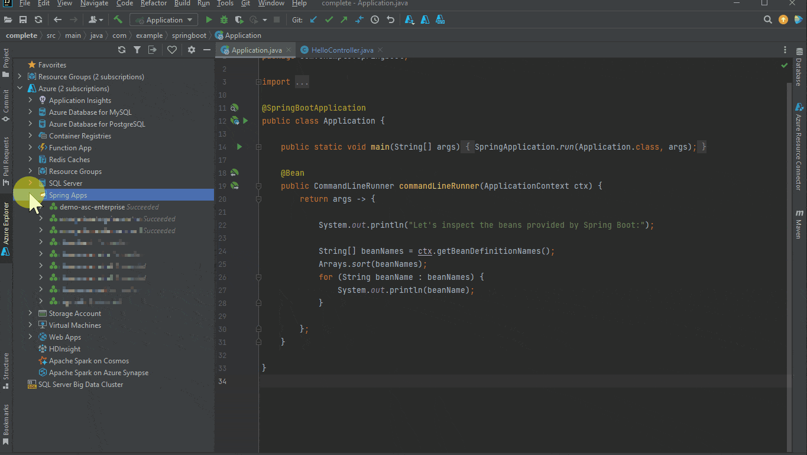
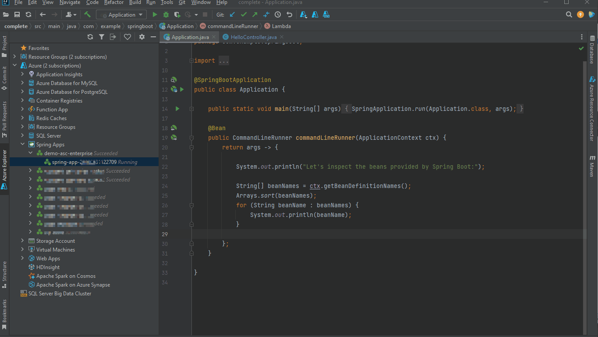
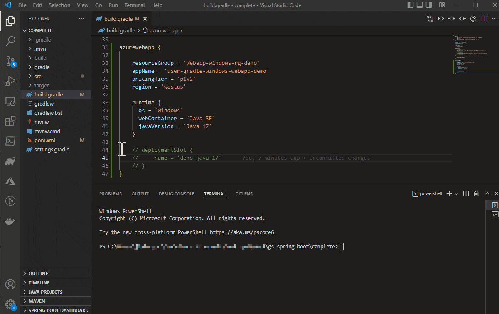
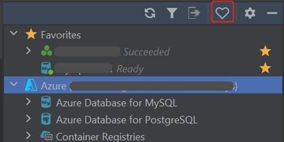

Hi everyone, welcome back to June update of Java on Azure Tooling.

In this update, we will introduce the new application-centric view on Azure toolkit for IntelliJ that will make the interface more user-friendly.

In addition, we have added support for more Azure services.

For Gradle plugins, we have some new features for Azure Web Apps and Azure Functions.

We hope you like these new features and share your feedback with us. So let us get right into it...

Azure Toolkit for IntelliJ Improvements
---------------------------------------

### New Application-centric View in Azure Explorer

In [April's update](https://foojay.io/today/azure-toolkit-for-intellij-april-2022-update/ "April’s blog"), we introduced our application-centric view in the roadmap. The current Azure Explorer has been built over time and expanded to support multiple separate cloud services. The Azure Explorer is the logic collections of Web Apps, Function Apps, Spring Apps, Virtual Machines, Storage Accounts, Databases, and other services. And it is grouped by resource types rather than applications (resource groups).

For developers who operate in Azure explorer, the view will make it complicated to manage and understand different services or offerings involved in one application. We also find that some developers may tend to lose focus or feel overwhelmed within the view of resources grouped by service type.

Based on these reasons, we have been making investments to improve and introduce this new application-centric view. Together with the view, it will help developers recognize and define what is in an application. You will be able to see a view of Azure resources grouped by application.



To use this new feature, you can locate the root node, Resource Groups in the Azure Explorer. You can see all the resources belonging to the same resource group are placed together for each application.

And then you can create or delete a resource to a resource group if needed for each application. Here is a short demonstration for it.



### Application Insights Support

In our latest release, Application Insights is available on Azure Toolkit for IntelliJ, so that developers can manage Application Insights directly in Azure Explorer.

To create it, you just need to locate the Application Insights and right click it and choose "create".



With this enhancement, resource connection could also be configured manually with Azure Resource Connector after you create Application Insights.



When you right click the node in with option "Open Live Metrics", it will take you to the portal of Application Insights, where you can watch Live Metrics Stream while your deployment is happening and find out how your application is currently performing.



### Spring Apps Improvement

As Azure Spring Apps Enterprise is made generally available with [the announcement](https://techcommunity.microsoft.com/t5/apps-on-azure-blog/azure-spring-apps-enterprise-tier-is-now-generally-available/ba-p/3418245 "the announcement") recently, we have made investments to support for Azure Spring Cloud Enterprise tier with our toolkit.

If you choose to use Enterprise pricing tier with Azure Spring apps, you could simply right click the node with the option "Create" under the Spring Apps Cluster node to finish the configuration.



To enhance this experience, we have additionally supported 0.5 core and 512Mi memory for vCPU version.

Besides, you do not need to specify Runtime for Enterprise Tier app since it will auto detect the runtime from either the source code or artifact to deploy. After deployment, you can simply right click the node with the option "Show properties" to see the configuration.



Gradle Plugin Improvements
--------------------------

### Deployment Slots Support

When you deploy your Web Apps or Function Apps to Azure App Service, you can use a separate deployment slot instead of the default production slot.

In this way, you can validate any app changes first in a staging deployment slot and then swap it into production within the same App Service.

```json
azurewebapp {
    ...
    deploymentSlot {
      name = 'xxx'
      configurationSource = 'parent'
    }
}
```


Starting from June, you can try our Gradle plugin for deployment slots support for Azure Web App with version of 1.4.0. and Azure Functions with version of 1.9.0. with the latest release. You could manually add the following configuration in file "build.gradle" and try this new feature.



To learn more about Gradle plugin, you can find more details with [how to deploy Java web apps to Azure with Gradle in one step](https://devblogs.microsoft.com/java/gradle-deploy-java-web-apps-to-azure-in-one-step/ "how to deploy Java web apps to Azure with Gradle in one step").

Feedback and Suggestions
------------------------

Please don't hesitate to try our product! Your feedback and suggestions are very important to us and will help shape our product in future.



* Leave your comment on this post
* [Create a feature request or submit a bug](https://github.com/microsoft/azure-tools-for-java/issues/new "Create a feature request or submit a bug") on our official GitHub Issues page
* [Fill in our survey](https://microsoft.qualtrics.com/jfe/form/SV_b17fG5QQlMhs2up "Fill in our survey")

Resources
---------

Here is a list of links that are helpful to learn Java on Azure Tooling,

* [Azure Toolkit for IntelliJ documentation](https://docs.microsoft.com/en-us/azure/developer/java/toolkit-for-intellij/ "Azure Toolkit for IntelliJ documentation")
* [Azure Toolkit for Eclipse documentation](https://docs.microsoft.com/en-us/azure/developer/java/toolkit-for-eclipse/installation "Azure Toolkit for Eclipse documentation")
* [Maven Plugin for Azure Web Apps/Functions/Spring Cloud](https://github.com/microsoft/azure-maven-plugins/wiki/Azure-Spring-apps "Maven Plugin for Azure Web Apps/Functions/Spring Cloud")
* [Gradle Plugin for Azure Web Apps/Functions](https://github.com/microsoft/azure-gradle-plugins/wiki "Gradle Plugin for Azure Web Apps/Functions")
* [VS Code extension for Azure Spring Cloud](https://code.visualstudio.com/docs/java/java-on-azure "VS Code extension for Azure Spring Cloud")
