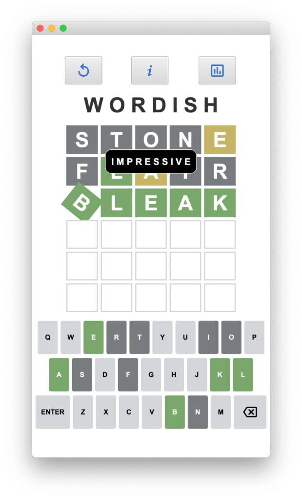
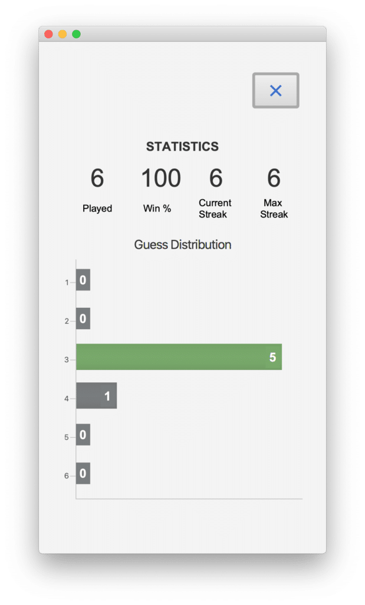
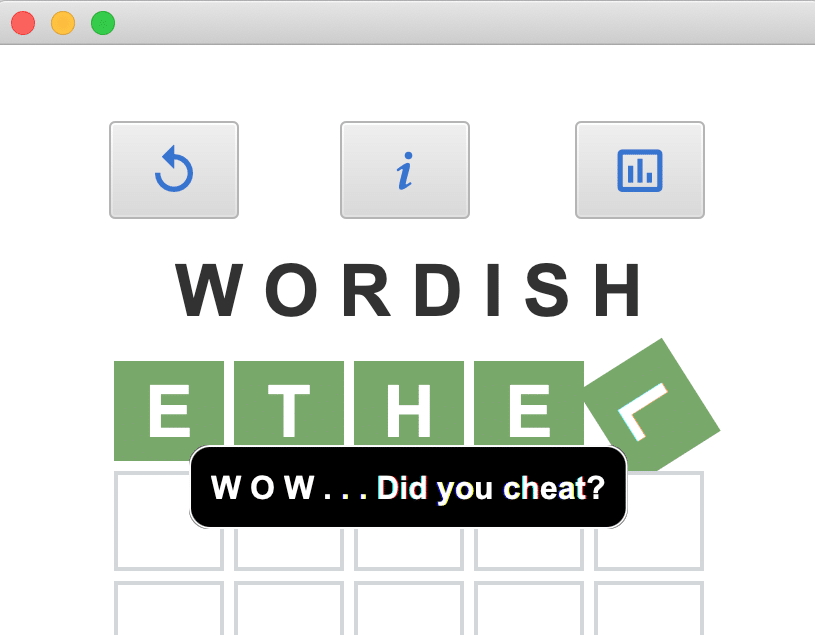

Welcome to Part 5 and the final installment of this series.

* In [Part 1](https://foojay.io/today/wordish-with-javafx-part-1/), we introduced the Wordish game with JavaFX and discussed the main UI layout.
* In [Part 2](http://foojay.io/today/wordish-with-javafx-part-2/), we discussed look and feel enhancements. We introduced specialized Label and Button controls that use pseudo-classes for advanced CSS styling. In addition, we covered incorporating third-party font libraries and customizing Scene Builder to leverage these features.
* Next, in [Part 3](http://foojay.io/today/wordish-with-javafx-part-3/), we explored the controller code that maintains game state and responds to user input with appropriate updates to the UI.
* [Part 4](http://foojay.io/today/wordish-with-javafx-part-4/), **What's in a Word, Anyway?**, examines how we get our words and how we determine if a submitted word is valid.

And now in Part 5, we turn to JavaFX charts, showing how to customize charts with orientation and colors and how to add nodes to the chart scene graph.

Furthermore, we look at implementing a customized Popup control.

Before we start, here's an example screenshot of Wordish.

<figure class="wp-block-image size-large is-resized">
 
 <figcaption>
  Figure 1. Wordish Main View Layout
 </figcaption>
</figure>

You can access the code on github here: <https://github.com/gailasgteach/Wordish>.

Part 5: Chart Your Guesses {#h2-0-part-5-chart-your-guesses}
------------------------------------------------------------

The bar chart icon in the main Wordish view takes you to the Statistics view, where a user can see game statistics accumulated during play.

To do this, we collect the game statistics in a singleton object, GameStats, which includes data collected into object WordStats.

Similar to the Wordle game, we display the number of games played, win percentage, current streak, and maximum streak, as shown in Figure 2.

<figure class="wp-block-image size-large is-resized">
 
 <figcaption>
  Figure 2. Wordish Statistics View
 </figcaption>
</figure>

Below the statistics data, we display the Guess Distribution as a horizontal bar chart. Here you see the left Y axis shows the number of guesses it took the user for a correct answer (1 through 6). Likewise, the corresponding X axis value reflects the number of games at each guess level.

The green bar shows the guess level of the most recent game. However, if the most recent game is a loss, then none of the bars are green.

**Note**: This version of Wordish does not persist game statistics. Maybe in the next version!

Let's show you how to display both these game statistics as well as the JavaFX BarChart Guess Distribution, as shown in Figure 2.

### Keeping Track of the Game Stats {#h3-1-keeping-track-of-the-game-stats}

Class WordStats stores our game-playing statistics as the user works through each game. Here's the WordStats class and its class variables (without the getters and setters). Variable `guessDistribution` is a HashMap with Integer keys and values. The key corresponds to the number of tries a successful play took (a number between 1 and 6, inclusive) and the value is the number of games that took that number of tries. Variable `thisGameGuesses` is how many guesses the most recent game took (one through six). A value of zero means the user did not guess the word in the allotted six tries.

<pre class="EnlighterJSRAW" data-enlighter-language="java" data-enlighter-theme="" data-enlighter-highlight="" data-enlighter-linenumbers="false" data-enlighter-lineoffset="" data-enlighter-title="" data-enlighter-group="">public class WordStats {

    private int gamesPlayed = 0;
    private int totalWins = 0;
    private int currentStreak = 0;
    private int maxStreak = 0;
    public static final int MAX_GUESS = 6;
    private int thisGameGuesses = 0;
    private final Map&lt;Integer, Integer&gt; guessDistribution = 
            new HashMap&lt;&gt;();

    WordStats() {
        // rangeClosed is (1, 2, 3, 4, 5, 6)
            IntStream.rangeClosed(1, MAX_GUESS)
                .forEach(i -&gt; guessDistribution.put(i, 0));
    }
      // setters and getters omitted . . .
}</pre>

**Note** : See **[WordStats.java](https://github.com/gailasgteach/Wordish/blob/master/src/main/java/com/asgteach/model/WordStats.java)** and **[GameStatus.java](https://github.com/gailasgteach/Wordish/blob/master/src/main/java/com/asgteach/model/GameStatus.java)**.

### The Statistics View {#h3-2-the-statistics-view}

FXML file **stats.fxml** describes the Statistics view, shown in Figure 2. The controller class for this view is **StatsController.java** . The `@FXML` annotation provides access to the appropriate Label controls, which we set in the `initialize()` method, as shown here.

<pre class="EnlighterJSRAW" data-enlighter-language="java" data-enlighter-theme="" data-enlighter-highlight="" data-enlighter-linenumbers="false" data-enlighter-lineoffset="" data-enlighter-title="" data-enlighter-group="">public class StatsController {

    @FXML
    private Label statPlayed;
    @FXML
    private Label statPercent;
    @FXML
    private Label statCurrent;
    @FXML
    private Label statMax;

    private final WordStats ws = gameStatus.getWordStats();
        . . .
    public void initialize() {
            statPlayed.setText(String.valueOf(ws.getGamesPlayed()));
            statPercent.setText(String.format("%4.0f", 
                   ws.getWinPercentage()));
            statCurrent.setText(String.valueOf(ws.getCurrentStreak()));
            statMax.setText(String.valueOf(ws.getMaxStreak()));
              . . .
      }
}</pre>

**Note** : See **[stats.fxml](https://github.com/gailasgteach/Wordish/blob/master/src/main/resources/com/asgteach/stats.fxml)** and **[StatsController.java](https://github.com/gailasgteach/Wordish/blob/master/src/main/java/com/asgteach/StatsController.java)**.

### Adding Data to the Bar Chart {#h3-3-adding-data-to-the-bar-chart}

The lower portion of the Statistics view is a Bar Chart. Notably, JavaFX charts are extremely flexible, but have added complexity. The Bar Chart for our use case, however, is fairly straightforward.

First, the Bar Chart is an XY Chart with a two-dimensional XY axis. You can orient a Bar Chart vertically, where the bars grow up from the X-axis. In this case, the X-axis is the "category axis," a String representation of data that is categorized.

Alternatively, you can orient a Bar Chart horizontally (as in Figure 2), where the bars grow left to right from the Y-axis. Consequently, the Y-axis is now the "category axis" and we therefore use String values to represent our Guess Distribution categories: strings "1" through "6".

Here are the BarChart, NumberAxis, and CategoryAxis UI controls for Wordish. First, the X-axis is the first BarChart attribute (Number) while the Y-axis is the second attribute (String). Next, the chart's data is stored in an ObservableList whose type is `BarChart.Series<Number, String>`. This is a named series of data items. (XYCharts manipulate a list of lists.)

<pre class="EnlighterJSRAW" data-enlighter-language="java" data-enlighter-theme="" data-enlighter-highlight="" data-enlighter-linenumbers="false" data-enlighter-lineoffset="" data-enlighter-title="" data-enlighter-group="">    @FXML
    private BarChart&lt;Number, String&gt; barChart;
    @FXML
    private NumberAxis xAxis;
    @FXML
    private CategoryAxis yAxis;

    private final ObservableList&lt;BarChart.Series&lt;Number, String&gt;&gt; bcData
            = FXCollections.observableArrayList();</pre>

### Method `getBarChartData()` {#h3-4-method-getbarchartdata}

Although a Bar Chart can have multiple series, we have only one series here. We pull our data from the `guessDistribution` hashmap and fill the list as follows.

We add each data item to the front of the list (index 0). Consequently, the Guess Distribution data displays with guess "1" at the top and guess "6" at the bottom. As noted, the CategoryAxis (`y-axis`) expects a String and therefore, we convert the hashmap's Integer key to a String. We subsequently add the series to the chart data `bcData`.

<pre class="EnlighterJSRAW" data-enlighter-language="java" data-enlighter-theme="" data-enlighter-highlight="" data-enlighter-linenumbers="false" data-enlighter-lineoffset="" data-enlighter-title="" data-enlighter-group="">private ObservableList&lt;XYChart.Series&lt;Number, String&gt;&gt; getBarChartData() {
        XYChart.Series&lt;Number, String&gt; series = new XYChart.Series&lt;&gt;();
        ws.getGuessDistribution().keySet().forEach(key -&gt; {
            series.getData().add(0,
                    new BarChart.Data&lt;&gt;(
                            ws.getGuessDistribution().get(key),
                            String.valueOf(key)));
        });

        bcData.add(series);
        return bcData;
}</pre>

**Note** : See **[StatsController.java](https://github.com/gailasgteach/Wordish/blob/master/src/main/java/com/asgteach/StatsController.java)**.

### Customizing the Bar Chart {#h3-5-customizing-the-bar-chart}

A standard JavaFX Bar Chart uses default colors for each of its data series. We can easily change the default color with CSS, as shown below. Here, we set the `.chart-bar` selector attribute `-fx-bar-fill` to our previously defined `-fx-nomatch-color` (a gray color). We similarly set the `.chartlabel` selector (which styles the specialized Label nodes, discussed next) to use the same `-fx-nomatch-color`, with `-fx-text-fill` set to white.

<pre class="EnlighterJSRAW" data-enlighter-language="css" data-enlighter-theme="" data-enlighter-highlight="" data-enlighter-linenumbers="false" data-enlighter-lineoffset="" data-enlighter-title="" data-enlighter-group="">.chart-bar {
    -fx-bar-fill: -fx-nomatch-color;
}

.chartlabel {
    -fx-background-color: -fx-nomatch-color;
    -fx-text-fill: white;
    -fx-padding: 2 5 3 5;
}</pre>

Recall that both the bar chart color and label will be green for the most recently played game. These we set in the controller code shown below. First, we locate the bar chart node corresponding to the Y-axis value of the current game. Then, we set the `-fx-bar-fill` of the bar chart node and the `-fx-background-color` of the label to `-fx-match-color` (green).

<pre class="EnlighterJSRAW" data-enlighter-language="java" data-enlighter-theme="" data-enlighter-highlight="" data-enlighter-linenumbers="false" data-enlighter-lineoffset="" data-enlighter-title="" data-enlighter-group="">. . .   
if (data.getYValue().equals(String.valueOf(ws.getThisGameGuesses()))) {
      node.setStyle("-fx-bar-fill: -fx-match-color;");
      mylabels.get(i).setStyle("-fx-background-color: -fx-match-color;");
}
. . . </pre>

**Note** : See **[styles.css](https://github.com/gailasgteach/Wordish/blob/master/src/main/resources/com/asgteach/style.css)** and **[StatsController.java](https://github.com/gailasgteach/Wordish/blob/master/src/main/java/com/asgteach/StatsController.java)** (method `fixLabels()`).

### Adding Controls to a Chart Node Structure {#h3-6-adding-controls-to-a-chart-node-structure}

A standard bar chart has a grid with labels that show the value of each bar. In our case, we display the category labels for the Y-axis data (the number of guesses). However, we don't use default labels for the X-axis. Instead, we have separate Label controls that we define in the FXML: one Label for each of the chart's bars.

In building our bar chart, we need to compute Label placements so they appear at the end of the bar (at the right hand edge). While this should be a straightforward task, the fact that the chart layout and CSS rendering are not fully complete when the controller class initializes complicates this task. That is, querying a node where it is located in the XY-space can return incorrect information if you ask this question too early (such as during the controller initialization method, `initialize()`).

To calculate the Label placement at the right time, we add a change listener to the scenegraph's scene property, which is invoked when the scene updates to the new scenegraph. This occurs after the `initialize()` method completes. However, it's still possible that chart data may not be fully rendered, even at this point. There are several approaches, which entail computing bounds and layout information at a (slightly) later time.

#### Approach 1: Create a Delay

A straightforward tactic is to create a 50 millisecond delay. This gives the JavaFX rendering task time to complete. Then, we can accurately query the placement of the bar chart nodes and place the Label controls at the right-hand edge.

Here's the scene property change listener with the delay. We create a Timeline with a 50-millisecond key frame. After finishing, we invoke method `fixLabels()`, which moves the Label controls to their correct place on the chart.

<pre class="EnlighterJSRAW" data-enlighter-language="java" data-enlighter-theme="" data-enlighter-highlight="" data-enlighter-linenumbers="false" data-enlighter-lineoffset="" data-enlighter-title="" data-enlighter-group="">        pane.sceneProperty().addListener(changeListener =
                (ObservableValue&lt;? extends Scene&gt; observableScene,
                        Scene oldScene, Scene newScene) -&gt; {
            if (oldScene == null &amp;&amp; newScene != null) {
                new Timeline(
                        new KeyFrame(Duration.millis(50), 
                            ae -&gt; fixLabels()))
                        .play();
            }
        });</pre>

#### Approach 2: Force JavaFX to Render the Scene

But wait, there's more! If creating a delay feels wrong to you, there's another approach. Take a "snapshot" of the layout container that holds the chart and the labels. This returns a rendered image when the snapshot is complete. Importantly, JavaFX processes the CSS and layout for the scenegraph prior to rendering. And voilà! You can then query the position of the bar chart's nodes for placement purposes.

Here's the alternate scene property change listener that invokes method `snapshot()`.

<pre class="EnlighterJSRAW" data-enlighter-language="java" data-enlighter-theme="" data-enlighter-highlight="" data-enlighter-linenumbers="false" data-enlighter-lineoffset="" data-enlighter-title="" data-enlighter-group="">       pane.sceneProperty().addListener(changeListener
                = (ObservableValue&lt;? extends Scene&gt; observableScene,
                        Scene oldScene, Scene newScene) -&gt; {
          if (oldScene == null &amp;&amp; newScene != null) {
              WritableImage image = pane.snapshot(
                         new SnapshotParameters(), null);
              fixLabels();
          }
       });</pre>

And here is method `fixLabels()`. You've already seen the code that updates the CSS. We use `translateX()` and `translateY()` to move the Label to its desired place in the bar chart. We set the Label's `text` property with the data's X-value.

<pre class="EnlighterJSRAW" data-enlighter-language="java" data-enlighter-theme="" data-enlighter-highlight="" data-enlighter-linenumbers="false" data-enlighter-lineoffset="" data-enlighter-title="" data-enlighter-group="">    public void fixLabels() {
        // this code only works after the scene is completely rendered
        List&lt;Label&gt; mylabels = pane.getChildren().stream()
                .filter(sc -&gt; sc instanceof Label)
                .map(Label.class::cast)
                .collect(Collectors.toList());
        mylabels.stream().forEach(l -&gt; {
            l.toFront();
            l.getStyleClass().add("chartlabel");
        });
        // find chart area Node
        Node chartArea = barChart.lookup(".chart-plot-background");
        XYChart.Series&lt;Number, String&gt; series = barChart.getData().get(0);

        IntStream.range(0, series.getData().size())
          .forEach(i -&gt; {
                    Data&lt;Number, String&gt; data = series.getData().get(i);
                    Node node = data.getNode();
                    . . . code to update css, see above . . .
                    // Place the label on the bar
                    // the stackpane centers the labels first
                    Bounds nodeBounds = node.localToScene(
                             chartArea.getBoundsInLocal());
                    // Get the display position along xAxis/yAxis 
                    // for a given X/Y-value.
                    double displayPositionX = xAxis.getDisplayPosition(
                            data.getXValue());
                    double displayPositionY = yAxis.getDisplayPosition(
                            data.getYValue());
                    mylabels.get(i).setText(data.getXValue().toString());
                    if (displayPositionX == 0.0) {
                        mylabels.get(i).setTranslateX(
                              20 - (nodeBounds.getWidth() / 2));
                    } else {
                        mylabels.get(i).setTranslateX(
                             displayPositionX - 4 - (
                             (nodeBounds.getWidth()) / 2));
                    }
                    mylabels.get(i).setTranslateY(displayPositionY + 21);
                    mylabels.get(i).setVisible(true);
            });
    }</pre>

Note that the critical code that depends on CSS and layout rendering includes the display position of the X- and Y-axis and the bounds area of the chart.

**Note** : See **[StatsController.java](https://github.com/gailasgteach/Wordish/blob/master/src/main/java/com/asgteach/StatsController.java)** (method `fixLabels()`).

### Implementing a PopUp Control {#h3-7-implementing-a-popup-control}

Wordish uses a PopUp control to display messages to users who play the game. We use a popup when the user

* submits an "invalid" word;
* fails to submit the correct word within six tries;
* submits the correct word. In this case, the message varies depending on how many tries it takes.

Figure 3 shows the popup control after guessing the word in one try. (Spoiler alert, I did cheat!)

<figure class="wp-block-image size-full is-resized">
 
 <figcaption>
  Figure 3. The Wordish Popup
 </figcaption>
</figure>

We style the popup with CSS as shown here.

<pre class="EnlighterJSRAW" data-enlighter-language="css" data-enlighter-theme="" data-enlighter-highlight="" data-enlighter-linenumbers="false" data-enlighter-lineoffset="" data-enlighter-title="" data-enlighter-group="">.popup {
    -fx-background-color: black;
    -fx-padding: 10;
    -fx-border-color: white;
    -fx-text-fill: white;
    -fx-font-size: 16;
    -fx-font-weight: bold;
    -fx-font-family: "Arial";
    -fx-text-alignment:center;
    -fx-border-radius: 10 10 10 10;
    -fx-background-radius: 10 10 10 10;
}</pre>

The background is black with a white border and white text fill. The control has rounded corners and the text is center-aligned.

Here is the WordPopup control. Our popup builds a Popup window (a JavaFX special control that displays information, such as messages or tooltips) and installs a single Label control.

Method `show()` invokes `createPopup()`, creates and sets the label, and shows the popup.

The `setOnShown()` event handler positions the popup at the center of the stage a third of the way down from the top. A timer hides the popup after 2.5 seconds.

<pre class="EnlighterJSRAW" data-enlighter-language="java" data-enlighter-theme="" data-enlighter-highlight="" data-enlighter-linenumbers="false" data-enlighter-lineoffset="" data-enlighter-title="" data-enlighter-group="">public class WordPopup {

    private static final int POPUP_TIMEOUT = 2500;

        private static Popup createPopup(final String message) {
            final Popup popup = new Popup();
            popup.setAutoFix(true);
            Label label = new Label(message);
            label.getStylesheets().add(WordishApp.class.getResource(
                         "style.css").toExternalFo‌​rm());
            label.getStyleClass().add("popup");
            popup.getContent().add(label);
            return popup;
        }

        public static void show(final String message, 
                              final Control control) {
            Stage stage = (Stage) control.getScene().getWindow();
            final Popup popup = createPopup(message);
            popup.setOnShown(e -&gt; {
                popup.setX(stage.getX() 
                       + stage.getWidth() / 2 
                       - popup.getWidth() / 2);
                popup.setY(stage.getY() 
                       + stage.getHeight() / 3 
                       - (popup.getHeight()/2) - 10 );
            });
            popup.show(stage);

            new Timeline(new KeyFrame(
                    Duration.millis(POPUP_TIMEOUT),
                    ae -&gt; popup.hide())).play();
        }

}</pre>

Here is an example of how we display the WordPopup during game play. The actual message in this example depends on how many guesses the user took to submit the correct word (variable `rownum`).

<pre class="EnlighterJSRAW" data-enlighter-language="java" data-enlighter-theme="" data-enlighter-highlight="" data-enlighter-linenumbers="" data-enlighter-lineoffset="" data-enlighter-title="" data-enlighter-group="">        if ((list.stream()
                .filter(c -&gt; !c.getMatchResult().equals(MATCHING))
                .count() == 0)) {   //match!
            WordPopup.show(messages.get(rownum), enterButton);
            animateSuccessGroup(list);
            updateGameState(true);
        } else . . . 
</pre>

**Note** : See **[WordPopup.java](https://github.com/gailasgteach/Wordish/blob/master/src/main/java/com/asgteach/modelview/WordPopup.java)** , **[WordishController.java](https://github.com/gailasgteach/Wordish/blob/master/src/main/java/com/asgteach/WordishController.java)** , and **[styles.css](https://github.com/gailasgteach/Wordish/blob/master/src/main/resources/com/asgteach/style.css)**.

That's it! I hope you have enjoyed this tour of implementing the Wordish game in JavaFX. I encourage you to try your hand at creating a JavaFX application. Start here: <https://start.gluon.io/>. This handy page generates a starter JavaFX maven project for you.

I'd like to give a shout-out to [Gluon](https://gluonhq.com/), who does an incredible job of maintaining and enhancing JavaFX and [Scene Builder](https://gluonhq.com/products/scene-builder/). In fact, JavaFX 19 early release is available: get the latest early release version here: <https://gluonhq.com/products/javafx/#ea>.

I'd also like to thank Johan Vos (@johanvos) and José Pereda (@JPeredaDnr), who have both helped me tremendously during my JavaFX journey.
