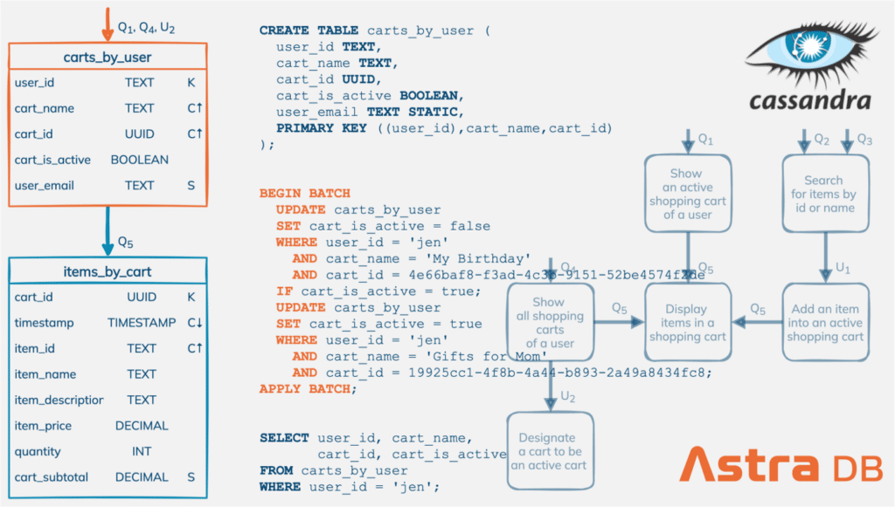
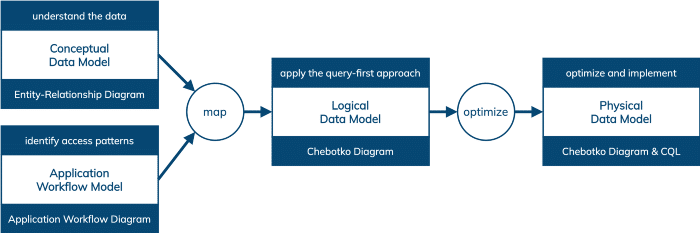
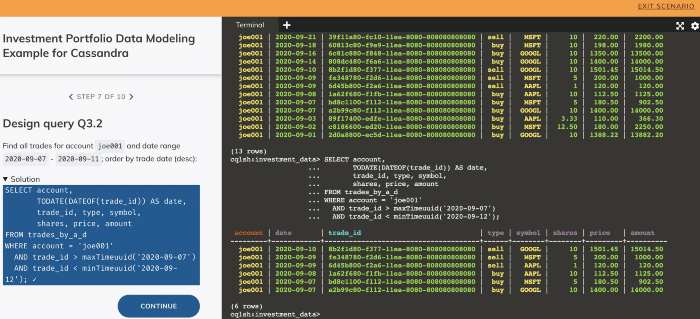

What does it take to build an efficient and sound data model for [Apache Cassandra](https://cassandra.apache.org/)® and [DataStax Astra DB](https://astra.dev/3z6AFNd)? Where would one start? Are there any data modeling rules to follow? Can it be done consistently time and time again? The answers to these and many other questions can be found in the Cassandra data modeling methodology.{#3856}

In this post, we present a high-level overview of the data modeling methodology for Cassandra and [Astra DB](https://astra.dev/3z6AFNd), and share over half a dozen complete data modeling examples from various real-life domains. We apply the methodology to create Cassandra and Astra DB data models for IoT, messaging data, digital library, investment portfolio, time series, shopping cart, and order management. We even provide our datasets and queries for you to try.{#4bd9}

As a side note, if you are new to Cassandra or if the terms [single-row partitions](https://www.datastax.com/learn/cassandra-fundamentals/tables-single-row-partitions) and [multi-row partitions](https://www.datastax.com/learn/cassandra-fundamentals/tables-multi-row-partitions) sound unfamiliar, we recommend taking a closer look at [Cassandra Fundamentals](https://www.datastax.com/learn/cassandra-fundamentals) before deep diving into data modeling.{#3558}

*Data modeling* is a process that involves many activities:{#25a3}

* Collecting and analyzing data requirements
* Understanding domain entities and relationships
* Identifying data access patterns
* Organizing and structuring data in a particular way
* Designing and specifying a database schema
* Optimizing schema and data indexing techniques

Data modeling can have a profound effect on data quality and data access. For data quality, think about data completeness, consistency, and accuracy. With respect to data access, think about queryability, efficiency, and scalability. An efficient and sound data model is crucial for both data and applications.{#cd51}

Our *methodology* defines how the data modeling process can be carried out in a well-organized and repeatable fashion. In particular, the Cassandra data modeling methodology is based on four objectives, four models, and two transitions; along with specific modeling, visualization, mapping, and optimization techniques and methods.{#48ff}
 Figure 1: Cassandra data modeling methodology.

## **Four objectives**

The Cassandra data modeling process, when discussed at a high level, can be distilled into these four key objectives:{#d3c1}

1. **Understand the data:**Whether starting from scratch or dealing with an existing dataset, do you understand data that needs to be managed? Things like entities, relationships, and key constraints come to mind.
2. **Identify data access patterns:** Do you have a good idea of what a data-driven application should be able to do? Think of tasks (or microservices) and their required data access patterns, execution sequences and workflows, and how data retrieved in one task is used by the next one.
3. **Apply the query-first approach:** Do you know how to design Cassandra tables to support specific queries? It is called a query-first or query-driven approach because designing table schemas depends on both data and queries.
4. **Optimize and implement:** How do you verify that both database tables and application queries are efficient and scalable? For example, large partitions and queries that access many partitions may require additional optimizations.

## **Four models**

The four models directly correspond to the four objectives and are meant to make the process more concrete, manageable, repeatable, documentable, collaborative, and shareable. They are:{#2291}

1. **Conceptual data model:** A technology-independent, high-level view of data. Its purpose is to understand the data in a particular domain. While there are a number of conceptual data modeling techniques, we use the *Entity-Relationship Model* and *Entity-Relationship Diagrams* in *Chen's Notation* to document entity types, relationship types, attribute types, and cardinality and key constraints.
2. **Application workflow model:**A technology-independent, high-level view of a data-driven application, consisting of application tasks, execution dependencies, and access patterns. Its purpose is to identify data access patterns and how they may be executed in sequences. These include queries, inserts, updates, and deletes required by different data-driven tasks. We use simple graph-like diagrams to represent application workflows.
3. **Logical data model:** A Cassandra-specific data model featuring tables, materialized views, secondary indexes, user-defined types, and other database schema constructs. It is derived from a conceptual data model by organizing data into Cassandra-specific data structures based on data access patterns identified by an application workflow. This is where the query-first approach is applied. Logical data models can be conveniently captured and visualized using *Chebotko Diagrams* that can feature tables, materialized views, indexes, and so forth.
4. **Physical data model** : A Cassandra-specific data model that is directly derived from a logical data model by analyzing and optimizing for performance. Physical data models can be conveniently captured and visualized using *Chebotko Diagrams* and implemented in Cassandra using CQL.

## **Two transitions**

To complete the picture, the methodology must define the transitions between the models:{#b756}

* Mapping a conceptual data model and an application workflow model to a logical data model
* Optimizing a logical data model to produce a physical data model

In many aspects, the transitions are the most interesting and profound components of the methodology. To carry out the first transition, the methodology defines *mapping rules* and *mapping patterns* . For the second transition, some common *optimization techniques* include splitting and merging partitions, data indexing, data aggregation, and concurrent data access optimizations.{#e78e}

You can find more information about the Cassandra data modeling methodology in the [original paper](https://www.dropbox.com/s/4bu0dy0ayrqygei/cassandra-data-modeling-methodology-paper.pdf), [conference presentation](https://www.dropbox.com/s/3cul3hqzr84bark/cassandra-data-modeling-methodology-presentation.pdf), or [DataStax Academy video course DS220](https://auth.cloud.datastax.com/auth/realms/CloudUsers/protocol/saml/clients/absorb).{#9a64}

One of the best ways to become skilled in data modeling is to explore concrete examples. We maintain [this growing collection of data modeling examples](https://www.datastax.com/learn/data-modeling-by-example) from various domains to help you get started with Cassandra and Astra DB data modeling. Each example applies the Cassandra data modeling methodology to produce and visualize four important artifacts: conceptual data model, application workflow model, logical data model, and physical data model.{#8b81}

Moreover, each example has a hands-on portion with practice questions and solutions. The hands-on scenarios make it straightforward to implement a data model in Cassandra, express data access patterns as CQL queries and run the queries against our sample datasets.{#9901}
 Figure 2: Example hands-on scenario with schema, data, and queries.

Go ahead and explore these data models, and execute real queries against them in your browser:{#f0f0}

* [Sensor data model](https://www.datastax.com/learn/data-modeling-by-example/sensor-data-model): Modeling sensor networks, sensors, and temperature measurements. The resulting database schema has four tables supporting four data access patterns.
* [Messaging data model](https://www.datastax.com/learn/data-modeling-by-example/messaging-data-model): Modeling users, email folders, emails, and email attachments. The resulting database schema has five tables supporting four data access patterns.
* [Digital library data model](https://www.datastax.com/learn/data-modeling-by-example/digital-library-data-model): Modeling performers, albums, album tracks, and users. The resulting database schema has eight tables supporting nine data access patterns.
* [Investment portfolio data model](https://www.datastax.com/learn/data-modeling-by-example/investment-data-model): Modeling users, investment accounts, trades, and trading instruments. The resulting database schema has six tables supporting seven data access patterns.
* [Time series data model](https://www.datastax.com/learn/data-modeling-by-example/time-series-model): Modeling IoT data sources, groups of related sources, metrics, data points, and time series with higher or lower resolution. The resulting database schema has seven tables supporting seven data access patterns.
* [Shopping cart data model](https://www.datastax.com/learn/data-modeling-by-example/shopping-cart): Modeling users, items, and shopping carts. The resulting database schema has three tables and one materialized view supporting seven data access patterns, including updates that use batches and lightweight transactions.
* [Order management data model](https://www.datastax.com/learn/data-modeling-by-example/order-management): Modeling users, payment methods, addresses, items, shopping carts, orders, delivery options, and order statuses. The resulting database schema has four tables supporting five data access patterns, including multi-step updates that use lightweight transactions.

[Astra DB](https://astra.dev/3z6AFNd) is a cloud database service built on Apache Cassandra. It is a serverless and multi-region service that works in AWS, Azure and GCP. If you haven't already, you should take advantage of [Astra DB's free tier](https://astra.dev/3z6AFNd) to create your own fully managed Cassandra database in the cloud. After all, how many multi-cloud, multi-region, serverless databases built on open-source technologies do you know? Astra DB is the first one.{#7880}

Astra DB databases are Cassandra databases. The same data modeling methodology applies and the above example data models can be instantiated in Astra DB. However, there are a couple of minor differences that you may want to be aware of:{#3898}

* Astra DB does not support materialized views. [Materialized views](https://www.datastax.com/learn/cassandra-fundamentals/materialized-views) are experimental in Cassandra and the use of regular tables is usually recommended instead.
* Astra DB does not support user-defined functions. Strictly speaking, user-defined functions are not data modeling constructs. They usually can be readily replaced with computation outside of a database.
* Astra DB supports *Storage-Attached Indexing* or SAI. [Storage-attached indexes](https://www.datastax.com/dev/cassandra-indexing) in Astra DB are secondary indexes with better performance, space efficiency, and more capabilities than [regular secondary indexes or experimental SASI](https://www.datastax.com/learn/cassandra-fundamentals/secondary-indexes) in Cassandra. With that said, it is important to understand that SAI and other secondary indexes still have the same [use cases and limitations](https://www.datastax.com/learn/cassandra-fundamentals/secondary-indexes), and should be used with caution.

The Astra DB and Cassandra differences with respect to materialized views, user-defined functions, and secondary indexes should not have any profound effect on data modeling.{#c2dd}

[K8ssandra](https://k8ssandra.io/) is a cloud-native distribution of Cassandra that runs on Kubernetes. Besides Cassandra, the distribution also includes several integrated components that enable richer data APIs, and provide better automation for observability, metrics monitoring, backup and restore, and data anti-entropy services.{#f096}

K8ssandra is open-source, free to use, and data modeling in K8ssandra is identical to data modeling in Cassandra.{#cc8c}

[Stargate](https://stargate.io/) is an open-source data gateway deployed between applications and a database. It supports different API options for an application to interact with Cassandra, Astra DB, and K8ssandra. Stargate's API extensions include CQL, REST, GraphQL, and Document APIs.{#847c}

The use of CQL, REST, and GraphQL APIs has no effect on data modeling: the same data modeling methodology applies.{#82e4}

The use of Document API has a significant impact on data modeling. With Document API, the focus shifts from organizing data as rows, columns, and partitions to structuring data as JSON documents. Stargate then uses the [predefined mapping](https://stargate.io/2020/10/19/the-stargate-cassandra-documents-api.html) to shred JSON documents and store them as rows in Cassandra tables. The topic of data modeling for document databases is beyond the scope of this article.{#6df9}

Data modeling in Cassandra and Astra DB is a very important topic and we just scratched the surface in this post. We presented a high-level overview of the Cassandra data modeling methodology and urged you to sharpen your skills by exploring the [data modeling examples](https://www.datastax.com/learn/data-modeling-by-example). We also established that data modeling in Cassandra, Astra DB, and K8ssandra are practically identical; with [Astra DB](https://astra.dev/3z6AFNd) having a significant advantage of being serverless and fully managed. Finally, we briefly discussed how Stargate APIs — namely CQL, REST, GraphQL, and Document APIs — can affect data modeling.{#66f8}

*Explore* [*DataStax Academy*](https://auth.cloud.datastax.com/auth/realms/CloudUsers/protocol/saml/clients/absorb)*to get certified in Apache Cassandra with hands-on courses. You can also* [*subscribe to our event alert*](https://docs.google.com/forms/d/e/1FAIpQLSfEtzzVauuFpFJWUiepYndqchBpNsaOwm6raPJDsMt9nTvMbw/viewform)*to get notified about our latest developer workshops. Lastly, follow* [*DataStax on Medium*](https://datastax.medium.com/)*for exclusive posts on all things Cassandra, streaming, Kubernetes, and more.*{#53d3}

1. [Apache Cassandra](https://cassandra.apache.org/)
2. [Astra DB](https://astra.dev/3z6AFNd)
3. [K8ssandra](https://k8ssandra.io/)
4. [Stargate](https://stargate.io/)
5. [Cassandra Fundamentals](https://www.datastax.com/learn/cassandra-fundamentals)
6. [Data Modeling by Example](https://www.datastax.com/learn/data-modeling-by-example)
7. [A Big Data Modeling Methodology for Apache Cassandra](https://www.dropbox.com/s/4bu0dy0ayrqygei/cassandra-data-modeling-methodology-paper.pdf)
8. [DataStax Academy DS220: Data Modeling with Apache Cassandra](https://auth.cloud.datastax.com/auth/realms/CloudUsers/protocol/saml/clients/absorb)
9. [Using the Chebotko Method to Design Sound and Scalable Data Models for Apache Cassandra](https://www.dropbox.com/s/3cul3hqzr84bark/cassandra-data-modeling-methodology-presentation.pdf)
