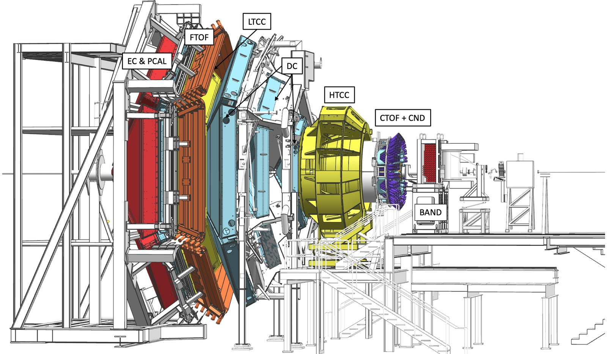

## Background

The CLAS12 detector at Jefferson Lab conducts nuclear physics experiments to study the structure of nucleons and new particle states.

At the core of detector setup are drift chambers that measure charged particles resulting from the interaction of an electron beam with a liquid hydrogen target.

The charged particles are reconstructed by combining segments of the track measured in 6 separate drift chambers along the particle trajectory.

In high-intensity experiments, detector systems produce noise segments increasing the combinatorics of track candidates to be analyzed by the conventional algorithm, which leads to decreased track reconstruction efficiency.

We have developed a Neural Network that allows track candidate classification using combinations of segments that lead to improved efficiency in a single track reconstruction by 12%-15%. The resulting impact on physics is an increase in statistics from 15%-35%.

The full research paper is available [here](https://arxiv.org/abs/2202.06869 "here").

The figure below shows two reactions where missing nucleon was identified through the missing mass of detected particles, and shows significant increase in statistics (solid line) when using AI to identify tracks through their segments in the drift chambers.


## Implementation

We used the Deep Netts library to implement our neural networks to do track classification, using Multi-Layer Perceptron (MLP) Neural Network (aka [Feed Forward Neural Network](https://www.deepnetts.com/apidocs/deepnetts/net/FeedForwardNetwork.html "Feed Forward Neural Network")).

We also implemented MLP based auto-encoder to reconstruct missing segments from part of the detector with intrinsic inefficiencies.

The reconstruction software infrastructure for CLAS12 detector is a Service Oriented Architecture (SOA) written in Java.


We searched for Java machine learning libraries that can be easily integrated into our software infrastructure.

One of the most popular libraries is DeepLearning4J which is implemented through JNI and requires native libraries for all platforms to work in heterogeneous environments. Unfortunately, this leads to a very large size (\>1GB) to link to the code.

Many other libraries that we found on the web had an incomplete implementation of different types of networks and were not very well documented.

The Deep Netts library is a lightweight native Java library that has a very good and well-documented API that helped us in the rapid development and testing of prototype neural networks and implementation in the workflow.

The solution is implemented using the Deep Netts community edition, an open source version of the library. The example code below shows how to create and train Feed Forward Neural Network using Deep Netts.

```java
// create instance of multi layer perceptron using builder
FeedForwardNetwork neuralNet = FeedForwardNetwork.builder()
        .addInputLayer(numInputs)
        .addFullyConnectedLayer(5, ActivationType.TANH)
        .addOutputLayer(numOutputs, ActivationType.SOFTMAX)
        .lossFunction(LossType.CROSS_ENTROPY)
        .build();

// configure training
BackpropagationTrainer trainer = neuralNet.getTrainer();
trainer.setMaxError(0.03f);
trainer.setLearningRate(0.01f);

// train neural network
neuralNet.train(trainingSet);
```

## Our Experience

One of the attractive points of Deep Netts is that it is written in pure Java which makes it very easy to deploy on any platform.

In the future, we would like to see more networks implemented, such as RNN and Trees (Boosted Decision Trees, Random Forest).

One of the weak parts of Community Edition of Deep Netts is multi-threading support (absence of multi-threading), especially for Convolutional Neural Network training, which we started using for de-noising application. However, this can be solved using Professional Edition which is available for free for development and prototyping.

In our experience, Deep Netts is definitely the best starting place for someone trying to implement platform-independent neural networks software for small or big projects.

## Links

* Full reseach paper [CLAS12 Track Reconstruction with Artificial Intelligence](https://arxiv.org/abs/2202.06869 "CLAS12 Track Reconstruction with Artificial Intelligence ")
* [Thomas Jefferson National Accelerator Facility](https://www.jlab.org/ "Thomas Jefferson National Accelerator Facility ")
* [Deep Netts Comunity edition on Github](https://github.com/deepnetts/deepnetts-communityedition "Deep Netts Comunity edition on Github")
* [Deep Netts Homepage](https://www.deepnetts.com "Deep Netts Homepage")
