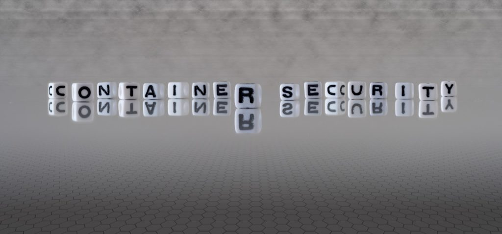
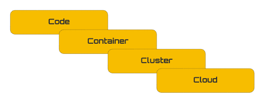
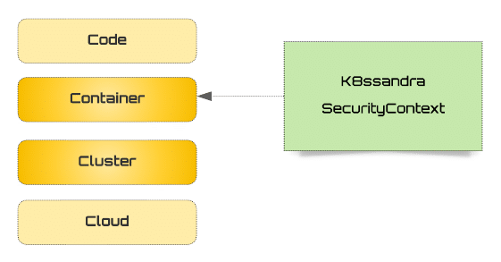
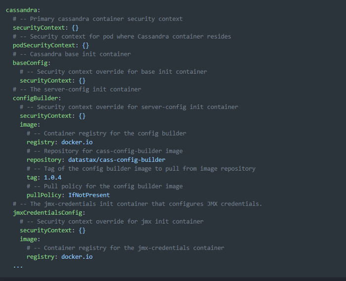
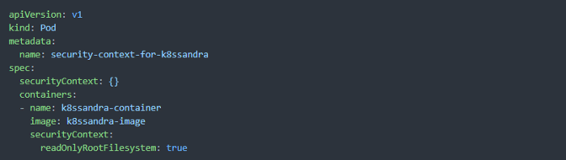
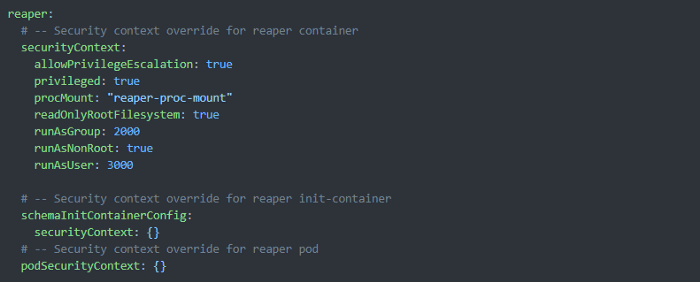

*New security features are coming to the open-source data platform: K8ssandra. The goal? To align even more with the security best practices of Kubernetes. Here's an introduction to the platform's security mission and an update on current initiatives.*{#e3b8}

The security defaults applied by [K8ssandra](https://k8ssandra.io/) are about to get even more aligned with[Kubernetes' security practices](https://kubernetes.io/docs/concepts/security/overview/). In an upcoming release of K8ssandra, pod and container security configurations give users full customization capabilities and default values out of the box.{#c373}

The default values are based on Kubernetes' security best practices because Kubernetes does a great job of these and includes many of them in their core APIs. We'll detail them in this post.{#b57c}

As a security-conscious Kubernetes user, you'll need a trusted environment to run your Kubernetes clusters. Kubernetes security best practices recommend a layered methodology to augment a highly regarded[defense-in-depth](https://en.wikipedia.org/wiki/Defense_in_depth_(computing)) practice.{#ca08}

The four layers described by Kubernetes for cloud-native security include artifacts that span application code to cloud.{#52a5}
 **Figure 1:**The 4 C's of Kubernetes cloud-native security.

K8ssandra security practices will follow this layered approach to give users full customizability to fit with Kubernetes best practices.{#2c38}

Before we dive into K8ssandra's security offerings, it's worth noting that a [**Kubernetes Pod Security Policy**](https://kubernetes.io/docs/concepts/policy/pod-security-policy/)**(PSP)** is being re-worked in the near future for the Kubernetes community.{#ab02}

You may be aware of the PodSecurityPolicy (PSP) as part of the [Kubernetes API](https://kubernetes.io/docs/concepts/overview/kubernetes-api/). The API had usability issues during its expansion. The path forward by Kubernetes now includes a new approach to replace the PodSecurityPolicy.{#02a4}

In a nutshell, various parties are working on a["PSP replacement policy"](https://github.com/kubernetes/enhancements/issues/2579). They are targeting an Alpha release in Kubernetes 1.22.{#28d4}

Unless you've included PodSecurityPolicy (PSP) APIs or features on your own, you can move forward using K8ssandra without migrating any of them. None of them were used in past versions of K8ssandra.{#9818}

Future releases of K8ssandra won't include PSP features either. Instead, they'll include open and flexible security configurations that assist with secured deployments.{#f34b}

In an upcoming release, K8ssandra will include access and permission control settings for pods and containers. The pods and containers will support the Kubernetes SecurityContext, which encapsulates a wide range of security controls.{#c76e}
 **Figure 2:**The container scope security.

Initially, the SecurityContext configurations will be included in the K8ssandra [values.yaml](https://github.com/gruntwork-io/helm-kubernetes-services/blob/master/charts/k8s-service/values.yaml) file. The additions will provide options ranging from security-enhanced Linux controls to filtering a process' system calls.{#04f2}

Below is an example of the SecurityContext placeholders for the [Apache Cassandra®](https://www.datastax.com/what-is/cassandra) containers residing in the K8ssandra values.yaml file. Each container will have its own security scope and can include customizations as needed without impacting other container's SecurityContext settings.{#c609}
 **Figure3:**SecurityContext placeholders in K8ssandra values.yaml file.

The *rendered* pod configuration with those values applied will now include **readOnlyRootFilesystem: true** for containers' SecurityContext entries. The default value is empty **{}** for pod SecurityContext entries. In the future, additional defaults may be included at the pod-level based on security best practices.{#0df5}

Below is an example of a pod-scoped SecurityContext. Its container-scoped SecurityContext defaults are applied. It's important to note that container SecurityContext settings will be isolated with settings unique to each container.{#14b1}
 **Figure 4:**SecurityContext with defaults applied.

Attribute compositions differ slightly in the Kubernetes documentation when it comes to the available `SecurityContext` attributes for pods and containers. This is because they are different types. A container's context is typed as `SecurityContext `and a pod's context as `PodSecurityContext`.{#7bc4}

The setting of the same attributes of the two types is possible within a K8ssandra `podSpec` configuration. When included, the container's security values will take precedence.{#43c0}

When a `SecurityContext` is applied at the pod level (`PodSecurityContext`), the pod's security attributes are propagated to any child containers: as long as they ***don't*** override the `PodSecurityContex`t's attributes using their own `SecurityContext`.{#8d1b}

In Kubernetes version 1.22, the `PodSecurityContext`appears in `PodSpec` (core/v1). The `SecurityContext`appears in both Container (core/v1) and EphemeralContainer (core/v1). Both types can be referenced at[Kubernetes.io](https://kubernetes.io/).{#4abf}

With these security features offered in K8ssandra, there will be no K8ssandra-specific types to support the pod and container runtime privileges. K8ssandra will fully reference the Kubernetes `SecurityContext` and `PodSecurityContext` APIs and types. All of those supported attributes will be available for use.{#97fe}

If you need to override or customize security, K8ssandra lets you do it at the pod or container level. There are placeholders in the K8ssandra `values.yaml` file to add or remove supported attributes as defined by the Kubernetes core API.{#1d76}

A container's `SecurityContext` will include a `readOnlyRootFilesystem: true` setting by default. Users can override that value in each of the containers where it is not allowed.{#6b52}

However, overriding current and future K8ssandra security defaults will impact the deployment's overall security. By default you will be using the Kubernetes recommended security best practices.{#6098}

Below is an example of `SecurityContext` customization for the Reaper container. This illustrates where the user could use container `SecurityContext` features other than the default set by K8ssandra. Only the single Reaper container will inherit the unique `SecurityContext` settings. No other containers will be impacted.{#8013}
 **Figure 5:**Reaper container: SecurityContext example.

The `SecurityContext` features mentioned will be included in both the v1.x (post v1.3) and upcoming v2.x release streams. The intent is to continue the same level of security configurations in both versions until the 1.x release stream is retired.{#9935}

Additional defense-in-depth security practices will be included for K8ssandra. This will continue to reduce attack surfaces and expand on the cluster and container-level security. Rest assured, those features will continue to adhere to the Kubernetes security best practices and APIs.{#4b5b}

Discussions are underway for the addition of more `SecurityContext` defaults at the pod and container levels. Along with them come measures to harden the container images involved with K8ssandra.{#ce5f}

*We would love to hear about the functions you're missing in K8ssandra and Kubernetes. You can open a ticket on the* [*K8ssandra GitHub*](https://github.com/k8ssandra/k8ssandra)*or join the discussion in our* [*K8ssandra Community*](https://discord.com/invite/qP5tAt6Uwt)*on Discord.*{#e888}

Curious to learn more about (or play with) Cassandra itself? We recommend trying it on the [Astra DB](https://astra.dev/3LUzt1X) free plan for the fastest setup.

1. [Get started with K8ssandra in 10 Minutes](https://k8ssandra.io/get-started/)
2. [K8ssandra Data Simplicity --- Getting Started](https://www.datastax.com/blog/2021/04/kubernetes-data-simplicity-getting-started-k8ssandra)
3. [PodSecurityPolicy Deprecation, Past, Present and Future](https://kubernetes.io/blog/2021/04/06/podsecuritypolicy-deprecation-past-present-and-future/)
4. [Join the K8ssandra Community on Discord](https://discord.com/invite/qP5tAt6Uwt)
5. [How to put a database in Kubernetes](https://medium.com/building-the-open-data-stack/how-to-put-a-database-in-kubernetes-ab7c21540ec2)
6. [K8ssandra/cass-operator: The DataStax Kubernetes Operator for Apache Cassandra](https://github.com/k8ssandra/cass-operator)
7. [DataStax Academy](https://academy.datastax.com/)
8. [DataStax Workshops](https://www.datastax.com/workshops)
