A couple of weeks ago, we had a great time hosting the workshop you can see below with Vlad Mihalcea. It was loads of fun and we hope to do this again soon!

In this workshop, we focused on Spring Boot performance but most importantly on Hibernate performance, which is a common issue in production environments.

It's especially hard to track since issues related to data are often hard to perceive when debugging locally. When we have "real world" data at scale, they suddenly balloon and become major issues.

I'll start this article by recapping many of the highlights in the talk and conclude by answering some questions we missed.

We plan to do a second part of this talk because there were so many things we never got around to covering!



## The Problem with show-sql

After the brief introduction, we dove right into the problem with `show-sql`. It's pretty common for developers to enable the `spring.jpa.show-sql` setting in the configuration file.

By setting this to true, we will see all SQL statements performed by Hibernate printed on the console.

This is very helpful for debugging performance issues, as we can see exactly what's going on in the database.

But it doesn't log the SQL query. It prints it on the console!

### Why do we Use Loggers?

This triggered the question to the audience: why does it matter if we use a logger and not `System.out`?

Common answers in the chat included:

* `System.out` is slow – it has a performance overhead. But so does logging
* `System.out` blocking – so are most logging implementations but yes you could use an asynchronous logger
* No persistence – you can redirect the output of a process to a file

The reason is the fine grained control and metadata that loggers provide. Loggers let us filter logs based on log level, packages, etc.

They let us attach metadata to a request using tools like MDC, which are absolutely amazing. You can also pipe logs to multiple destinations, output them in ingestible formats such as JSON so they can include proper meta-data when you view all the logs from all the servers (e.g. on Elastic).

### Show-sql is Just System Output

It includes no context. It's possible it won't get into your Elastic output and even if it does. You will have no context. It will be impossible to tell if a query was triggered because of request X or Y.

Another problem here is the question marks in the SQL. There's a very limited context to work with. We want to see the variable values, not questions.

### Adding a Log with Lightrun

Lightrun lets you add a new log to a production application without changing the source code. We can just open the Hibernate file "Loader.java" and add a new log to `executeQueryStatement`.

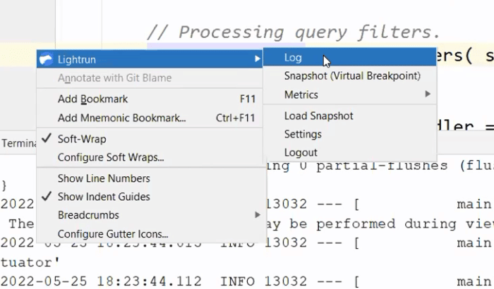

We can fill out the log statements in the dialog that prompts us. Notice we can use curly braces to write Java expressions, e.g. variable names, method calls, etc.

These expressions execute in a sandbox which **guarantees** that they will not affect the application state. The sandbox **guarantees** read only state!

Once we click OK, we can see the log appear in the IDE. Notice that no code changed, but this will act as if you wrote a logger statement in that line. So logs will be integrated with other logs.

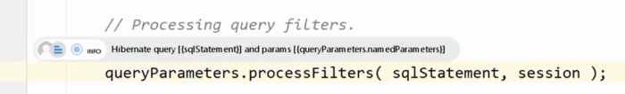

Notice that we print both the statement and the arguments so the log output will include everything we need. You might be concerned that this weighs too heavily on the CPU and you would be right. Lightrun detects overuse of the CPU and suspends expensive operations temporarily to keep execution time in check. This prevents you from accidentally performing an overly expensive operation.

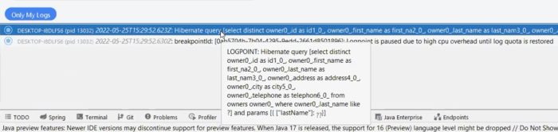

You can see the log was printed with the full content on top but then suspended to prevent CPU overhead. This means you won't have a performance problem when investigating performance issues…

You still get to see the query, and values sent to the database server.

### Log Piping

One of the biggest benefits of [Lightrun's](https://lightrun.com/) logging capability is its ability to integrate with other log statements written in the code. When you look at the log file, the Lightrun added statements will appear "in-order" with the log statements written in code.

As if you wrote the statement, recompiled and uploaded a new version. But this isn't what you want in all cases.

If there are many people working on the source code and you want to investigate an issue, logging might be an issue. You might not want to pollute the main log file with your "debug prints". This is the case for which we have Log Piping.

Log piping lets us determine where we want the log to go. We can choose to pipe logs to the plugin and in such a case, the log won't appear with the other application logs. This way, a developer can track an issue without polluting the sanctity of the log.

## Spring Boot Connection Acquisition

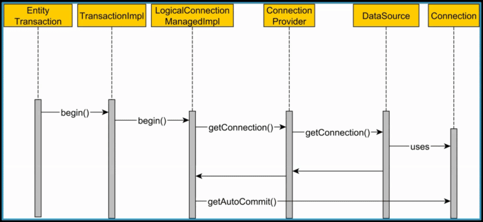

Ideally, we should establish the relational database connection at the very last moment. You should release it as soon as possible to increase database throughput. In JDBC, the transaction is on auto-commit by default and this doesn't work well with the JPA transactions in Spring Boot.

Unfortunately, we're at a Chicken and Egg problem. Spring Boot needs to disable auto-commit. In order to do that, it needs a database connection. So it needs to connect to the database just to turn off this flag that should have been off to begin with.

This can seriously affect performance and throughput, as some requests might be blocked waiting for a database connection from the pool.

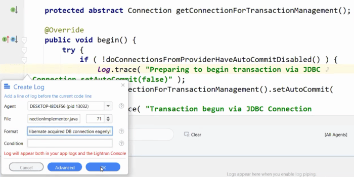

If this log is printed, we have a problem in our auto-commit configuration. Once we know that the rest is pretty easy. We need to add these two fields that both disable auto-commit and tell Hibernate that we disabled it. Once those are set, performance should be improved.

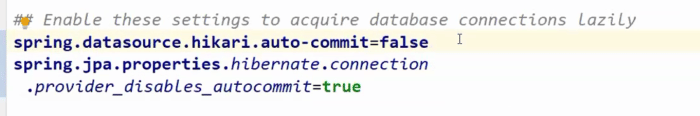

## Query Plan Cache

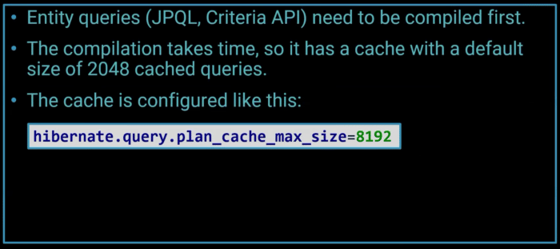

Compiling JPQL to native SQL code takes time. Hibernate caches the results to save CPU time.

A cache miss in this case has an enormous impact on performance, as evidenced by the chart below:

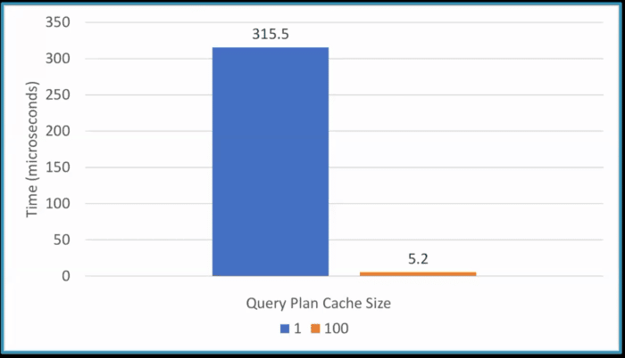

This can seriously affect the query execution time and the response time of the whole service.

Hibernate has a statistics class which collects all of this information. We can use it to detect problematic areas and, in this case, add a snapshot into the class.

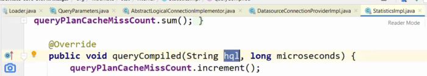

### Snapshots

A Snapshot (AKA Non-breaking breakpoint or Capture) is a breakpoint that doesn't stop the program execution. It includes the stack trace, variable values in every stack frame, etc. It then presents these details to us in a UI very similar to the IDE breakpoint UI.

We can traverse the source code by clicking the stack frames and see the variable values. We can add watch entries and most importantly: we can create conditional snapshots (this also applies to logs and metrics).

Conditional snapshots let us trigger the snapshot only if a particular condition is met. A common problem is when a bug in a system is experienced by a specific user only. We can use a conditional snapshot to get stack information only for that specific user.

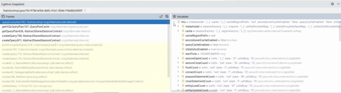

## Eager Fetch

When we look at logs for SQL queries, we can often see that the database fetches a lot more than what we initially asked for. That's because of the default setting of JPA relations which is EAGER. This is a problem in the specification itself. We can achieve significant performance improvement by explicitly defining the fetch type to LAZY.

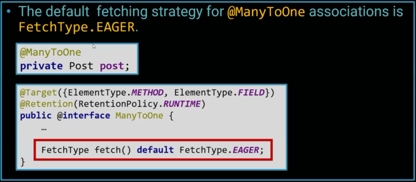

We can detect these problems by placing a snapshot in the `loadFromDatasource()` method of `DefaultLoadEventListener`.

In this case, we use a conditional snapshot with the condition: `event.isAssociationFetch()`.

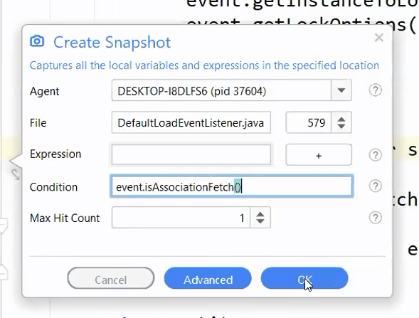

As a result, the snapshot will only trigger when we have an eager association, which is usually a bug. It means we forgot to include the LAZY argument to the annotation.

As you can see, this got triggered with a full stack trace and the information about the entity that has such a relation.

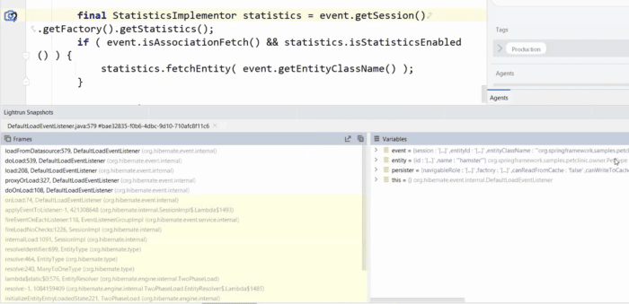

You can use this approach to detect incorrect lazy fetches as well. Multiple lazy fetches can be worse than a single eager fetch, so we need to be vigilant.

## Open Session in View Anti-Pattern

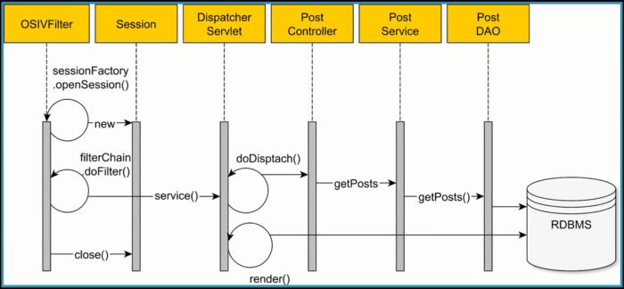

On the surface, it doesn't seem like we're doing anything wrong. We're just fetching data from the database and returning it to the client. But the transaction context finished when the post controller returned and as a result we're fetching from the database all over again. We need to do an additional query as data might be stale. Isolation level might be broken and many bugs other than performance might arise.

This creates an N+1 problem of unnecessary queries!

We can detect this problem by placing a snapshot on the `onInitializeCollection` call and seeing the open session:

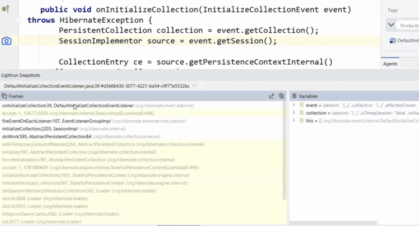

Now that we see the problem is happening we can solve the problem by defining `spring.jpa.open-in-view=false`

It will block you from using this approach.

## Q\&A

There were many brilliant questions as part of the session. Here are the answers.

### **Could you please describe a little bit about Lightrun?**

Lightrun is a developer observability platform. As such, it lets you debug production safely and securely while keeping a tight lid on CPU usage. It includes the following pieces:

* Client – IDE Plugin/Command Line
* Management Server
* Agent – running on your server to enable the capabilities

I wrote about it in depth [here](https://talktotheduck.dev/remote-debugging-and-developer-observability).

### **Could Lightrun Work Offline?**

Since you're debugging production, we assume your server isn't offline.

However, Lightrun can be deployed on-premise, which removes the need for an open to the Internet environment.

### **Wondering about this sample, will this be available for our reference?**

The code is all [here](https://github.com/vladmihalcea/spring-petclinic).

### **As the Instrumentation/manipulation happens via a Server, given that I do not host the instrumentation server myself, what kind and what amount of data is being transmitted? Is the data secured or encrypted in any way?**

The instrumentation happens on your server using the agent.

The Lightrun server has no access to your source code or bytecode!

Source code or bytecode never goes on the wire at any stage and Lightrun is never exposed to it.

All transmissions are secured and encrypted. Certificates are pinned to avoid a man in the middle attack. The Lightrun architecture received multiple rounds of deep security reviews and is running in multiple Fortune 500 companies.

Finally, all operations in Lightrun are logged in an administrator log, which means you can track every operation that was performed and have a full post mortem trail.

You can read more about Lightrun security [here](https://talktotheduck.dev/detect-track-verify-security-issues-zero-days).

### **As mentioned, these logs are aged out in 1 hr. Is it possible to save those and re-use them for later use rather than creating log entries manually every time?**

Lightrun actions default to expire after 1 hour to remove any potential unintentional overhead. You can set this number much higher, which is useful for hard to reproduce bugs.

Notice that when an action is expired, you can just click it and re-create it. It will appear in red within the IDE and can still be used for reference.

### **Is IntelliJ IDEA the only way to add breakpoints/logging? Or how is debugging with Lightrun done in production?**

You can use IntelliJ (also PyCharm and WebStorm) as well as VSCode, VSCode.dev and the command line.

These connect to production through the Lightrun server. The goal is to make you feel as if you're debugging a local app while extracting production data. Without the implied risks.

### **Is there any case where eager loading should be configured always for One-to-Many or Many-to-Many or Many-to-One relations? I always configure lazy loading for the above relations. Is it okay?**

Yes. If you see that you keep fetching the other entity, then eager loading for this case makes sense. Having eagerness as the default makes little sense for most cases.

### **Do we need to restart an application with the javaagent?**

The agent would run in the background constantly. It's secure and doesn't have overhead when it isn't used.

### **If we are using other instrumentation tools like say AppDynamics or dynatrace... does this work alongside?**

This varies based on the tool. Most APMs work fine besides Lightrun because they hook up to different capabilities of the JVM.

### **Does this work with GraalVM?**

Not at this time since GraalVM doesn't support the javaagent argument. We're looking for alternative approaches, but hopefully the GraalVM team will have some solutions.

### **Is it free to use?**

Yes!

Check out [lightrun.com/free](https://lightrun.com/free)

### **Does it impact app performance?**

Yes, but it's minimal. Under 0.5% when no actions are used, and under 8% with multiple actions. Notice you can tune the amount of overhead in the agent configuration.

### **Does it work for Scala and Kotlin?**

Yes.

### **How to use it in production without an IDE?**

The IDE will work even for production, since you don't connect directly to the production servers and don't have access to them. The IDE connects to the Lightrun management server only. This lets your production servers remain segregated.

Having said that, you can still use the command-line interface to get all the features discussed here and much more.

### **Apart from injecting loggers, what other stuff can we do?**

The snapshot lets you get full stack traces with the values of all the variables in the stack and object instance state. You can also include custom watch expressions as part of the snapshot.

Metrics let you add counters (how many times did we reach this line), tictocs (how much time did it take to perform this block), method duration (similar to tictocs but for the whole method) and custom metrics.

You can also add conditions to each one of those to narrowly segment the data.

### **How do we hide sensitive properties from beans? Say Credit card number of user?**

Lightrun supports PII Reduction, which lets you define a mask (e.g. credit card) that would be removed before going into the logs. This lets you block an inadvertent injection into the logs.

It also supports blocklists, which let you block a file/class/group from actions. This means a developer won't be able to place a log or snapshot there.

### **How can we use it for performance testing?**

I made a tutorial on this [here](https://twitter.com/debugagent/status/1531653268639825923?s=20&t=_2mpt-LGGCr5WYvDc7POUw).

### **When working air gapped on prem is required, how do you provide the Server, as a jar or docker…?**

This is something our team helps you set up.

### **Will it consume much more memory if we run with the Lightrun agent?**

This is minimal. Running the petclinic demo on my Mac with no agent produces this in the system monitor:

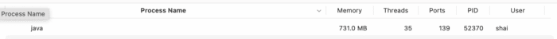

With the agent, we have this:

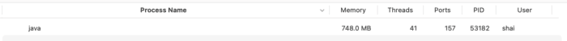

At these scales, a difference of 17mb is practically within the margin of error. It's unclear what overhead the agent has, if at all.

## Finally

This has been so much fun and we can't wait to do it again. Please follow [Vlad](https://twitter.com/vlad_mihalcea), [Tom](https://twitter.com/tomGranot/), and [myself](https://twitter.com/debugagent) for updates on all of this.

There are so many things we didn't have time to cover that go well beyond slow queries and spring data nuances. We had a really cool demo of piping metrics to Grafana that we'd love to show you next time around.
