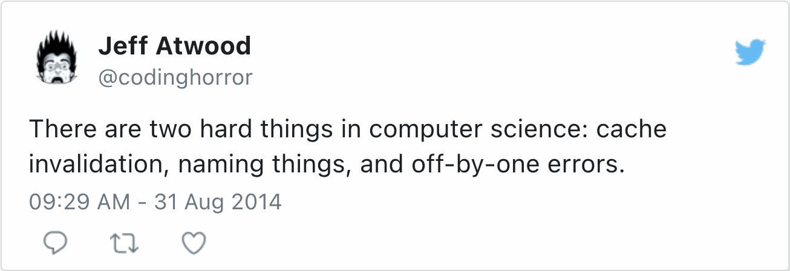

If you've more than a couple of years of experience in IT, you probably have stumbled upon the following quote:
> There are only two hard things in computer science: cache invalidation and naming things. -- Phil Karlton

Then, because it's such a great quote, it evolved:

[](https://twitter.com/codinghorror/status/506010907021828096)However, I think that the initial quote is misleading. A lot of things are hard in computer science. This post aims to describe some of them.

## Cache invalidation

I had a few use-cases for caching in my professional career. When I did, it was mostly to cache Hibernate entities. Only once did I implement my own cache. I used a simple `HashMap` as it was for a batch job as the cache size was small: no invalidation was needed.

Most cache implementations implement the Cache-Aside strategy. In Cache-Aside, the application tries to load data from the cache. If the cache has them, it returns them; if not, the application reads from the source of truth - in general, a database.

While data are stored in the cache, they may change in the database. In short, the probability that data in the cache and the source of truth diverge increases as time passes. For this reason, we sometimes need to synchronize data with the source of truth. It's achieved by cleaning data from the cache - cache invalidation, also known as .

The TTL specifies how long an entry is valid. After the time has elapsed, the cache removes it, and the next read will load data from the source of truth.

The tricky thing, in this case, is to choose the correct TTL:

1. If the reference data in the source of truth changes before invalidation, clients read stale data
2. If the invalidation happens before the change, an unnecessary reload happens.

In essence, the smaller the TTL, the less chance to read stale data, but the less useful is the cache.

## Naming things

If you have any experience as a developer, you probably are convinced that naming things is challenging indeed. If not, let's introduce another quote:
> Programs are meant to be read by humans and only incidentally for computers to execute
>
> -- Donald Knuth

Here's another one, slightly more inflammatory:
> Any fool can write code that a computer can understand. Good programmers write code that humans can understand.
>
> -- Martin Fowler

For example, here's some gibberish-y code:

```kotlin
data class Foo(val bar: String)

class Baz : IllegalArgumentException()

data class Qux(val quux: Double, val foo: Foo) {
    operator fun plus(qux: Qux) =
        if (foo != qux.foo) throw Baz()
        else Qux(quux + qux.quux, foo)
}
```

Thanks to the usage of APIs, namely `IllegalArgumentException` and `plus()`, you may infer somewhat what the code does. However, correctly renaming classes and fields reveals our intent:

```kotlin
data class Currency(val symbol: String)

class MismatchCurrencyException : IllegalArgumentException()

data class Amount(val number: Double, val currency: Currency) {
    operator fun plus(amount: Amount) =
        if (currency != amount.currency) throw MismatchCurrencyException()
        else Amount(number + amount.number, currency)
    }
}
```

When I worked on projects, I always cautioned about the following issues when talking with the business:

1. Using different words to cover the same reality
2. Using the same word to cover different realities

The second is much worse, as you may think you're talking about the same thing with the business or fellow developers, but you're not. If the talk ends in agreement, but each party has a different reality in their head, it's a recipe for a future disaster.

Within the scope of verbal communication, it's possible to ask questions about the meaning of such and such words. In code, it's not! Hence, naming classes and variables must convey the exact meaning.

It's hard because you need to be precise without being verbose.

## Dates, times, and timezones

I already wrote about [Date and time gotchas](https://blog.frankel.ch/date-time-gotchas/). To sum up:

* The move from the Julian calendar to the Gregorian one happened at different dates depending on the country involved
* Some countries' timezone are not entirely congruent to their geographical location
* Some countries implement , some not. Even worse, some did and don't anymore.
* Countries sometimes change their timezones. While it's not frequent, it happens more frequently than most think.
* Not all timezones are separated by one hour. For example, India is UTC+5:30, but three timezones are spaced by 45 minutes.

## Estimates

Estimates in software development projects are so hard to get right that some people working on the development side started the "No Estimate" movement. I won't delve into the pros and cons of not doing estimates; my point is just that estimating a non-trivial software project is challenging.

I think that entire books have been written on why estimates are demanding and how to improve them. Let's summarize the reasons:

* Not only software projects:Many who are involved in software projects but do not know how they work are eager to compare the activity with house building. Unfortunately, "house" can encompass different levels of industrialization. What the people refer to is an off-the-shelf building. It involves low or zero customization. Software development projects are on the opposite side of the scale, akin to unique architectural *chef-d'oeuvre* . For a more detailed explanation, look at the following [On house building and software development projects](https://blog.frankel.ch/on-house-building-software-development-projects/) post.
* Problems along the way:Estimates are provided before the start of the project, with all parameters available at the time. Unfortunately, while risk management accounts for the known knowns and the known unknowns, it's impossible to forecast the **unknown unknowns**. With the highly-mutable state of software projects, it's practically a given that something unexpected happens, invalidating our previous estimates.
* The nature of estimates:By definition, an estimate is a guess. The problem is that most treat them as a deadline. At this point, the organization will focus on respecting the deadline, regardless of the trade-offs - a recipe for failure.


## Distributed systems

There's so much one can do with a single computer, even a multicore one. Adding more resources to a computer rapidly hits the point of diminishing returns. You can do nothing at this point but distribute the load across several computers. Welcome to the realm of distributed systems!

The problem with distributed systems is that they are easy "to get wrong". Here is the list of fallacies regarding distributed systems:
> 1. The network is reliable
> 2. Latency is zero
> 3. Bandwidth is infinite
> 4. The network is secure
> 5. Topology doesn't change
> 6. There is one administrator
> 7. Transport cost is zero
> 8. The network is homogeneous.
>
> -- [Wikipedia, Fallacies of distributed computing](https://en.wikipedia.org/wiki/Fallacies_of_distributed_computing)

Tons of books and theses have been written on distributed systems. People who can get them right deserve all my respect.

In my career, I stumbled upon two distributed systems problems:

* Dual writes
* Leader election

### Dual writes

Imagine a system with two distributed data stores. We require that they must contain the same data.

It qualifies as the *dual write* problem. In a single database, we can solve it with database transactions. In two different databases, [two-phase commits](https://en.wikipedia.org/wiki/Two-phase_commit_protocol) are available, even if they might not be reliable. If the stores that you need to write to cannot be enrolled in , as in microservices architectures, you need to rely on [compensating transactions](https://en.wikipedia.org/wiki/Compensating_transaction). Compensating transactions are fragile and complex to implement correctly, if at all.

From a theoretical point of view, the [CAP](https://en.wikipedia.org/wiki/CAP_theorem) teaches us that we can choose only two out of three capabilities: Consistency, Availability, and Partition tolerance. In reality, the choice is no choice at all. Because the system is distributed, we need to choose ; because modern requirements forbid us to block, we need to choose . The trade-off is consistency: both stores will converge to the same state **over time**.

While working on this problem, I discovered [Change-Data-Capture](https://en.wikipedia.org/wiki/Change_data_capture). The idea behind is to send updates to a single store and stream the diffs of the new state to the other one. To implement it by oneself is not trivial. I'd recommend using an existing product: I've used [Debezium](https://debezium.io/) successfully in the past for my demos.

### Leader election

Distributed systems rely on multiple nodes, and coordination across them is mandatory. Some rely on a specific node referred to as the **leader** to manage other nodes, while others are *leaderless*.

Most modern implementations are leader-based: it seems leaderless implementations are less reliable, though, truth to be told, I cannot tell the reason given the depth of my current understanding at the moment of this writing). Such implementations require all nodes to agree on which node is the leader among them - *consensus*. When a network partition happens, some nodes cannot communicate with others. It's relatively easy to reach a consensus in a partition; it's more challenging when the network reunites, and a single leader must be selected among all previous ones.

It's why the [Paxos](https://en.wikipedia.org/wiki/Paxos_(computer_science)) algorithm, or the Paxos family of algorithms, was invented. However, experts seem to think that Paxos is error-prone to implement: the [Raft](https://en.wikipedia.org/wiki/Raft_(algorithm)) algorithm is an attractive easier-to-implement alternative. In any case, easier doesn't mean [easy](https://groups.google.com/g/raft-dev/c/JEtBYaPpHXo).

## Proving code is bug-free

Traditional software engineering mandates testing to avoid bugs. Unfortunately, whatever approach you favor - unit, integration, end-to-end, or a mix of the three - doesn't guarantee your code has no bugs. It's, in fact, quite widespread to find bugs in production despite the infamous [100% code coverage](https://blog.frankel.ch/100-code-coverage/). The only reliable way to have bug-free code is to prove it. It requires solid mathematical foundations and a programming language that allows [formal proofs](https://en.wikipedia.org/wiki/Formal_proof).

A couple of [such languages](https://en.wikipedia.org/wiki/Proof_assistant) exist. Unfortunately, all of them still belong to academia; the ones I've heard of are [Coq](https://en.wikipedia.org/wiki/Coq), [Idris](https://en.wikipedia.org/wiki/Idris_(programming_language)), and [Isabelle](https://en.wikipedia.org/wiki/Isabelle_(proof_assistant)).

Until any of them makes it into the mainstream industry, writing bug-free code will be part of one the hard things in computer science.

## Summary

Writing there are *only* two hard things in computer science is a strong claim.

In this article, I have tried to list several hard things I've been exposed to during my career.

I believe there are many others: I'll be interested in the ones you've encountered!

**To go further:**

* [TwoHardThings](https://martinfowler.com/bliki/TwoHardThings.html)
* [Can we put an end to this 'Estimate' game of fools?](https://blog.frankel.ch/can-we-put-an-end-to-this-estimate-game-of-fools/)

*Originally published at [A Java Geek](https://blog.frankel.ch/hard-things-computer-science/) on June 26^th^, 2022*

*[P]: Partition tolerance
*[A]: Availability
*[CDC]: Change-Data-Capture
*[2PC]: 2-Phases Commits
*[TTL]: Time-To-Live
