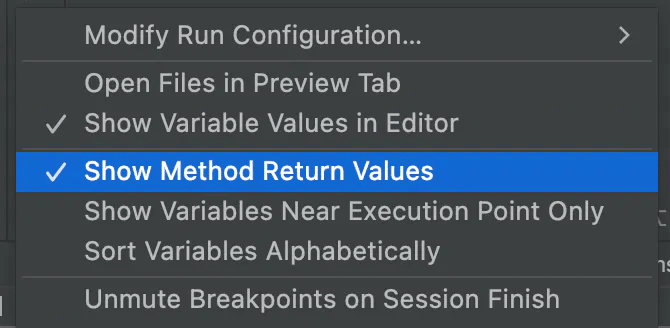
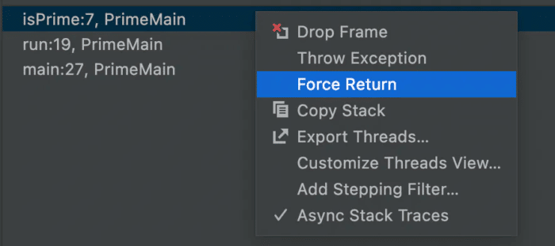
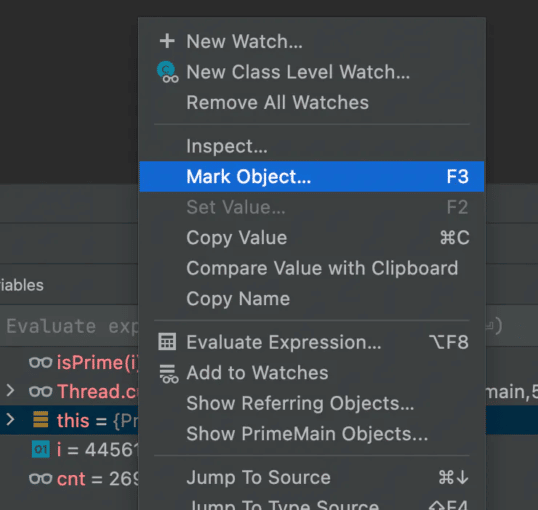
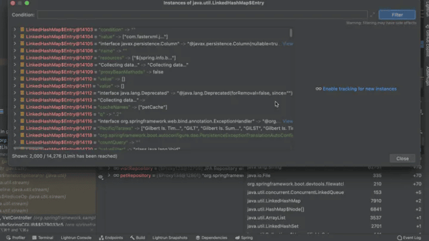
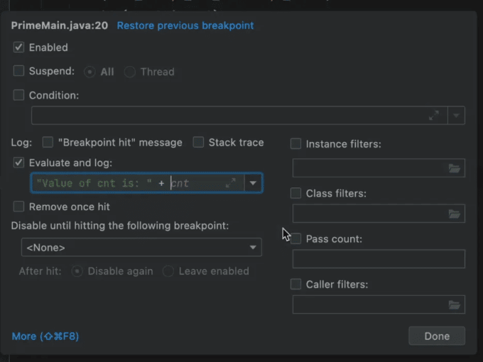
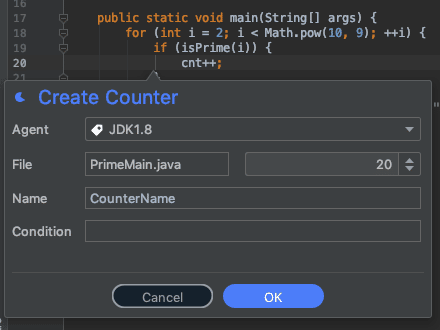
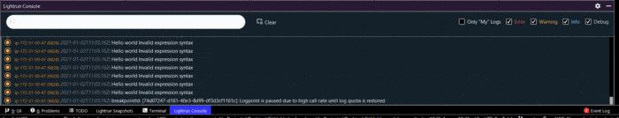
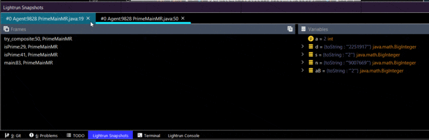

Say you have a new code base to study or picked up an open source project. You might be a seasoned developer for whom this is another project in a packed resume. Alternatively, you might be a junior engineer for whom this is the first "real" project.

It doesn't matter!

With completely new source code repositories, we still know nothing...

The seasoned senior might have a leg up in finding some things and recognizing patterns. But none of us can read and truly follow a project with 1M+ lines of code. We look over the docs, which in my experience usually have only passing resemblance to the actual codebase. We segregate and assume about the various modules, but picking them up is hard.

We use IDE tools to search for connections, but this is really hard. It's like following a yarn thread after an army of cats had its way with it...

As a consultant for over a decade, I picked up new client projects on a weekly basis. In this post, I'll describe the approach I used to do that and how I adapted this approach further at Lightrun.

## Finding Usage

The programming language can help a lot. As Java developers, we're lucky, codebase exploration tools are remarkably reliable. We can dig into the code and find usage. IDEs highlight unused code and they're pretty great for this. But this has several problems:

* We need to know where to look and how deeply
* Code might be used by tests or by APIs that aren't actually used by users
* Flow is hard to understand via usage. Especially asynchronous flow
* There's no context such as data to help explain the flow of the code

There has to be a better way than randomly combing through source files.

### UML Generation

Another option is UML chart generation from source files. My personal experience with these tools hasn't been great. They're supposed to help with the "big picture" but I often felt even more confused by these tools.

They elevate minor implementation details and unused code into equal footing in a mind-boggling confusing chart. With a typical codebase, we need more than a high level view. The devil is in the details and our perception should be of the actual codebase in version control. Not some theoretical model.

## Debugging as a Learning Tool

Debuggers instantly solve all these problems. We can instantly verify assumptions, see "real world" usage, and step over a code block to understand the flow. We can place a breakpoint to see if we reached a piece of code. If it's reached too frequently and we can't figure out what's going on, we can make this breakpoint conditional.

I make it a habit to read the values of variables in the watch when using a debugger to study the codebase.

Does this value make sense at this point in time?

If it doesn't, then I have something to look at and figure out. With this tool, I can quickly understand the semantics of the codebase. In the following sections, I'll cover techniques for code learning both in the debugger and in production.

Notice I use Java, but this should work for any other programming language as the concepts are (mostly) universal.

### Field Watchpoint

I think most developers know about [field watchpoints](https://talktotheduck.dev/basics-of-breakpoints-you-might-not-know#heading-field-watchpoint) and just forget about them!

"Who changed this value and why", is probably the most common question asked by developers. When we look through the code, there might be dozens of code flows that trigger a change. But placing a watchpoint on a field will tell you everything in seconds.

Understanding state mutation and propagation is probably the most important thing you can do when studying a codebase.

### The Return Value

One of the most important things to understand when stepping through methods is the return value. Unfortunately, with debuggers, this information is often "lost" when returning from a method and might miss a critical part of the flow.

Luckily, most IDEs let us inspect the return value dynamically and see what the method returned from its execution. In JetBrains IDEs such as IntelliJ/IDEA, we can enable "Show Method Return Value" as I discuss [here](https://talktotheduck.dev/debugging-tutorial-java-return-value-intellij-jump-to-line-and-more).

### Flow Control as a Learning Tool

Why is this line needed?

What would happen if it wasn't there?

That's a pretty common set of question. With a debugger, we can [change control flow](https://talktotheduck.dev/debugging-tutorial-java-return-value-intellij-jump-to-line-and-more) to jump to a specific line of code or force an early return from a method with a specific value. This can help us check situations with a specific line, e.g.: what if this method was invoked with value X instead of Y?

Simple. Just drag the execution back a bit and invoke the method again with a different value. This is much easier than reading into a deep hierarchy.

### Keeping Track With Object Marking

[Object Marking](https://talktotheduck.dev/debugging-tutorial-java-return-value-intellij-jump-to-line-and-more#heading-object-marking) is one of those unknown debugger capabilities that's invaluable and remarkably powerful. It has a big role in understanding "what the hell is going on".

You know how when you debug a value you write down the pointer to the object so you can keep track of "what's going on in this code block?".

This becomes very hard to keep track of. So we limit the interaction to very few pointers. Object marking lets us skip this by keeping a reference to a pointer under a fixed name. Even when the object is out of scope, the reference marker would still be valid. We can start tracking objects to understand the flow and see how things work. E.g. if we're looking at a User object in the debugger and want to keep track of it, we can just keep a reference to it. Then use conditional breakpoints with the user object in place to detect the area of the system that access the user.

This is also remarkably useful in keeping track of threads, which can help in understanding code where the threading logic is complex.

### Check The Objects In Memory

A common situation I run into is a case where I see a component in the debugger. But I've been looking for a different instance of this object. E.g. if you have an object called UserMetaData. Does every user object have a corresponding UserMetaData object?

As a solution, we can use the memory inspection tool and see which [objects of the given type are held in the memory](https://talktotheduck.dev/memory-debugging-and-watch-annotations#heading-memory-usage)!

Seeing actual object instance values and reviewing them helps put numbers/facts behind the objects. It's a powerful tool that helps us visualize the data.

### Use Tracepoint Statements to Follow Complex Logic

During development, we often just add logs to see "was this line reached". Obviously a breakpoint has advantages, but we don't always want to stop. Stopping might change threading behavior, and it can also be pretty tedious.

But adding a log can be worse. Re-compile, re-run, and accidentally commit it to the repository. It's a problematic tool for debugging and for studying code.

Thankfully, we have [tracepoints](https://talktotheduck.dev/basics-of-breakpoints-you-might-not-know#heading-tracepoints) which are effectively logs that let us print out expressions, etc.

## What's Going on in Production -- AKA "Reality Coverage"

This works great for "simple" systems. But there are platforms and settings in our industry that are remarkably hard to reproduce in a debugger. Knowledge about the way our code works locally is one thing. The way it works in production is something completely different.

Production is the one thing that really matters and in multi-developer projects, it's really hard to evaluate the gap between production and assumption.

We call this reality coverage. E.g. you can get 80% coverage in your tests. But if your coverage is low on classes that are heavily accessed in your source code repository... Then the QA might be less effective. We can study the repo over and over. We can use every code analysis tool and setting. But they won't show us the two things that really matter:

Is this actually used in production?

How is this used in production?

Without this information, we might waste our time. E.g. when dealing with millions of lines in the repo. You don't want to waste your study time reading a method that isn't heavily used.

In order to get an insight into production and debug that environment, we'll need a developer observability tool, like Lightrun. You can [install it for free here](https://lightrun.com/free).

### Measuring with Counters

A counter lets us see how frequently a line of code was reached. This is one of the most valuable tools at our disposal.

Is this method even reached?

Is this block in the code reached? How often?

If you want to understand where to focus your energies first, the counter is probably the most handy tool at your disposal. You can read about counters [here](https://docs.lightrun.com/metrics/#counter).

### Assumption Verification with Conditions

We often look at a statement and make various assumptions. When the code is new to us, these assumptions might be pivotal to our understanding of the code. A good example is something like most of the users who use this feature have been with the system for a while and should be familiar with it.

You can test that with conditional statements that you can attach to any action (logs, counters, snapshots, etc.). As a result, we can use a condition like `user.signupDate.getMillis() < ...`.

You can add this to a counter and literally count the users that don't match your expectations.

### Logs and Piping to Learn without the Noise

I think it's obvious how injecting a log in runtime can make a vast difference to understanding our system. But in production, this comes at a price. I'm studying the system while looking at the logs and all my "methodX reached with value Y" logs add noise to our poor DevOps/SRE teams.

We can't have that. Studying something should be solitary, but by definition, production is the exact opposite of that...

With [piping](https://docs.lightrun.com/logs/#configure-piping) we can log everything locally to the IDE and spare everyone else the noise. Since the logic is sandboxed, there will be no overhead if you log too much. So go wild!

### Snapshots for Easier Learning

One of the enormous challenges in learning is understanding the things we don't know "yet". [Snapshots](https://docs.lightrun.com/snapshots-plugin/) help us get a bigger picture of the code. Snapshots are like placing any breakpoint and reviewing the values of the variables in the stack to see if we understand the concepts. They just "don't break" so you get all the information you can use to study, but the system keeps performing as usual, including threading behavior.

Again, using conditional snapshots is very helpful in pinpointing a specific question. E.g. what's going on when a user with permission X uses this method?

Simple, place a conditional snapshot for the permission. Then inspect the resulting snapshot to see how variable values are affected along the way.

## Final Word

Developers often have a strained relationship with debugging tools.

On the one hand, they're often the tool that saves our bacon and helps us find the bug. On the other hand, they're the tool we look at when we realize we were complete morons for the past few hours.

I hope this guide will encourage you to pick up debuggers when you don't have a bug. The insights provided by running a debugger, even when you aren't actively debugging, can be "game changing".
