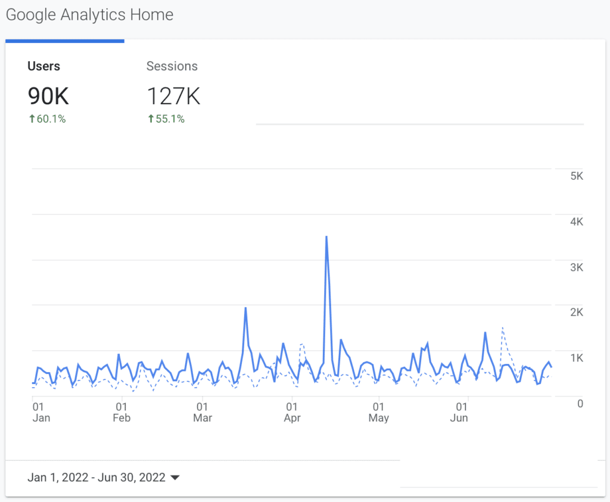
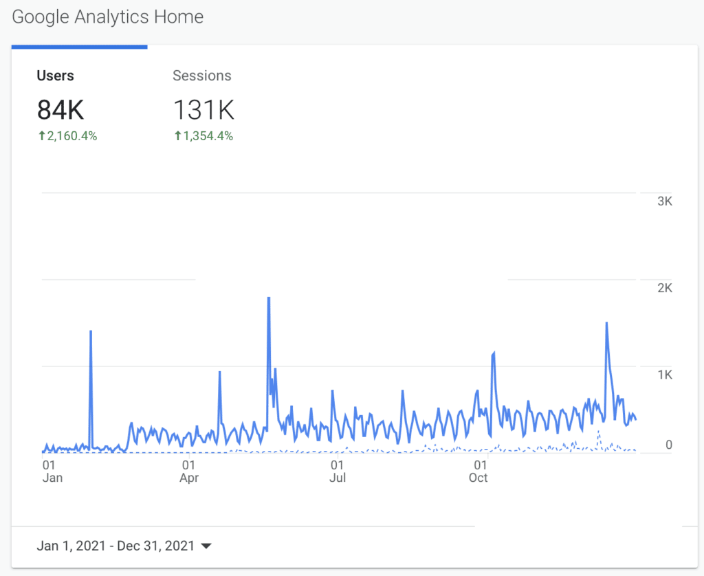

It's been another half year of content and activities in and around the place for friends of OpenJDK... let's look at some statistics, trends, comparisons, highlights, and plans for the future!

Trends and Comparisons {#h2-0-trends-and-comparisons}
-----------------------------------------------------

Let's start by looking at Google Analytics, what's the curve look like for the past half year? Here it is:

<figure class="wp-block-image size-large is-resized">
 
</figure>

Over the past 6 months, from the first day of January to the last day of June, there were **90K unique visitors and 127K sessions on Foojay.io**. That is meaningless in the absence of something to compare it to. Let's compare the above to the same analysis for the entirety of last year, from the first day of last year to the last day of last year:

<figure class="wp-block-image size-large is-resized">
 
</figure>

What you see above is that **we have had as much traffic on Foojay.io in the first half of this year as we had for the whole of last year**. That's a good trend!

Big Spikes and Popular Articles {#h2-1-big-spikes-and-popular-articles}
-----------------------------------------------------------------------

What do the big spikes mean? For the spikes of the previous half years, and related analysis, see [Foojay Status Report: July -- December 2021](https://foojay.io/today/foojay-status-report-july-december-2021/) and [Foojay Status Report: January -- June 2021](https://foojay.io/today/foojay-status-report-january-june-2021/).

Over the past half year, the very biggest spikes were in April for [Bazlur Rahman](https://foojay.io/today/author/bazlur-rahman/) and his [Top 10 Java Language Features](https://foojay.io/today/top-10-java-language-features/) and in March for his [7 Reasons Why, After 26 Years, Java Still Makes Sense!](https://foojay.io/today/7-reasons-why-after-26-years-java-still-makes-sense/) Incredibly, the most popular two articles on Foojay.io over the past half year were by the same person, congratulations, Bazlur! Also check out [his incredible Java Thread Programming series here](https://foojay.io/today/java-thread-programming-part-1/). Aside from all that, Bazlur leads the Bangladesh JUG, has been extremely helpful and active on Foojay as one of its co-editors, and recently became one of the Java Champions. An excellent half year for Bazlur.

Of course, what makes Bazlur's articles extremely popular is that they are high level overviews and assessments, rather than specific niche topics, of which there are very many on Foojay.io too, which are very much appreciated. In that context, a special shout out to [Nicolas Frankel](https://foojay.io/today/author/nicolas-frankel/) and [Shai Almog](https://foojay.io/today/author/shai-almog/) who, week after week keep bringing out great and inspiring content around their areas of interest.

Upcoming Activities {#h2-2-upcoming-activities}
-----------------------------------------------

Foojay.io has always been more than a website. It is a vehicle for the users of the OpenJDK to get together and unite around their common platform.

For example, this year [the second Friends of OpenJDK devroom was held at FOSDEM](http://Foojay%20at%20FOSDEM%202022%20on%20YouTube) and Foojay.io continues to be a place where OpenJDK users find each other, e.g., such as speakers for JUG events around the world. Recently a Foojay.io Board meeting was held, in which around 15 different organizations participated to plan upcoming events.

Just over the past week, in the Foojay.io Slack channel, the ideas were raised to continue with the Foojay Podcast and also to set up a developer certification program.

Join In {#h2-3-join-in}
-----------------------

There's clearly a lot going on and if you too want to get your tutorials, tips and tricks, release notes, event announcements, and opinions out to the broader OpenJDK user community, there's nothing easier to do than follow these two articles:

* [How To Submit Your Next Article On Foojay.io](https://foojay.io/today/how-to-submit-your-next-article-on-foojay-io/)
* [How to Add an Event to the Foojay Event Calendar](https://foojay.io/today/how-to-add-an-event-to-the-foojay-event-calendar/)
