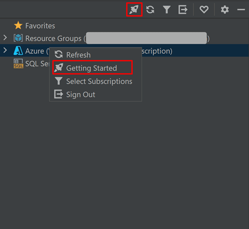
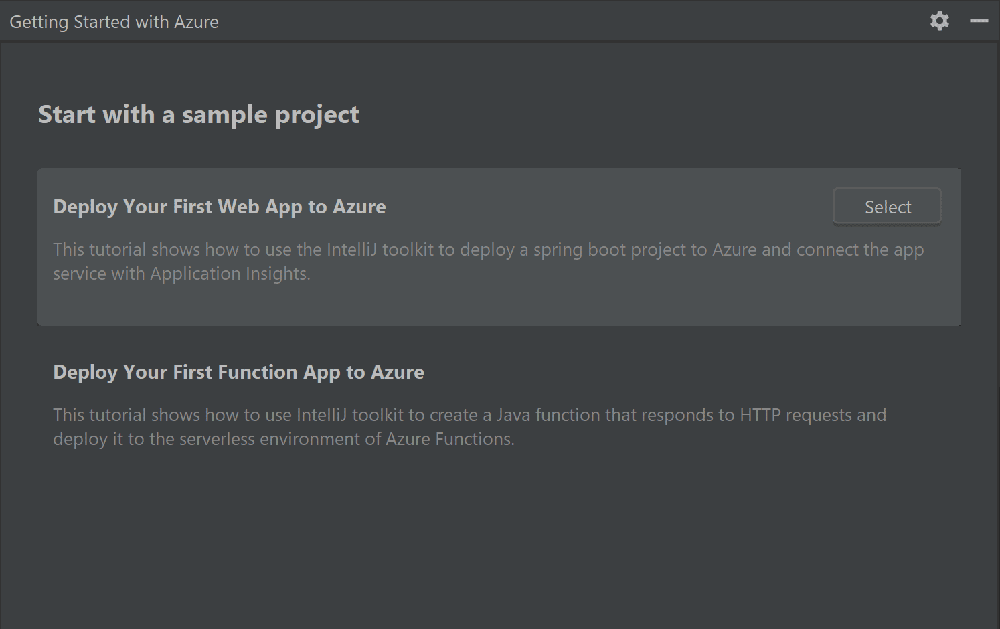
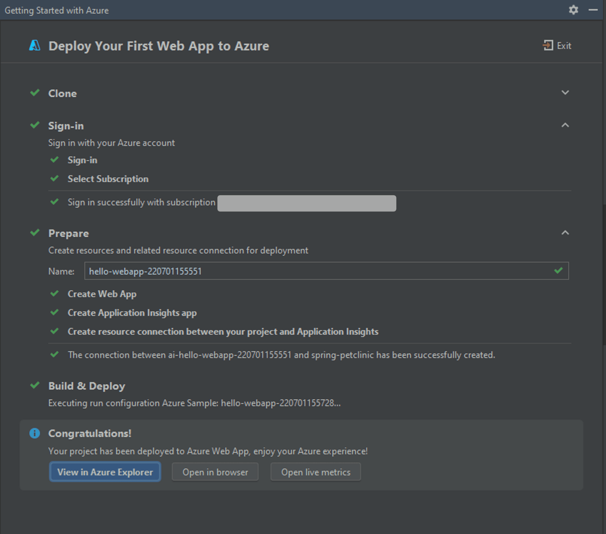
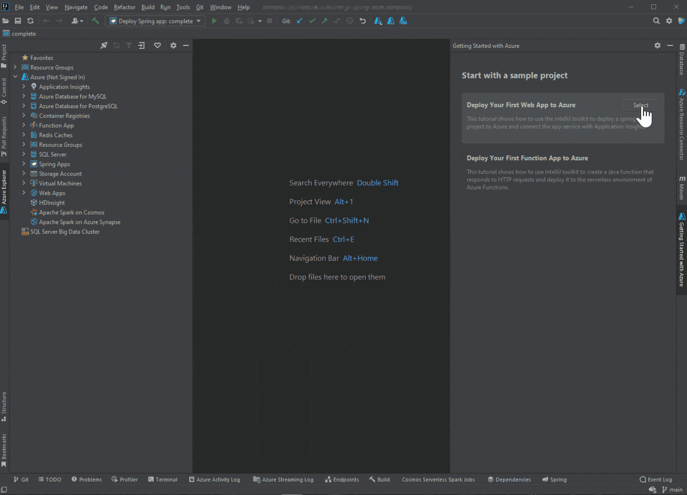
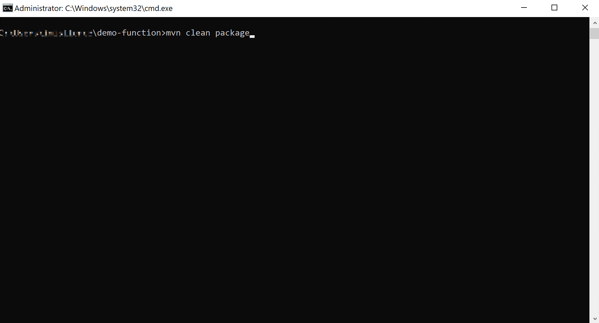
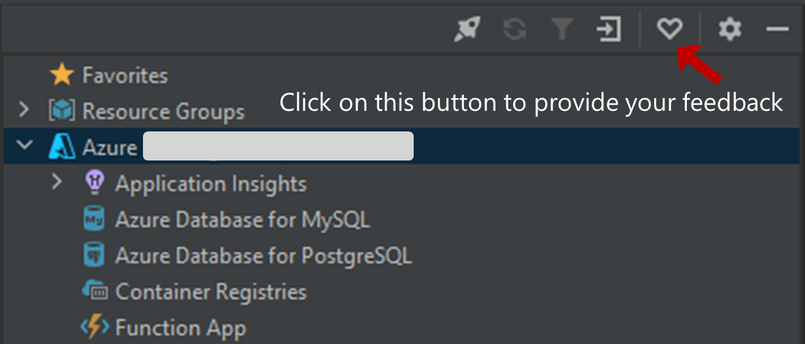

Hi everyone, welcome back to the July update of Java on Azure Tooling.

In this update, we will introduce the brand new getting started experience with the Azure toolkit for IntelliJ.

In addition, we have added support for Managed Identity Authentication.

Let's see what these new features are.

## Azure Toolkit for IntelliJ Improvements

### New Guided Getting Started Experience

In [April's blog](https://devblogs.microsoft.com/java/azure-toolkit-for-intellij-update-april-2022/ "April’s blog"), we first talked about why we needed better getting started experience. Currently, there are several challenges for a developer who is new to Azure:

* Deep learning curve: Developer needs to go through unfamiliar, Azure-specific concepts and other tools as beginners
* Scattered documentation: Documentation could be hard to find and contains too many number of steps
* Lack of guidance: No step-by-step guide to guide users from start to finish

Now let's take a look at our getting started experience to address these problems. There are three ways to open this feature:

* Click the  on the toolbar in Azure Explorer
* Right-click the Azure node and select the "Getting started" option in Azure Explorer
* Select "Tools \> Azure \> Getting Started" in the main menu

With this new getting experience, you will be able to finish your first deployment to Azure within several minutes, even if you have no experience.

During this process, you will get familiar with Azure Toolkit features and Azure concepts for boosting your productivity as a Java developer on Azure.

After you have upgraded or installed the latest of the toolkit, it will automatically open the getting started experience on the right side for the first time.

Once your click one of these two samples, our plugin will guide you to finish an end-to-end process. You can have an overview of all steps (as the screenshot shows below).

When you're done, you will have your first application successfully running on Azure. Next, you could click the button "View in Azure Explorer" to focus on your app resources in Azure Explorer. Here is a short demonstration for it.

### EAP and Snapshot Version Support

Azure Toolkit for IntelliJ has supported the IntelliJ 2022.2 EAP version. Besides, the latest release of the Azure Toolkit for IntelliJ also brings support for snapshot and beta versions. Now, if you want to try some new features that haven't been released, you can download and install the newest version from [the marketplace page](https://plugins.jetbrains.com/plugin/8053-azure-toolkit-for-intellij/versions/dev "the marketplace page").

## Maven Plugin/Gradle Plugin Improvements

### Support for Managed Identity Authentication

The managed identities for Azure resources help you safely access Azure resources. You can find more details [about managed identities for Azure Resources](https://docs.microsoft.com/en-us/azure/active-directory/managed-identities-azure-resources/overview "about managed identities for Azure Resources"). In our latest release, Managed Identity Authentication is available on Maven Plugin and Gradle Plugin.

To use it, you can simply configure your system-assigned or user-assigned managed identity in the portal at first. Next, it could be used to authenticate services when you deploy the application with Maven/Gradle Plugin. The following demonstration shows how you can use system-assigned managed identity when you deploy Azure Functions on a virtual machine.

## Feedback and Suggestions

Please don't hesitate to try our product! Your feedback and suggestions are very important to us and will help shape our product in future.

* Leave your comment on this blog post
* [Create a feature request or submit a bug](https://github.com/microsoft/azure-tools-for-java/issues/new "Create a feature request or submit a bug") on our official GitHub Issues page
* [Fill in our survey](https://microsoft.qualtrics.com/jfe/form/SV_b17fG5QQlMhs2up "Fill in our survey")

## Resources

Here is a list of links that are helpful to learn Java on Azure Tooling.

* [Azure Toolkit for IntelliJ documentation](https://docs.microsoft.com/en-us/azure/developer/java/toolkit-for-intellij/ "Azure Toolkit for IntelliJ documentation")
* [Azure Toolkit for Eclipse documentation](https://docs.microsoft.com/en-us/azure/developer/java/toolkit-for-eclipse/installation "Azure Toolkit for Eclipse documentation")
* [Maven Plugin for Azure Web Apps/Functions/Spring Cloud](https://github.com/microsoft/azure-maven-plugins/wiki/Azure-Spring-apps "Maven Plugin for Azure Web Apps/Functions/Spring Cloud")
* [Gradle Plugin for Azure Web Apps/Functions](https://github.com/microsoft/azure-gradle-plugins/wiki "Gradle Plugin for Azure Web Apps/Functions")
* [VS Code extension for Azure Spring Cloud](https://code.visualstudio.com/docs/java/java-on-azure "VS Code extension for Azure Spring Cloud")
