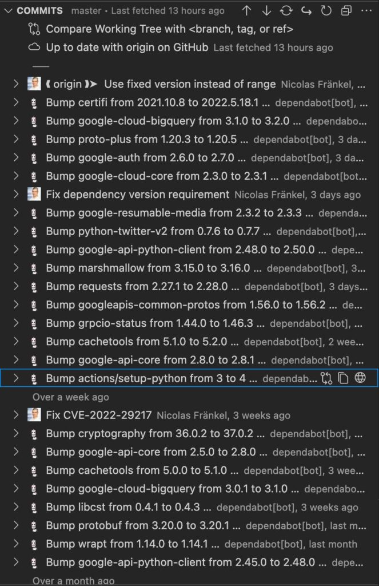

As part of my new job on [Apache APISIX](https://apisix.apache.org/), I write less Java and Kotlin code.

And when I do, the code is [really](https://github.com/nfrankel/evolve-apis/blob/master/old-api/src/main/java/org/apisix/demo/oldapi/HelloWorldController.java) [simple](https://github.com/nfrankel/evolve-apis/blob/master/new-api/src/main/kotlin/org/apisix/newapi/NewApiApplication.kt).

My coding hours (unfortunately not days) involve:

* A lot of containerization, including `Dockerfile`, `docker-compose.yml`, and soon Kubernetes manifests
* Some Python for scripting jobs - I abandoned Kotlin Scripting for this
* A bit of Lua because I want to learn it as part of my job
* A bit of Rust because I want to learn it for fun
* A bit of Kotlin because I still love it

Because of this, I didn't renew my IntelliJ Ultimate license early this year, and I fell back on the Community one.

I installed the relevant plugins, and I happily continued my coding routine.

Recently, I noticed that I used only a couple of features:

* Auto-completion, enhanced with the [TabNine](https://www.tabnine.com/) plugin
* Running and debugging

And that's all!

I didn't even use the Docker Compose integration, preferring to type `docker compose up` and `docker compose down`. I was actually using a richly featured for trivial tasks! After realizing it, I thought it might be time to try another IDE.

A couple of years ago, VSCode was all the rage. I didn't pay any attention because I assumed it was mainly for front-end development, and I did a lot of coding on the JVM then.

Things have changed: the VSCode ecosystem has matured, and lots of plugins are available. I decided to give it a shot.

To start with, I looked a bit under the cover:
> Microsoft's vscode source code is open source (MIT-licensed), but the product available for download (Visual Studio Code) is licensed under [this not-FLOSS license](https://code.visualstudio.com/license) and contains telemetry/tracking. The VSCodium project exists so that you don't have to download+build from source. This project includes special build scripts that clone Microsoft's vscode repo, run the build commands, and upload the resulting binaries for you to [GitHub releases](https://github.com/VSCodium/vscodium/releases). **These binaries are licensed under the MIT license. Telemetry is disabled.** --[VSCodium](https://vscodium.com/)

The paragraph above made me switch from VSCode to VSCodium. Installing it is just a command-line away:

```
brew install vscodium
```

VSCodium is built around a plugin architecture. The application is very lightweight, but tons of extensions contain all the possible features you can wish for.

Because I needed to update one of my Python projects, I searched for the relevant plugin. Navigate to *Extension*, then search for "python".



I installed the "official" [Python](https://open-vsx.org/extension/ms-python/python) extension. As I was there, I also installed the [TabNine](https://www.tabnine.com/install/vscode) one.

Getting used to a new IDE is always an investment. It took me three attempts to switch from Eclipse to IntelliJ IDEA. Here are three main problems that I had to solve immediately:

1. Find how to set a breakpoint - it's the leftmost gutter in the editor view
2. Multiline edit - *\[Opt + Cmd + Arrow\]*
3. Remember to save after editing! I had to forget to save after switching from Eclipse to IntelliJ IDEA; now I need to remember it again. Life is a circle.

To use VSCodium during my conference talks, I have two additional requirements:

1. Zooming with the mouse. Go to menu *VSCodium \> Preferences \> Settings* and search for "zoom".
2. View each Git commit and navigate from one to the other. The default Git view is not enough. I installed [GitLens](https://marketplace.visualstudio.com/items?itemName=eamodio.gitlens), adding the feature to the Git view.

At this point, I think I'm ready to use VSCodium for my next talk.

**To go further:**

* [Visual Studio website](https://code.visualstudio.com/)
* [VSCodium](https://vscodium.com/)
* [Visual Studio Code on GitHub](https://github.com/microsoft/vscode)

*Originally published at [A Java Geek](https://blog.frankel.ch/take-vscode-spin/) on June 17^th^, 2022*

*[IDE]: Integrated Development Environment
