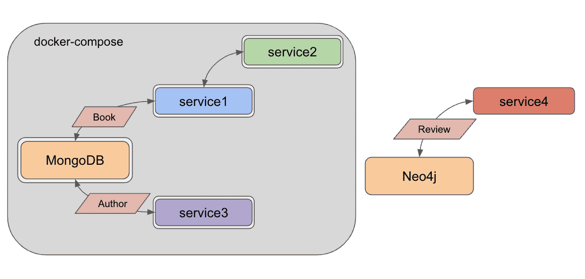
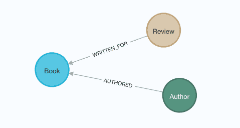
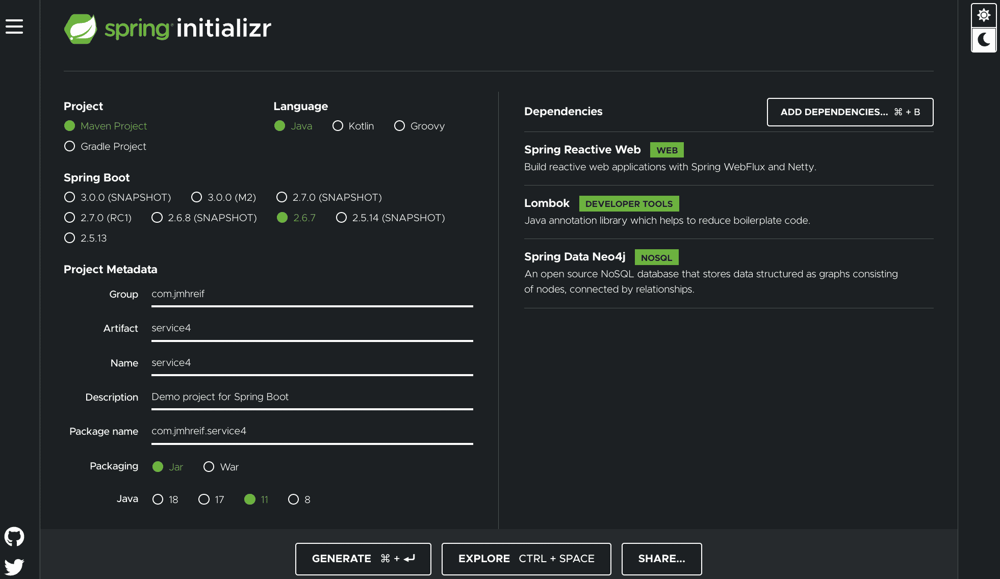
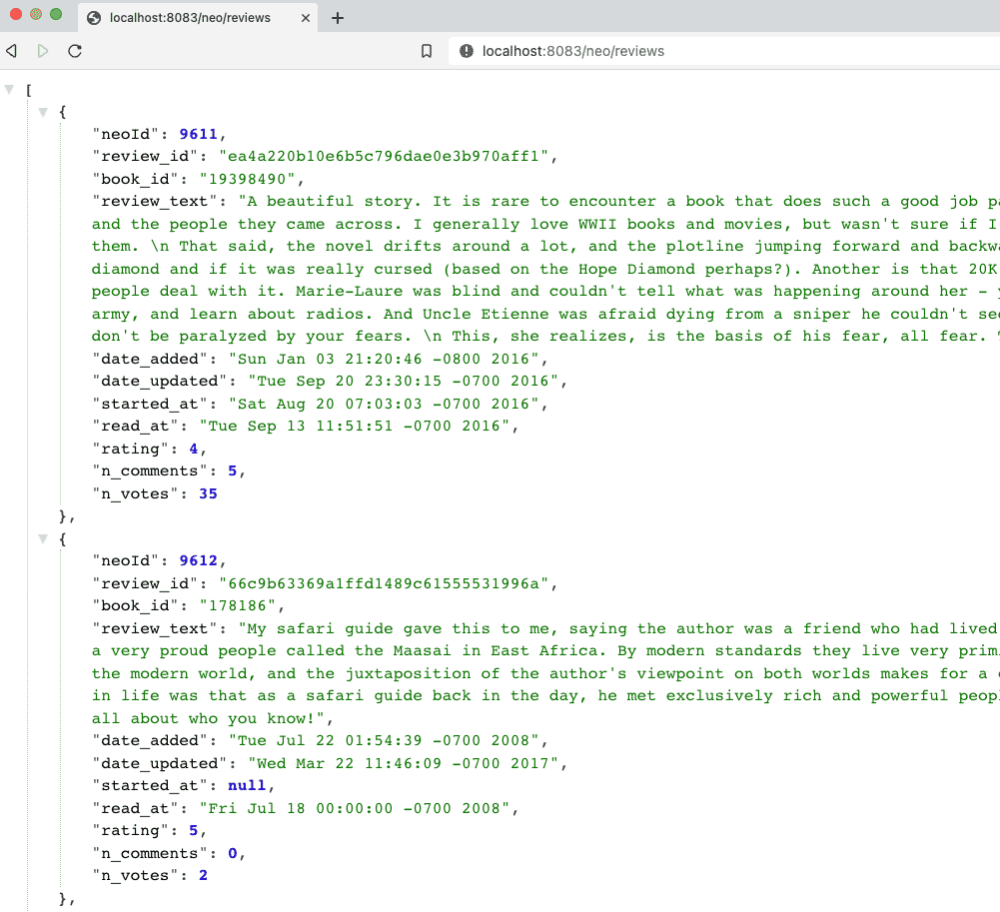
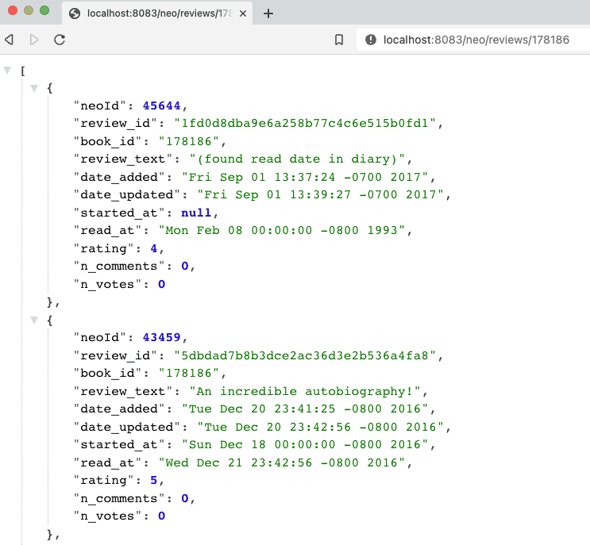

For our next adventure in Java microservices, we want to expand our system for book review data.

While books and authors are well-suited for a document database such as MongoDB, once you add reviews to the mix, the importance of the relationships makes this project better suited for a graph database.

This way, we can utilize relationships between the different entities to improve analysis based on the structure of the connections.

While everything we will do here is feasible with other data stores, a graph database dramatically simplifies queries on connected entities.

If you are new to graphs, I will leave a couple of resources below for more information.

* [Blog post: How do you know if a graph database solves the problem](https://medium.com/neo4j/how-do-you-know-if-a-graph-database-solves-the-problem-a7da10393f5)
* [Neo4j guide: What is a graph database?](https://neo4j.com/developer/graph-database/)

Utilizing another database means starting a database instance, and there were a few choices here. Several graph databases exist on the market, but Neo4j is a popular one and offers several deployment options.

We could spin up a Docker container (as we did in an [earlier section with MongoDB](https://jmhreif.com/blog/microservices-level3/)) or take advantage of the database-as-a-service option called [AuraDB](https://dev.neo4j.com/aura-java) with their free tier. Neo4j will handle managing the database, and it should have everything we need.

In this post, we will create our Neo4j database and get the data loaded, then build our new service that interacts with the database and provides an API for client services.

Let's get into the technical stuff!

## Architecture

We began this microservices project with minimum functionality explained in the [level 1 blog post](https://jmhreif.com/blog/microservices-level1/). In our last post ([level5](https://jmhreif.com/blog/microservices-level5/)), we used our existing services with book and author data, but set up Docker Compose to manage all the services together using a yaml file and a couple of commands.

With this iteration, we want to add some new functionality for book review data using a graph database in the cloud and set up a new service that hosts that data from the database.

Here is the updated architecture:



The items outside the grey box are what we are adding today - Neo4j database and `service4` application. The rest of the pieces of the diagram are from previous iterations of our microservices project.

Notice that we are not yet incorporating Neo4j and our new service to Docker Compose. I prefer to build things in small increments, so that there is less room for errors. We will add these new pieces to our existing architecture in a later post.

## Database-as-a-service: AuraDB

We want to add a new database into our microservices system, and we know we want to use [AuraDB](https://dev.neo4j.com/aura-java) free tier. Signing up and creating the database instance requires a couple steps and a bit of information, such as verifying your email address and waiting for the instance to spin up (takes a few minutes).

Details of that process (with screenshots) are shown in most of my colleague [Michael Hunger](https://twitter.com/mesirii)'s "Discover AuraDB Free" blog posts, such as [this week's](https://medium.com/neo4j/discover-auradb-free-week-26-goodreads-books-and-recommendations-54fb47e3f201).

Once the instance is running, we can get started with our data load.

## Graph data load

I could just load reviews to Neo4j, but graphs gain power from relationships between data. So, we can load all the entities for books, authors, and reviews.

My [data Github repository](https://github.com/JMHReif/graph-demo-datasets/tree/main/goodreadsUCSD) contains a load script with steps outlined in the folder's readme. A couple of queries are included in the readme for verifying the data. The loaded data has the below data model.



Time to start building our application to pull review data.

## Applications - Service 4

For those following along from previous iterations of this project, our new `service4` will look pretty similar to `service1` and `service3` for books and authors, respectively. For those jumping in with this blog post, we will build a Spring Boot application with a couple of REST endpoints to access the data from the connected database (in this case, Neo4j).

We can put together the outline of our project using the Spring Initializr at [start.spring.io](https://start.spring.io/).

On the form, we can leave `Project`, `Language`, and `Spring Boot` version fields defaulted. Under the `Project Metadata` section, I have chosen to update the group name for my personal projects, but you are welcome to leave it defaulted as well. I named the artifact `service4`, but naming isn't important as long as we can keep everything straight with our other services.

All other fields in this section can remain as they are. Under the `Dependencies` section, we will need `Spring Reactive Web`, `Lombok`, and `Spring Data Neo4j`. [Spring Data Neo4j](https://spring.io/projects/spring-data-neo4j) is the sister project to our previously-used Spring Data MongoDB, providing much of the same capabilities for the graph database. Finally, the project template is complete, and we can click the `Generate` button at the bottom to download the project.



*Note: the Spring Initializr displays in dark mode or light mode via the moon or sun icons in the right column of the page.*

Generating will download the project as a zip, so we can unzip it and move it to our project folder with the other services. Open the project in your favorite IDE and let's get coding!

The `pom.xml` contains the dependencies and software versions we set up on the Spring Initializr, so we can move to the `application.properties` file in the `src/main/resources` folder. Here, we want to connect to our Neo4j instance with a URI and database credentials.

We typically do not want to embed our database credentials in an application. Hard-coding those values could give others access to login or tamper with our cloud database. This is different from our previous services because we connected to a local MongoDB instance.

Solving this is something we will cover in the next blog post, but for now, we will simply hard-code our credentials with the caveat that we need to override them with dummy data before we publish any code.

```
server.port=8083

#database connection
spring.neo4j.uri=
spring.neo4j.authentication.username=
spring.neo4j.authentication.password=
spring.data.neo4j.database=
```

Because we have multiple services, we need the `server.port` property to ensure traffic does not conflict. We have already used ports 8080-8082 for services 1-3, so 8083 is our next in line. Next, we need to connect to our database using the properties for Neo4j URI, username, password, and database. *\*Note:\* Database should be `neo4j`, unless you have specifically used commands to change the default.*

On to the project code!

### Service 4 - project code

As mentioned above, code for `service4` will look similar to services 1 and 3, with the exception that we are mapping graph data instead of document data. A few changes go into that shift, so let's walk through them starting with the domain class.

```java
@Data
@Node
class Review {
	@Id
	@GeneratedValue
	private Long neoId;
	@NonNull
	private String review_id;

	private String book_id, review_text, date_added, date_updated, started_at, read_at;
	private Integer rating, n_comments, n_votes;
}
```

The `@Data` is a [Lombok annotation](https://projectlombok.org/features/Data) that generates our getters, setters, equals, hashCode, and toString methods for the domain class. It cuts down on the boilerplate code, so that's nice. Next is the [`@Node`](https://github.com/JMHReif/microservices-level6/blob/main/service4/src/main/java/com/jmhreif/service4/Service4Application.java#L53) annotation. This is a Spring Data Neo4j annotation that marks it as a Neo4j entity class (Neo4j entities are called nodes).

Within the class declaration, we define a few fields (properties) for our class. The `@Id` annotation marks the field as a unique identifier, and the `@GeneratedValue` says that it is generated internally by Neo4j. On our next field [`review_id`](https://github.com/JMHReif/microservices-level6/blob/main/service4/src/main/java/com/jmhreif/service4/Service4Application.java#L59), we have a Lombok [`@NonNull`](https://projectlombok.org/features/NonNull) annotation that specifies this field cannot be null. We also have some other fields we want to retrieve for the review text, dates, and rating information.

Next, we need a repository interface where we can define methods to interact with the data in the database.

```java
interface ReviewRepository extends ReactiveCrudRepository {
	Flux findFirst1000By();

	@Query("MATCH (r:Review)-[rel:WRITTEN_FOR]->(b:Book {book_id: $book_id}) RETURN r;")
	Flux findReviewsByBook(String book_id);
}
```

We want this repository to extend the `ReactiveCrudRepository`, which will let us use reactive methods and types for working with the data. Then, we define a couple of methods. While we could use Spring Data's out-of-the-box implementations of a few default methods (listed in the [code example of the documentation](https://docs.spring.io/spring-data/commons/docs/current/reference/html/#repositories.core-concepts)), we want to customize a little bit, so we will define our own. Instead of using the default `.findAll()` method, we want to pull only 1,000 results because pulling all 35,342 reviews could overload result-rendering on the client.

Notice that we do not have any implementation details with the `findFirst1000By()` method (no query or logic). Instead, we are using another of Spring Data's features - [derived methods](https://www.baeldung.com/spring-data-derived-queries). This is where Spring constructs (i.e. "derives") what the query should be based on the method name. In our example, the repository is dealing with reviews (`ReactiveCrudRepository`), so `findFirst1000` is looking for the first 1,000 reviews.

Normally, this syntax would continue by finding the results `by` a certain criterion (rating, reviewer, date, etc), but since we want to pull any random set of reviews, we can trick Spring by simply leaving off the criterion from our method name. This is where we get the `findFirst1000By`. *\*Note:\* This is a hidden workaround that is pretty handy once you know it, but it would be nice if Spring provided an out-of-the-box solution for these cases.*

Our next method [starting at the fourth line](https://github.com/JMHReif/microservices-level6/blob/main/service4/src/main/java/com/jmhreif/service4/Service4Application.java#L48) is a bit more straightforward. We want to find reviews for any specific book, so we need to look up reviews by `book_id`. For this, we have written a custom query using the `@Query` annotation and the database's related query language. Neo4j's is [Cypher](https://neo4j.com/developer/cypher/). This query looks for reviews written for a book with the specified book id.

With the repository complete, we can write our [controller class](https://www.javatpoint.com/spring-mvc-tutorial) that sets up some REST endpoints for other services to access the data.

```java
@RestController
@RequestMapping("/neo")
@AllArgsConstructor
class ReviewController {
	private final ReviewRepository reviewRepo;

	@GetMapping
	String liveCheck() { return "Service4 is up"; }

	@GetMapping("/reviews")
	Flux getReviews() { return reviewRepo.findFirst1000By(); }

	@GetMapping("/reviews/{book_id}")
	Flux getBookReviews(@PathVariable String book_id) { return reviewRepo.findReviewsByBook(book_id); }
}
```

Those familiar with our previous services 1 and 3 code will notice this looks almost the exact same (except with reviews instead of books or authors). The `@RestController` Spring annotation designates this as a rest controller class, and the `@RequestMapping` defines a high-level endpoint for using any of the class methods. Within the class declaration, we inject the `ReviewRepository` with the [first line](https://github.com/JMHReif/microservices-level6/blob/main/service4/src/main/java/com/jmhreif/service4/Service4Application.java#L32), so that we can utilize our written methods.

Next, we map endpoints for each of our methods. The `liveCheck()` method uses the high-level `/neo` endpoint to return a string, ensuring that our service is live and reachable. We can execute the `getReviews()` method by adding a nested endpoint (`/reviews`). This method uses the `findFirst1000By()` method that we wrote in the repository and returns a reactive `Flux` type where we expect 0 or more reviews in the results.

Our [final method](https://github.com/JMHReif/microservices-level6/blob/main/service4/src/main/java/com/jmhreif/service4/Service4Application.java#L40) has the nested endpoint of `/reviews/{book_id}`, where the book id is a path variable that changes based on the book we want to search. The `getBookReviews()` method passes in the specified book id as the path variable, then calls the `findReviewsByBook()` method from the repository and returns a `Flux` of reviews.

Time to test our new service!

## Put it to the test

Since `service4` is currently separate from our other services and using a different database, we will test this individually for now and test everything together once we are ready to incorporate `service4` with the rest in Docker Compose.

I like to start projects from bottom to top, so let us first ensure the Neo4j AuraDB instance is still running. *\*Note:\* AuraDB free tier pauses automatically after 3 days. You can resume with the `play` icon on the instance.*

Next, we need to start our `service4` application, either through the IDE or command line. Once that is running, we can test the application with the following commands.

1. Test application is live: open a browser and go to `localhost:8083/neo` or go to command line with `curl localhost:8083/neo`.
2. Test backend reviews api finding reviews: open a browser and go to `localhost:8083/neo/reviews` or go to command line with `curl localhost:8083/neo/reviews`.
3. Test api finding reviews for a certain book: open a browser and go to `localhost:8083/neo/reviews/178186` or go to command line with `curl localhost:8083/neo/178186`.

And here is the resulting output from authors api results from service4!





## Wrapping up!

We walked through creating a graph database instance using Neo4j AuraDB free tier and loaded data for books, authors, and reviews.

Then, we built a microservice application to connect to the cloud database and retrieve reviews.

Finally, we tested all of our code by starting the application and hitting each of our endpoints to ensure we could access the data.

There is so much more we can do on this topic. In upcoming posts, we need to externalize our database credentials, keeping sensitive data private, yet accessible to multiple services.

We also need to incorporate our new `service4` with the rest of our services in Docker Compose to manage everything together.

Another area of exploration is to take further advantage of graph benefits by pulling more related entities.

Happy coding!

## Resources

* Github: [microservices-level6](https://github.com/JMHReif/microservices-level6) repository
* Github: [Meta repository for all related content](https://github.com/JMHReif/microservices-java)
* Developer guide: [Neo4j graph database](https://neo4j.com/developer/graph-database/)
* Neo4j AuraDB: [Create a FREE database](https://dev.neo4j.com/aura-java)
* Documentation: [Spring Data Neo4j](https://spring.io/projects/spring-data-neo4j)
