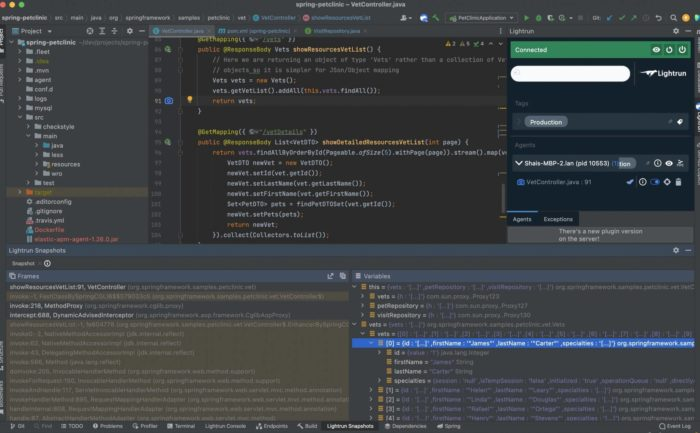
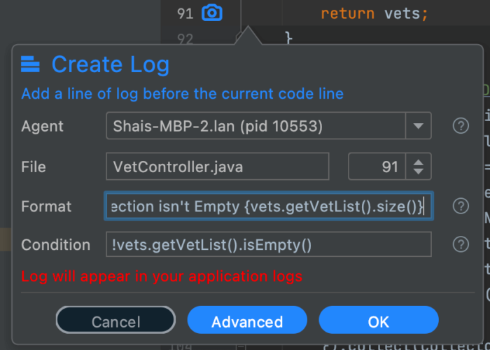
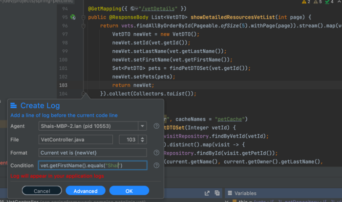

The Java Collections Framework was a huge leap forward when it was introduced as part of Java 2 (JDK 1.2).

Thanks to the included collection classes we finally moved beyond the limits of `Vector` and `Hashtable` to more mature and generic solutions. With the introduction of streams and functional concepts in Java 8 the framework took everything to the next level.

One of the core principles underlying the framework is coding to the interface. As such you would use the List interface or a Collection interface instead of the concrete implementation. This is great engineering but it makes debugging the Java Collections far more challenging.

When we debug a typical class we can inspect the variables or the implementation. In this case, the collection of objects is often hidden behind an abstraction which masks a complex internal structure e.g. red black tree etc.

## Local Debugging is Easy

With local debugging we can just add an inspection such `aslist.toArray()`. This will perform poorly but will still work. However, in a production environment when using [Lightrun](https://lightrun.com/) this will fail.

When trying to print out a complex list we can fail on the method invocation itself (which might fall below quota) or simply the length of the output which might be cropped.

Printing the content of a collection of elements is problematic. Even if you have code that uses the `Iterable` interface to loop over the entire list the likelihood of avoiding quota restrictions is low. Printing a primitive type array is easy but printing objects requires more.

## Erasure of Collection Elements

The collection framework includes another challenge when debugging: erasures. In Java one would expect code like this to work:

```java
List<MyObject> myList = new ArrayList<>();
```

Then the log might look like this:

```
The property value of the first element is {myList.get(0).getProperty()}
```

This will fail.

Generics in Java are removed during compilation and have no effect in the bytecode.

As such, Lightrun, which works at the bytecode level, is oblivious to them.

The solution is to write the code as if the generic isn't present and cast to the appropriate class:

```
The property value of the first element is {((MyObject)myList.get(0)).getProperty()}
```

## Getting Around Quota Limits

### What's Quota?

Lightun executes user code in a sandbox. Use code would qualify as any condition, expression log etc. The sandbox lets us guarantee that:

* The code is read only and doesn't impact state in any way. Not even if you invoke additional methods etc.
* The code doesn't fail (throw an exception etc.)
* The code is performant and doesn't take up too much CPU

This sandboxing has its own overhead. This is the "quota limit" the amount of CPU processing allocated to user code. Note that this is configurable on a per-agent basis.

Quota may be impacted if the object dependency graph is deep and requires access to many class objects. ֿThere are however two things we can do to extract some debuggable value from a collection interface.

### Use Snapshots

Snapshots provide far more detail about all types of collections. Since they access object internal state with a single shot, they tend to grab a lot of applicable data in the class.

E.g., take for instance this snapshot from the pet clinic Spring Boot demo. It lists a vector and the 10 elements within it. The values of individual objects within are clearly visible in the snapshot and can be traversed easily.



### Use Size and Related Methods

Debugging is the process of making assumptions and validating them. The `size()` method from java collections is very efficient and can be used almost freely.

If you expect a result to include a fixed set of elements you can easily use the `size()` or `isEmpty()` methods to indicate if a collection fits expectations. The method invocation here will be very efficient.

You can use it as a condition or within the log format itself:



### Logging an Individual Entry

As we mentioned before, if we're in a loop and try to log all the elements we'll hit quota pretty fast.

But if we only log the element we need from the collections class we'll be able to stay within the quota. This applies to positional access as well, assuming we have the offset of the element.

The code below uses the java streams API to covert elements. In that conversion code I can stick a log and only print it if the vet is me. This is the condition which uses the getFirstName()method of the Vet class:

```java
vet.getFirstName().equals("Shai")
```

If it's met I can print out the full details for the entry: `Current vet is {newVet}`.



## Preparation

Debugging Java Collections is harder when we aren't prepared. The nice thing is that preparation is also the first step in writing better code for long term maintenance.

It applies to all kinds of collections, it also works well for collections and stream operations.

The biggest fault by a far, is code that's overly concise. I'm at fault here too... E.g. this code returns directly from the method:

```java
return vets.findAllByOrderById(Pageable.ofSize(5).withPage(page)).stream().map(vet -> {
  VetDTO newVet = new VetDTO();
  newVet.setId(vet.getId());
  newVet.setLastName(vet.getLastName());
  newVet.setFirstName(vet.getFirstName());
  Set<PetDTO> pets = findPetDTOSet(vet.getId());
  newVet.setPets(pets);
  return newVet;
}).collect(Collectors.toList());
```

It seems so much cooler than this code which returns from the method after value assignment:

```java
List<VetDTO> returnValue = vets.findAllByOrderById(Pageable.ofSize(5).withPage(page)).stream().map(vet -> {
  VetDTO newVet = new VetDTO();
  newVet.setId(vet.getId());
  newVet.setLastName(vet.getLastName());
  newVet.setFirstName(vet.getFirstName());
  Set<PetDTO> pets = findPetDTOSet(vet.getId());
  newVet.setPets(pets);
  return newVet;
}).collect(Collectors.toList());
return returnValue;
```

But the second one lets us debug the collection locally as well as remotely. It also makes it much easier to add a log statement covering the collection result value which is something you should generally consider.

This is especially true when dealing with Java streams which emphasize such terse syntax.

### Include a Proper toString Methods

I cannot stress this enough: if it goes into the collection framework it should have a `toString()` method in the class. This makes debugging the elements so much easier!

When we include the class in a snapshot or a log the` toString()` method is invoked. If there's no implementation in the class we will see the object ID which isn't as useful.

## Summary

Snapshots are superior for debugging collection framework objects as they display more of the hierarchy.

Java Streams can be debugged but because of their terse nature by default they are more challenging. We should try and write code that's not as terse both for easier logging and debugging.

Printing everything in an `Iterable` interface won't work but using a conditional statement to print only the line that matters can work rather well.

Standard methods in the collection might still be too expensive for the quota CPU time mechanism. But APIs such as `isEmpty()` or \``size()`are efficient.
