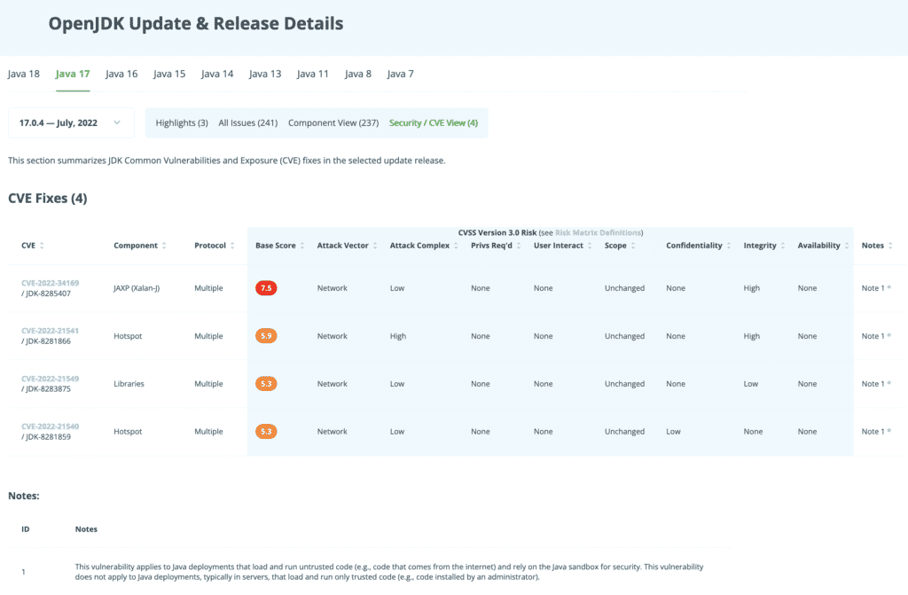

**Java has regular patch and security updates that are co-ordinated across the community, they happen once per quarter. When these updates happen, there are fixes that include security issues, all of which are displayed on Foojay.io.**

The next quarterly release of the OpenJDK has been made available, as scheduled, for July 2022, impacting a number of OpenJDK releases.

All the fixes provided for each updated OpenJDK release are found here:

* OpenJDK 18.0.2: <https://foojay.io/java-18/?quarter=072022>
* OpenJDK 17.0.4: <https://foojay.io/java-17/?quarter=072022>
* OpenJDK 15.0.8: <https://foojay.io/java-15/?quarter=072022>
* OpenJDK 13.0.12: <https://foojay.io/java-13/?quarter=072022>
* OpenJDK 11.0.16: <https://foojay.io/java-11/?quarter=072022>
* OpenJDK 8u342: <https://foojay.io/java-8/?quarter=072022>

Some of the security issues addressed are important enough to get a CVE (Common Vulnerabilities and Exposures), which means it is included in a list of publicly available computer security flaws. When the term "CVE" is referred to, what is meant is a security flaw that's been assigned a CVE ID number.

These too, with their details, [are listed on Foojay.io](https://foojay.io/java-17/?quarter=072022&tab=cve):

