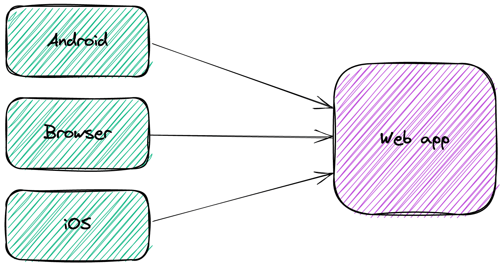
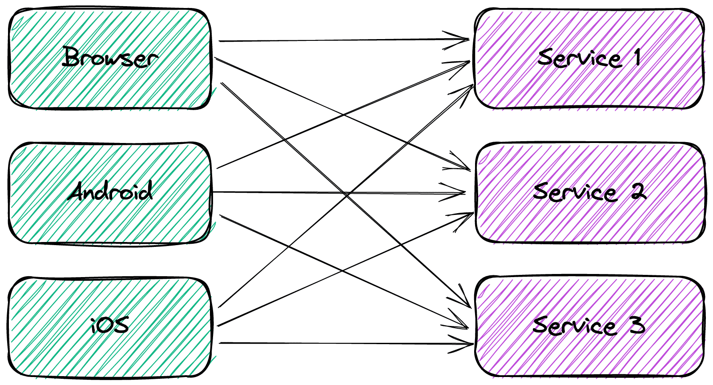
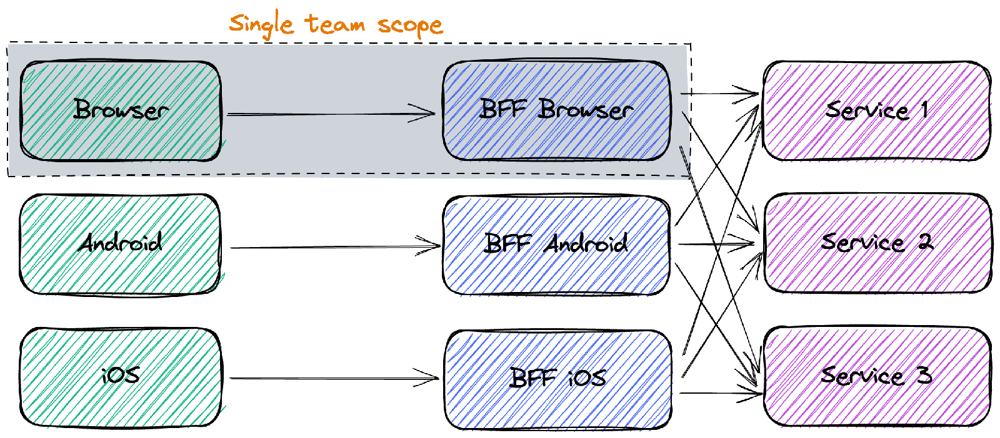
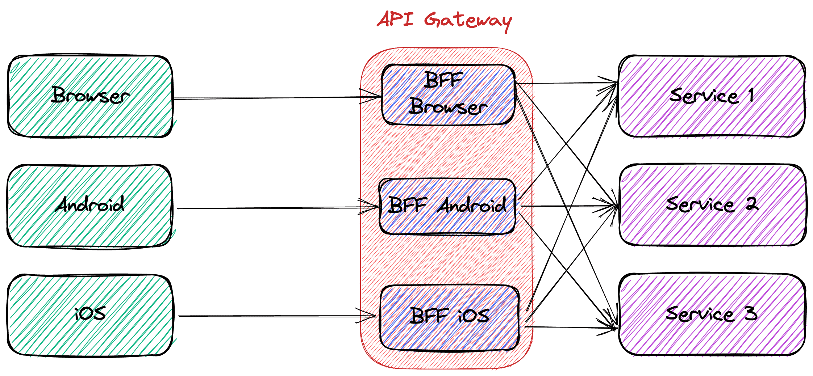

In the good old days, applications were simple. A browser sent a request to a webapp endpoint; the latter fetched data from a database and returned the response.

The rise of mobile clients and integrations with other apps upset this simplicity. I want to discuss one solution to handle the complexity in this post.

## The increased complexity of system architecture

Let's first model the above simple architecture.

Mobile clients changed this approach. The display area of mobile clients is smaller: just smaller for tablets and much smaller for phones.

A possible solution would be to return all data and let each client filter out the unnecessary ones. Unfortunately, phone clients also suffer from poorer bandwidth. Not every phone has 5G capabilities. Even if it was the case, it's no use if it's located in the middle of nowhere with the connection point providing H+ only.

Hence, over-fetching is not an option. Each client requires a different subset of the data. With monoliths, it's manageable to offer multiple endpoints depending on each client.

One could design a web app with a specific layer at the forefront. Such a layer detects the client from which the request originated and filters out irrelevant data in the response. Over-fetching in the web app is not an issue.

Nowadays, microservices are all the rage. Everybody and their neighbours want to implement a microservice architecture.

Behind microservices lies the idea of two-pizzas teams. Each team is autonomous and is responsible for a single microservice - or a single front-end application. To avoid coupling between the development effort, each microservice team publishes its API contract and handles changes **very carefully**.

Each microservice needs to serve the data strictly necessary for each kind of client to avoid the over-fetching issue above. With a small number of microservices, it's unwieldy to make each one filter out data depending on the client; with a large number, it's plain impossible. *Ergo*, the cartesian factor between the number of microservices and the number of different clients makes dedicated data endpoints on each microservice exponentially expensive.

## The solution: Backend For Front-end

The idea behind is to move logic from each microservice to a dedicated deployable endpoint. The latter is responsible for:

* Getting the data from each required microservice
* Extracting the relevant parts
* Aggregating them
* And finally returning them in the format relevant to the specific client

The same team develops the client **and** its associated BFF. BFF offers the same trade-off as microservices: improving the development velocity by increasing the system complexity.

## Separate deployment unit vs. API Gateways

The literature about BFF implies dedicated deployment units, as in the diagram above. Some posts, like this [one](https://www.manuelkruisz.com/blog/posts/api-gateway-vs-bff), oppose BFF with API Gateways. But the conceptual diagram shouldn't necessarily map one-to-one with the deployment diagram.

Like in many areas, people should focus more on the organizational side of things and less on the technical side. In this case, the most critical point is that the team responsible for the front-end is also accountable for the BFF. Whether it's a separate deployment unit or part of the API Gateway configuration is an implementation detail.

For example, with Apache APISIX, each team could deploy their BFF code independently as a separate plugin.

## Performance considerations

For the monolith, the situation is the following:

* The request from the client to the monolith takes a specific time *T* . It goes through the Internet, and *T* is probably long.
* The different internal calls to the database(s) are negligible compared to *T*.

As soon as one migrates to microservices, the client needs to call each one in turn. Hence, the time becomes *Σ(T1, T2, Ti, Tn)* for sequential calls. Since it's not acceptable, clients generally use parallel calls. The time becomes *max(T1, T2, Ti, Tn)* . Note that the client needs to execute *n* requests even then.

In the BFF case, we are back to one request, in *T* time, whatever the implementation. Compared to the monolith, there are additional requests `t1`, `t2`, `ti`, `tn` from the BFF to the microservices, but they are probably located together. Hence, the overall time will be longer than for a monolith, but since each `t` is much shorter than `T`, it won't affect the user experience much.

## Conclusion

You probably shouldn't implement microservices. If you do, microservices shouldn't return the whole data and make clients responsible for cleaning them. Thus, the microservice needs to return the exact data necessary, depending on the client. It introduces strong coupling between a microservice and its clients.

You want to remove this coupling. To achieve it, the Backend For Front-end approach extracts the cleaning logic away from each service into a dedicated component, also tasked with aggregating data. **Each client team is also responsible for their dedicated BFF**: when the client changes its data requirements, the team can deploy a new BFF version adapted for the new needs.

The BFF is a conceptual solution. Nothing mandates the fetching/cleaning/aggregating logic to be located in a specific location. It can be a dedicated deployment unit or a plugin in an API Gateway.

In a future post, I'll demo the different steps described in this post.

**To go further:**

* [Pattern: Backends For Frontends](https://samnewman.io/patterns/architectural/bff/)
* [The API gateway pattern versus the Direct client-to-microservice communication](https://docs.microsoft.com/en-us/dotnet/architecture/microservices/architect-microservice-container-applications/direct-client-to-microservice-communication-versus-the-api-gateway-pattern)
* [API Gateway vs Backend For Frontend](https://www.manuelkruisz.com/blog/posts/api-gateway-vs-bff)

*Originally published at [A Java Geek](https://blog.frankel.ch/backend-for-frontend/) on July 23^rd^, 2022*

*[BFF]: Backend For Front-end
