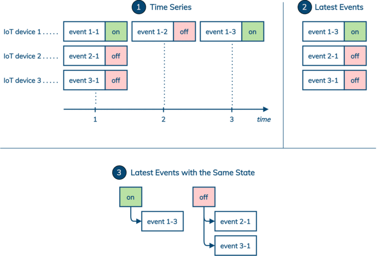

 © Shutterstock / everything possible   

Apache Cassandra is a rock-solid choice for managing IoT and time series data at scale. The most popular use case of storing, querying and analyzing time series generated by IoT devices in Cassandra is well-understood and documented. In general, a time series is stored and queried based on its source IoT device. However, there exists another class of IoT applications that require quick access to the most recent data generated by a collection of IoT devices based on a known state. The question that such applications need to answer is: Which IoT devices or sensors are currently reporting a specific state? In this blog post, we focus on this question and provide five possible data modeling solutions to efficiently answer it in Cassandra.

Introduction {#h2-0-introduction}
---------------------------------

The Internet of Things (IoT) is generating massive amounts of time series data that needs to be stored, queried, and analyzed. Apache Cassandra is an excellent choice for this task: not only because of its speed, reliability and scalability, but also because its internal data model has built-in support for time-ordered data.

In Cassandra, time series are usually stored and retrieved by a source (e.g., an IoT device or sensor) or a subject (e.g., a parameter or metric). There are many good resources that cover this topic in great detail, including [this conference presentation video](https://www.datastax.com/resources/video/datastax-accelerate-2019-designing-time-series-applications-scale-datastax), and ready-to-use Cassandra data models for [sensor data](https://www.datastax.com/learn/data-modeling-by-example/sensor-data-model) and [time series](https://www.datastax.com/learn/data-modeling-by-example/time-series-model).

In this post, we look at a related class of IoT use cases that need to manage a snapshot of the latest data coming from many IoT devices. Moreover, such a snapshot needs to be queried or filtered based on a specific state reported by IoT devices. In other words, we should be able to quickly answer this question in Cassandra: Which IoT devices are currently reporting a specific state? For many real-life use cases, this question may sound more like:

* Which lights are currently on (off) in a smart home?
* Which parking spots are currently occupied (unoccupied) in a parking structure?
* Which vehicles are currently available (unavailable) near a specific location?
* Which security alarms are currently triggered (activated, disabled) in an area?
* Which doors are currently opened (closed, locked, unlocked) in a building?
* Which fire detection sensors are currently reporting an abnormal (normal standby, error) state in a sensor network?

In the following, we define the problem a bit more formally and propose five practical solutions with example CQL implementations.

The problem definition {#h2-1-the-problem-definition}
-----------------------------------------------------

Given a collection of IoT devices or sensors that generate time-ordered sequences of events containing timestamps, data points and states, find the latest events with a known state reported by all IoT devices. The three key components of this problem are illustrated in the figure below and are described as follows:

1. The input consists of time series generated by IoT devices. The time series are generally stored in one or more Cassandra tables.
2. The intermediate view is a snapshot of only the latest events reported by the IoT devices. It is possible to either store the latest events separately and explicitly, or compute them dynamically from the input.
3. The final result is all the latest events with a known state. The latest events with the same state should be either stored together or readily computable.

 Managing the Latest IoT Events Based on a State   

We identify several challenges to managing the latest IoT events based on a state:

* A snapshot of the latest events is constantly evolving. Additional effort may be required to incrementally capture any changes.
* A frequency of event occurrences is generally unpredictable. It may be difficult to partition and organize events based on only their timestamp components.
* A state can usually take only a few unique values. Partitioning and indexing data based on a low-cardinality column may result in large partitions.

We use the following running example as a starting point. Table `events_by_device` is the input. This[table with multi-row partitions](https://www.datastax.com/learn/cassandra-fundamentals/tables-multi-row-partitions) is designed to store time series, such that each partition corresponds to one device, and rows in a partition represent events with timestamps, states and values. Events within each partition are always sorted by their timestamps in the descending order. This table essentially stores one time series per partition. We insert five events into the table and retrieve the time series for one device. Moreover, in the second query, we demonstrate that it is possible to dynamically compute all the latest events for all devices. Unfortunately, we should not rely on this query to solve the problem: it can potentially become very expensive as it accesses every partition in the table.

**SEE ALSO: ["An automated testing program is easier to iterate on than starting from scratch"](https://jaxenter.com/oleary-interview-174607.html)**

### Schema {#h3-2-schema}

<pre class="EnlighterJSRAW" data-enlighter-language="generic" data-enlighter-theme="" data-enlighter-highlight="" data-enlighter-linenumbers="" data-enlighter-lineoffset="" data-enlighter-title="" data-enlighter-group="">-- All events by device

CREATE TABLE events_by_device (

device_id  UUID,

timestamp  TIMESTAMP,

state      TEXT,

value      TEXT,

PRIMARY KEY((device_id), timestamp)

) WITH CLUSTERING ORDER BY (timestamp DESC);</pre>

### Data {#h3-3-data}

<pre class="EnlighterJSRAW" data-enlighter-language="generic" data-enlighter-theme="" data-enlighter-highlight="" data-enlighter-linenumbers="" data-enlighter-lineoffset="" data-enlighter-title="" data-enlighter-group="">-- Event 1-1
INSERT INTO events_by_device 
       (device_id, timestamp, state, value)
VALUES (11111111-aaaa-bbbb-cccc-12345678abcd, 
        '2021-01-01 01:11:11', 'on', 'event 1-1');
-- Event 1-2
INSERT INTO events_by_device 
       (device_id, timestamp, state, value)
VALUES (11111111-aaaa-bbbb-cccc-12345678abcd, 
        '2021-01-01 02:22:22', 'off', 'event 1-2');
-- Event 1-3
INSERT INTO events_by_device 
       (device_id, timestamp, state, value)
VALUES (11111111-aaaa-bbbb-cccc-12345678abcd, 
        '2021-01-01 03:33:33', 'on', 'event 1-3');
-- Event 2-1
INSERT INTO events_by_device 
       (device_id, timestamp, state, value)
VALUES (22222222-aaaa-bbbb-cccc-12345678abcd, 
        '2021-02-02 01:11:11', 'off', 'event 2-1');
-- Event 3-1
INSERT INTO events_by_device 
       (device_id, timestamp, state, value)
VALUES (33333333-aaaa-bbbb-cccc-12345678abcd, 
        '2021-03-03 01:11:11', 'off', 'event 3-1');</pre>

### Queries {#h3-4-queries}

<pre class="EnlighterJSRAW" data-enlighter-language="generic" data-enlighter-theme="" data-enlighter-highlight="" data-enlighter-linenumbers="" data-enlighter-lineoffset="" data-enlighter-title="" data-enlighter-group="">-- Find all events for a device
SELECT device_id, timestamp, state, value
FROM   events_by_device
WHERE  device_id = 11111111-aaaa-bbbb-cccc-12345678abcd;

 device_id                            | timestamp                       | state | value
--------------------------------------+---------------------------------+-------+-----------
 11111111-aaaa-bbbb-cccc-12345678abcd | 2021-01-01 03:33:33.000000+0000 |    on | event 1-3
 11111111-aaaa-bbbb-cccc-12345678abcd | 2021-01-01 02:22:22.000000+0000 |   off | event 1-2
 11111111-aaaa-bbbb-cccc-12345678abcd | 2021-01-01 01:11:11.000000+0000 |    on | event 1-1

-- Find the latest events for all devices
SELECT device_id, timestamp, state, value
FROM   events_by_device
PER PARTITION LIMIT 1;

 device_id                            | timestamp                       | state | value
--------------------------------------+---------------------------------+-------+-----------
 33333333-aaaa-bbbb-cccc-12345678abcd | 2021-03-03 01:11:11.000000+0000 |   off | event 3-1
 22222222-aaaa-bbbb-cccc-12345678abcd | 2021-02-02 01:11:11.000000+0000 |   off | event 2-1
 11111111-aaaa-bbbb-cccc-12345678abcd | 2021-01-01 03:33:33.000000+0000 |    on | event 1-3</pre>

Note that, we can assume that the number of events per device is not to exceed 100,000. Otherwise, we may have to further split partitions in table `events_by_device` by introducing another column into its partition key definition. Since this is not important for the problem we are solving in this post, let's keep things simple.

Given the problem definition and the running CQL example of IoT events, we are ready to describe the five solutions with different characteristics.

Solution 1: Materialized view {#h2-5-solution-1-materialized-view}
------------------------------------------------------------------

The first solution requires a new table and a materialized view. Table `latest_events_by_device` is a table with [single-row partitions](https://www.datastax.com/learn/cassandra-fundamentals/tables-single-row-partitions), where each partition corresponds to a device and each row corresponds to the latest known event. The purpose of this table is to have a snapshot of only the latest events reported by the IoT devices. The table is also a base table for materialized view `latest_events_by_state` that enables querying the latest events using a state.

Notice that exactly the same data is inserted into both tables `events_by_device` and `latest_events_by_device`. However, for the latter, inserts become [upserts](https://www.datastax.com/learn/cassandra-fundamentals/inserts-updates-deletes) that update rows to the latest events.

### Schema {#h3-6-schema}

<pre class="EnlighterJSRAW" data-enlighter-language="generic" data-enlighter-theme="" data-enlighter-highlight="" data-enlighter-linenumbers="" data-enlighter-lineoffset="" data-enlighter-title="" data-enlighter-group="">-- Latest known events by device
CREATE TABLE latest_events_by_device (
    device_id  UUID,
    timestamp  TIMESTAMP,
    state      TEXT,
    value      TEXT,
    PRIMARY KEY((device_id))
);

-- Latest events by state
CREATE MATERIALIZED VIEW latest_events_by_state AS 
  SELECT * FROM latest_events_by_device
  WHERE state IS NOT NULL AND device_id IS NOT NULL
PRIMARY KEY ((state), device_id);</pre>

### Data {#h3-7-data}

<pre class="EnlighterJSRAW" data-enlighter-language="generic" data-enlighter-theme="" data-enlighter-highlight="" data-enlighter-linenumbers="" data-enlighter-lineoffset="" data-enlighter-title="" data-enlighter-group="">-- Event 1-1
INSERT INTO latest_events_by_device 
       (device_id, timestamp, state, value)
VALUES (11111111-aaaa-bbbb-cccc-12345678abcd, 
        '2021-01-01 01:11:11', 'on', 'event 1-1');
-- Event 1-2
INSERT INTO latest_events_by_device 
       (device_id, timestamp, state, value)
VALUES (11111111-aaaa-bbbb-cccc-12345678abcd, 
        '2021-01-01 02:22:22', 'off', 'event 1-2');
-- Event 1-3
INSERT INTO latest_events_by_device 
       (device_id, timestamp, state, value)
VALUES (11111111-aaaa-bbbb-cccc-12345678abcd, 
        '2021-01-01 03:33:33', 'on', 'event 1-3');
-- Event 2-1
INSERT INTO latest_events_by_device 
       (device_id, timestamp, state, value)
VALUES (22222222-aaaa-bbbb-cccc-12345678abcd, 
        '2021-02-02 01:11:11', 'off', 'event 2-1');
-- Event 3-1
INSERT INTO latest_events_by_device 
       (device_id, timestamp, state, value)
VALUES (33333333-aaaa-bbbb-cccc-12345678abcd, 
        '2021-03-03 01:11:11', 'off', 'event 3-1');</pre>

### Queries {#h3-8-queries}

<pre class="EnlighterJSRAW" data-enlighter-language="generic" data-enlighter-theme="" data-enlighter-highlight="" data-enlighter-linenumbers="" data-enlighter-lineoffset="" data-enlighter-title="" data-enlighter-group="">-- Find all the latest events with state 'on'
SELECT state, device_id, timestamp, value
FROM   latest_events_by_state
WHERE  state = 'on';

 state | device_id                            | timestamp                       | value
-------+--------------------------------------+---------------------------------+-----------
    on | 11111111-aaaa-bbbb-cccc-12345678abcd | 2021-01-01 03:33:33.000000+0000 | event 1-3

-- Find all the latest events with state 'off'
SELECT state, device_id, timestamp, value
FROM   latest_events_by_state
WHERE  state = 'off';

 state | device_id                            | timestamp                       | value
-------+--------------------------------------+---------------------------------+-----------
   off | 22222222-aaaa-bbbb-cccc-12345678abcd | 2021-02-02 01:11:11.000000+0000 | event 2-1
   off | 33333333-aaaa-bbbb-cccc-12345678abcd | 2021-03-03 01:11:11.000000+0000 | event 3-1</pre>

The materialized view solution has the following characteristics:

* Applicability: state-based queries return 100K rows / 100MBs of data or less.
* Pros: the view is maintained automatically; excellent performance.
* Cons: materialized views have [a few limitations](https://www.datastax.com/learn/cassandra-fundamentals/materialized-views); data distribution may become skewed.

To support multiple tenants, we can change the table primary key to `PRIMARY KEY((tenant, device_id))` or `PRIMARY KEY((tenant), device_id)`, and the materialized view primary key to `PRIMARY KEY ((tenant, state), device_id)`. Multi-tenancy may also help improve data distribution.

This data model can be a simple, effective and efficient choice for many applications, as long as you are aware of and willing to counteract the [materialized view limitations](https://www.datastax.com/learn/cassandra-fundamentals/materialized-views). Another less obvious advantage of this data model is how easy it would be to feed data from an event streaming platform like [Apache Pulsar or Apache Kafka](https://www.datastax.com/blog/2021/01/four-reasons-why-apache-pulsar-essential-modern-data-stack). All events can go to the base table and the materialized view takes care of the rest.

Solution 2: Secondary index {#h2-9-solution-2-secondary-index}
--------------------------------------------------------------

The second solution requires a new table and a secondary index. The table is the same as in the materialized view solution. Table `latest_events_by_device` is a table with [single-row partitions](https://www.datastax.com/learn/cassandra-fundamentals/tables-single-row-partitions), where each partition corresponds to a device and each row corresponds to the latest known event. The purpose of this table is to have a snapshot of only the latest events reported by the IoT devices. Secondary index `latest_events_by_state_2i` is created for this table to query the latest events based on a state.

Once again, exactly the same data is inserted into both tables `events_by_device` and `latest_events_by_device`. However, for the latter, inserts become [upserts](https://www.datastax.com/learn/cassandra-fundamentals/inserts-updates-deletes) that update rows to the latest events.

### Schema {#h3-10-schema}

<pre class="EnlighterJSRAW" data-enlighter-language="generic" data-enlighter-theme="" data-enlighter-highlight="" data-enlighter-linenumbers="" data-enlighter-lineoffset="" data-enlighter-title="" data-enlighter-group="">-- Latest known events by device
CREATE TABLE latest_events_by_device (
    device_id  UUID,
    timestamp  TIMESTAMP,
    state      TEXT,
    value      TEXT,
    PRIMARY KEY((device_id))
);

-- Latest events by state
CREATE INDEX latest_events_by_state_2i 
ON latest_events_by_device (state);</pre>

### Data {#h3-11-data}

<pre class="EnlighterJSRAW" data-enlighter-language="generic" data-enlighter-theme="" data-enlighter-highlight="" data-enlighter-linenumbers="" data-enlighter-lineoffset="" data-enlighter-title="" data-enlighter-group="">-- Event 1-1
INSERT INTO latest_events_by_device
(device_id, timestamp, state, value)
VALUES (11111111-aaaa-bbbb-cccc-12345678abcd,
'2021-01-01 01:11:11', 'on', 'event 1-1');
-- Event 1-2
INSERT INTO latest_events_by_device
(device_id, timestamp, state, value)
VALUES (11111111-aaaa-bbbb-cccc-12345678abcd,
'2021-01-01 02:22:22', 'off', 'event 1-2');
-- Event 1-3
INSERT INTO latest_events_by_device
(device_id, timestamp, state, value)
VALUES (11111111-aaaa-bbbb-cccc-12345678abcd,
'2021-01-01 03:33:33', 'on', 'event 1-3');
-- Event 2-1
INSERT INTO latest_events_by_device
(device_id, timestamp, state, value)
VALUES (22222222-aaaa-bbbb-cccc-12345678abcd,
'2021-02-02 01:11:11', 'off', 'event 2-1');
-- Event 3-1
INSERT INTO latest_events_by_device
(device_id, timestamp, state, value)
VALUES (33333333-aaaa-bbbb-cccc-12345678abcd,
'2021-03-03 01:11:11', 'off', 'event 3-1');</pre>

### Queries {#h3-12-queries}

<pre class="EnlighterJSRAW" data-enlighter-language="generic" data-enlighter-theme="" data-enlighter-highlight="" data-enlighter-linenumbers="" data-enlighter-lineoffset="" data-enlighter-title="" data-enlighter-group="">-- Find all the latest events with state 'on'
SELECT state, device_id, timestamp, value
FROM   latest_events_by_device
WHERE  state = 'on';

 state | device_id                            | timestamp                       | value
-------+--------------------------------------+---------------------------------+-----------
    on | 11111111-aaaa-bbbb-cccc-12345678abcd | 2021-01-01 03:33:33.000000+0000 | event 1-3

-- Find all the latest events with state 'off'
SELECT state, device_id, timestamp, value
FROM   latest_events_by_device
WHERE  state = 'off';

 state | device_id                            | timestamp                       | value
-------+--------------------------------------+---------------------------------+-----------
   off | 33333333-aaaa-bbbb-cccc-12345678abcd | 2021-03-03 01:11:11.000000+0000 | event 3-1
   off | 22222222-aaaa-bbbb-cccc-12345678abcd | 2021-02-02 01:11:11.000000+0000 | event 2-1</pre>

The secondary index solution has the following characteristics:

* Applicability: state-based queries return 100K rows / 100MBs of data or more; state-based queries are executed infrequently.
* Pros: may better distribute the query workload across nodes in a cluster when retrieving a large result set.
* Cons: secondary indexes have [a few limitations](https://www.datastax.com/learn/cassandra-fundamentals/secondary-indexes); performance may become unsatisfactory for real-time applications.

This data model can be a reasonable choice in some cases. In particular, when multi-tenancy is introduced by changing the table primary key to `PRIMARY KEY((tenant), device_id)`, we can hit [the sweet spot](https://www.datastax.com/learn/cassandra-fundamentals/secondary-indexes) of using secondary indexes for real-time transactional queries. That is when retrieving rows from a large multi-row partition based on both a partition key and an indexed column specified in a query predicate.

Solution 3: State-Partitioned Table {#h2-13-solution-3-state-partitioned-table}
-------------------------------------------------------------------------------

The third solution relies on table `latest_events_by_state` to organize and query the latest events using a state. Every insert of an event with some state into this table must be accompanied by deletes of any outdated events with the other states for the same IoT device. In our example, we have one insert and one delete for each event, since we only have two unique states. If we were to have three possible states, each new event would result in one insert and two deletes.

### Schema {#h3-14-schema}

<pre class="EnlighterJSRAW" data-enlighter-language="generic" data-enlighter-theme="" data-enlighter-highlight="" data-enlighter-linenumbers="" data-enlighter-lineoffset="" data-enlighter-title="" data-enlighter-group="">-- Latest events by state
CREATE TABLE latest_events_by_state (
    state      TEXT,
    device_id  UUID,
    timestamp  TIMESTAMP,
    value      TEXT,
    PRIMARY KEY((state), device_id)
);</pre>

### Data {#h3-15-data}

<pre class="EnlighterJSRAW" data-enlighter-language="generic" data-enlighter-theme="" data-enlighter-highlight="" data-enlighter-linenumbers="" data-enlighter-lineoffset="" data-enlighter-title="" data-enlighter-group="">-- Event 1-1
INSERT INTO latest_events_by_state 
       (state, device_id, timestamp, value)
VALUES ('on', 11111111-aaaa-bbbb-cccc-12345678abcd, 
        '2021-01-01 01:11:11', 'event 1-1');
DELETE FROM latest_events_by_state 
WHERE state = 'off' AND
      device_id = 11111111-aaaa-bbbb-cccc-12345678abcd;
-- Event 1-2
INSERT INTO latest_events_by_state 
       (state, device_id, timestamp, value)
VALUES ('off', 11111111-aaaa-bbbb-cccc-12345678abcd, 
        '2021-01-01 02:22:22', 'event 1-2');
DELETE FROM latest_events_by_state 
WHERE state = 'on' AND
      device_id = 11111111-aaaa-bbbb-cccc-12345678abcd;
-- Event 1-3
INSERT INTO latest_events_by_state 
       (state, device_id, timestamp, value)
VALUES ('on', 11111111-aaaa-bbbb-cccc-12345678abcd, 
        '2021-01-01 03:33:33', 'event 1-3');
DELETE FROM latest_events_by_state 
WHERE state = 'off' AND
      device_id = 11111111-aaaa-bbbb-cccc-12345678abcd;
-- Event 2-1
INSERT INTO latest_events_by_state 
       (state, device_id, timestamp, value)
VALUES ('off', 22222222-aaaa-bbbb-cccc-12345678abcd, 
        '2021-02-02 01:11:11', 'event 2-1');
DELETE FROM latest_events_by_state 
WHERE state = 'on' AND
      device_id = 22222222-aaaa-bbbb-cccc-12345678abcd;
-- Event 3-1
INSERT INTO latest_events_by_state 
       (state, device_id, timestamp, value)
VALUES ('off', 33333333-aaaa-bbbb-cccc-12345678abcd, 
        '2021-03-03 01:11:11', 'event 3-1');
DELETE FROM latest_events_by_state 
WHERE state = 'on' AND
      device_id = 33333333-aaaa-bbbb-cccc-12345678abcd;</pre>

### Queries {#h3-16-queries}

<pre class="EnlighterJSRAW" data-enlighter-language="generic" data-enlighter-theme="" data-enlighter-highlight="" data-enlighter-linenumbers="" data-enlighter-lineoffset="" data-enlighter-title="" data-enlighter-group="">-- Find all the latest events with state 'on'
SELECT state, device_id, timestamp, value
FROM   latest_events_by_state
WHERE  state = 'on';

 state | device_id                            | timestamp                       | value
-------+--------------------------------------+---------------------------------+-----------
    on | 11111111-aaaa-bbbb-cccc-12345678abcd | 2021-01-01 03:33:33.000000+0000 | event 1-3

-- Find all the latest events with state 'off'
SELECT state, device_id, timestamp, value
FROM   latest_events_by_state
WHERE  state = 'off';

 state | device_id                            | timestamp                       | value
-------+--------------------------------------+---------------------------------+-----------
   off | 22222222-aaaa-bbbb-cccc-12345678abcd | 2021-02-02 01:11:11.000000+0000 | event 2-1
   off | 33333333-aaaa-bbbb-cccc-12345678abcd | 2021-03-03 01:11:11.000000+0000 | event 3-1</pre>

The state-partitioned table solution has the following characteristics:

* Applicability: state-based queries return 100K rows / 100MBs of data or less.
* Pros: excellent performance.
* Cons: additional deletes are required to maintain the table; measures to prevent [tombstone-related problems](https://medium.com/de-bijenkorf-techblog/experiences-with-tombstones-in-apache-cassandra-7302092e7423) may be necessary; data distribution may become skewed.

Neither of the three cons should be considered a serious obstacle in most circumstances. Additional deletes are equivalent to additional writes, and Cassandra can readily scale to handle more writes. Given that inserts and deletes are applied to the same rows again and again, tombstones are likely to get [resolved in a MemTable rather than in SSTables](https://docs.datastax.com/en/cassandra-oss/3.0/cassandra/dml/dmlHowDataWritten.html), which can greatly reduce the overall number of tombstones. For example, for a given IoT device, even frequent status updates that all hit the same MemTable can only result in one tombstone. We still recommend [monitoring table metrics](https://medium.com/de-bijenkorf-techblog/experiences-with-tombstones-in-apache-cassandra-7302092e7423) to be on top of any potential problems. Last but not least, data distribution depends on data and application characteristics. We take full control of data distribution in our last solution in this post.

We can easily support multiple tenants by changing the table primary key to `PRIMARY KEY((tenant, state), device_id)`. Multi-tenancy may also help improve data distribution. Overall, in terms of performance, this solution should be comparable to the materialized view solution.

**SEE ALSO: [4 Common Software Security Development Issues \& How to Fix Them](https://jaxenter.com/security-dev-issues-174540.html)**

Solution 4: Multiple tables {#h2-17-solution-4-multiple-tables}
---------------------------------------------------------------

The fourth solution features a separate table for each state. Every insert to table `latest_on_events_by_device` must be accompanied by a delete from table `latest_off_events_by_device`, and vice versa. This is to ensure that the latest event always cancels out any outdated event with a different state for the same device. The state-based queries over the tables can become very expensive as they have to scan all partitions in the tables.

### Schema {#h3-18-schema}

<pre class="EnlighterJSRAW" data-enlighter-language="generic" data-enlighter-theme="" data-enlighter-highlight="" data-enlighter-linenumbers="" data-enlighter-lineoffset="" data-enlighter-title="" data-enlighter-group="">-- Latest 'on' events by device
CREATE TABLE latest_on_events_by_device (
    device_id  UUID,
    timestamp  TIMESTAMP,
    value      TEXT,
    PRIMARY KEY((device_id))
);

-- Latest 'off' events by device
CREATE TABLE latest_off_events_by_device (
    device_id  UUID,
    timestamp  TIMESTAMP,
    value      TEXT,
    PRIMARY KEY((device_id))
);</pre>

### Data {#h3-19-data}

<pre class="EnlighterJSRAW" data-enlighter-language="generic" data-enlighter-theme="" data-enlighter-highlight="" data-enlighter-linenumbers="" data-enlighter-lineoffset="" data-enlighter-title="" data-enlighter-group="">-- Event 1-1
INSERT INTO latest_on_events_by_device 
       (device_id, timestamp, value)
VALUES (11111111-aaaa-bbbb-cccc-12345678abcd, 
        '2021-01-01 01:11:11', 'event 1-1');
DELETE FROM latest_off_events_by_device 
WHERE device_id = 11111111-aaaa-bbbb-cccc-12345678abcd;
-- Event 1-2
INSERT INTO latest_off_events_by_device 
       (device_id, timestamp, value)
VALUES (11111111-aaaa-bbbb-cccc-12345678abcd, 
        '2021-01-01 02:22:22', 'event 1-2');
DELETE FROM latest_on_events_by_device 
WHERE device_id = 11111111-aaaa-bbbb-cccc-12345678abcd;
-- Event 1-3
INSERT INTO latest_on_events_by_device 
       (device_id, timestamp, value)
VALUES (11111111-aaaa-bbbb-cccc-12345678abcd, 
        '2021-01-01 03:33:33', 'event 1-3');
DELETE FROM latest_off_events_by_device 
WHERE device_id = 11111111-aaaa-bbbb-cccc-12345678abcd;
-- Event 2-1
INSERT INTO latest_off_events_by_device 
       (device_id, timestamp, value)
VALUES (22222222-aaaa-bbbb-cccc-12345678abcd, 
        '2021-02-02 01:11:11', 'event 2-1');
DELETE FROM latest_on_events_by_device 
WHERE device_id = 22222222-aaaa-bbbb-cccc-12345678abcd;
-- Event 3-1
INSERT INTO latest_off_events_by_device 
       (device_id, timestamp, value)
VALUES (33333333-aaaa-bbbb-cccc-12345678abcd, 
        '2021-03-03 01:11:11', 'event 3-1');
DELETE FROM latest_on_events_by_device 
WHERE device_id = 33333333-aaaa-bbbb-cccc-12345678abcd;</pre>

### Queries {#h3-20-queries}

<pre class="EnlighterJSRAW" data-enlighter-language="generic" data-enlighter-theme="" data-enlighter-highlight="" data-enlighter-linenumbers="" data-enlighter-lineoffset="" data-enlighter-title="" data-enlighter-group="">-- Find all the latest events with state 'on'
SELECT device_id, timestamp, value
FROM   latest_on_events_by_device;

 device_id                            | timestamp                       | value
--------------------------------------+---------------------------------+-----------
 11111111-aaaa-bbbb-cccc-12345678abcd | 2021-01-01 03:33:33.000000+0000 | event 1-3

-- Find all the latest events with state 'off'
SELECT device_id, timestamp, value
FROM   latest_off_events_by_device;

 device_id                            | timestamp                       | value
--------------------------------------+---------------------------------+-----------
 33333333-aaaa-bbbb-cccc-12345678abcd | 2021-03-03 01:11:11.000000+0000 | event 3-1
 22222222-aaaa-bbbb-cccc-12345678abcd | 2021-02-02 01:11:11.000000+0000 | event 2-1</pre>

The multi-table solution has the following characteristics:

* Applicability: state-based queries return 100K rows / 100MBs of data or more; state-based queries are executed infrequently.
* Pros: may better distribute the query workload across nodes in a cluster when retrieving a large result set.
* Cons: performance may become unsatisfactory for real-time applications; additional deletes are required to maintain the tables; measures to prevent tombstone-related problems may be necessary.

This solution is on par with the secondary index solution in terms of query performance. Multiple tenants can be supported by changing the table primary keys to `PRIMARY KEY((tenant, device_id))` or `PRIMARY KEY((tenant), device_id)`. While we do not recommend this solution in practice, what is really interesting about this data model is how it prepares the stage for customizable partitioning discussed next.

Solution 5: Customizable partitioning {#h2-21-solution-5-customizable-partitioning}
-----------------------------------------------------------------------------------

Our final solution builds on the idea of using a separate table for each state. However, this time, we partition tables using artificial buckets. A bucket value is readily computable using user-defined function hash from a device `UUID` identifier. In this example, the function extracts the first three digits from a `UUID` literal, converts the resulting hexadecimal number to a decimal one, and returns the remainder of division of the decimal number by 3. Therefore, there can be at most three buckets or partitions per table with values 0, 1 or 2. It is just a coincidence that all our device identifiers map to bucket 0 in this example. Since [Version 4 UUIDs](https://www.datastax.com/learn/cassandra-fundamentals/advanced-data-types) are randomly generated, for a large number of events, data should be more or less uniformly distributed among the three buckets.

Similarly to the previous data model, every insert to table `latest_on_events_by_bucket` must be accompanied by a delete from table `latest_off_events_by_bucket`, and vice versa. Performance of the state-based queries depends on partitioning, and partitioning is customizable.

### Schema {#h3-22-schema}

<pre class="EnlighterJSRAW" data-enlighter-language="generic" data-enlighter-theme="" data-enlighter-highlight="" data-enlighter-linenumbers="" data-enlighter-lineoffset="" data-enlighter-title="" data-enlighter-group="">-- Custom hash function
CREATE FUNCTION hash(id UUID) 
RETURNS NULL ON NULL INPUT 
RETURNS INT 
LANGUAGE Java AS 
'return Integer.parseInt(id.toString().substring(0,3),16) % 3;';

-- Latest 'on' events by device
CREATE TABLE latest_on_events_by_bucket (
    bucket     INT,
    device_id  UUID,
    timestamp  TIMESTAMP,
    value      TEXT,
    PRIMARY KEY((bucket), device_id)
);

-- Latest 'off' events by device
CREATE TABLE latest_off_events_by_bucket (
    bucket     INT,
    device_id  UUID,
    timestamp  TIMESTAMP,
    value      TEXT,
    PRIMARY KEY((bucket), device_id)
);</pre>

### Data {#h3-23-data}

<pre class="EnlighterJSRAW" data-enlighter-language="generic" data-enlighter-theme="" data-enlighter-highlight="" data-enlighter-linenumbers="" data-enlighter-lineoffset="" data-enlighter-title="" data-enlighter-group="">-- Event 1-1
INSERT INTO latest_on_events_by_bucket 
       (bucket, device_id, timestamp, value)
VALUES (hash(11111111-aaaa-bbbb-cccc-12345678abcd), 
        11111111-aaaa-bbbb-cccc-12345678abcd,
        '2021-01-01 01:11:11', 'event 1-1');
DELETE FROM latest_off_events_by_bucket 
WHERE bucket = hash(11111111-aaaa-bbbb-cccc-12345678abcd) AND 
      device_id = 11111111-aaaa-bbbb-cccc-12345678abcd;
-- Event 1-2
INSERT INTO latest_off_events_by_bucket 
       (bucket, device_id, timestamp, value)
VALUES (hash(11111111-aaaa-bbbb-cccc-12345678abcd),
        11111111-aaaa-bbbb-cccc-12345678abcd, 
        '2021-01-01 02:22:22', 'event 1-2');
DELETE FROM latest_on_events_by_bucket 
WHERE bucket = hash(11111111-aaaa-bbbb-cccc-12345678abcd) AND 
      device_id = 11111111-aaaa-bbbb-cccc-12345678abcd;
-- Event 1-3
INSERT INTO latest_on_events_by_bucket 
       (bucket, device_id, timestamp, value)
VALUES (hash(11111111-aaaa-bbbb-cccc-12345678abcd),
        11111111-aaaa-bbbb-cccc-12345678abcd, 
        '2021-01-01 03:33:33', 'event 1-3');
DELETE FROM latest_off_events_by_bucket 
WHERE bucket = hash(11111111-aaaa-bbbb-cccc-12345678abcd) AND 
      device_id = 11111111-aaaa-bbbb-cccc-12345678abcd;
-- Event 2-1
INSERT INTO latest_off_events_by_bucket 
       (bucket, device_id, timestamp, value)
VALUES (hash(22222222-aaaa-bbbb-cccc-12345678abcd),
        22222222-aaaa-bbbb-cccc-12345678abcd, 
        '2021-02-02 01:11:11', 'event 2-1');
DELETE FROM latest_on_events_by_bucket 
WHERE bucket = hash(22222222-aaaa-bbbb-cccc-12345678abcd) AND 
      device_id = 22222222-aaaa-bbbb-cccc-12345678abcd;
-- Event 3-1
INSERT INTO latest_off_events_by_bucket 
       (bucket, device_id, timestamp, value)
VALUES (hash(33333333-aaaa-bbbb-cccc-12345678abcd),
        33333333-aaaa-bbbb-cccc-12345678abcd, 
        '2021-03-03 01:11:11', 'event 3-1');
DELETE FROM latest_on_events_by_bucket 
WHERE bucket = hash(33333333-aaaa-bbbb-cccc-12345678abcd) AND 
      device_id = 33333333-aaaa-bbbb-cccc-12345678abcd;</pre>

### Queries {#h3-24-queries}

<pre class="EnlighterJSRAW" data-enlighter-language="generic" data-enlighter-theme="" data-enlighter-highlight="" data-enlighter-linenumbers="" data-enlighter-lineoffset="" data-enlighter-title="" data-enlighter-group="">-- Find all the latest events with state 'on'
SELECT bucket, device_id, timestamp, value
FROM   latest_on_events_by_bucket
WHERE  bucket IN (0,1,2);

 bucket | device_id                            | timestamp                       | value
--------+--------------------------------------+---------------------------------+-----------
      0 | 11111111-aaaa-bbbb-cccc-12345678abcd | 2021-01-01 03:33:33.000000+0000 | event 1-3

-- Find all the latest events with state 'off'
SELECT bucket, device_id, timestamp, value
FROM   latest_off_events_by_bucket
WHERE  bucket IN (0,1,2);

 bucket | device_id                            | timestamp                       | value
--------+--------------------------------------+---------------------------------+-----------
      0 | 22222222-aaaa-bbbb-cccc-12345678abcd | 2021-02-02 01:11:11.000000+0000 | event 2-1
      0 | 33333333-aaaa-bbbb-cccc-12345678abcd | 2021-03-03 01:11:11.000000+0000 | event 3-1</pre>

The customizable partitioning solution has the following characteristics:

* Applicability: can meet different requirements when customized.
* Pros: flexibility; performance can be optimized by customizing partitioning.
* Cons: a good partitioning function must be supplied; additional deletes are required to maintain the tables; measures to [prevent tombstone-related problems](https://medium.com/de-bijenkorf-techblog/experiences-with-tombstones-in-apache-cassandra-7302092e7423) may be necessary.

Choosing a good partitioning function is a good problem to have. While this may add a bit more complexity, the solution gives full control over data partitioning and query performance. Finding a good partitioning function would depend on specific data and application requirements, and may require some experience and experimentation. For example, retrieving 100 rows from 1 partition is generally faster than retrieving 100 rows from 10 partitions, but retrieving 1,000,000 rows from 1 partition is usually slower than retrieving 1,000,000 rows from 10 partitions. Next, additional deletes are equivalent to additional writes, and Cassandra can readily scale to handle more writes.

Given that inserts and deletes are applied to the same rows again and again, tombstones are likely to get [resolved in a MemTable rather than in SSTables](https://docs.datastax.com/en/cassandra-oss/3.0/cassandra/dml/dmlHowDataWritten.html), which can greatly reduce the overall number of tombstones. For example, for a given IoT device, even frequent status updates that all hit the same MemTable can only result in one tombstone. We still recommend [monitoring table metrics](https://medium.com/de-bijenkorf-techblog/experiences-with-tombstones-in-apache-cassandra-7302092e7423) to be on top of any potential problems. Last but not least, data distribution depends on data and application characteristics. We take full control of data distribution in our last solution in this post.

This data model provides ultimate flexibility. Multi-tenancy is achievable by changing the primary key of each table to `PRIMARY KEY((tenant, bucket), device_id)`. More importantly, a partitioning function can be changed to increase or decrease the number of partitions. A query that retrieves a smaller result set should access a smaller number of partitions for better performance. A query that retrieves a larger result set should access a larger number of partitions for better workload distribution. It is possible to use different functions for different states and tenants to achieve optimal performance. Better partitioning should result in better performance.

Conclusion {#h2-25-conclusion}
------------------------------

We defined the problem of managing the latest IoT events based on a state, identified its challenges, and described how it can be solved in Apache Cassandra using five different data models. We stated the applicability, pros and cons for each data model. Our final recommendation is to focus on the materialized view, state-partitioned table, and customizable partitioning data models. Choose the first two for their simplicity and ease of use. Consider customizable partitioning for ultimate flexibility when other options are exhausted. Finally, be open to exploring new possible solutions that may push some computation to an application or rely on specialized search indexes and other technologies.

It is worth mentioning that this blog post was motivated by questions from Apache Cassandra community members on Discord. Join the [Fellowship of the (Cassandra) Rings](https://discord.com/invite/pPjPcZN) today and connect to fellow community members and experts!

Learn more about Cassandra, data modeling and IoT:

* **Cassandra-as-a-Service** [DataStax Astra](https://astra.dev/3OIIXir) -- experience serverless Cassandra for free
* **Short course** [Cassandra Fundamentals](https://www.datastax.com/learn/cassandra-fundamentals) -- learn Cassandra Query Language (CQL)
* **Learning series** [Data Modeling by Example](https://www.datastax.com/learn/data-modeling-by-example) -- study Cassandra data modeling in depth
* **Workshops** [Developer Workshops](https://www.datastax.com/workshops) -- attend free data modeling workshops and more
* **Whitepaper** [Data Modeling in Apache Cassandra](https://www.datastax.com/resources/whitepaper/data-modeling-apache-cassandra) -- get an overview of the best data modeling practices
* **More on IoT and time series** [Fundamentals](https://www.datastax.com/resources/video/datastax-accelerate-2019-designing-time-series-applications-scale-datastax) \|[IoT data model](https://www.datastax.com/learn/data-modeling-by-example/sensor-data-model) \| [Time series data model](https://www.datastax.com/learn/data-modeling-by-example/time-series-model) \| [Streaming](https://www.youtube.com/watch?v=nF502PmFi_w)
