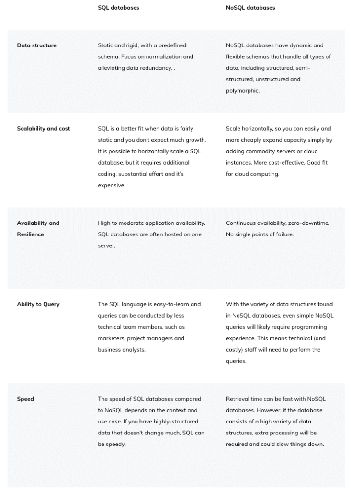
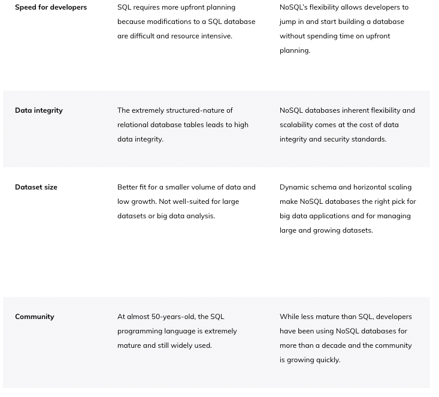

For decades, many companies have relied on relational databases to store, protect, and access their data.

SQL databases, in particular, worked well for a long time and still do for many use cases. But, today, there is a wide range of situations where SQL databases can no longer satisfy the needs of modern enterprises, especially those that have made the move to the cloud.

Increasingly, these companies are turning to NoSQL databases to meet their goals.

NoSQL databases are likely the better choice when:

* You have a large volume and variety of data
* Scalability is a top priority
* You need continuous availability
* Working with big data or performing real-time analytics

While this will often make a NoSQL database the right choice, there are many things to consider before making the move.

In this article, we'll explore when NoSQL use cases make sense.

First, let's take a closer look at NoSQL.

NoSQL is short for "not only SQL," or "non-SQL." It's a term used to describe databases that are not relational. To better understand NoSQL databases, let's first take a look at their alternative, SQL databases.

Developed in the early 1970s, a time when data storage was extremely expensive, SQL databases attempt to minimize data duplication between tables. While extremely organized, this also makes them extremely inflexible and difficult to modify.

Since then, the cost of storage has plummeted, while the cost of developer time has dramatically increased. With NoSQL databases, developers are no longer limited to the rigid, tabular approach of relational databases and have far more flexibility to do their best work.

NoSQL comes with many benefits, including:

* The choice of several database types — [**key-value, document, tabular (or wide column), graph, and multi-model**](https://www.datastax.com/nosql#types-of-nosql-databases) — so you can find the best fit for your data.
* The flexibility to easily store and access a wide variety of data types together, without upfront planning. The data types can include structured, semi-structured, unstructured, and polymorphic.
* The ability to add new data types and fields to the database without having to redefine the data model.
* Built-in, horizontal scalability that can handle rapid growth and is much less costly than attempting to scale-out a SQL database.
* Continuous availability and strong resilience, due to its horizontal scaling approach.
* Ease-of-use for developers that fits well with modern, agile teams.

[**Learn more about NoSQL**](http://www.datastax.com/nosql).

While NoSQL databases have many advantages, they're not the right choice for every situation. Sometimes sticking with a tried-and-true SQL database is the way to go. Let's compare SQL and NoSQL databases across several factors. Think about how each would apply to your data profile and use cases.
 

As you can see, making the choice between a SQL and NoSQL database is not always a straightforward decision. Each has its advantages and disadvantages. Making the right choice depends on your organization's specific data environment, along with your current needs and future goals. Many development teams actually use both within their cloud data architecture, sometimes even within the same application — deploying each to cover the areas they handle best.

So, what are the non-relational use cases? Here are several where NoSQL has been proven to make sense:

* Fraud detection and identity authentication
* Inventory and catalog management
* Personalization, recommendations and customer experience
* Internet of things (IoT) and sensor data
* Financial services and payments
* Messaging
* Logistics and asset management
* Content management systems
* Digital and media management

Let's look at the first three NoSQL use cases more closely.

Protecting sensitive personal data and ensuring only real customers have access to applications is understandably a top priority. Of course, this is only heightened in areas such as financial services, banking, payments, and insurance.

It's a never-ending battle. Fraudsters are creative and nimble. They tirelessly look for new ways to break the seal and their attacks continue to rise at an alarming rate. Whether you're trying to prevent illegitimate users from gaining access, or authenticating the identity of your customers, you have to lean heavily on your data.

It's possible to identify patterns and anomalies to pinpoint fraud in real-time or, in some cases, even before it occurs. To do so, real-time analysis of a large volume of both historic and live data of all types is required, including but not limited to user profile, environment, geographic data, and perhaps even biometric data. And context matters. For example, a $500 withdrawal may not typically be a big deal for a particular customer, but it might raise a red flag if the attempt originates at 3 a.m. in a foreign country.

The stakes to your company's reputation are higher than ever. One breach or mistake can be quickly amplified with the social media megaphone. It's a balancing act because setting restrictions too narrowly could result in a false positive rate that can adversely impact the customer experience. You want to make it as easy as possible for customers to use your application or website, while ensuring they actually are who they say they are. It's quite a tightrope to walk.

This combination of needs, including real-time analysis, large and growing datasets, numerous data types, along with the ability to continuously analyze and conduct machine learning and AI, makes the decision to use a NoSQL database a no-brainer for fraud detection and identity authentication.

Take the case of [**ACI Worldwide**](https://www.aciworldwide.com/), a company that provides real-time payment capabilities to 19 of the top 20 banks in the world. Their transaction volume is astronomically high, processing trillions of dollars in payments every day, and their data analysis needs are complex.

While payment intelligence systems have used relational databases in the past, that approach struggles to handle growing, large-scale use cases that require complex data analysis. At some point, it becomes impractical and cost-prohibitive to build a relational database big enough to do the job. To have any chance at handling these needs, a SQL database would have to be partitioned. In addition to being extremely resource intensive and expensive, partitioning would have another drawback. For the fraud use case, all information across all dimensions is needed to make each transaction decision. To handle the ever-growing volume, inevitably, a partitioned relational database would have to decrease the window of time of past transactions evaluated. As that time window shrinks, so does the ability to detect fraud.

For effective fraud detection and identity authentication, the data types analyzed extend far beyond transactional information. They could include anything from demographic data, help desk information from the CRM system, website interactions, historical shopping data, and much, much more. It would be impossible to develop a schema upfront that would define everything customers might want to do in the future. This environment requires the flexibility of a NoSQL database where any type of data element can be quickly added to the mix.

Using [**DataStax Enterprise**](https://www.datastax.com/products/datastax-enterprise) (DSE), ACI has improved its fraud detection rate and false positive rate, while saving their customers millions of dollars. And ACI's call center is saving money as fewer false positive cases are routed there.

[**Read more about how ACI is battling fraud with a NoSQL solution**](https://www.datastax.com/enterprise-success/aci).

NoSQL databases are known for their high availability and predictable, cost-effective, horizontal scalability. This makes them a great match for e-commerce companies with massive, growing online catalogs and loads of inventory to manage.

These organizations need the flexibility to quickly update their product mix, without volume limits. And the worst thing imaginable for them would be to have their site or application go down on Black Friday or during the Christmas holiday season.

For these reasons, [**Macy's**](https://www.macys.com/) has made the journey from relational databases to NoSQL. One of the most prominent department stores in the world, Macy's also has one of the largest e-commerce sites, with billions in annual sales. Like ACI, Macy's handles a massive volume of data that is diverse and growing. Before the move to NoSQL, the company had a heavily normalized database that limited their ability to scale their catalog and online inventory. Now that DSE and a NoSQL database are in place, this is no longer a source of concern for the Macy's team.

With their NoSQL database setup, Macy's can now:

* Handle traffic growth and massive volumes of data
* Easily and cost-effectively scale
* Provide faster catalog refreshes
* Grow its online catalog and number of products
* Analyze its catalog and inventory in real time

[**Learn more about Macy's move to NoSQL**](https://www.datastax.com/enterprise-success/macys).

Providing a fast, personalized experience is no longer a differentiator. Today, it's table stakes. Customers expect a consistent, high-quality, tailored experience from your brand, 24/7, across all devices.

They take it for granted. They demand near real-time interactions and relevant recommendations. While it's still possible to carve out unique, memorable experiences, the first priority is to make sure you have these bases covered. If you don't, that's what they'll remember. And, if that happens, you run the risk of them turning to Twitter or Facebook and amplifying your shortcomings. NoSQL databases are the answer to power the individualized experiences that will keep your customers happy.

That's because NoSQL databases:

* Have fast response times with extremely low latency, even as a customer base expands
* Can handle all types of data, structured and unstructured, from a variety of sources
* Are built to cost-effectively scale, with the ability to store, manage, query, and modify extremely large volumes of data and concurrently deliver personalized experiences to millions of customers
* Are extremely flexible, so you can continuously innovate and improve the customer experience
* Can seamlessly capture, integrate, and analyze new data that is continuously flowing in
* Are adept at being the backbone for the machine learning and AI engine algorithms that provide recommendations and power personalization

By focusing on providing intuitive, superior online customer experiences from the start, [**Macquarie Bank**](https://www.macquarie.com.au/), an Australian financial services company, was able to move from no retail banking presence to a top contender in the digital banking space in less than two years. Their focus on truly understanding customer behavior and prioritizing personalization has been a key to their success. So, it's no surprise they use a NoSQL database (Apache Cassandra with DataStax Enterprise) to provide their customers with near real-time recommendations, interactions, and insights.

[**Read more about how MacQuarie uses NoSQL to provide personalization for their customers**](https://www.datastax.com/enterprise-success/macquarie-bank).

Hopefully, this post and the non-relational database examples above have provided some guidance about when using a NoSQL database would be the smart move. So, what's the next step if you determine your company does indeed have NoSQL use cases?

A great place to start is [**to schedule a demo for DataStax Astra DB**](https://www.datastax.com/products/astra/demo), a scale-out NoSQL database built on Apache Cassandra.

Or, if you want to jump right in, [**you can get started with Astra DB for free**](https://astra.dev/3DNb4ee).
