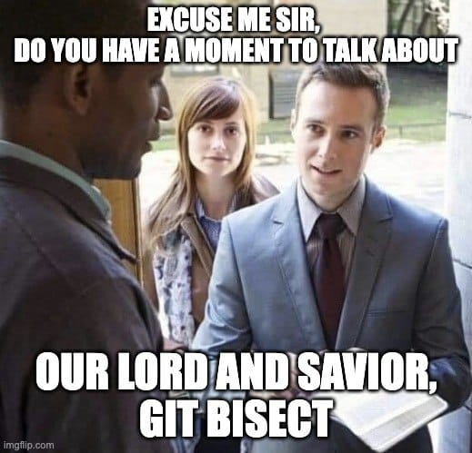
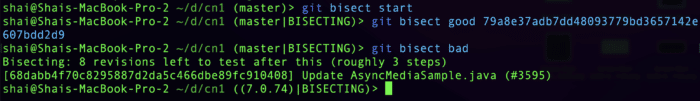

In this series, I cover a lot of magical tools and [git bisect](https://git-scm.com/docs/git-bisect) is probably the best example of such magic.

The hardest part in debugging is knowing the general area of the bug... and bisect literally shines a light on the specific commit that caused it!

Before we begin, let's make one thing clear: bisect is a tool for debugging regressions. It does nothing for regular bugs. When we have a regression, we typically know that the issue used to work in a specific release, we would typically have a specific revision where the code worked. We would typically know that it doesn't work in the current version, but which commit along the way causes the failure?

## In the Olden Days

Back in the old days of SVN (or CVS, SourceSafe, etc.) we used to checkout an older version of the repository and test on it. If it failed, we'd go further back and if it succeeded we'd go forward to hone in on the specific commit that failed. Those among us who were lucky enough to work with competent QA departments could often pass this task to them. Ultimately, the work was manual.

When zeroing in on the issue we'd follow the sensible search strategy of dividing the number of revisions in half and going to the middle of the set instead of going one step at a time. This significantly shortened the time spent looking for the problematic revision. However, there are still many revisions to search through.

At this point you might wonder, why didn't you automate these things?

We sometimes did but since no versioning system was as dominant as git these automations didn't last and I'm not aware of such an automation that made it into any version control system. But git bisect made it in and is the automation of this heuristic.



## Git Bisect: Find the Bug. Automatically!

That's right. It does exactly that. The simplest use of git bisect starts with the command:

```
git bisect start
```

This switches us into bisect mode. We can now define the "good" version where things used to work properly. E.g. for <https://github.com/codenameone/CodenameOne/> I can use the revision `79a8e37adb7dd48093779bd3657142e607bdd2d9` as the good revision. We can thus mark it using the command:

```
git bisect good 79a8e37adb7dd48093779bd3657142e607bdd2d9
```

Once we do, we can activate bisect traversal by marking the bad revision. For most cases this means the current head revision which is the default, but you can specify a specific revision as an argument to this command:

```
git bisect bad
```

Once this is done, we can move between revisions by redefining the good or bad revisions.

Here we ran these commands on the Codename One repo and got this output:


Notice the value `68dabb4f70c8295887d2da5c466dbe89fc910408` at the bottom. This is the current revision we "jumped" to. We can now mark this revision as good or bad based on our manual testing.

I marked it as bad, could have marked it as "good" and that would have worked fine. This moved bisect to the next revision we need to test:



## This Sucks! Or Does It?

Going through every revision manually is a major pain!

Sure, it's better than randomly looking through revision logs and jumping through revisions while keeping our place in our head. But just barely better. Luckily, there's a better way: `run`.

Bisect can run an arbitrary command for us on every revision it encounters. If the command returns zero (as a process exit code) the revision is good. If it returns something else, it's bad. This way the broken revision will be identified automatically for us with no human interaction.

Normally this works great for a shell command but as a Java developer this is a bit of a pain. Typically, I would have a unit test that shows the failure. Unfortunately, that unit test doesn't exist in the older version of the project. Then I also need to compile the project for this to work. So while git bisect seems cool with the run command, how do we use it for a compiled language like Java?

This is actually pretty easy. We can create a complex command line but personally I prefer something like:

```
git bisect run testMyJavaProject.sh
```

Then I implement the shell script with the commands that build/test. But before that I need to create a unit test that fails for that specific bug. I assume this is something most of us can accomplish easily. Now that we have a unit test creating the shell script is trivial. The code below assumes you use maven for building:

```
#!/bin/sh

mvn clean
mvn package -DskipTests
mvn test -Dtest=MyTestClass
```

That's it. Notice that if compilation will fail because of dependencies within the test class you might end up with the wrong revision. So keep the test simple!

When you're done with git bisect or wish to stop for any reason just issue the command:

```
git bisect reset
```

## TL;DR

Git bisect is probably the simplest tool I will cover in this series.

But it's also one of the most important tools.

Learning to use it effectively can save you days of tedious work and hunting around for an issue.

Despite these huge benefits, it's a relatively obscure feature. The reason for this is that for 98% of the time we don't need it. But in that 2%, we REALLY need it...

Hopefully, the next time you run into a regression you'll remember that it's there and use this post to hunt down the issue.
