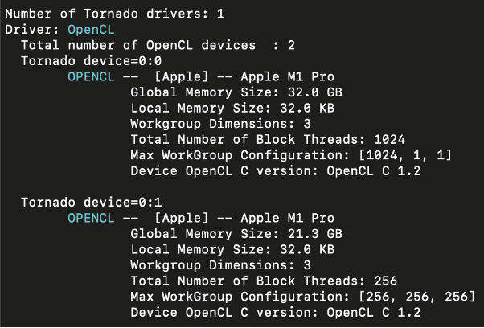
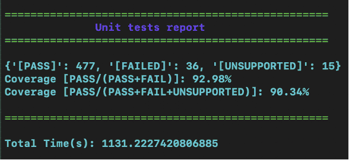
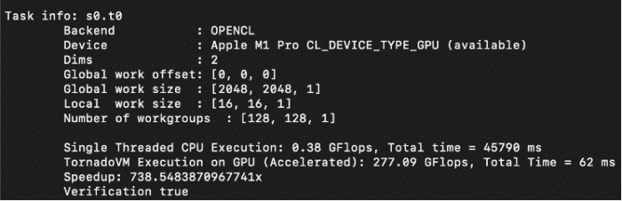

This article aims to describe the main steps required to install and run [TornadoVM](https://foojay.io/today/hardware-acceleration-for-java-tornadovm-can-do-it/) on Apple M1 Pro.

#### Steps

* Install Prerequisites
* Run TornadoVM Installer
* Execute Unit Tests
* Performance Evaluation: Running Matrix-Multiplication on Apple M1 GPU

### 1. Install Prerequisites

To install TornadoVM, it is necessary to have some packages installed. For instance, you will have to install [Maven](https://maven.apache.org/) and [wget](https://mac.install.guide/homebrew/index.html) in order to enable the TornadoVM installer to be functional.

Assuming that Homebrew is installed in your system, you can open a terminal and execute the following commands:

```
$ brew install wget
$ brew install maven
```

### 2. Run TornadoVM Installer

Now that prerequisites are in place, the next step is to use the TornadoVM installer which will download, install all dependencies, and build TornadoVM. In the example below, TornadoVM is installed with OpenJDK 11 and the OpenCL backend; which is the only backend that can currently operate on Apple M1 Pro.

Note that the installer will download and use the OpenJDK version for x86_64 architecture. This software version is portable on M1 Pro which has an ARM processor due to [Rosetta 2 dynamic binary translation](https://www.toptal.com/apple/apple-m1-processor-compatibility-overview) that allows x86 software to run on M1 Pro.

```
$ git clone https://github.com/beehive-lab/TornadoVM.git
$ cd TornadoVM
$ ./scripts/tornadoVMInstaller.sh --jdk11 --opencl
```

Once the installer script is completed, users can source the script that holds all the paths that need to be exported before they run TornadoVM.

Be aware that this step has to be run every time that a new terminal process begins. Alternatively, you can add that command in your *bashrc* or *zsh* profile.

```
$ source source.sh
$ echo 'source <path-to-TornadoVM>/TornadoVM/source.sh' >> ~/.zprofile
```

If you want to rebuild TornadoVM using the same JDK (OpenJDK 11) with the installation, you can type:

```
$ make jdk-11-plus
```

Now that TornadoVM is installed in your system, let's see which devices are detected as OpenCL compatible by running:

```
$ tornado --devices
```



The first device is the CPU of Apple M1 Pro, while the second device is the GPU.

### 3. Execute Unit Tests

The TornadoVM version that is demonstrated in this blog is v0.14 and the exact commit is [#5e5fbbc](https://github.com/beehive-lab/TornadoVM/commit/5e5fbbc8cc2e79f3ecb87c32dedfec48d0f6b44d). TornadoVM contains a set of 528 unit-tests for the OpenCL backend.

We have run all unit tests on the CPU (first device detected) by running make tests, and we obtained the following report: TornadoVM passes 477 tests, fails 36 tests, and 15 out of 528 are not supported.



Several unit tests fail for different reasons. For instance, the default OpenCL version on M1 Pro is 1.2, while TornadoVM requires OpenCL 2.1 to exploit all its features.

A second issue is that some default features, such as [native functions](https://registry.khronos.org/OpenCL/sdk/1.0/docs/man/xhtml/mathFunctions.html) are not supported by the OpenCL device driver.

Another reason that unit-tests fail is an exception regarding `CL_INVALID_WORK_GROUP_SIZE`, which means that the total work group size (256) used in the tests exceeds the size supported by the device, which is 1.

### 4. Performance Evaluation: Running Matrix-Multiplication on Apple M1 GPU

We opted to run the Matrix Multiplication application for two dimensional matrices on the GPU device with id (0:1). To reproduce the result you can execute the following command:

```
$ tornado --threadInfo -Ds0.t0.device=0:1 -m tornado.examples/uk.ac.manchester.tornado.examples.compute.MatrixMultiplication2D 2048
```

The result is 738.5x performance increase compared to a single threaded execution, as shown below.  


### Final Remarks

To sum up, the installation of TornadoVM along with all its dependencies was not a tedious process. Everything was executed in a straightforward manner and the TornadoVM installer is functional also on the Apple M1 Pro silicon.

However, the fact that OpenCL is reported to be [deprecated](https://developer.apple.com/documentation/apple-silicon/porting-your-macos-apps-to-apple-silicon) soon by Apple, makes Apple M1 Pro an experimental platform without any guarantees. For all the aforementioned reasons, Apple M1 Pro can run TornadoVM but several issues related to performance or functional correctness may be encountered.
