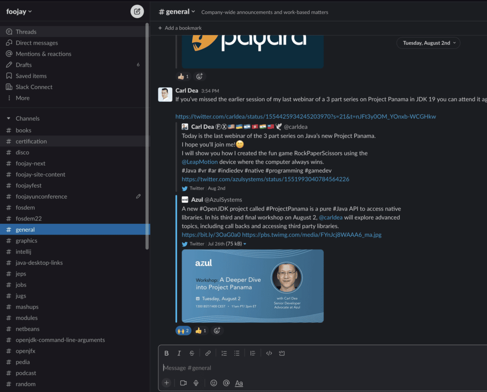

You can join the Foojay.io community on Slack on [this link](https://join.slack.com/t/foojay/shared_invite/zt-49m9q52n4-utLx5AzXYxR_Na1S3oFoug).

Encountering any kind of problem while signing up to Foojay Slack? Send a quick e-mail off to hello AT foojay DOT io for help!

On Slack, the Foojay.io community discusses articles, insights, tips, tricks, events, and more, all related to users of the OpenJDK, such as Java and Kotlin developers.

