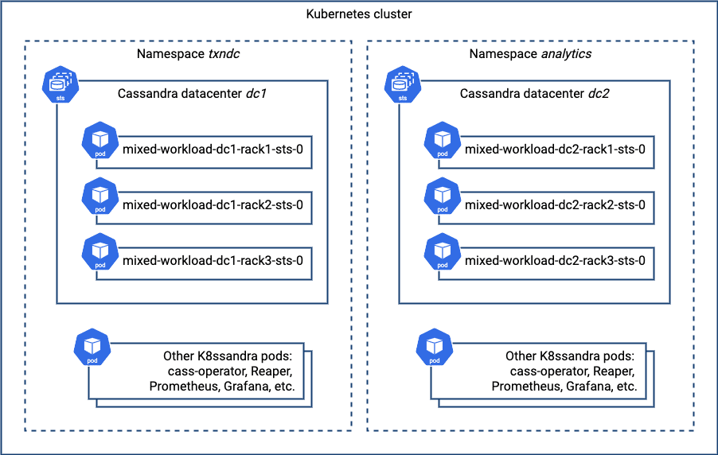

The [Get Started](https://k8ssandra.io/get-started/) examples on the K8ssandra site are primarily concerned with spinning up a single Apache Cassandra datacenter in a single Kubernetes cluster.

However, there are many situations that can benefit from other deployment options.

In this series of articles, we'll examine different deployment patterns and show how to implement them using K8ssandra.

## Flexible topologies with Cassandra

From its earliest days, Cassandra has included the ability to assign nodes to datacenters and racks. A rack was originally conceived as mapping to a single rack of servers connected to shared resources, like power, network, and cooling.

A datacenter could consist of multiple racks with physical separation. These constructs allowed developers to create high-availability deployments by replicating data across different fault domains. This ensured that Cassandra clusters remain operational amid failures ranging from a single physical server, rack, to an entire datacenter facility.

The concepts of datacenters and racks are flexible in Cassandra, allowing a variety of deployment patterns. In public cloud deployments, racks are often mapped to cloud provider zones, and datacenters to regions.

For example, in a deployment on Google Cloud Platform, you might have Cassandra `dc1` deployed in region `us-west4`, with racks in zone `us-west4-a`, `us-west4-b`, and `us-west4-c`. Another datacenter `dc2` might be deployed in `us-east1`.

Another common pattern takes advantage of the fact that datacenters and racks don't have to strictly map to physical topology. You can create a separate logical datacenter in order to isolate workloads.

For example, when running heavy analytics workloads it may make sense to spin up a separate logical data center for those queries. Transactional workloads will not be affected by the surge in queries as Spark jobs are submitted and run against the dedicated analytics datacenter.

## Separate K8ssandra install per Cassandra datacenter

Let's look at how you can use Kubernetes namespaces to perform separate K8ssandra installations in the same cloud region.

### Creating a Kubernetes cluster for testing

To try this out, you'll need a Kubernetes cluster to test on. As an example, in preparing this post, I followed the instructions on the [K8ssandra Google Kubernetes Engine (GKE)](https://docs.k8ssandra.io/install/gke/) installation docs to create a GKE cluster in the `us-west4` region.

Note that I followed the instructions on this page up to the "Install K8ssandra" section and stopped, given my installation is slightly different. The GKE install instructions reference scripts provided as part of the [K8ssandra GCP Terraform Example](https://github.com/k8ssandra/k8ssandra-terraform/tree/main/gcp).

### Creating administrator credentials

According to K8ssandra's default options, Cassandra nodes are created with authentication enabled.

If no secret is provided containing authentication credentials, K8ssandra creates a secret containing an administrator username and password that will be applied to all the nodes.

In our deployment, you will create administrator credentials that are applied to both K8ssandra installs. This ensures that both datacenters will use the same credentials.

Since Kubernetes secrets are namespaced, you'll need to create a copy in each namespace where our datacenters are deployed. Create the namespaces and secrets as follows:

```
kubectl create namespace txndc
kubectl create secret generic cassandra-admin-secret --from-literal=username=cassandra-admin --from-literal=password=cassandra-admin-password -n txndc

kubectl create namespace analyticsdc
kubectl create secret generic cassandra-admin-secret --from-literal=username=cassandra-admin --from-literal=password=cassandra-admin-password -n analyticsdc
```

For the purpose of this blog, let's keep things simple and let `kubectl` encode the credentials. You may want to use a more complex password for production deployments.

See the [Security documentation page](https://docs.k8ssandra.io/tasks/secure/) and the `cassandra.auth section` of the [K8ssandra helm chart documentation](https://docs.k8ssandra.io/reference/helm-charts/k8ssandra/) for more information on configuring administrator credentials.

### Creating the first datacenter

Now you're ready to start creating a multi-datacenter deployment. Create the configuration for the first datacenter in a file called `dc1.yaml`:

```
cassandra:
  auth:
    superuser:
      secret: cassandra-admin-secret
  cassandraLibDirVolume:
    storageClass: standard-rwo
  clusterName: mixed-workload
  datacenters:
  - name: dc1
    size: 3
    racks:
    - name: rack1
      affinityLabels:
        failure-domain.beta.kubernetes.io/zone: us-west4-a
    - name: rack2
      affinityLabels:
        failure-domain.beta.kubernetes.io/zone: us-west4-b
    - name: rack3
      affinityLabels:
        failure-domain.beta.kubernetes.io/zone: us-west4-c
```

In addition to requesting 3 nodes in the datacenter, this configuration specifies a specific storage class which uses `volumeBindingMode: WaitForFirstConsumer`, and uses affinity to specify how the racks are mapped to GCP zones. This configuration also uses the secret you created previously for the Cassandra superuser account.

Create a release for the datacenter using this command:

```
helm install txndc k8ssandra/k8ssandra -f dc1.yaml -n txndc
```

This causes the K8ssandra release to be installed in the `txndc` namespace, which is just a name picked to indicate this is a Cassandra datacenter intended for transactional work.

It is possible to check the allocation of the Cassandra nodes to workers in different zones using the output of the `kubectl` describe nodes command, which includes information about the zone of the node as well as its executing pods (I've shortened the output slightly for readability):

```
kubectl describe nodes | grep -e 'ProviderID\|sts-' | awk '{ print $2 }'

.../us-west4-b/gke-multi-zone4-default-pool-33e58b74-jxj1
mixed-workload-dc1-rack2-sts-0
.../us-west4-a/gke-multi-zone4-default-pool-aa341888-r63m
mixed-workload-dc1-rack1-sts-0
.../us-west4-c/gke-multi-zone4-default-pool-c0d4bfd0-skz7
mixed-workload-dc1-rack3-sts-0
```

As you can see, `rack1` maps to zone `us-west4-a`, `rack2` to zone `us-west4-b`, and `rack3` to zone `us-west4-c`, as requested.

As would be the case for any Cassandra cluster deployment, you will want to wait for the first datacenter to be completely up before adding a second datacenter. One simple way to do this is to watch until the Stargate pod shows as initialized, since it depends on Cassandra being ready:

```
watch kubectl get pods -n txndc

NAME                                                  READY   STATUS             RESTARTS   AGE
txndc-dc1-stargate-58bf5657ff-ns5r7                     1/1     Running            0          15m
```

### Adding a second datacenter

Create a configuration to deploy the second datacenter. For the nodes in `dc2` to be able to join the cluster, a couple of things are required. The first is to use the same Cassandra cluster name as for the first datacenter.

Second, you'll need to provide some seed nodes so that the nodes in the second datacenter know how to contact nodes in the first datacenter to join the cluster. In a traditional Cassandra installation, you might grab the IP addresses of a couple of nodes in `dc1` to provide to `dc2` as seed nodes.

In Kubernetes, we expect pods to be replaced on a fairly regular basis, so there's no guarantee that a Cassandra node will be available at a particular IP address should it get recreated in a new pod. Fortunately, K8ssandra takes care of this by providing a seed service.

The seed service provides a stable DNS address that resolves IP addresses during the bootstrap process for other Cassandra nodes wishing to join a cluster. K8ssandra manages the details of mapping of the pod IP addresses of a couple of underlying Cassandra nodes as the actual seeds. You can find the seed service using a command like this:

```
kubectl get services -n txndc | grep seed
```

Which produces output such as:

```
mixed-workload-seed-service  ClusterIP    None    <none>    <none>    30m
```

As you can see, the name for the service is `mixed-workload-seed-service`. To reference it as a seed provider in the other namespace, you'll need to include the namespace as part of the DNS name: `mixed-workload-seed-service.txndc`. Create a configuration with the values just described, in a file called `dc2.yaml`:

```
cassandra:
  additionalSeeds: [ mixed-workload-seed-service.txndc ]
  auth:
    superuser:
      secret: cassandra-admin-secret
  cassandraLibDirVolume:
    storageClass: standard-rwo
  clusterName: mixed-workload
  datacenters:
  - name: dc2
    size: 3
    racks:
    - name: rack1
      affinityLabels:
        failure-domain.beta.kubernetes.io/zone: us-west4-b
    - name: rack2
      affinityLabels:
        failure-domain.beta.kubernetes.io/zone: us-west4-c
    - name: rack3
      affinityLabels:
        failure-domain.beta.kubernetes.io/zone: us-west4-a
```

Similar to the configuration for `dc1`, this configuration also uses affinity. A similar allocation of racks can be used to make sure Cassandra nodes are evenly spread across the remaining workers. Deploy the release using this command:

```
helm install analyticsdc k8ssandra/k8ssandra -f dc2.yaml -n analyticsdc
```

This causes the K8ssandra release to be installed in the `analyticsdc` namespace. If you look at the resources in this namespace using a command such as `kubectl get services,pods -n analyticsdc`, you'll note that there are a similar set of pods and services as for `txndc`, including Stargate, Prometheus, Grafana, and Reaper. Depending on how you wish to manage your application, this may or may not be to your liking, but you are free to tailor the configuration to disable any components you don't need.

### Configuring keyspaces

Once the second datacenter comes online, you'll want to configure Cassandra keyspaces to replicate across both clusters. To do this, connect to a node in the original datacenter and execute cqlsh:

```
kubectl exec mixed-workload-dc1-rack1-sts-0 -n txndc -it -- cqlsh -u cassandra-admin -p cassandra-admin-password
```

Use the `DESCRIBE KEYSPACES` command to list the keyspaces and `DESCRIBE KEYSPACE <name>` to identify those using the `NetworkTopologyStrategy`. For example:

```
cassandra-admin@cqlsh> DESCRIBE KEYSPACES
reaper_db      system_auth  data_endpoint_auth  system_traces
system_schema  system       system_distributed

cassandra-admin@cqlsh> DESCRIBE KEYSPACE system_auth

CREATE KEYSPACE system_auth WITH replication = {'class': 'NetworkTopologyStrategy', 'dc1': '3'}  AND durable_writes = true;
…
```

Typically you'll find that the `system_auth`, `system_traces`, and `system_distributed` keyspaces use `NetworkTopologyStrategy`. You can then update the replication strategy to ensure data is replicated to the new datacenter. You'll execute something like the following for each of these keyspaces:

```
ALTER KEYSPACE system_auth WITH replication = {'class': 'NetworkTopologyStrategy', 'dc1': 3, 'dc2': 3};
```

**Important:**Remember to create or alter the replication strategy for any keyspaces you need for your application so that you have the desired number of replicas in each datacenter.

If you've enabled Stargate, make sure to alter the `data_endpoint_auth` keyspace to use `NetworkTopologyStrategy` as well.

After exiting `cqlsh`, make sure existing data is properly replicated to the new datacenter with the `nodetool rebuild` command. It needs to be run on each node in the new datacenter, for example:

```
kubectl exec mixed-workload-dc2-rack1-sts-0 -n analyticsdc -- nodetool --username cassandra-admin --password cassandra-admin-password rebuild dc1
```

Repeat for the other nodes `mixed-workload-dc2-rack2-sts-0` and `mixed-workload-dc2-rack3-sts-0`.

### Testing the configuration

How do you know the configuration worked? It's time to test it out. Probably the most straightforward way would be to use the `nodetool status` command. To do this you'll need to pick a Cassandra node to execute the `nodetool` command against.

Because K8ssandra configures Cassandra nodes to require login by default, you'll need credentials. Execute the `nodetool` command against the node, making sure to swap in any alternate credentials you may have used:

```
kubectl exec mixed-workload-dc1-rack1-sts-0 -n txndc -- nodetool --username cassandra-admin --password cassandra-admin-password status
```

This will produce output similar to the following:

```
Defaulting container name to cassandra.
Use 'kubectl describe pod/txndc-dc1-rack1-sts-0 -n txndc' to see all of the containers in this pod.
Datacenter: dc1
===============
Status=Up/Down
|/ State=Normal/Leaving/Joining/Moving
--  Address      Load       Tokens       Owns (effective)  Host ID                               Rack
UN  10.120.0.8   579.16 KiB  256          16.0%             ef2595c0-830a-4701-bbf2-9e8637d95edd  rack1
UN  10.120.2.5   519.94 KiB  256          16.6%             c965fb53-9555-4a29-9e75-179f637738bd  rack2
UN  10.120.1.5   564.45 KiB  256          16.2%             16e66328-a85f-4be9-8e87-c9a6df373a79  rack3
Datacenter: dc2
===============
Status=Up/Down
|/ State=Normal/Leaving/Joining/Moving
--  Address      Load       Tokens       Owns (effective)  Host ID                               Rack
UN  10.120.5.14  182.61 KiB  256          16.6%             179d92e0-fca8-4427-8ca5-048b3c465ff8  rack1
UN  10.120.4.14  182.44 KiB  256          16.8%             791b70d3-5c69-4101-822b-6543c0d9cca8  rack2
UN  10.120.3.7   158.64 KiB  256          17.8%             9e686277-9a78-49f6-bb5f-4322733c60d6  rack3
```

If everything has been configured correctly, you'll be able to see both datacenters in the cluster output. Here's a picture that depicts what you've just deployed, focusing on the Cassandra nodes:


## Multiple Cassandra datacenters in a single K8ssandra install?

One question that might have occurred to you: why not do a single K8ssandra installation with multiple datacenters? For example, you might try a configuration like this:

```
cassandra:
  ...
  datacenters:
  - name: dc1
    size: 3
    racks:
    - name: rack1
  - name: dc2
    size: 3
    racks:
    - name: rack1
```

However, if you attempt an installation like this and inspect the results using kubectl get cassdc, you'll only see a single datacenter in the resulting deployment:

```
NAME   AGE
dc1    1m
```

What's the issue? It turns out that K8ssandra 1.x releases only support deployment of a single datacenter. While [cass-operator](https://github.com/k8ssandra/cass-operator) does support multiple datacenters, releases of K8ssandra prior to 2.0 rely heavily on Helm's templating feature to provide additional infrastructure around Cassandra.

Configuration of this additional infrastructure to incorporate addition or removal of datacenters will require significant effort to implement in Helm templates, as discussed in issue [#566](https://github.com/k8ssandra/k8ssandra/issues/566). The 2.0 release will provide a K8ssandra operator, where it will be much simpler to implement multi-datacenter deployments. You can read more about these plans in issue [#485](https://github.com/k8ssandra/k8ssandra/issues/485).

## What's next

In the next post in this series, we'll take our first steps in multi-datacenter topologies that span Kubernetes clusters.

We'd love to hear about alternative configurations you build and answer any questions you have on the [forum](https://forum.k8ssandra.io/).

Curious to learn more about (or play with) Cassandra itself?

We recommend trying it on the [Astra DB](https://astra.dev/3VcNCh9) for the fastest setup.
