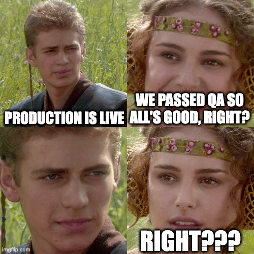

[Tom Granot](https://twitter.com/TomGranot/) and [myself](https://twitter.com/debugagent/) have had the privilege of [Vlad Mihalcea's](https://twitter.com/vlad_mihalcea) online company for a while now. As a result we decided to [do a workshop together](https://go.lightrun.com/production-troubelshooting-masterclass) talking about a lot of the things we learned in the process. This workshop would be pretty informal ad-hoc, just a bunch of guys chatting and showing off what we can do with tooling.

In celebration of that I thought I'd write about some of the tricks we discussed amongst ourselves in the past to give you a sense of what to expect when joining us for the workshop but also a useful tool in its own right.

## The Problem

Before we begin I'd like to take a moment to talk about production and the role of developers within a production environment. As a hacker I often do everything. That's OK for a small company but as companies grow we add processes.

Production doesn't go down in flames as much. Thanks to staging, QA, CI/CD and DevOps who rein in people like me...

So we have all of these things in place. We passed QA, staging and everything's perfect. Right?

Well... Not exactly.

Sure. Modern DevOps made a huge difference to production quality, monitoring and performance. No doubt. But bugs are inevitable. The ones that slither through are the worst types of vermin. They're hard to detect and often only happen on scale.

Some problems, like performance issues. Are only noticeable in production against a production database. Staging or dev environments can't completely replicate modern complex deployments. Infrastructure as Code (IaC) helps a lot with that but even with such solutions, production is at a different scale.

### It's the One Place that REALLY Matters

Everything that isn't production is in place to facilitate production. That's it. We can have the best and most extensive tests. With 100% coverage for our local environments. But when our system is running in production behavior is different. We can't control it completely.

A knee jerk reaction is "more testing". I see that a lot. If only we had a test for that... The solution is to somehow think of every possible mistake we can make and build a test for that. That's insane. If we know the mistake, we can just avoid it. The idea that a different team member will have that insight is again wrong. People make similar mistakes and while we can eliminate some bugs in this way. More tests create more problems... CI/CD becomes MUCH slower and results in longer deploy times to production.

That means that when we do have a production bug. It will take much longer to fix because of redundant tests. It means that the whole CI quality process which we need to go through, will take longer. It also means we'll need to spend more on CI resources...

### Logging

Logging solves some of the problems. It's an important part of any server infrastructure. But the problems are similar to the ones we run into with testing.

We don't know what will be important when we write a log. Then in production we might find it's missing. Overlogging is a huge problem in the opposite direction. It can:

* Demolish performance \& caching
* Incur huge costs due to log retention
* Make debugging harder due to hard to wade through verbosity

It might still be missing the information we need...

I recently posted to a reddit thread where this comment was also present:

"A team at my company accidentally blew \~100k on Azure Log Analytics during the span of a few days. They set the logging verbosity to a hitherto untested level and threw in some extra replicas as well. When they announced their mistake on Slack, I learned that yes, there is such a thing as too much logging." -- full thread [here](https://www.reddit.com/r/devops/comments/udgohy/there_is_no_such_thing_as_too_much_logging_or_is/).

Again, logging is great. But it doesn't solve the core problem.

## Agility

Our development team needs to be fast and responsive. We need to respond quickly to issues. Sure, we need to try and prevent them in the first place... But like most things in life the law of diminishing returns is in effect here too. There are limits to tests, logs, etc.

For that we need to fully understand the bug fast. Going through the process of reproducing something locally based on hunches is problematic at best. We need a way to observe the problem.

This isn't new. There are plenty of solutions to look at issues in production e.g. APM tools provide us invaluable insight into our performance in production. They don't replace profilers. They provide the one data point that matters: how fast is the application that our customers are using!

But most of these tools are geared towards DevOps. It makes sense. DevOps are the people responsible for production, so naturally the monitoring tools were built for them. But DevOps shouldn't be responsible for fixing R\&D bugs or even understanding them... There's a disconnect here.

### Enter Developer Observability

Developers observability is a pillar of observability targeted at developers instead of DevOps. With tools in this field we can instantly get feedback that's tailored for our needs and reduce the churn of discovering the problem. Before these tools if a log didn't exist in the production and we didn't understand the problem... We had to redeploy our product with "more logs" and cross our fingers...

## In Practice and The Workshop...

I got a bit ahead of myself explaining the problem longer than I will explain the solution. I tend to think that's because the solution is so darn obvious once we "get it". It's mostly a matter of details.

Like we all know: the devil is in the details...

Developer observability tools can be very familiar to developers who are used to working with debuggers and IDEs. But they are still pretty different. One example is breakpoints.

### It's Snapshots Now

We all know this drill. Set a breakpoint in the code that doesn't work and step over until you find the problem. This is so ingrained into our process that we rarely stop to think about this at all.

But if we do this in a production environment the server will be stuck while waiting for us to step over. This might impact all users in the server and I won't even discuss the security/stability implications (you might as well take a hammer and demolish the server. It's that bad).

Snapshots do everything a breakpoint does. They can be conditional, like a conditional breakpoint. They contain the stack trace and you can click on elements in the stack. Each frame includes the value of the variables in this specific frame. But here's the thing: they don't stop.

So you don't have "step over" as an option. That part is unavoidable since we don't stop. You need to rethink the process of debugging errors.

### currentTimeMillis()

I love profilers. But when I need to really understand the cost of a method I go to my trusted old `currentTimeMillis()` call. There's just no other way to get accurate/consistent performance metrics on small blocks of code.

But as I said before. Production is where it's at. I can't just stick micro measurements all over the code and review later.

So developer observability tools added the ability to measure things. Count the number of times a line of code was reached. Or literally perform a tictoc measurement which is equivalent to that `currentTimeMillis()` approach.

## See You There

"Only when the tide goes out do you discover who's been swimming naked." -- Warren Buffett

I love that quote. We need to be prepared at all times. We need to move fast and be ready for the worst. But we also need practicality. We aren't original, there are common bugs that we run into left and right. We might notice them faster but mistakes aren't original.

In the workshop we'll focus on some of the most common mistakes and demonstrate how we can track them using developer observability. We'll give real world examples of failures and problems we ran into in the past and as part of our work. I'm very excited about this and hope to see you all [there](https://go.lightrun.com/production-troubelshooting-masterclass)!
