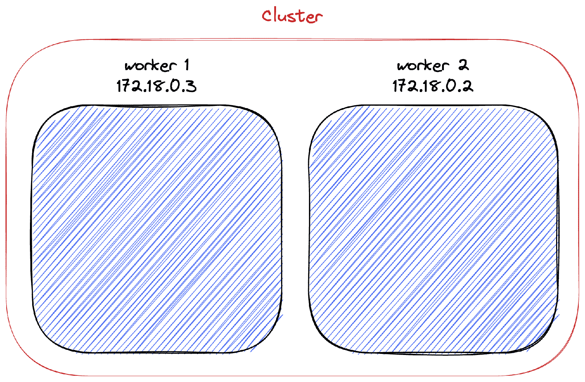
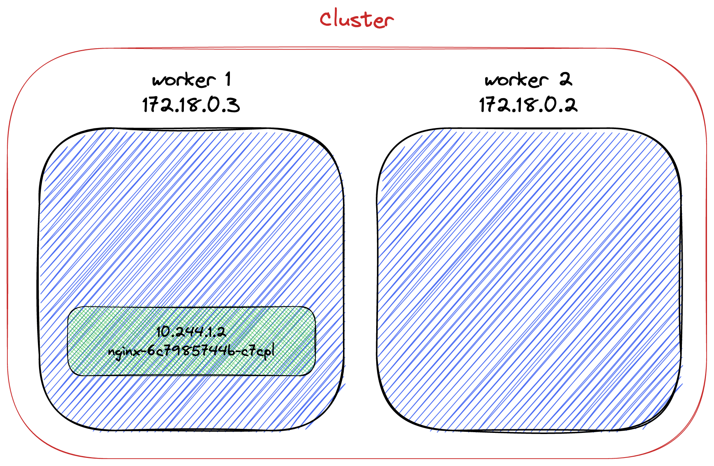
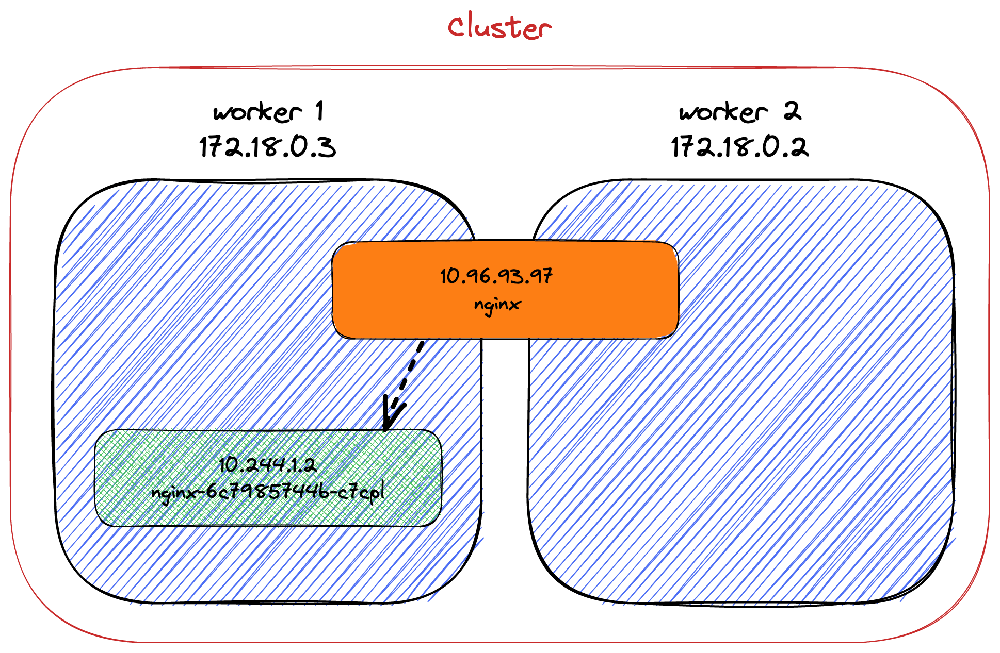
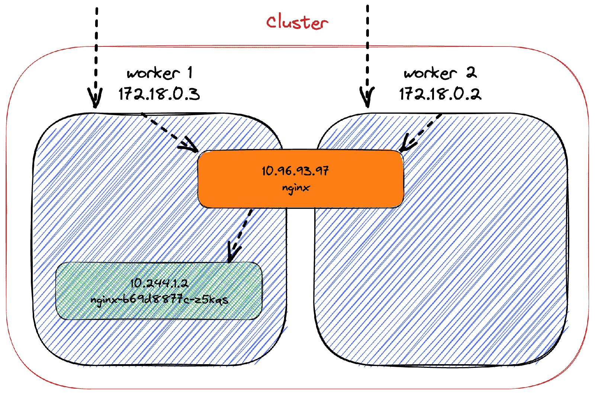
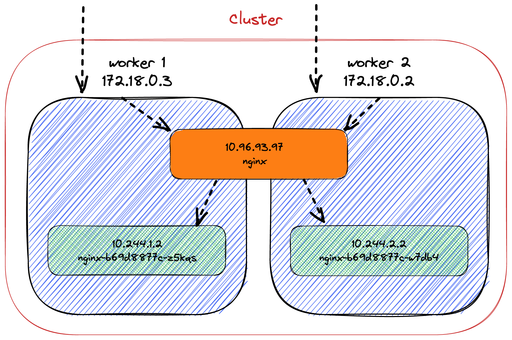
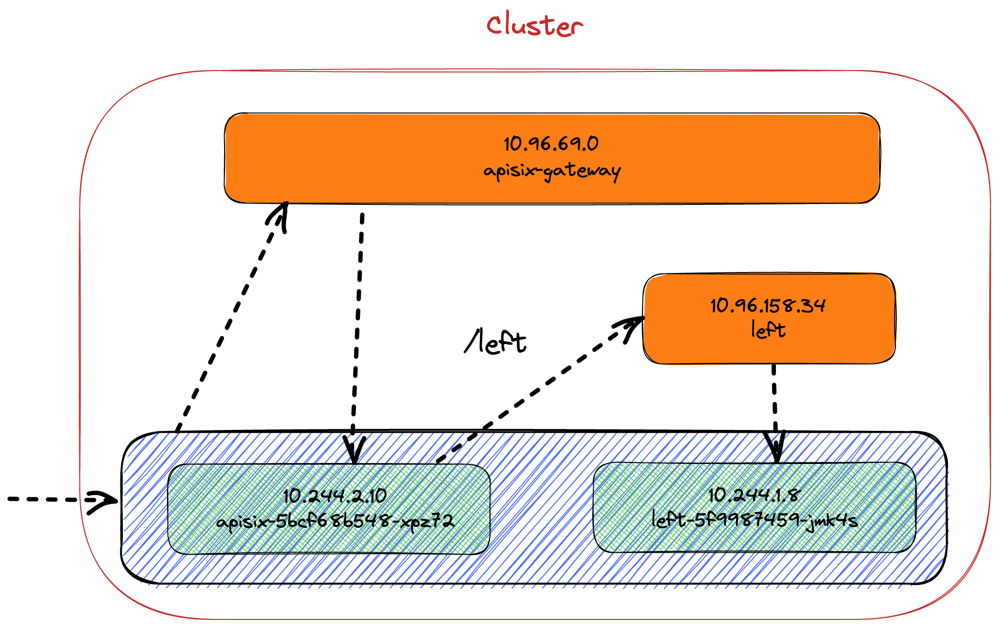

Kubernetes is a colossal beast. You need to understand many different concepts before it starts being useful.

When everything is set up, you'll probably want to expose some pods to the outside of the cluster.

Kubernetes provides different ways to do it: I'll describe them in this post.

## Setup

For the sake of the demo, I'll be using [Kind](https://kind.sigs.k8s.io/):
> kind is a tool for running local Kubernetes clusters using Docker container "nodes". kind was primarily designed for testing Kubernetes itself, but may be used for local development or CI.

I'll use a two-nodes cluster:

```yaml
kind: Cluster
apiVersion: kind.x-k8s.io/v1alpha4
nodes:
- role: control-plane
  extraPortMappings:
  - containerPort: 30800             # 1
    hostPort: 30800                  # 1
- role: worker                       # 2
- role: worker                       # 2
```

1. Port forwarding to cope with the Docker VM layer on Mac (see below)
2. Two nodes

```bash
kind create cluster -- config kind.yml
```



Next, we need a container. It shouldn't just run and stop: Let's use the latest Nginx image available at the time of this writing.

With Kind, we have to preload images, so they are available.

```bash
docker pull nginx:1.23
kind load docker-image nginx:1.23
```

Finally, I alias `kubetcl` to `k`:

```bash
alias k=kubectl
```

## No outside access by default

The default situation is to provide no access to the outside of the cluster.

```bash
k create deployment nginx --image=nginx:1.23 # 1
```

1. Create a deployment of a single pod

Let's check if everything is fine:

```bash
k get pods
```

    NAME                     READY   STATUS    RESTARTS   AGE
    nginx-6c7985744b-c7cpl   1/1     Running   0          67s

The pod has an IP, but we cannot reach it outside the cluster.

```bash
k get pod nginx-6c7985744b-c7cpl --template '{{.status.podIP}}'
```

    10.244.1.2

Let's confirm the IP by running a shell inside the pod itself:

```bash
k exec -it nginx-6c7985744b-c7cpl -- /bin/bash
hostname -I
```

```bash
10.244.1.2
```



We cannot successfully ping this IP outside the cluster; it's an internal IP.

## Internal IPs are not stable

We created a deployment. Hence, if we delete the single pod, Kubernetes will detect it and create a new one, thanks to its self-healing capabilities.

```bash
k delete pod nginx-6c7985744b-c7cpl
k get pods
```

```bash
NAME                     READY   STATUS    RESTARTS   AGE
nginx-6c7985744b-c6f92   1/1     Running   0          71s
```

Let's check its new IP:

```bash
k exec -it nginx-6c7985744b-c6f92 -- /bin/bash
hostname -I
```

`10.244.2.2`

Kubernetes created a new pod, but its IP differs from the deleted pod's. We cannot rely on this IP for pod-to-pod communication. Indeed, we should never directly use a pod's IP.

To solve this issue, Kubernetes provides the `Service` object. Services represent a stable interface in front of pods. Kubernetes manages the mappings between a service and its pod(s). It binds new pods and unbinds removed ones.
> `ClusterIP`: Exposes the `Service` on a cluster-internal IP. Choosing this value makes the `Service` only reachable from within the cluster. This is the default `ServiceType`.
>
> -- [Publishing Services (ClusterIP)](https://kubernetes.io/docs/concepts/services-networking/service/)

Let's expose the existing deployment with a service:

```bash
k expose deployment nginx --type=ClusterIP --port=8080
k get svc
```

```bash
NAME         TYPE        CLUSTER-IP    EXTERNAL-IP   PORT(S)    AGE
kubernetes   ClusterIP   10.96.0.1     <none>        443/TCP    9m47s
nginx        ClusterIP   10.96.93.97   <none>        8080/TCP   4s
```

From this point on, it's possible to access the pod *via* the service's `ClusterIP`.



All is set for access inside the cluster. From the outside, it's not possible yet. So why shall we use `ClusteIP`? It's pretty darn useful for services that you don't want to expose to the outside world: databases, ElasticSearch nodes, Redis nodes, etc.

## Accessing a pod

Accessing a pod from outside the cluster is when things become interesting.

We first need to remove the existing deployment and service.

```bash
k delete deployment nginx
k delete svc nginx
```

The simplest way to allow external access is to change the service's type to `NodePort`.  
`NodePort` adds an access port to a `ClusterIP`.
> `NodePort`: Exposes the Service on each Node's IP at a static port (the `NodePort`). A `ClusterIP` Service, to which the `NodePort` Service routes, is automatically created. You'll be able to contact the `NodePort` Service, from outside the cluster, by requesting `:`.
>
> -- [Publishing Services (NodePort)](https://kubernetes.io/docs/concepts/services-networking/service/)

I want the pod to return its IP and hostname to demo it. We must move away from the command line to a dedicated Kubernetes manifest file because we have to configure Nginx. It results in the same state as with the command line, with the added Nginx configuration:

```yaml
apiVersion: apps/v1
kind: Deployment
metadata:
  name: nginx
  labels:
    app: nginx
spec:
  replicas: 1
  selector:
    matchLabels:
      app: nginx
  template:
    metadata:
      labels:
        app: nginx
    spec:
      containers:
      - name: nginx
        image: nginx:1.23
        volumeMounts:                                                     # 1
          - name: conf
            mountPath: /etc/nginx/nginx.conf
            subPath: nginx.conf
            readOnly: true
      volumes:                                                            # 1
        - name: conf
          configMap:
            name: nginx-conf
            items:
              - key: nginx.conf
                path: nginx.conf
---
apiVersion: v1                                                            # 1
kind: ConfigMap
metadata:
  name: nginx-conf
data:
  nginx.conf: |
    events {
        worker_connections  1024;
    }
    http {
        server {
            location / {
                default_type text/plain;
                return 200 "host: $hostname\nIP:   $server_addr\n";
            }
        }
    }
---
apiVersion: v1
kind: Service
metadata:
  name: nginx
spec:
  selector:
    app: nginx
  type: NodePort                                                          # 2
  ports:
    - port: 80
      nodePort: 30800
```

1. Override the default configuration to return hostname and IP address
2. `NodePort` maps the pod's port to an externally accessible port

Let's apply the configuration:

```bash
k apply -f deployment.yml
```

Note that I'm running on Mac; hence, there's a VM container around Docker, like in Windows. For this reason, Kind needs to port forward the VM to the host. Please check the [documentation](https://kind.sigs.k8s.io/docs/user/configuration/#extra-port-mappings) on how to achieve it.

Once Kubernetes has scheduled the pod, we can access it on the configured port:

```bash
curl localhost:30800
```

    host: nginx-b69d8877c-p2s79
    IP:   10.244.2.2



The pathway of the request is as follows (notwithstanding the VM layer on Mac/Windows):

* The `curl` request goes to any nodeNote that on a cloud-provider setup, you could target any Kubernetes node that hosts a pod part of the deployment. With the local setup, we target `localhost` and let the VM layer targets a node.
* The node sees the port `30800` and forwards the request to the `NodePort` service with the relevant port
* The service forwards the request to the pod, translating the port from `30800` to `80`

Now, let's increase the number of pods in our deployment to two:

```bash
k scale deployment nginx --replicas=2
k get pods -o wide
```

Kubernetes balances the cluster so that each pod resides on a different node:

    NAME                    READY   STATUS    RESTARTS   AGE    IP           NODE           NOMINATED NODE   READINESS GATES
    nginx-b69d8877c-w7db4   1/1     Running   0          129m   10.244.2.2   kind-worker    <none>           <none>
    nginx-b69d8877c-z5kqs   1/1     Running   0          38m    10.244.1.2   kind-worker2   <none>           <none>

To which node/pod will requests be sent?

```bash
while true; do curl localhost:30800; done
```

    host: nginx-b69d8877c-w7db4
    IP:   10.244.2.2
    host: nginx-b69d8877c-w7db4
    IP:   10.244.2.2
    host: nginx-b69d8877c-z5kqs
    IP:   10.244.1.2
    host: nginx-b69d8877c-z5kqs
    IP:   10.244.1.2
    host: nginx-b69d8877c-w7db4
    IP:   10.244.2.2
    host: nginx-b69d8877c-w7db4
    IP:   10.244.2.2



The service balances the requests between all available pods.

## The load balancing abstraction

`NodePort` allows querying *any* cluster node. `LoadBalancer` is a facade over the cluster that does... load balancing. It's an abstract object provided by Kubernetes; each cloud provider implements it differently depending on its peculiarities though the behavior is the same.
> LoadBalancer: Exposes the Service externally using a cloud provider's load balancer. NodePort and ClusterIP Services, to which the external load balancer routes, are automatically created.
>
> -- [Publishing Services (LoadBalander)](https://kubernetes.io/docs/concepts/services-networking/service/)

First, we need a `LoadBalancer` implementation. Kind has out-of-the-box integration with MetalLB:
> MetalLB is a load-balancer implementation for bare metal Kubernetes clusters, using standard routing protocols.
>
> -- [MetalLB](https://metallb.universe.tf/)

It's no use paraphrasing Kind's excellent documentation on [how to install MetalLB](https://kind.sigs.k8s.io/docs/user/loadbalancer/). We can update the manifest accordingly:

```bash
apiVersion: v1
kind: Service
metadata:
  name: nginx
spec:
  selector:
    app: nginx
  type: LoadBalancer
  ports:
    - port: 80
      targetPort: 30800
```

Let's look at the services:

```bash
k get svc
```

    NAME         TYPE           CLUSTER-IP      EXTERNAL-IP   PORT(S)          AGE
    kubernetes   ClusterIP      10.96.0.1       <none>        443/TCP          4h37m
    nginx        LoadBalancer   10.96.216.126   127.0.0.240   8080:31513/TCP   82m     # 1

1. It has an external IP!

Unfortunately, as I mentioned above, on Mac (and Windows), Docker runs in a VM. Hence, we cannot access the "external" IP from the host. Readers with proper Linux systems should access it.

Depending on the cloud provider, `LoadBalancer` may provide additional proprietary capabilities.

## Ingress, when you need routing

`Ingress` focuses on *routing* requests to services in the cluster.  

It shares some aspects with `LoadBalancer`:

* It intercepts inbound traffic
* It's implementation-dependent and implementations offer different features, *e.g.* , [Nginx](https://github.com/nginxinc/kubernetes-ingress), [Traefik](https://github.com/containous/traefik), [HAProxy](https://haproxy-ingress.github.io/), etc.

However, it's *not* a `Service`.
> Ingress exposes HTTP and HTTPS routes from outside the cluster to services within the cluster. Traffic routing is controlled by rules defined on the Ingress resource.
>
> -- [What is Ingress?](https://kubernetes.io/docs/concepts/services-networking/ingress/)

Installing an `Ingress` depends a lot on the implementation. The only common factor is that it involves s.

To demo, I'll use the [Apache APISIX Ingress controller](https://apisix.apache.org/docs/ingress-controller/getting-started/). I won't paraphrase the [installation instructions](https://apisix.apache.org/docs/ingress-controller/deployments/minikube/). The only difference is to set the `NodePort` to a set value:

```bash
helm install apisix apisix/apisix \
  --set gateway.type=NodePort \
  --set gateway.http.nodePort=30800 \
  --set ingress-controller.enabled=true \
  --namespace ingress-apisix \
  --set ingress-controller.config.apisix.serviceNamespace=ingress-apisix
```

Note that though the documentation mentions Minikube, it's applicable to *any* local cluster, including Kind.

The following services should be available in the `ingress-apisix` namespace:

    NAME                        TYPE        CLUSTER-IP     EXTERNAL-IP   PORT(S)             AGE
    apisix-admin                ClusterIP   10.96.98.159   <none>        9180/TCP            22h
    apisix-etcd                 ClusterIP   10.96.80.154   <none>        2379/TCP,2380/TCP   22h
    apisix-etcd-headless        ClusterIP   None           <none>        2379/TCP,2380/TCP   22h
    apisix-gateway              NodePort    10.96.233.74   <none>        80:30800/TCP        22h
    apisix-ingress-controller   ClusterIP   10.96.125.41   <none>        80/TCP              22h

To demo, we will have two services: each one will have an underlying deployment of one pod. Requesting `/left` will hit one service and return `left`; `/right`, `right`.

Let's update the topology accordingly:

```yaml
apiVersin: apps/v1
kind: Deployment
metadata:
  name: left
  labels:
    app: left
spec:
  replicas: 1
  selector:
    matchLabels:
      app: left
  template:
    metadata:
      labels:
        app: left
    spec:
      containers:
      - name: nginx
        image: nginx:1.23
        volumeMounts:
          - name: conf
            mountPath: /etc/nginx/nginx.conf
            subPath: nginx.conf
            readOnly: true
      volumes:
        - name: conf
          configMap:
            name: left-conf
            items:
              - key: nginx.conf
                path: nginx.conf
---
apiVersion: v1
kind: Service
metadata:
  name: left
spec:
  selector:
    app: left
  ports:
    - port: 80
---
apiVersion: v1
kind: ConfigMap
metadata:
  name: left-conf
data:
  nginx.conf: |
    events {
        worker_connections  1024;
    }
    http {
        server {
            location / {
                default_type text/plain;
                return 200 "left\n";
            }
        }
    }
```

The above snippet only describes the `left` path; it should contain a similar configuration for the `right` path.

At this point, we can create the configuration to route paths to services:

```yaml
apiVersion: apisix.apache.org/v2beta3            # 1
kind: ApisixRoute                                # 1
metadata:
  name: apisix-route
spec:
  http:
  - name: left
    match:
      paths:
      - "/left"
    backends:
    - serviceName: left                          # 2
      servicePort: 80                            # 2
  - name: right
    match:
      paths:
        - "/right"
    backends:
    - serviceName: right                         # 3
      servicePort: 80                            # 3
```

1. Use the `ApisixRoute` CRD created by the installation
2. Forward request to the `left` service
3. Forward request to the `right` service

Here's what it should look like. Note that I've chosen to represent only the `left` path and one node not to overload the diagram.



To check that it works, let's curl again.

```bash
curl localhost:30800
```

    {"error_msg":"404 Route Not Found"}

It's a good sign: APISIX is responding.

We can now try to curl the `right` path to ensure it will forward to the relevant pod.

```bash
curl localhost:30800/right
```

    right

`/left`, it works as well.

## Conclusion

In this post, I've described several ways to access pods outside the cluster: `NodePort` and `LoadBalancer` services and `Ingress`. For `Ingress`, you may have noticed that the `ApisixRoute` object is a proprietary CRD. To avoid it, Kubernetes aims to provide an abstraction; the CNCF is working on a [Gateway API](https://gateway-api.sigs.k8s.io/) project.

I'll describe it in a future post.

The complete source code for this post can be found on [GitHub](https://github.com/ajavageek/k8s-access).

**To go further:**

* [Services, Load Balancing, and Networking](https://kubernetes.io/docs/concepts/services-networking/)
* [Kubernetes Services simply visually explained](https://medium.com/swlh/kubernetes-services-simply-visually-explained-2d84e58d70e5)
* [Kubernetes NodePort vs LoadBalancer vs Ingress? When should I use what?](https://medium.com/google-cloud/kubernetes-nodeport-vs-loadbalancer-vs-ingress-when-should-i-use-what-922f010849e0)
* [Understanding Kubernetes LoadBalancer vs NodePort vs Ingress](https://platform9.com/blog/understanding-kubernetes-loadbalancer-vs-nodeport-vs-ingress/)
* [What's the difference between ClusterIP, NodePort and LoadBalancer service types in Kubernetes?](https://stackoverflow.com/questions/41509439/whats-the-difference-between-clusterip-nodeport-and-loadbalancer-service-types)
* [Kubernetes Ingress Controller Overview](https://medium.com/swlh/kubernetes-ingress-controller-overview-81abbaca19ec)
* [Getting started with Apache APISIX Ingress Controller](https://apisix.apache.org/docs/ingress-controller/getting-started/)
* [Apache APISIX Ingress Controller FAQ](https://apisix.apache.org/docs/ingress-controller/FAQ/)

*Originally published at [A Java Geek](https://blog.frankel.ch/basics-access-kubernetes-pods/) on August 7^th^, 2022*

*[CRD]: Custom Resource Definition
