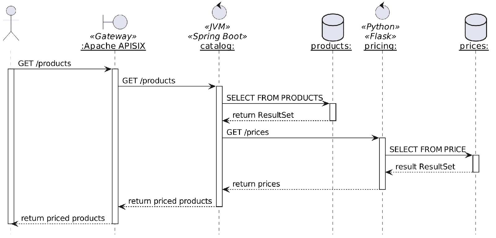
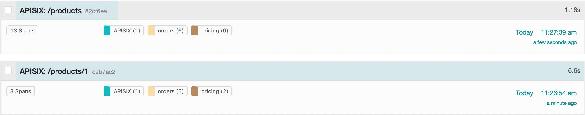
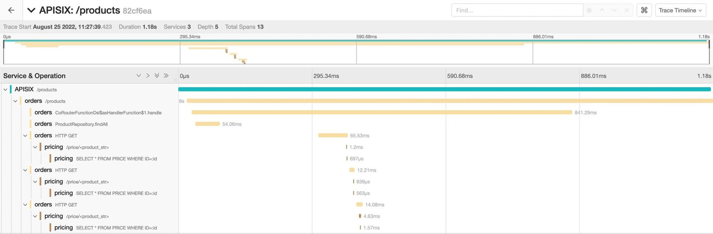
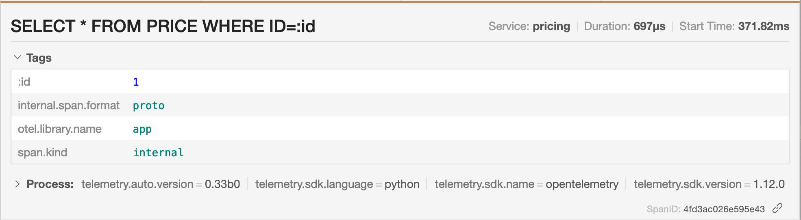

Whether you implement microservices or not (and you probably shouldn't), your system is most probably composed of multiple components.

The most straightforward system is probably made of a reverse proxy, an app, and a database.

In this case, monitoring is not only a good idea; it's a requirement.

The higher the number of components through which a request may flow, the strongest the requirement.

However, monitoring is only the beginning of the journey.

When requests start to fail *en masse*, you need an aggregated view across all components.

It's called **tracing** , and it's one of the pillars of *observability*; the other two are metrics and logs.

In this post, I'll focus solely on traces and describe how you can start your journey into observability.

## The W3C Trace Context specification

A tracing solution should provide a standard format to work across heterogeneous technology stacks. Such a format needs to adhere to a specification, either a formal one or a *de facto* one.

One needs to understand that a specification rarely appears from nowhere. In general, the market already has a couple of distinct implementations. Most of the time, a new specification leads to an additional implementation, as the famous XKCD comic describes:


Sometimes, however, a miracle happens: the market adheres to the new specification. Here, Trace Context is a W3C specification, and it seems to have done the trick:
> This specification defines standard HTTP headers and a value format to propagate context information that enables distributed tracing scenarios. The specification standardizes how context information is sent and modified between services. Context information uniquely identifies individual requests in a distributed system and also defines a means to add and propagate provider-specific context information.
>
> -- <https://www.w3.org/TR/trace-context/>

Two critical concepts emerge from the document:

* A **trace** follows the path of a request that spans multiple components
* A **span** is bound to a single component and linked to another span by a child-parent relationship



At the time of this writing, the specification is a W3C recommendation, which is the **final** stage.

Trace Context already has [many implementations](https://github.com/w3c/trace-context/blob/main/implementations.md). One of them is OpenTelemetry.

## OpenTelemetry as the golden standard

The closer you're to the operational part of IT, the highest the chances that you've heard about OpenTelemetry:
> OpenTelemetry is a collection of tools, APIs, and SDKs. Use it to instrument, generate, collect, and export telemetry data (metrics, logs, and traces) to help you analyze your software's performance and behavior.
>
> OpenTelemetry is generally available across several languages and is suitable for use.
>
> -- <https://opentelemetry.io/>

OpenTelemetry is a project managed by the . Before OpenTelemetry stood two projects:

* OpenTracing, focused on traces as its name implies
* OpenCensus, whose goal was to manage metrics and traces

Both projects merged and added logs on top. OpenTelemetry now offers a set of "layers" focusing on observability:

* Instrumentation APIs in a variety of languages
* Canonical implementations, again in different languages
* Infrastructure components such as collectors
* Interoperability formats, such as the W3C's Trace Context

Note that while OpenTelemetry is a Trace Context implementation, it does more. Trace Context limits itself to HTTP, while OpenTelemetry allows spans to cross non-web components, such as Kafka. It's outside the scope of this blog post.

## The use-case

My favorite use case is an e-commerce shop, so let's not change it. In this case, the shop is designed around microservices, each accessible via a REST API and protected behind an API Gateway. To simplify the architecture for the blog post, I'll use only two microservices: `catalog` manages products, and `pricing` handles the price of products.

When a user arrives on the app, the home page fetches all products, gets their respective price, and display them.



To make things more interesting, `catalog` is a Spring Boot application coded in Kotlin, while `pricing` is a Python Flask application.

Tracing should allow us to follow the path of a request across the gateway, both microservices and, if possible, the databases.

## Traces at the gateway

The entry point is the most exciting part of tracing, as it should generate the trace ID: in this case, the entry point is the gateway. I'll use Apache APISIX to implement the demo:
> Apache APISIX provides rich traffic management features like Load Balancing, Dynamic Upstream, Canary Release, Circuit Breaking, Authentication, Observability, etc.
>
> -- <https://apisix.apache.org/>

Apache APISIX is based on a plugin architecture and offers an OpenTelemetry plugin:
> The `opentelemetry` Plugin can be used to report tracing data according to the OpenTelemetry specification.
>
> The Plugin only supports binary-encoded OLTP over HTTP.
>
> -- <https://apisix.apache.org/docs/apisix/plugins/opentelemetry/>

Let's configure the `opentelemetry` plugin:

```yaml
apisix:
  enable_admin: false              #1
  config_center: yaml              #1
plugins:
  - opentelemetry                  #2
plugin_attr:
  opentelemetry:
    resource:
      service.name: APISIX         #3
    collector:
      address: jaeger:4318         #4
```

1. Run Apache APISIX in standalone mode to make the demo easier to follow. It's a good practice in production anyway
2. Configure `opentelemetry` as a global plugin
3. Set the name of the service. It's the name that will appear in the trace display component
4. Send the traces to the `jaeger` service. The following section will describe it.

We want to trace every route, so instead of adding the plugin to each route, we should set up the plugin as a global one:

```yaml
global_rules:
  - id: 1
    plugins:
      opentelemetry:
        sampler:
          name: always_on          #1
```

1. Tracing has an impact on performance. The more we trace, the more we impact. Hence, we should carefully balance the performance impact vs. the benefits of observability. For the demo, however, we want to trace every request.

## Collecting, storing and displaying traces

While Trace Context is a W3C specification and OpenTelemetry is a *de facto* standard, many solutions exist to collect, store and display traces on the market. Each solution may provide all three capabilities or only part of them. For example, the Elastic stack handles storage and display, but you must rely on something else for collection. On the other hand, [Jaeger](https://www.jaegertracing.io/docs/1.18/opentelemetry/) and [Zipkin](https://zipkin.io/) do provide a complete suite to fulfill all three capabilities.

Jaeger and Zipkin predate OpenTelemetry, so each has its trace transport format. They do provide integration with the OpenTelemetry format, though.

In the scope of this blog post, the exact solution is not relevant, as we only need the capabilities. I chose Jaeger because it provides an all-in-one Docker image: every capability has its component, but they are all embedded in the same image, which makes configuration much more effortless.

The image's [relevant ports](https://www.jaegertracing.io/docs/1.37/getting-started/#all-in-one) are the following:

|  Port   | Protocol | Component |                          Function                          |
|---------|----------|-----------|------------------------------------------------------------|
| `16686` | HTTP     | query     | serve frontend                                             |
| `4317`  | HTTP     | collector | accept OpenTelemetry Protocol (OTLP) over gRPC, if enabled |
| `4318`  | HTTP     | collector | accept OpenTelemetry Protocol (OTLP) over HTTP, if enabled |

The Docker Compose bit looks like this:

```yaml
services:
  jaeger:
    image: jaegertracing/all-in-one:1.37           #1
    environment:
      - COLLECTOR_OTLP_ENABLED=true                #2
    ports:
      - "16686:16686"                              #3
```

1. Use the `all-in-one` image
2. Very important: enable the collector in OpenTelemetry format
3. Expose the UI port

Now that we have set up the infrastructure, we can focus on enabling traces in our applications.

## Traces in Flask apps

The `pricing` service is a simple [Flask](https://flask.palletsprojects.com/) application. It offers a single endpoint to fetch the price of a single product from the database.

```python
@app.route('/price/<product_str>')                           #1-2
def price(product_str: str) -> Dict[str, object]:
    product_id = int(product_str)
    price: Price = Price.query.get(product_id)               #3
    if price is None:
        return jsonify({'error': 'Product not found'}), 404
    else:
        low: float = price.value - price.jitter              #4
        high: float = price.value + price.jitter             #4
        return {
            'product_id': product_id,
            'price': round(uniform(low, high), 2)            #4
        }
```

1. Endpoint
2. The route requires the product's id
3. Fetch data from the database using SQLAlchemy
4. Real pricing engines never return the same price over time; let's randomize the price a bit for fun

Warning: Fetching a single price per call is highly inefficient. It requires as many calls as products, but it makes for a more exciting trace. In real life, the route should be able to accept multiple product ids and fetch all associated prices in one request-response.

Now is the time to instrument the application. Two options are available: automatic instrumentation and manual instrumentation. Automatic is low effort and a quick win; manual requires focused development time. I'd advise starting with automatic and only adding manual if required.

We need to add a couple of Python packages:

```
opentelemetry-distro[otlp]==0.33b0
opentelemetry-instrumentation
opentelemetry-instrumentation-flask
```

We need to configure a couple of parameters:

```yaml
pricing:
  build: ./pricing
  environment:
    OTEL_EXPORTER_OTLP_ENDPOINT: http://jaeger:4317     #1
    OTEL_RESOURCE_ATTRIBUTES: service.name=pricing      #2
    OTEL_METRICS_EXPORTER: none                         #3
    OTEL_LOGS_EXPORTER: none                            #3
```

1. Send the traces to Jaeger
2. Set the name of the service.  
   It's the name that will appear in the trace display component
3. We are interested neither in logs nor in metrics

Now, instead of using the standard `flask run` command, we wrap it:

```bash
opentelemetry-instrument flask run
```

Just with this, we already collect spans from method calls and Flask routes.

We can manually add additional spans if needed, *e.g.*:

```python
from opentelemetry import trace

@app.route('/price/<product_str>')
def price(product_str: str) -> Dict[str, object]:
    product_id = int(product_str)
    with tracer.start_as_current_span("SELECT * FROM PRICE WHERE ID=:id", attributes={":id": product_id}) as span: #1
        price: Price = Price.query.get(product_id)
    # ...
```

1. Add an additional span with the configured label and attribute

## Traces in Spring Boot apps

The `catalog` service is a Reactive [Spring Boot](https://spring.io/projects/spring-boot) application developed in Kotlin. It offers two endpoints:

* One to fetch a single product
* The other to fetch all products

Both first look in the product database, then query the above `pricing` service for the price.

As for Python, we can leverage automatic and manual instrumentation. Let's start with the low-hanging fruit, automatic instrumentation. On the JVM, we achieve it through an agent:

```bash
java -javaagent:opentelemetry-javaagent.jar -jar catalog.jar
```

As in Python, it creates spans for every method call and HTTP entry point. It also instruments JDBC calls, but we have a Reactive stack and thus use R2DBC. For the record, a [GitHub issue](https://github.com/open-telemetry/opentelemetry-java-instrumentation/issues/2515) is open for adding support.

We need to configure the default behavior:

```yaml
catalog:
  build: ./catalog
  environment:
    APP_PRICING_ENDPOINT: http://pricing:5000/price
    OTEL_EXPORTER_OTLP_ENDPOINT: http://jaeger:4317     #1
    OTEL_RESOURCE_ATTRIBUTES: service.name=orders       #2
    OTEL_METRICS_EXPORTER: none                         #3
    OTEL_LOGS_EXPORTER: none                            #3
```

1. Send the traces to Jaeger
2. Set the name of the service. It's the name that will appear in the trace display component
3. We are interested neither in logs nor in metrics

As for Python, we can up the game by adding manual instrumentation. Two options are available, programmatic and annotation-based. The former is a bit involved unless we introduce Spring Cloud Sleuth. Let's add annotations.

We need an additional dependency:

```xml
<dependency>
    <groupId>io.opentelemetry.instrumentation</groupId>
    <artifactId>opentelemetry-instrumentation-annotations</artifactId>
    <version>1.17.0-alpha</version>
</dependency>
```

Be careful, the artifact was very recently relocated from `io.opentelemetry:opentelemetry-extension-annotations`.  

Also, please notice the `-alpha` suffix at the end of the version. OpenTelemetry has parts that are not stable yet, please consider this if you want to use OTel in production.

We can now annotate our code:

```kotlin
@WithSpan("ProductHandler.fetch")                                               //1
suspend fun fetch(@SpanAttribute("id") id: Long): Result<Product> {             //2
    val product = repository.findById(id)
    return if (product == null) Result.failure(IllegalArgumentException("Product $id not found"))
    else Result.success(product)
}
```

1. Add an additional span with the configured label
2. Use the parameter as an attribute, with the key set to `id` and the value the parameter's runtime value

## The result!

We can now play with our simple demo to see the result:

```bash
curl localhost:9080/products
curl localhost:9080/products/1
```

The responses are not interesting, but let's look at the Jaeger UI. We find both traces, one per call:

[](all-traces.jpg)

We can dive into the spans of a single trace:

[](all-spans-in-trace-scaled.jpg)

Note that we can infer the sequence flow without the above UML diagram. Even better, the sequence displays the calls internal to a component.

Each span contains attributes that the automatic instrumentation added and the ones we added manually:

[](span-attributes.jpg)

## Conclusion

In this post, I've showcased tracing by following a request across an API gateway, two apps based on different tech stacks, and their respective databases.

I've brushed only the surface of tracing: in the real world, tracing would probably involve components unrelated to HTTP, such as Kafka and message queues.

Still, most systems rely on HTTP in one way or another.

While not trivial to set up, it's not too hard either. Tracing HTTP requests across components is a good start in your journey toward observability of your system.

The complete source code for this post can be found on [GitHub](https://github.com/nfrankel/opentelemetry-tracing).

**To go further:**

* [W3C Trace Context specification](https://www.w3.org/TR/trace-context/)
* [Trace Context implementations](https://github.com/w3c/trace-context/blob/main/implementations.md)
* [A beginner's guide to OpenTelemetry](https://medium.com/@magstherdev/opentelemetry-d71d369c83d7)
* [Python Automatic Instrumentation](https://opentelemetry.io/docs/instrumentation/python/automatic/)
* [Python Distro](https://opentelemetry.io/docs/instrumentation/python/distro/)
* [Jaeger Getting Started](https://www.jaegertracing.io/docs/next-release/getting-started/)

*Originally published at [A Java Geek](https://blog.frankel.ch/end-to-end-tracing-opentelemetry/) on August 28^th^, 2022*

*[CNCF]: Cloud-Native Computing Foundation
