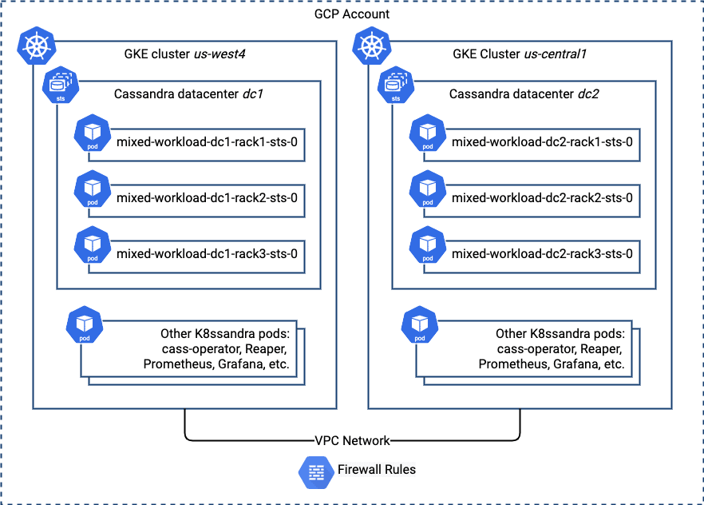

This is the second in a series of posts examining patterns for using K8ssandra to create Cassandra clusters with different deployment topologies.

In the [first article](https://k8ssandra.io/blog/tutorials/deploy-a-multi-datacenter-apache-cassandra-cluster-in-kubernetes/) in this series, we looked at how you could create a Cassandra cluster with two datacenters in a single cloud region, using separate Kubernetes namespaces in order to isolate workloads. For example, you might want to create a secondary Cassandra datacenter to isolate a read-heavy analytics workload from the datacenter supporting your main application.

In the rest of this series, we'll explore additional configurations that promote high availability and accessibility of your data across various different network topologies, including hybrid and multi-cloud deployments. Our focus for this post will be on creating a Cassandra cluster running on Kubernetes clusters in multiple regions within a single cloud provider -- in this case Google Cloud. If you worked through the first blog, many of the steps will be familiar.

Note: for the purpose of this exercise, you'll create GKE clusters in two separate regions, under the same Google Cloud project. This will make it possible to use the same network.

Preparing the first GKE Cluster {#h-preparing-the-first-gke-cluster}
--------------------------------------------------------------------

First, you're going to need a Kubernetes cluster in which you can create the first Cassandra datacenter. To create this first cluster, follow the instructions for [K8ssandra on Google Kubernetes Engine (GKE)](https://docs.k8ssandra.io/install/gke/), which reference scripts provided as part of the [K8ssandra GCP Terraform Example](https://github.com/k8ssandra/k8ssandra-terraform/tree/main/gcp).

When building this example for myself, I provided values for the environment variables used by the Terraform script to match my desired environment. Notice my initial GKE cluster is in the `us-west4` region. You'll want to change these values for your own environment.

```
export TF_VAR_environment=dev
export TF_VAR_name=k8ssandra
export TF_VAR_project_id=<my project>
export TF_VAR_region=us-west4
```


After creating the GKE cluster, you can ignore further instructions on the [K8ssandra GKE docs page](https://docs.k8ssandra.io/install/gke/) (the "Install K8ssandra" section and beyond), since you'll be doing a custom K8ssandra installation. The Terraform script should automatically change your `kubectl` context to the new cluster, but you can make sure by checking the output of `kubectl config current-context`.

Creating the first Cassandra datacenter {#h-creating-the-first-cassandra-datacenter}
------------------------------------------------------------------------------------

First, a bit of upfront planning. It will be easier to manage our K8ssandra installs in different clusters if we use the same administrator credentials in each datacenter. Let's create a namespace for the first datacenter and add a secret within the namespace:

```
kubectl create namespace us-west4
kubectl create secret generic cassandra-admin-secret --from-literal=username=cassandra-admin --from-literal=password=cassandra-admin-password -n us-west4
```


Notice that I chose to create a namespace matching the GCP region in which I'm deploying K8ssandra. This is done as part of enabling DNS between the GKE clusters, which is a topic that we'll discuss in depth in a future post. You'll want to specify a namespace corresponding to the region you're using.

The next step is to create a K8ssandra deployment for the first datacenter. You'll need Helm installed for this step, as described on the [K8ssandra GKE docs page](https://docs.k8ssandra.io/install/gke/). Create the configuration for the first datacenter in a file called `dc1.yaml`, making sure to change the affinity labels to match zones used in your GKE cluster:

```
cassandra:
  auth:
    superuser:
      secret: cassandra-admin-secret
  cassandraLibDirVolume:
    storageClass: standard-rwo
  clusterName: multi-region
  datacenters:
  - name: dc1
    size: 3
    racks:
    - name: rack1
      affinityLabels:
        failure-domain.beta.kubernetes.io/zone: us-west4-a
    - name: rack2
      affinityLabels:
        failure-domain.beta.kubernetes.io/zone: us-west4-b
    - name: rack3
      affinityLabels:
        failure-domain.beta.kubernetes.io/zone: us-west4-c
```


In addition to requesting 3 nodes in the datacenter, this configuration specifies an appropriate storage class for the GKE environment (`standard-rwo`), and uses affinity to specify how the racks are mapped to GCP zones. Make sure to change the referenced zones to match your configuration. For more details, please reference the first [blog post](https://k8ssandra.io/blog/tutorials/deploy-a-multi-datacenter-apache-cassandra-cluster-in-kubernetes/) in the series.

Deploy the release using this command:

```
helm install k8ssandra k8ssandra/k8ssandra -f dc1.yaml -n us-west4
```


This causes the K8ssandra release named `k8ssandra` to be installed in the namespace `us-west4`.

As would be the case for any Cassandra cluster deployment, you will want to wait for the first datacenter to be completely up before adding a second datacenter. Since you'll now be creating additional infrastructure for the second datacenter, you probably don't need to wait, but if you're interested, one simple way to do make sure the datacenter is up is to watch until the Stargate pod shows as initialized since it depends on Cassandra being ready:

```
kubectl get pods -n us-west4 kubectl get pods -n us-west4 --watch --selector app=k8ssandra-dc1-stargate

NAME                                                  READY   STATUS             RESTARTS   AGE
k8ssandra-dc1-stargate-58bf5657ff-ns5r7                     1/1     Running            0          15m
```


This is a great point to get some information you'll need below to configure the second Cassandra datacenter: seeds. In the first blog post in this series, we took advantage of a headless Kubernetes service that K8ssandra creates called the seed service, which points to a couple of the Cassandra nodes that can be used to bootstrap new nodes or datacenters into a Cassandra cluster. You can take advantage of the fact that the seed nodes are labeled to find their addresses.

```
kubectl get pods -n us-west4 -o jsonpath="{.items[*].status.podIP}" --selector cassandra.datastax.com/seed-node=true
```


Which produces output that looks like this:

```
10.56.6.8 10.56.5.8 10.56.4.7
```


Record a couple of these IP addresses to use as seeds further down.

Preparing the second GKE cluster {#h-preparing-the-second-gke-cluster}
----------------------------------------------------------------------

Now you'll need a second Kubernetes cluster that will be used to host the second Cassandra datacenter. The terraform scripts used above to create the first GKE cluster also create a network and service account that should be reused for the second cluster. Instead of modifying the Terraform scripts to take existing resources into account, you can create the new GKE cluster using the console or the `gcloud` command line.

For example, I chose the `us-central1` region for my second cluster. First, I explicitly created a subnet in that region as part of the same network that Terraform created for the first datacenter.

```
gcloud compute networks subnets create dev-k8ssandra-subnet2 --network=dev-k8ssandra-network --range=10.2.0.0/20 --region=us-central1
```


Then I created the second GKE cluster using that network and the same compute specs as the first cluster:

```
gcloud beta container clusters create "k8ssandra-2" --region "us-central1" --machine-type "e2-highmem-8" --disk-type "pd-standard" --disk-size "100" --num-nodes "1" --network dev-k8ssandra-network --subnetwork dev-k8ssandra-subnet2 --node-locations "us-central1-b","us-central1-c","us-central1-f"
```


Change the `kubectl` context to the second datacenter. Typically you can obtain a command to do this by selecting the cluster in the GCP console and pressing the "Connect" button.

Then you'll need to create a firewall rule to allow traffic between the two clusters. I obtained the IP space of each subnet and the IP space of each GKE cluster and created a rule to allow all traffic:

```
gcloud compute firewall-rules create k8ssandra-multi-region-rule --direction=INGRESS --network=dev-k8ssandra-network --action=ALLOW --rules=all --source-ranges=10.0.0.0/20,10.2.0.0/20,10.56.0.0/14,10.24.0.0/14
```


If desired, you could create a more targeted rule to only allow TCP traffic between ports used by Cassandra.

Adding a second Cassandra datacenter {#h-adding-a-second-cassandra-datacenter}
------------------------------------------------------------------------------

Let's start by creating a namespace for the new datacenter matching the GCP region name. We also need to create administrator credentials to match those created for the first datacenter, since the secrets are not automatically replicated between clusters.

```
kubectl create namespace us-central1
kubectl create secret generic cassandra-admin-secret --from-literal=username=cassandra-admin --from-literal=password=cassandra-admin-password -n us-central1
```


Now you'll create a configuration to deploy an additional Cassandra datacenter `dc2` in the new GKE cluster. For the nodes in `dc2` to be able to join the Cassandra cluster, a few steps are required:

* The first is one you've already taken care of: using the same Google Cloud network for both GKE clusters means the nodes in the new datacenter will be able to communicate with nodes in the original datacenter.
* Second, make sure to use the same Cassandra cluster name as for the first datacenter.
* Finally, you'll need to provide the seed nodes you recorded earlier so that the nodes in the new datacenter know how to contact nodes in the first datacenter to join the cluster.

Now create a configuration in a file called `dc2.yaml`. Here's what my file looked like, you'll want to change the additional seeds and affinity labels to your configuration:

```
cassandra:
  auth:
    superuser:
      secret: cassandra-admin-secret
  additionalSeeds: [ 10.56.2.14, 10.56.0.10 ]
  cassandraLibDirVolume:
    storageClass: standard-rwo
  clusterName: multi-region
  datacenters:
  - name: dc2
    size: 3
    racks:
    - name: rack1
      affinityLabels:
        failure-domain.beta.kubernetes.io/zone: us-central1-f
    - name: rack2
      affinityLabels:
        failure-domain.beta.kubernetes.io/zone: us-central1-b
    - name: rack3
      affinityLabels:
        failure-domain.beta.kubernetes.io/zone: us-central1-c
```


Similar to the configuration for `dc1`, this configuration also uses affinity. A similar allocation of racks can be used to make sure Cassandra nodes are evenly spread across the remaining workers. Deploy the release using a command such as this:

```
helm install k8ssandra2 k8ssandra/k8ssandra -f dc2.yaml -n us-central1
```


If you look at the resources in this namespace using a command such as `kubectl get services,pods` you'll note that there are a similar set of pods and services as for `dc1`, including Stargate, Prometheus, Grafana, and Reaper. Depending on how you wish to manage your application, this may or may not be to your liking, but you are free to tailor the configuration to disable any components you don't need.

Configuring Cassandra Keyspaces {#h-configuring-cassandra-keyspaces}
--------------------------------------------------------------------

Once the second datacenter comes online, you'll want to configure Cassandra keyspaces to replicate across both clusters

**Important** : You'll likely need to first change your `kubectl` context back to the first GKE cluster, for example using the `kubectl config use-context` command. You can list existing contexts using `kubectl config get-contexts`.

To update keyspaces, connect to a node in the first datacenter and execute `cqlsh`.

```
kubectl exec multi-region-dc1-rack1-sts-0 cassandra -it -- cqlsh -u cassandra-admin -p cassandra-admin-password
```


Use the `DESCRIBE KEYSPACES` to list the keyspaces and `DESCRIBE KEYSPACE &lt;name>` command to identify those using the `NetworkTopologyStrategy`. For example:

```
cassandra-admin@cqlsh> DESCRIBE KEYSPACES

reaper_db      system_auth  data_endpoint_auth  system_traces
system_schema  system       system_distributed

cassandra-admin@cqlsh> DESCRIBE KEYSPACE system_auth

CREATE KEYSPACE system_auth WITH replication = {'class': 'NetworkTopologyStrategy', 'dc1': '3'}  AND durable_writes = true;
…
```


Typically you'll find that the `system_auth`, `system_traces`, and `system_distributed` keyspaces use `NetworkTopologyStrategy`, as well as `data_endpoint_auth` if you've enabled Stargate. You can then update the replication strategy to ensure data is replicated to the new datacenter. You'll execute something like the following for each of these keyspaces:

```
ALTER KEYSPACE system_auth WITH replication = {'class': 'NetworkTopologyStrategy', 'dc1': 3, 'dc2': 3}
```


**Important**: Remember to create or alter the replication strategy for any keyspaces you need for your application so that you have the desired number of replicas in each datacenter.

After exiting `cqlsh`, make sure existing data is properly replicated to the new datacenter with the `nodetool rebuild` command.

**Important** : Remember to change your `kubectl context` back to the second GKE cluster.

Rebuild needs to be run on each node in the new datacenter, for example:

```
kubectl exec multi-region-dc2-rack1-sts-0 -n us-central1 -- nodetool --username cassandra-admin --password cassandra-admin-password rebuild dc1
```


Repeat for the other nodes `multi-region-dc2-rack2-sts-0` and `multi-region-dc2-rack3-sts-0`.

Testing the configuration {#h-testing-the-configuration}
--------------------------------------------------------

Let's verify the second datacenter has joined the cluster. To do this you'll pick a Cassandra node to execute the `nodetool status` command against. Execute the `nodetool` command against the node:

```
kubectl exec multi-region-dc2-rack1-sts-0 -n us-central1 cassandra -- nodetool --username cassandra-admin --password cassandra-admin-password status
```


This will produce output similar to the following:

```
Datacenter: dc1
===============
Status=Up/Down
|/ State=Normal/Leaving/Joining/Moving
--  Address      Load       Tokens       Owns    Host ID                               Rack
UN  10.56.2.8    835.57 KiB  256          ?       8bc5cd4a-7953-497a-8ac0-e89c2fcc8729  rack1
UN  10.56.5.8    1.19 MiB   256          ?       fdd96600-5a7d-4c88-a5cc-cf415b3b79f0  rack2
UN  10.56.4.7    830.98 KiB  256          ?       d4303a9f-8818-40c2-a4b5-e7f2d6d78da6  rack3
Datacenter: dc2
===============
Status=Up/Down
|/ State=Normal/Leaving/Joining/Moving
--  Address      Load       Tokens       Owns    Host ID                               Rack
UN  10.24.4.99   418.52 KiB  256          ?       d2e71ab4-6747-4ac6-b314-eaaa76d3111e  rack3
UN  10.24.7.37   418.17 KiB  256          ?       24708e4a-61fc-4004-aee0-6bcc5533a48f  rack2
UN  10.24.1.214  398.22 KiB  256          ?       76c0d2ba-a9a8-46c0-87e5-311f7e05450a  rack1
```


If everything has been configured correctly, you'll be able to see both datacenters in the cluster output. Here's a picture that depicts what you've just deployed, focusing on the Cassandra nodes and networking:


What's next {#h-what-s-next}
----------------------------

In the following posts in this series, we'll explore additional multi-datacenter topologies across multiple Kubernetes clusters, including Cassandra clusters in hybrid cloud and multi-cloud deployments. We'll also dive into more details on networking and DNS configuration.

We'd love to hear your ideas for additional configurations you build, and please feel free to reach out with any questions you have on the [forum](https://forum.k8ssandra.io/) or our [Discord](https://discord.gg/qP5tAt6Uwt) channel.
Curious to learn more about (or play with) Cassandra itself? We recommend trying it on the [Astra DB](https://astra.dev/3BqyowO) for the fastest setup.
