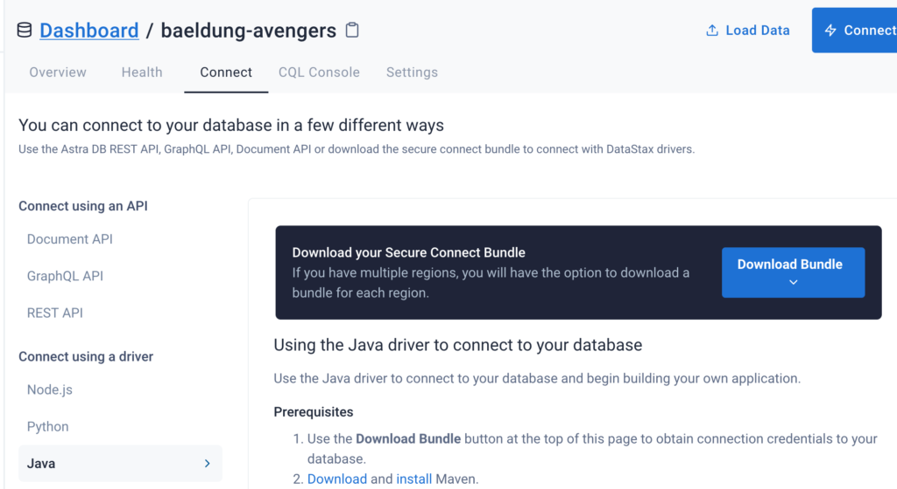
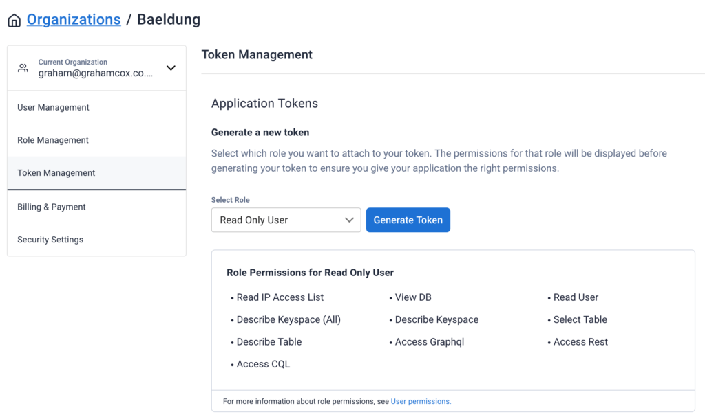
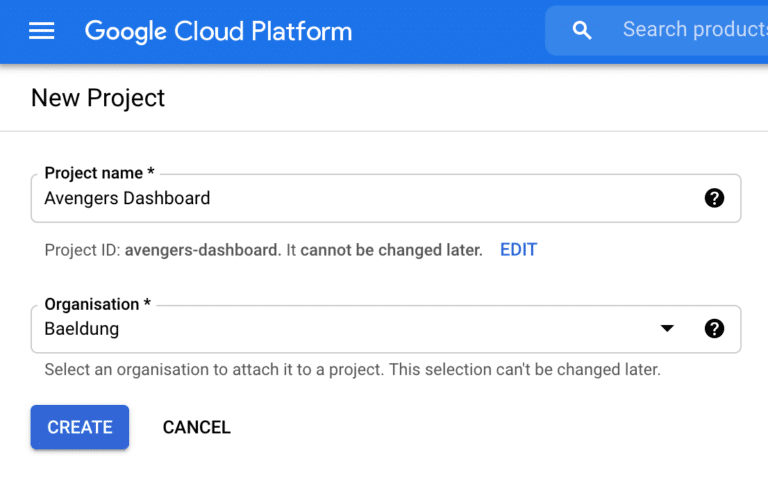
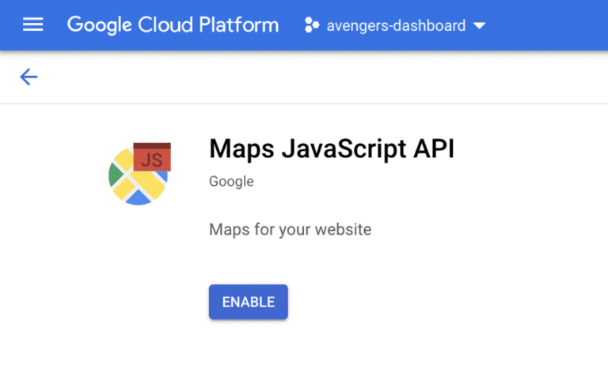
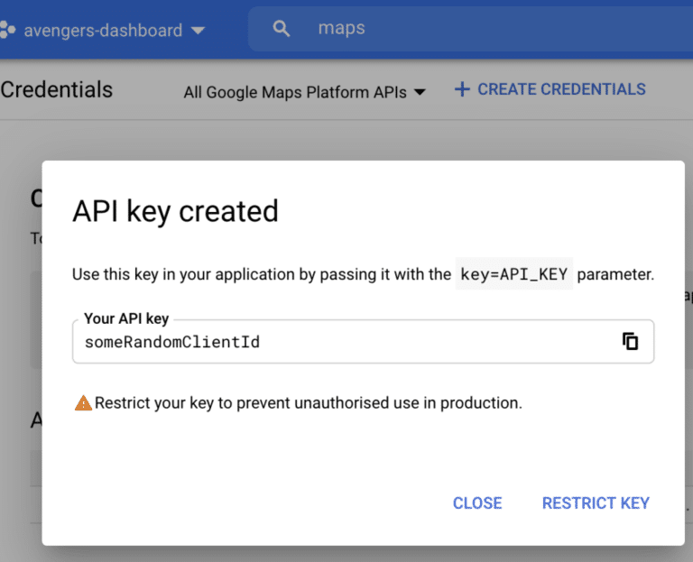
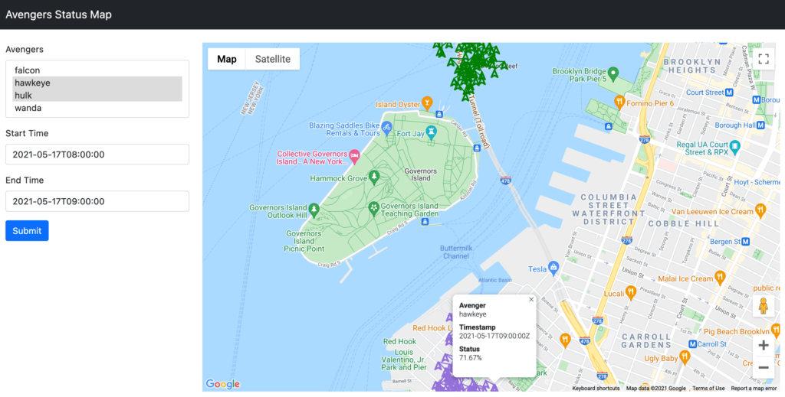

## **1. Introduction**

In our [previous article](https://www.baeldung.com/cassandra-astra-rest-dashboard-updates), we looked at augmenting our dashboard to store and display individual events from the Avengers using [DataStax Astra](https://astra.dev/3DnYCl8), a serverless DBaaS powered by [Apache Cassandra](https://cassandra.apache.org/) using [Stargate](https://stargate.io/?utm_medium=referral&utm_source=baeldung&utm_campaign=series-1-of-3&utm_content=avengers-dash-series-1) to offer additional APIs for working with it.

In this article, we will be making use of the exact same data in a different way. **We are going to allow the user to select which of the Avengers to display, the time period of interest, and then display these events on an interactive map.** Unlike in the previous article, this will allow the user to see the data interacting with each other in both geography and time.

In order to follow along with this article, it is assumed that you have already read the [first](https://www.baeldung.com/cassandra-astra-stargate-dashboard) and [second](https://www.baeldung.com/cassandra-astra-rest-dashboard-updates) articles in this series and that you have a working knowledge of Java 16, Spring, and at least an understanding of what Cassandra can offer for data storage and access. It may also be easier to have the code from [GitHub](https://github.com/Baeldung/datastax-cassandra/) open alongside the article to follow along.

## **2. Service Setup**

**We will be retrieving the data using the CQL API, using queries in the [Cassandra Query Language](https://docs.datastax.com/en/cql-oss/3.3/index.html).** This requires some additional setup for us to be able to talk to the server.

### **2.1. Download Secure Connect Bundle.**

**In order to connect to the Cassandra database hosted by DataStax Astra via CQL, we need to download the "Secure Connect Bundle".** This is a zip file containing SSL certificates and connection details for this exact database, allowing the connection to be made securely.

This is available from the Astra dashboard, found under the "Connect" tab for our exact database, and then the "Java" option under "Connect using a driver":


For pragmatic reasons, we're going to put this file into *src/main/resources* so that we can access it from the classpath. In a normal deployment situation, you would need to be able to provide different files to connect to different databases -- for example, to have different databases for development and production environments.

### **2.2. Creating Client Credentials**

**We also need to have some client credentials in order to connect to our database.** Unlike the APIs that we've used in previous articles, which use an access token, the CQL API requires a "username" and "password". These are actually a Client ID and Client Secret that we generate from the "Manage Tokens" section under "Organizations":


Once this is done, we need to add the generated Client ID and Client Secret to our *application.properties*:

```
ASTRA_DB_CLIENT_ID=clientIdHere
ASTRA_DB_CLIENT_SECRET=clientSecretHere
```

### **2.3. Google Maps API Key**

**In order to render our map, we are going to use Google Maps. This will then need a Google API key to be able to use this API.**

After signing up for a Google account, we need to visit the [Google Cloud Platform Dashboard](https://console.cloud.google.com/). Here we can create a new project:


We then need to enable the Google Maps JavaScript API for this project. Search for this and enable this:


Finally, we need an API key to be able to use this. For this, we need to navigate to the "Credentials" pane on the sidebar, click on "Create Credentials" at the top and select API Key:


We now need to add this key to our *application.properties*file:

```
GOOGLE_CLIENT_ID=someRandomClientId
```

## 3. Building the Client Layer Using Astra and CQL

**In order to communicate with the database via CQL, we need to write our client layer.** This will be a class called CqlClient that wraps the DataStax CQL APIs, abstracting away the connection details:

```
@Repository
public class CqlClient {
  @Value("${ASTRA_DB_CLIENT_ID}")
  private String clientId;

  @Value("${ASTRA_DB_CLIENT_SECRET}")
  private String clientSecret;

  public List<Row> query(String cql, Object... binds) {
    try (CqlSession session = connect()) {
      var statement = session.prepare(cql);
      var bound = statement.bind(binds);
      var rs = session.execute(bound);

      return rs.all();
    }
  }

  private CqlSession connect() {
    return CqlSession.builder()
      .withCloudSecureConnectBundle(CqlClient.class.getResourceAsStream("/secure-connect-baeldung-avengers.zip"))
      .withAuthCredentials(clientId, clientSecret)
      .build();
  }
}
```

This gives us a single public method that will connect to the database and execute an arbitrary CQL query, allowing for some bind values to be provided to it.

**Connecting to the database makes use of our Secure Connect Bundle and client credentials that we generated earlier.** The Secure Connect Bundle needs to have been placed in *src/main/resources/secure-connect-baeldung-avengers.zip* , and the client ID and secret need to have been put into *application.properties* with the appropriate property names.

Note that this implementation loads every row from the query into memory and returns them as a single list before finishing. This is only for the purposes of this article but is not as efficient as it otherwise could be. We could, for example, fetch and process each row individually as they are returned or even go as far as to wrap the entire query in a *java.util.streams.Stream* to be processed.

## **4. Fetching the Required Data**

**Once we have our client to be able to interact with the CQL API, we need our service layer to actually fetch the data we are going to display.**

Firstly, we need a Java Record to represent each row we are fetching from the database:

```
public record Location(String avenger, 
  Instant timestamp, 
  BigDecimal latitude, 
  BigDecimal longitude, 
  BigDecimal status) {}
```

And then we need our service layer to retrieve the data:

```
@Service
public class MapService {
  @Autowired
  private CqlClient cqlClient;

  // To be implemented.
}
```

Into this, we're going to write our functions to actually query the database -- using the *CqlClient* that we've just written -- and return the appropriate details.

### **4.1. Generate a List of Avengers**

Our first function is to get a list of all the Avengers that we are able to display the details of:

```
public List<String> listAvengers() {
  var rows = cqlClient.query("select distinct avenger from avengers.events");

  return rows.stream()
    .map(row -> row.getString("avenger"))
    .sorted()
    .collect(Collectors.toList());
}
```

**This just gets the list of distinct values in the *avenger* column from our *events* table.** Because this is our partition key, it is incredibly efficient. CQL will only allow us to order the results when we have a filter on the partition key so we are instead doing the sorting in Java code. This is fine though because we know that we have a small number of rows being returned so the sorting will not be expensive.

### **4.2. Generate Location Details**

Our other function is to get a list of all the location details that we wish to display on the map. **This takes a list of avengers, and a start and end time and returns all of the events for them grouped as appropriate:**

```
public Map<String, List<Location>> getPaths(List<String> avengers, Instant start, Instant end) {
  var rows = cqlClient.query("select avenger, timestamp, latitude, longitude, status from avengers.events where avenger in ? and timestamp >= ? and timestamp <= ?", 
    avengers, start, end);

  var result = rows.stream()
    .map(row -> new Location(
      row.getString("avenger"), 
      row.getInstant("timestamp"), 
      row.getBigDecimal("latitude"), 
      row.getBigDecimal("longitude"),
      row.getBigDecimal("status")))
    .collect(Collectors.groupingBy(Location::avenger));

  for (var locations : result.values()) {
    Collections.sort(locations, Comparator.comparing(Location::timestamp));
  }

  return result;
}
```

The CQL binds automatically expand out the IN clause to handle multiple avengers correctly, and the fact that we are filtering by the partition and clustering key again makes this efficient to execute. We then parse these into our *Location* object, group them together by the *avenger* field and ensure that each grouping is sorted by the timestamp.

## **5. Displaying the Map**

**Now that we have the ability to fetch our data, we need to actually let the user see it.** This will first involve writing our controller for getting the data:

### **5.1. Map Controller**

```
@Controller
public class MapController {
  @Autowired
  private MapService mapService;

  @Value("${GOOGLE_CLIENT_ID}")
  private String googleClientId;

  @ModelAttribute("googleClientId")
  String getGoogleClientId() {
    return googleClientId;
  }

  @GetMapping("/map")
  public ModelAndView showMap(@RequestParam(name = "avenger", required = false) List<String> avenger,
  @RequestParam(required = false) String start, @RequestParam(required = false) String end) throws Exception {
    var result = new ModelAndView("map");
    result.addObject("inputStart", start);
    result.addObject("inputEnd", end);
    result.addObject("inputAvengers", avenger);

    result.addObject("avengers", mapService.listAvengers());

    if (avenger != null && !avenger.isEmpty() && start != null && end != null) {
      var paths = mapService.getPaths(avenger, 
        LocalDateTime.parse(start).toInstant(ZoneOffset.UTC), 
        LocalDateTime.parse(end).toInstant(ZoneOffset.UTC));

      result.addObject("paths", paths);
    }

    return result;
  }
}
```

**This uses our service layer to get the list of avengers, and if we have inputs provided then it also gets the list of locations for those inputs.** We also have a *ModelAttribute* that will provide the Google Client ID to the view for it to use.

### **5.1. Map Template**

Once we've written our controller, we need a template to actually render the HTML. This will be written using Thymeleaf as in the previous articles:

```
<!doctype html>
<html lang="en">

<head>
  <meta charset="utf-8" />
  <meta name="viewport" content="width=device-width, initial-scale=1" />

  <link href="https://cdn.jsdelivr.net/npm/bootstrap@5.0.0-beta3/dist/css/bootstrap.min.css" rel="stylesheet"
    integrity="sha384-eOJMYsd53ii+scO/bJGFsiCZc+5NDVN2yr8+0RDqr0Ql0h+rP48ckxlpbzKgwra6" crossorigin="anonymous" />

  <title>Avengers Status Map</title>
</head>

<body>
  <nav class="navbar navbar-expand-lg navbar-dark bg-dark">
    <div class="container-fluid">
      <a class="navbar-brand" href="#">Avengers Status Map</a>
    </div>
  </nav>

  <div class="container-fluid mt-4">
    <div class="row">
      <div class="col-3">
        <form action="/map" method="get">
          <div class="mb-3">
            <label for="avenger" class="form-label">Avengers</label>
            <select class="form-select" multiple name="avenger" id="avenger" required>
              <option th:each="avenger: ${avengers}" th:text="${avenger}" th:value="${avenger}"
                th:selected="${inputAvengers != null && inputAvengers.contains(avenger)}"></option>
            </select>
          </div>
          <div class="mb-3">
            <label for="start" class="form-label">Start Time</label>
            <input type="datetime-local" class="form-control" name="start" id="start" th:value="${inputStart}"
              required />
          </div>
          <div class="mb-3">
            <label for="end" class="form-label">End Time</label>
            <input type="datetime-local" class="form-control" name="end" id="end" th:value="${inputEnd}" required />
          </div>
          <button type="submit" class="btn btn-primary">Submit</button>
        </form>
      </div>
      <div class="col-9">
        <div id="map" style="width: 100%; height: 40em;"></div>
      </div>
    </div>
  </div>

  <script src="https://cdn.jsdelivr.net/npm/bootstrap@5.0.0-beta3/dist/js/bootstrap.bundle.min.js"
    integrity="sha384-JEW9xMcG8R+pH31jmWH6WWP0WintQrMb4s7ZOdauHnUtxwoG2vI5DkLtS3qm9Ekf" crossorigin="anonymous">
    </script>
  <script type="text/javascript" th:inline="javascript">
    /*<![CDATA[*/
    let paths = /*[[${paths}]]*/ {};

    let map;
    let openInfoWindow;

    function initMap() {
      let averageLatitude = 0;
      let averageLongitude = 0;

      if (paths) {
        let numPaths = 0;

        for (const path of Object.values(paths)) {
          let last = path[path.length - 1];
          averageLatitude += last.latitude;
          averageLongitude += last.longitude;
          numPaths++;
        }

        averageLatitude /= numPaths;
        averageLongitude /= numPaths;
      } else {
        // We had no data, so lets just tidy things up:
        paths = {};
        averageLatitude = 40.730610;
        averageLongitude = -73.935242;
      }

      map = new google.maps.Map(document.getElementById("map"), {
        center: { lat: averageLatitude, lng: averageLongitude },
        zoom: 16,
      });

      for (const avenger of Object.keys(paths)) {
        const path = paths[avenger];
        const color = getColor(avenger);

        new google.maps.Polyline({
          path: path.map(point => ({ lat: point.latitude, lng: point.longitude })),
          geodesic: true,
          strokeColor: color,
          strokeOpacity: 1.0,
          strokeWeight: 2,
          map: map,
        });

        path.forEach((point, index) => {
          const infowindow = new google.maps.InfoWindow({
            content: "<dl><dt>Avenger</dt><dd>" + avenger + "</dd><dt>Timestamp</dt><dd>" + point.timestamp + "</dd><dt>Status</dt><dd>" + Math.round(point.status * 10000) / 100 + "%</dd></dl>"
          });

          const marker = new google.maps.Marker({
            position: { lat: point.latitude, lng: point.longitude },
            icon: {
              path: google.maps.SymbolPath.FORWARD_CLOSED_ARROW,
              strokeColor: color,
              scale: index == path.length - 1 ? 5 : 3
            },
            map: map,
          });

          marker.addListener("click", () => {
            if (openInfoWindow) {
              openInfoWindow.close();
              openInfoWindow = undefined;
            }

            openInfoWindow = infowindow;
            infowindow.open({
              anchor: marker,
              map: map,
              shouldFocus: false,
            });
          });

        });
      }
    }

    function getColor(avenger) {
      return {
        wanda: '#ff2400',
        hulk: '#008000',
        hawkeye: '#9370db',
        falcon: '#000000'
      }[avenger];
    }

    /*]]>*/
  </script>

  <script
    th:src="${'https://maps.googleapis.com/maps/api/js?key=' + googleClientId + '&callback=initMap&libraries=&v=weekly'}"
    async></script>
</body>

</html>
```

We are injecting the data retrieved from Cassandra, as well as some other details. Thymeleaf automatically handles converting the objects within the *script* block into valid JSON. Once this is done, our JavaScript then renders a map using the Google Maps API and adds some routes and markers onto it to show our selected data.

**At this point, we have a fully working application. Into this we can select some avengers to display, date and time ranges of interest, and see what was happening with our data:**


## **6. Conclusion**

Here we have seen an alternative way to visualize data retrieved from our Cassandra database, and have shown the Astra CQL API in use to obtain this data.

All of the code from this article can be found [over on GitHub](https://github.com/Baeldung/datastax-cassandra/tree/main/avengers-dashboard).
