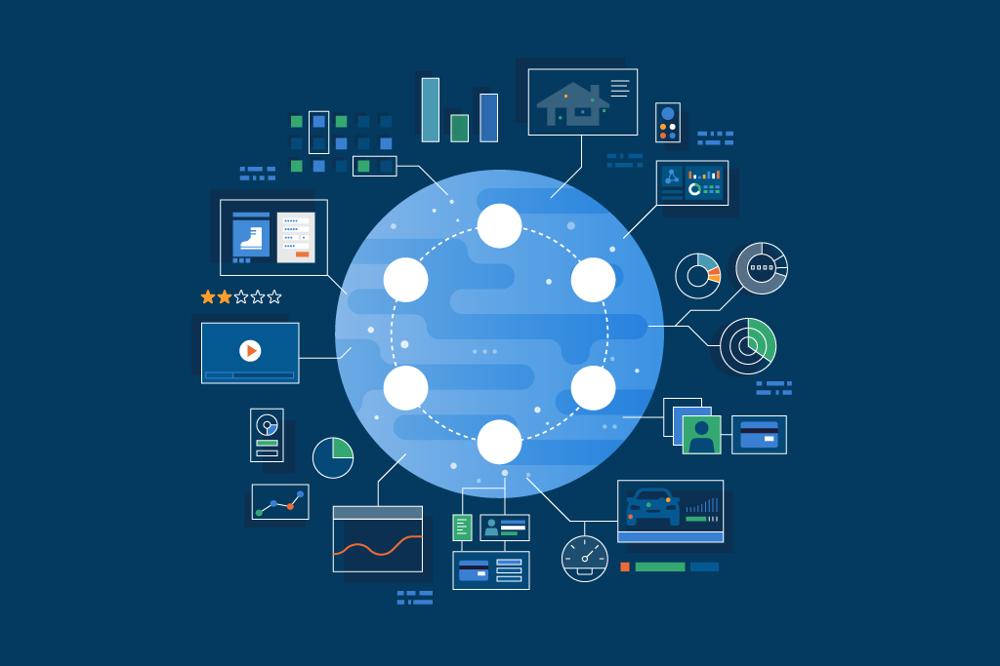

The O'Reilly book, *Cassandra: The Definitive Guide,* features a quote from Ray Kurzweil, the noted inventor and futurist:

"An invention has to make sense in the world in which it is finished, not the world in which it is started."

This quote has a prophetic ring to it, especially considering my co-author Eben Hewitt included it in the 2010 first edition of this book we wrote, back when Apache Cassandra, the open-source, distributed, and highly scalable NoSQL database, was just on its 0.7 release.

In those days, other NoSQL databases were appearing on the scene as part of platforms with worldwide scale from vendors like Amazon, YouTube, and Facebook. With many competing database projects and a slowly emerging response from relational database vendors, the future of this emerging landscape wasn't yet clear, and Hewitt qualified his assessment with this summary: "In a world now working at web scale and looking to the future, Apache Cassandra *might* be *one part*of the answer." (emphasis added)

While many of those databases from the NoSQL revolution and the [NewSQL](https://en.wikipedia.org/wiki/NewSQL) counter-revolution have now faded into history, Cassandra has stood the test of time, maturing into a rock-solid database that arguably still scales with performance and reliability better than any other.

Twelve-plus years after its invention, Cassandra is now used by approximately 90 percent of the Fortune 100, and it's appeal is broadening quickly, driven by a rush to harness today's "data deluge" with apps that are globally distributed and always-on. Add to this recent advances in the Cassandra ecosystem such as [Stargate](https://stargate.io/), [K8ssandra](https://k8ssandra.io/), and cloud services like [Astra DB](https://astra.dev/3xr02HV), and the cost and complexity barriers to using Cassandra are fading into the past. So while it's fair to say that while Cassandra might have been ahead of its time in 2007, it's primed and ready for the data demands of the 2020s and beyond.

Cassandra made a lot of sense to its inventors at Facebook when they developed it in 2007 to store and access reams of data for Messenger, which was growing insanely fast. From the start, Cassandra scaled quickly, and accessed huge amounts of data within strict SLAs—in a way that relational databases and SQL, which had long been the standard ways to access and manipulate data, couldn't. As it became clear that this technology was suitable for other use cases, Facebook handed Cassandra to the Apache Software Foundation, where it became an open source project (it was voted into a top-level project in 2010).

The reliability and fail-over capabilities offered by Cassandra quickly won over some rising web stars, who loved its scalability and reliability. Netflix launched its streaming service in 2007, using an Oracle database in a single data center. As the company's streaming service users, the devices they binge-watched with, and data expanded rapidly, the limitations on scalability and the potential for failures became a serious threat to Netflix's success. At the time, Netflix's then-cloud architect Adrian Cockroft said he viewed the single data center that housed Netflix's backend as a single point of failure. Cassandra, with its distributed architecture, was a natural choice, and by 2013, most of Netflix's data was housed there, and Netflix still uses Cassandra today.

Cassandra survived its adolescent years by retaining its position as the database that scales more reliably than anything else, with a continual pursuit of operational simplicity at scale. It demonstrated its value even further by integrating with a broader data infrastructure stack of open source components, including the analytics engine [Apache Spark](https://spark.apache.org/), stream-processing platform [Apache Kafka](https://kafka.apache.org/), and others.

Cassandra hit a major milestone this month, with the release of 4.0. The members of the Cassandra community pledged to do something that's unusual for a dot-zero release: make 4.0 so stable that major users would run it in production from the get-go. But the real headline is the overall growth of the Cassandra ecosystem, measured by changes both within the project and related projects, and improvements in how Cassandra plays within anyour infrastructure.

A host of complementary open-source technologies have sprung up around Cassandra to make it easier for developers to build apps with it. [Stargate](https://stargate.io/), for example, is an open source data gateway that provides a pluggable API layer that greatly simplifies developer interaction with any Cassandra database. REST, GraphQL, Document, and gRPC APIs make it easy to just start coding with Cassandra without having to learn the complexities of CQL and Cassandra data modeling.

[K8ssandra](https://k8ssandra.io/) is another open source project that demonstrates this approachability, making it possible to deploy Cassandra on any Kubernetes engine, from the public cloud providers to VMWare and OpenStack. K8ssandra extends the Kubernetes promise of application portability to the data tier, providing yet another weapon against vendor-lock in.

There's a question that Hewitt poses in [*Cassandra: The Definitive Guide*](https://www.datastax.com/resources/ebook/oreilly-cassandra-definitive-guide)*:* "What kind of things would I do with data if it wasn't a problem?"

Netflix asked this question—and ran with the answer—almost a decade ago. The $25-billion company is a paragon of the kind of success that can be built with the right tools and the right strategy at the right time. But today, for a broad spectrum of companies that want to achieve business success, data also can't be a "problem."

Think of the modern applications and workloads that should never go down, like online banking services, or those that operate at huge, distributed scale, such as airline booking systems or popular retail apps. Cassandra's seamless and consistent ability to scale to hundreds of terabytes, along with its exceptional performance under heavy loads, has made it a key part of the data infrastructures of companies that operate these kinds of applications.

Across industries, companies have staked their business on the reliability and scalability of Cassandra. Best Buy, the world's largest multichannel consumer electronics retailer, refers to Cassandra as "flawless" in how it handles massive spikes in holiday purchasing traffic. Bloomberg News has relied on Cassandra since 2016 because it's easy to use, easy to scale, and always available; the financial news service serves 20 billion requests per day on nearly a petabyte of data (that's the rough equivalent of over 4,000 digital pictures a day—for every day of an average person's life).

But Cassandra isn't just for big, established sector leaders like Best Buy or Bloomberg. [Ankeri](https://www.datastax.com/enterprise-success/ankeri), an Icelandic startup that operates a platform to help cargo shipping operators manage real-time vessel data, chose Cassandra—delivered through DataStax's [Astra DB](https://astra.dev/3xr02HV)—in part because of its ability to scale as the company gathers an increasing amount of data from a growing number of ships. It wanted a data platform that wouldn't make data a problem, and wouldn't get in the way of its success.

A handful of organizations have built services around Cassandra, in an effort to make it more accessible, and to solve some of the inherent challenges that come with operating a robust database.

One particularly hard nut to crack when it comes to managing databases has been provisioning. With cloud computing services (think AWS Lambda), scaling, capacity planning, and cost management are all automated, resulting in software that's easy to maintain, and cost effective—"serverless," in other words. But because modern databases store data by partitioning it across nodes of a database cluster, they've proved challenging to make serverless. Doing so requires rebalancing data across nodes when more are added, in order to balance storage and computing capabilities.

Because of this, enterprises have been required to guess what their peak usage will be—and pay for that level, even if they aren't using that capacity. That's why it was a big deal when DataStax announced earlier this year that its Astra DB cloud database built on Cassandra is [available](https://www.datastax.com/blog/2021/02/datastax-serverless-what-we-did-and-why-its-game-changer) as a serverless, pay-as-you-go service. According to [recent research](https://www.datastax.com/gigaom-tco) by analyst firm GigaOm, the serverless Astra DB can deliver significant cost savings. And developers will only pay for what they use, no matter how many database clusters they create and deploy.

Carl Olofson, research vice president at IDC, noted: "A core benefit of the cloud is dynamic scalability, but this has been more difficult to achieve for storage than with compute. By decoupling compute from storage, DataStax's Astra DB service lets users take advantage of the innate elasticity of the cloud for data, with a cloud agnostic database."

While Cassandra is more than a decade young, it is a database for today. If the argument of 2010 was "Cassandra may be the future," and 2017 "Cassandra is mature," the 2021 version is "Cassandra is an essential part of any modern data platform." The developments in Cassandra and its surrounding ecosystem point to a coming wave of new developers and enterprises worldwide for whom Cassandra is not just a sensible choice, but an obvious one.

## Want to learn more about DataStax Astra DB, built on Apache Cassandra? [Sign up](https://www.datastax.com/products/astra/demo) for a free demo.
