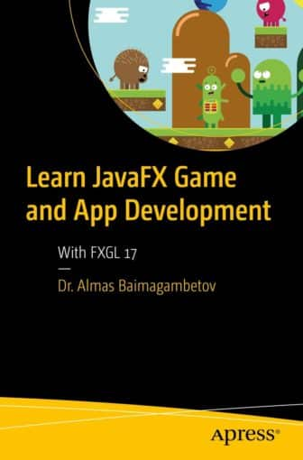

This is an announcement of the FXGL 17 book. This book is for beginners in Java and/or JavaFX who wish to develop apps and games with FXGL, while improving Java and JavaFX skills.

This book is also suitable for experienced developers who wish to learn how to use FXGL.

Lastly, game developers familiar with Unity, Unreal Engine or Godot who wish to learn Java and JavaFX will find this book useful.

JavaFX is a modern high-performance GUI toolkit for Java. It provides hardware acceleration support on a range of platforms, including desktop, mobile and embedded, allowing the development of cross-platform applications.

However, to develop games with JavaFX effectively, numerous domain-specific concepts are needed. To address this need, the FXGL game engine extends JavaFX and brings support for real-world game development techniques.

FXGL is a JavaFX-based game engine that is distributed as a typical Maven/Gradle dependency.

Out of the box it supports commonly used game development techniques, such as Entity-Component, physics, interpolated animations, particle effects, AI, networking and many more.

The API is typically higher level than other engines and follows the JavaFX conventions, where appropriate, to minimise the transition from JavaFX to FXGL.

The book is available from Springer: <https://link.springer.com/book/10.1007/978-1-4842-8625-8>

All of the source code is available at: <https://github.com/AlmasB/FXGL>

FXGL powered games are available from: <https://github.com/AlmasB/FXGLGames>

Complete playable demos are published at: <https://fxgl.itch.io/>
