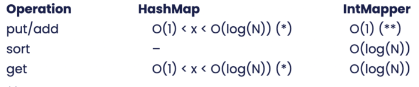
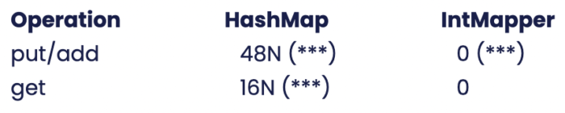

As most Java developers know, putting values in a Java Map (like a HashMap) involves creating a large number of auxiliary objects under the covers.

For example, a HashMap with int keys and long values might, for each entry, create a wrapped Integer, a wrapped Long object and a Node that holds the former values together with a hash value and a link to other potential Node objects sharing the same hash bucket.

Perhaps even more tantalizing is that a wrapped Integer might be created each time the Map is queried. For example, using the Map::get operation.

In this short tutorial, we will devise a way of creating an object-creation-free, light-weighted mapper with rudimentary lookup capability that is suitable for a limited number of associations.

The mapper is first created and initialized, whereafter it can be queried. Interestingly, these mappers can also be serialized/deserialized and sent over the wire using [Chronicle's open-source libraries](https://github.com/OpenHFT "Chronicle’s open-source libraries") without incurring additional object creation.

#### Setting the Scene

Suppose we have a number of Security objects with an "id" field of type int. We would like to create a reusable mapper for these objects allowing a number of Security objects to be looked up using the "id" field:

```java
public final class Security extends SelfDescribingMarshallable {
    private int id;
    private long averagePrice;
    private long count;
    public Security(int id, long price, long count) {
        this.id = id;
        this.averagePrice = price;
        this.count = count;
    }
    // Getters, setters and toString() not shown for brevity
}
```


The SelfDescribingMarshallable is basically a serialization marker.

#### Implementing an IntMapper

We can now store these Security objects in an IntMapper containing the actual lookup method as shown hereunder:

```java
public class IntMapper<V> extends SelfDescribingMarshallable {
    private final List<V> values = new ArrayList<>();
    private final ToIntFunction<? super V> extractor;
    public IntMapper(final ToIntFunction<? super V> extractor) {
        this.extractor = Objects.requireNonNull(extractor);
    }
    public List<V> values() { return values; }
    public IntStream keys() {
        return values.stream().mapToInt(extractor);
    }
    public void set(Collection<? extends V> values) {
        this.values.clear();
        this.values.addAll(values);
        // Sort the list in id order
        this.values.sort(comparingInt(extractor));
    }
    public V get(int key) {
        int index = binarySearch(key);
        if (index >= 0)
            return values.get(index);
        else
            return null;
    }
    // binarySearch() shown later in the article
}
```


That's it!

We have created a reusable mapper with no object creation overhead with reasonable query performance.

#### Using the Mapper

Armed with the above classes, we can put together a small main method that demonstrates the use of the concept:

```java
public class SecurityLookup {
    public static void main(String[] args) {
        // These can be reused
        final Security s0 = new Security(100, 45, 2);
        final Security s1 = new Security(10, 100, 42);
        final Security s2 = new Security(20, 200, 13);
        // This can be reused
        final List<Security> securities = new ArrayList<>();
        securities.add(s0);
        securities.add(s1);
        securities.add(s2);
        // Reusable Mapper
        IntMapper<Security> mapper =
                new IntMapper<>(Security::getId);
        mapper.set(securities);
        Security security100 = mapper.get(100);
        System.out.println("security100 = " + security100);
    }
}
```


As expected, the program will produce the following output when run:

```
security100 = Security{id=100, averagePrice=45, count=2}
```


#### Binary Search Method Implementation

The binary search method used above might be implemented like this:

```java
int binarySearch(final int key) {
        int low = 0;
        int high = values.size() - 1;
        while (low >> 1;
            final V midVal = values.get(mid);
            int cmp = Integer.compare(
                    extractor.applyAsInt(midVal), key);
            if (cmp  0)
                high = mid - 1;
            else
                return mid;
        }
        return -(low + 1);
    }
}
```


Unfortunately, we cannot use Arrays::binarySearch or Collections::binarySearch. One reason is that methods like these would create additional objects upon querying.

#### Other Key Types

If we want to use other types like CharSequence or other reference objects, there is an overload of the comparing() method that takes a custom comparator. This might look like the following in the case of CharSequence:

```java
values.sort(
    comparing(Security::getId, CharSequenceComparator.INSTANCE));
```


More generally, if the key reference object is of type K, then the binary search method above can easily be modified to use an extractor of type Function instead and an added Comparator parameter.

A complete example of a generic Mapper is available [here](https://github.com/OpenHFT/Chronicle-Wire/tree/ea/demo/src/main/java/run/chronicle/wire/demo/mapreuse "here").

#### Serializing Across the Wire

Sending IntMapper objects over the wire without object creation requires special care on the receiver side so that old Security objects can be reused. This involves setting up a transient buffer that holds recycled Security objects.

```java
private final transient List buffer = new ArrayList();
```


We also have to override the IntMapper::readMarshallable method and include:

```java
wire.read("values").sequence(values, buffer, Security::new);
```


The complete setup is outside the scope of this article.

#### Analysis: HashMap vs. IntMapper

Looking at various properties of the two alternatives, we see the following:

#### Execution Performance



(\*) Depending on key distribution, size, load factor and associations made.

(\*\*) There is no add method in the IntMapper, instead all values are added in a batch

#### Memory usage in Bytes



(\*\*\*): The figures above are under typical JVM use, excluding the Security objects themselves and excluding any backing array, both of which can be recycled between use.

#### Object Allocation in objects


All the figures above are excluding the Security objects themselves and excluding any backing array.

#### Resources

* [Chronicle Software Home Page](https://chronicle.software/ "Chronicle Software Home Page")
* [Chronicle Wire on GitHub (open-source)](https://github.com/OpenHFT/Chronicle-Wire "Chronicle Wire on GitHub (open-source)")
* [Complete source code for all examples in this article (open-source)](https://github.com/OpenHFT/Chronicle-Wire/tree/ea/demo/src/main/java/run/chronicle/wire/demo/mapreuse "Complete source code for all examples in this article (open-source)")
