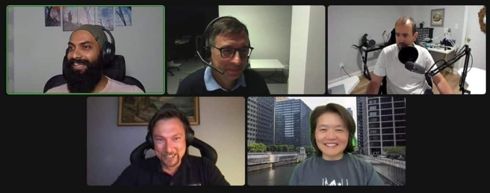

It's September 20th, OpenJDK 19 has been released. In this podcast, we discuss the new features and the changes that this release brings.



## Podcast Apps

You can listen and subscribe to the Foojay Podcast on:

* [Spotify](https://open.spotify.com/show/6CpTfgn9LirzJGAtc4ICdQ)
* [Apple Podcasts](https://podcasts.apple.com/be/podcast/foojay-io-the-friends-of-openjdk/id1652281304)
* And most others...

## Guests

* **[Miroslav Wengner](https://twitter.com/miragemiko)** (OpenValue)
* **[Mary Grygleski](https://twitter.com/mgrygles)** (CJUG, DataStax)
* **[Deepu K Sasidharan](https://twitter.com/deepu105)** (Okta, JHipster)

## Podcast host

**[Erik Costlow](https://twitter.com/costlow)** (Azul)

## Content

0'00 Short intro and music  

0'15 Introduction about the shift of Java releases to a 6-month release cycle and version 19  

0'55 Introduction Speakers and Host  

3'30 Review of articles published on Foojay regarding the new JDK 19 features  

4'00 What is project Loom and virtual threads?  

4'55 What can we expect in OpenJDK 19?  

6'10 Project Amber, pattern matching, switch cases  

7'10 Massive throughput with virtual threads  

8'45 About preview and incubator features  

12'50 Platform versus virtual threads  

17'05 Java is becoming much stronger, reducing the need for extra frameworks  

18'15 Java versus other languages  

21'40 How trading companies can profit from virtual threads  

22'50 Project Panama, shared memory use  

28'05 About jextract  

29'35 About Java versions, LTS, and how they are used  

33'35 Record patterns  

35'40 Maintainability and developer productivity  

37'40 The importance of keeping up with other languages to keep Java "cool" for developers  

43'30 About Java modules  

45'45 Outro

