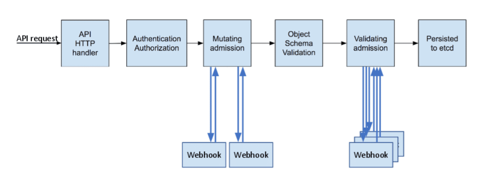

Kubernetes offers a lot of benefits: an enormous ecosystem with plenty of actors, self-healing capabilities, etc. There's no free lunch, though. It also comes with downsides, chief among them its complexity and operating costs.

However, the more I work with Kubernetes, the more I think its most significant asset is **extensibility**. If you need something that the platform doesn't provide by default, there's an option to develop it yourself and integrate it. In this post, I'd like to list such extension points.

Kubernetes 101 {#h2-0-kubernetes-101}
-------------------------------------

A lot of explanations on Kubernetes focus on the architecture. I believe they go into too many details and miss the big picture. Here, I only want to highlight the basic concepts.

At its most basic level, Kubernetes is just a platform able to run container images. It stores its configuration in a distributed storage engine, `etcd`. The most significant part of this configuration is dedicated to the *desired state* for objects. For example, you only update this state when you schedule a pod using the `kubectl` command line.

Other components, called controllers, watch configuration changes and read the *desired state* . Then, they try to reconcile the *desired state* with the *actual state* . It's nothing revolutionary: Puppet is based on the same control-loop approach, and AFAIK, Chef. Generally, a controller manages a single type of object, *e.g.* , the `DeploymentController` manages deployments.

The idea behind making a generic tool is to follow Pareto's Law: solve 80% of the problems with 20% of the effort. Unfortunately, the more generic the tool and the wider the user base, the more effort to customize the remaining 20%.

Kubernetes designers saw this issue as the most critical obstacle to widespread adoption. Hence, Kubernetes offers many extension points.

Extensible model {#h2-1-extensible-model}
-----------------------------------------

In the section above, I mentioned scheduling a pod. A pod is one of the many objects available in Kubernetes out-of-the-box. Other objects include: deployments, jobs, services, etc.

Some solutions easily fit this model. For example, one can easily create a deployment of three Hazelcast pods. It works out-of-the-box: the pods will multicast over the network, find each other, and form a cluster.

Other solutions are not so homogenous. Before [KIP-500](https://cwiki.apache.org/confluence/display/KAFKA/KIP-500%3A+Replace+ZooKeeper+with+a+Self-Managed+Metadata+Quorum), Kafka would rely on Zookeeper. At cluster consists of at least three Zookeeper nodes and as many Kafka nodes as desired. Kubernetes makes it possible to deploy multiple images on the same pod. Yet, if all required components are on the same pod and the pod fails, it amounts to nothing. We should map one regular component to one pod.

In this case, we need a fully-featured Kubernetes manifest that describes the architecture. Because of different requirements, we will need to make it configurable. Kubernetes' ecosystem offers several alternatives to manage this problem: [Kustomize](https://kustomize.io/) and [Helm](https://helm.sh/) count among the most popular solutions. But neither work at the desired level of abstraction, the Kafka cluster.

Therefore, Kubernetes allows designing a new `Kafka` object. This kind of custom object is known as a . Here's a sample for a simplistic arbitrary `Foo` object:

<pre class="EnlighterJSRAW" data-enlighter-language="yaml" data-enlighter-theme="dracula">apiVersion: apiextensions.k8s.io/v1       #1
kind: CustomResourceDefinition
metadata:
 name: foos.frankel.ch                    #2
spec:
 group: frankel.ch                        #3
 names:
   plural: foos                           #4
   singular: foo                          #5
   kind: Foo                              #6
 scope: Namespaced                        #7
 versions:
   - name: v1alpha1
     served: true                         #8
     storage: true                        #9
     schema:
       openAPIV3Schema:
         type: object
         properties:
           spec:
             type: object
             properties:
               bar:
                 type: string
             required: ["bar"]
         required: ["spec"]</pre>

1. Required header
2. Match the following `.`
3. Group name for REST API - `/apis//`
4. Plural name for the REST API - `/apis///`
5. Singular name to be used on the CLI and for display
6. Used in manifests
7. Can be either `Cluster` or `Namespaced`. A `Cluster` resource is declared cluster-wide, and there can be a single one per cluster; `Namespaced` resources can be multiple and need to be under a namespace; by default, `default`
8. A version can be enabled/disabled
9. The latest version must be marked as the storage version

Once you've applied this manifest, you can manage your `Foo`. Let's create a manifest to create a new `Foo` object.

<pre class="EnlighterJSRAW" data-enlighter-language="yaml" data-enlighter-theme="dracula">apiVersion: foos.frankel.ch/v1alpha1
kind: Foo
metadata:
  name: myfoo
spec:
  bar: "whatever"</pre>

<pre class="EnlighterJSRAW" data-enlighter-language="java" data-enlighter-theme="dracula">kubectl apply -f foo.yml
kubectl get foo</pre>

The above commands have updated the data model with a new `Foo` type and created a `Foo` object. But under the cover, we've only stored data in `etcd` via the Kubernetes API. Nothing will happen until we start a controller that watches for new objects and acts upon them. Note that the name for a controller that manages CRDs is *operator*.

Extensible validation {#h2-2-extensible-validation}
---------------------------------------------------

A common concern with a platform that can run third-party workloads is allowing only vetted ones. Some workloads may consume too many resources; others may be malicious.

Here are two concrete scenarios:

* As the cluster operator, you want to manage your cluster's limited physical resources (CPU/memory) and share them among all pods. For this, you want to enforce that each pod describes its [resources requirements](https://kubernetes.io/docs/concepts/configuration/manage-resources-containers/). Developers achieve this by setting the `request` and `limits` attributes. You want to disallow pods that don't have them.
* As a security-minded operator, you want to prevent [privilege escalation](https://docs.bridgecrew.io/docs/bc_k8s_19). It shouldn't change the final behavior of the pod. You want to add the `allowPrivilegeEscalation=false` to every pod.

While one can manage both cases through a "build" pipeline, Kubernetes provides a solution out-of-the-box.

As I explained above, Kubernetes stores configuration is `etcd` while controllers watch changes and act upon them. To prevent unwanted behavior, the safest way is to validate payloads that change configuration; it's the role of *admission controllers*.
> An admission controller is a piece of code that intercepts requests to the Kubernetes API server prior to persistence of the object, but after the request is authenticated and authorized. The controllers consist of the list below, are compiled into the kube-apiserver binary, and may only be configured by the cluster administrator. In that list, there are two special controllers: `MutatingAdmissionWebhook` and `ValidatingAdmissionWebhook`. These execute the mutating and validating (respectively) admission control webhooks which are configured in the API.
>
> -- [Using Admission Controllers](https://kubernetes.io/docs/reference/access-authn-authz/admission-controllers/)

In short, two kinds of admission controllers are available:

1. The validating admission webhook allows/prevents a request from changing the state
2. The mutating admission webhook changes the request

They run in turn as per the following diagram:

*From [A Guide to Kubernetes Admission Controllers](https://kubernetes.io/blog/2019/03/21/a-guide-to-kubernetes-admission-controllers)*

Each can solve the scenarios highlighted above.

Extensible client capabilities {#h2-3-extensible-client-capabilities}
---------------------------------------------------------------------

At its most basic level, the `kubectl` command line is a high-level abstraction over a REST client. You can verify it by setting the verbose option:

<pre class="EnlighterJSRAW" data-enlighter-language="java" data-enlighter-theme="dracula">kubectl get pods --v=8
</pre>

<pre class="EnlighterJSRAW" data-enlighter-language="generic" data-enlighter-theme="dracula">loader.go:372] Config loaded from file:  /Users/nico/.kube/config
round_trippers.go:463] GET https://127.0.0.1:61378/api/v1/namespaces/default/pods?limit=500
round_trippers.go:469] Request Headers:
round_trippers.go:473]     Accept: application/json;as=Table;v=v1;g=meta.k8s.io,application/json;as=Table;v=v1beta1;g=meta.k8s.io,application/json
round_trippers.go:473]     User-Agent: kubectl/v1.24.2 (darwin/arm64) kubernetes/f66044f
round_trippers.go:574] Response Status: 200 OK in 8 milliseconds
round_trippers.go:577] Response Headers:
round_trippers.go:580]     Cache-Control: no-cache, private
round_trippers.go:580]     Content-Type: application/json
round_trippers.go:580]     X-Kubernetes-Pf-Flowschema-Uid: 479e2d49-7b9f-4e4c-8fca-63c273cfb525
round_trippers.go:580]     X-Kubernetes-Pf-Prioritylevel-Uid: 4787583d-e7d4-4679-a474-ebb66919a43c
round_trippers.go:580]     Date: Sun, 04 Sep 2022 09:32:39 GMT
round_trippers.go:580]     Audit-Id: 2f2f163d-fb6d-4149-ba44-ecf4395028aa
request.go:1073] Response Body: {"kind":"Table","apiVersion":"meta.k8s.io/v1","metadata":{"resourceVersion":"263411"},"columnDefinitions":[{"name":"Name","type":"string","format":"name","description":"Name must be unique within a namespace. Is required when creating resources, although some resources may allow a client to request the generation of an appropriate name automatically. Name is primarily intended for creation idempotence and configuration definition. Cannot be updated. More info: http://kubernetes.io/docs/user-guide/identifiers#names","priority":0},{"name":"Ready","type":"string","format":"","description":"The aggregate readiness state of this pod for accepting traffic.","priority":0},{"name":"Status","type":"string","format":"","description":"The aggregate status of the containers in this pod.","priority":0},{"name":"Restarts","type":"string","format":"","description":"The number of times the containers in this pod have been restarted and when the last container in this pod has restarted.","priority":0},{"name":"Age","type":"st [truncated 6465 chars]</pre>

Kubernetes' REST API is (mostly?) based on operations. Sometimes, you need to run several commands to achieve the desired results. For example, we would like to query which subjects can execute an action.

`kubectl` includes a mechanism to [write code](https://kubernetes.io/docs/tasks/extend-kubectl/kubectl-plugins/) to orchestrate these calls. The mechanism is pretty similar to Git's:

1. You write your code according to a specific format - a *plugin*
2. You set it in your `PATH` variable

From this point, `kubectl` can discover it.

You can manage your plugins on your machine, but this approach is not scalable to a whole organization. The solution is a plugin manager. Meet Krew:
> Krew is the plugin manager for `kubectl` command-line tool.
>
> Krew helps you:
>
> * discover `kubectl` plugins,
> * install them on your machine,
> * and keep the installed plugins up-to-date.
>
> -- [What is Krew?](https://krew.sigs.k8s.io/)

Regarding which subjects can execute an action, here's how to do it:

<pre class="EnlighterJSRAW" data-enlighter-language="bash" data-enlighter-theme="dracula">brew install krew                              #1 
kubectl krew completion                        #2
# follow instructions to update your shell
kubectl krew update                            #3
kubectl krew install who-can                   #4
k who-can watch pod                            #5</pre>

1. Install `brew` on Mac
2. Display the auto-completion instructions
3. Update the cached list of plugins
4. Install the `who-can` Krew plugin
5. Enjoy!

<pre class="EnlighterJSRAW" data-enlighter-language="generic" data-enlighter-theme="dracula">No subjects found with permissions to watch pod assigned through RoleBindings

CLUSTERROLEBINDING                             SUBJECT                                 TYPE            SA-NAMESPACE
apisix-clusterrolebinding                      apisix-ingress-controller               ServiceAccount  ingress-apisix
cluster-admin                                  system:masters                          Group
local-path-provisioner-bind                    local-path-provisioner-service-account  ServiceAccount  local-path-storage
system:controller:attachdetach-controller      attachdetach-controller                 ServiceAccount  kube-system
system:controller:daemon-set-controller        daemon-set-controller                   ServiceAccount  kube-system
system:controller:deployment-controller        deployment-controller                   ServiceAccount  kube-system
system:controller:endpoint-controller          endpoint-controller                     ServiceAccount  kube-system
system:controller:endpointslice-controller     endpointslice-controller                ServiceAccount  kube-system
system:controller:ephemeral-volume-controller  ephemeral-volume-controller             ServiceAccount  kube-system
system:controller:generic-garbage-collector    generic-garbage-collector               ServiceAccount  kube-system
system:controller:job-controller               job-controller                          ServiceAccount  kube-system
system:controller:persistent-volume-binder     persistent-volume-binder                ServiceAccount  kube-system
system:controller:pod-garbage-collector        pod-garbage-collector                   ServiceAccount  kube-system
system:controller:pvc-protection-controller    pvc-protection-controller               ServiceAccount  kube-system
system:controller:replicaset-controller        replicaset-controller                   ServiceAccount  kube-system
system:controller:replication-controller       replication-controller                  ServiceAccount  kube-system
system:controller:resourcequota-controller     resourcequota-controller                ServiceAccount  kube-system
system:controller:statefulset-controller       statefulset-controller                  ServiceAccount  kube-system
system:coredns                                 coredns                                 ServiceAccount  kube-system
system:kube-controller-manager                 system:kube-controller-manager          User
system:kube-scheduler                          system:kube-scheduler                   User</pre>

Conclusion {#h2-4-conclusion}
-----------------------------

In this post, we browsed through several extension points in Kubernetes: the data model, admission controllers, and client-side. It was a very brief introduction, both in width and depth. Yet, I hope that it gives a good entry point into further research.

* [Extend the Kubernetes API with CustomResourceDefinitions](https://kubernetes.io/docs/tasks/extend-kubernetes/custom-resources/custom-resource-definitions/)
* [Versions in CustomResourceDefinitions](https://kubernetes.io/docs/tasks/extend-kubernetes/custom-resources/custom-resource-definition-versioning/)
* [Using Admission Controllers](https://kubernetes.io/docs/reference/access-authn-authz/admission-controllers/)
* [Extend kubectl with plugins](https://kubernetes.io/docs/tasks/extend-kubectl/kubectl-plugins/)
* [Krew plugins](https://krew.sigs.k8s.io/plugins/)

*Originally published at [A Java Geek](https://blog.frankel.ch/kubernetes-extensibility/) on September 18^th^, 2022*

*[CRUD]: Create Read Update Delete
*[CRD]: Custom Resource Definition
