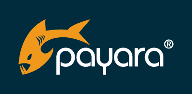

**22.09. 2022** . With the launch of Jakarta EE 10 today, Payara releases **Payara 6 Community Alpha 4 immediately,** bringing its new features directly to its product for innovation and learning*.*

[Payara is one of the few vendors to have a product certified against the Jakarta EE 10 Platform on the launch day.](https://jakarta.ee/compatibility/certification/10/) Payara 6 Enterprise will follow in Q1, 2023, bringing the future of Jakarta EE to those using Payara's enterprise product.  



***"With the release of Jakarta EE 10, Jakarta EE - formerly Java EE - continues to lead the way in application development for enterprise, cloud native Java applications. Payara Server is proud to support reliable and secure deployments of Jakarta EE apps in any environment. Being a member of the Eclipse Foundation, and a Strategic Member of the Jakarta EE Working Group, Payara continuously contributes to the Jakarta EE initiative and is pleased to welcome this next stage",*emphasized Payara CEO and Founder Steve Millidge.**

Jakarta EE 10 is the first major release of Jakarta EEsince the major namespace update, brought by Jakarta EE 9. With Jakarta EE 9, the package namespace javax moved to jakarta across the Jakarta EE 9 Platform, Web Profile specifications, and related TCKs. With Jakarta EE 10, we see the first release in the new namespace that also *adds functionality* for the Jakarta EE user.

The baseline Java JDK used is also changing, from Java 8 to Java 11 at API level, and Java 17 for runtimes. For Jakarta EE 8 users moving to Jakarta EE 10, all Jakarta EE imports in the code will need to be changed to the new namespace. For example, for messaging, javax.jms must become jakarta.jms; Java Persistence, heavily used in Hibernate and Spring, must move from javax.persistence to jakarta.persistence, etc.

There are several things that every developer can look forward to with Jakarta EE 10. New Java SE Features can now be used with Jakarta EE 10; some of these are Completable Future, Fork/Join pools, and better integration with new technologies like OpenID. Payara Community users will be able to make use of these changes straightaway, thanks to Payara 6 Community Alpha 4.

Many deprecated features have been also removed for Jakarta EE 10, streamlining, and improving the developer experience. A lot of work has been done across APIs to provide deployable resources, attached to the application through annotations. The aim of this is that developers will not have to use a deployment descriptor or similar in future when deploying resources that their applications need.

There are also many exciting improvements to Jakarta EE specifications. For example, Jakarta Faces now has a completely programmable implementation and Jakarta REST has a new Bootstrap API, so developers no longer must use it in a container. There are also major improvements to [CDI](https://jakarta.ee/specifications/cdi/), support for polymorphic types in JSON-B, and much more.

By supporting Jakarta EE 10 as soon as possible, Payara Server continues to be easy to learn, simple to use, and the first choice for Jakarta EE 10 applications.

**For more information about Payara, please contact: [marketing@payara.fish](mailto:marketing@payara.fish)**

**About Payara**:

A global open source company, Payara creates innovative infrastructure software. We proudly nurture and grow an open, collaborative community to advance our software and services by being innovative and flexible while providing first-class support, stability, and security. We actively contribute to Jakarta EE as one of the main Eclipse Foundation Solutions members and members of the Project Management Committee to shape the future of the industry. Payara is one of 205 organizations nationally recognized with the prestigious Queen's Award for Enterprise: International Trade 2021.

For more information, please visit:

[Payara Welcomes Jakarta EE 10](https://blog.payara.fish/payara-welcomes-jakarta-ee-10)

[Jakarta EE 10 Certification](https://jakarta.ee/compatibility/certification/10/)
