I had a pretty awful travel experience trying to reach Oslo, but it's all worth it for what is possibly my favorite conference: JavaZone.

I absolutely love this conference. It has everything: Sense of humor, craziness, heavy metal, continuous integration of food and amazing talks with great people.

This years conference has a fantasy theme which fits into the "weirdness" of the conference. Notice that when I say "weird" this is one of the highest complements I can give a conference. I a world of cookie cutter conferences JavaZone is unique in every way. See [this opening scene](https://www.youtube.com/watch?v=rmnaxgwPewY) in the morning of the first day...

The conference had plenty of things to do. One of the cool gimmicks was an app that let you set the background and decorations on a green screen. Below is a picture of me and [Bruno Burges](https://twitter.com/brunoborges/) in a typical viking setting.

JavaZone has continuous integration of food. That means food starts coming out in the morning and just never stops. There's no lunch breaks. Just food constantly available and at the highest quality of any conference I've ever been to. It's catering so I don't want to oversell it, but it's great and plentiful and a great part of the experience at JavaZone. There's also the party at night where donuts, beer and Thai food mix with live music. There's no other conference like it!

Another great feature of JavaZone is the overflow room. Before I get into this you need to understand the spectacular venue for this conference. The Oslo Spectrum is a huge circular building with a large arena in the center where we have the pavilion, parties and live viking fights. Around it are seven rooms where we can see the talks. Most of these rooms are built like a cinema. Where you need to climb to get to the chairs and the screens are HUGE. This is wonderful.

No one will hide the speaker if they sit in-front of you. The view is absolutely fantastic and the lighting is perfect. But the most amazing feature is the overflow. It's one room where the screen is divided into 7 and you can see all seven concurrent talks at once. You're given a headpiece and you can change the audio channel between the various talks and enjoy several talks at once. I used to sit in this room all the time back in the day. But with this visit I just couldn't. After all this time on Zoom I feel I need to see people live. As a result I missed some talks I wanted to attend which is a shame. There was just too much content.

Unfortunately, due to the connections and logistics I had to leave very early and so I didn't see much of the second day at JavaZone. I try to attend a couple of morning sessions but due to the tight schedule I missed even more. Despite the fact I spent half of this trip is in airports/in-route it's still worth the trip as it's SUCH a great conference in such a great city!

## The Duck Teaches: Learn to debug from the masters. Local to production - kill the bugs - Shai Almog (me)

This year I gave a workshop which is a two hour "hands-on" experience. I liked it and got some good feedback but I feel there's room for improvement. The main culprit was getting Kubernetes to play nice with the demo code. I hoped that since I picked [Skaffold](https://talktotheduck.dev/cloud-native-skaffold-book-review) for the demo things will work smoothly. Skaffold is indeed magical but there are limits to its powers. Half of the students couldn't get the environment working which was frustrating and ate up a lot of our time. Next time I give this talk I will structure it so the Kubernetes part is in the end and people would still be able to get a lot even without running it.

Another option is to set up the Kubernetes cluster for them so they can connect to it remotely, if this workshop gets accepted into other conferences I might choose to go that route. Regardless, the class was lovely and I got good feedback so hopefully they enjoyed it. I hope to create a video of this workshop so people can follow it at home as it's a pretty cool workshop.

## Speaker Dinner

Because of the flight delays I literally landed and had to rush to the workshop. From there I had less than an hour to go to the speaker dinner. This is usually one of the highlights of a conference. You get to meet the conference friends, those of us who go from conference to conference. I've taken a long hiatus from conferences 7 years ago so I don't know as many people as I used to but I'm starting to run into familiar faces. There are also other "old timers" like myself who I know from back in the Sun days.

I got to meet some people who I've never met in person but interacted with online which was great. The pub where it was happening was a nice one too. I was very tired so I left relatively early with a few friends.

## What's cooking in Maven? - Maarten Mulders

Maarten who's an Apache maven committer talked about what's new in that build tool. He covered the maven wrapper, the build/consumer POM, reactor and the maven daemon. The maven wrapper are the scripts that let us build a maven project from the CLI. The `./mvnw` script, etc. It let's us ignore the version of maven the users have on their system.

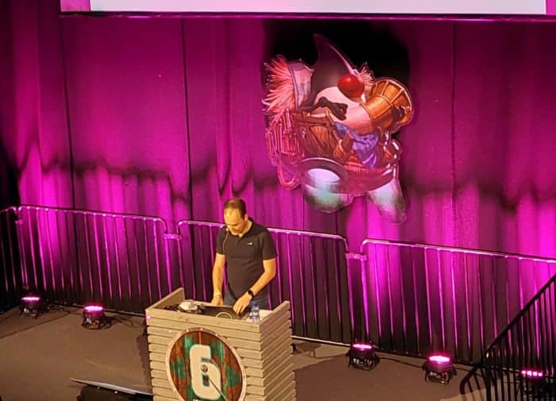

Tikari-wrapper is the type of maven wrapper that most of us are familiar with. The apache-wrapper is the second approach to do the same thing. In the upcoming maven 4 the wrapper comes pre-packaged into maven. It downloads the wrapper code into `~/.m2/wrapper` which is an idea from the gradle wrapper.

There's still no announcement date for the release of Maven 4.0. We can use snapshots right now to play with it. But that's probably not something we'd want to use for production development at this point (my projection not something Maarten said).

Decoupling build and consumer is another big change. The POM we have in source control is currently the same one we have in maven central or local maven repo. This makes things pretty complicated. We want the pom to be far more compact but it might break other tools that parse the POM and relies on that. The solution is to split the POM we have locally from the POM we upload. Maven 4.x is smart, it looks through child poms from relative paths and picks up nested POMs without the same level of verbosity we have in Maven 3.x. It works by creating an "effective pom" from the more terse POM syntax that 4.x allows. This lets Maven maintain compatibility while pushing to central (through the effective POM) while leaving the local POM syntax terse and simple.

The improved reactor makes multi-module projects much simpler. The reactor is the part of maven that's aware of your project structure. It goes through the project structure and resolves dependencies. It builds the conceptual dependency graph required for the build. But it only works from the root of the project!

The new reactor will be root-project aware as long as you have a `.mvn` folder. It removes the need to constantly do `mvn install` which is a huge pain. Thanks to these changes when a multi-module build fails it knows where the build fails and can resume from that point. You don't need to explicitly tell it which module needs to resume, you can just pass `-r` to the `mvn` to resume from the last failure.

The maven daemon is their response to the gradle daemon. You have maven already running the background so it can stay running and jitted. That way builds will be slightly faster. Runs multi-threaded builds by default without cluttering the output. During the demo a build that took 23 seconds with mvn3 went down to 7 or even 3 seconds with maven 4.x. The main source of benefit was from the multi-threaded aspect but the daemon startup also helped. Notice that some plugins might not work with the maven daemon. It has a version already available today that you can use right now.

Dependency downloads might also be parallelized but this is a separate process unrelated to the current roadmap to maven 4.x so it might not make it into 4.0.0. Since 4.0 will change the way the POM works we need to start testing it right now if we have a custom plugin. It's possible plugins will need updating and might need replacing for some cases. We will need to replace the signing plugin when moving to maven 4.0, we need this plugin to upload to maven central.

You can follow Maarten on twitter here [mthmulders](https://twitter.com/mthmulders).

## Building Kotlin DSL - Anton Arhipov

While I coded in Kotlin I didn't do so at scale and consider myself a novice in that language. I understand the concepts and the code is familiar due to its JVM roots but it's a bit unintuitive to me. I love the concepts of DSL so decided to attend this talk.

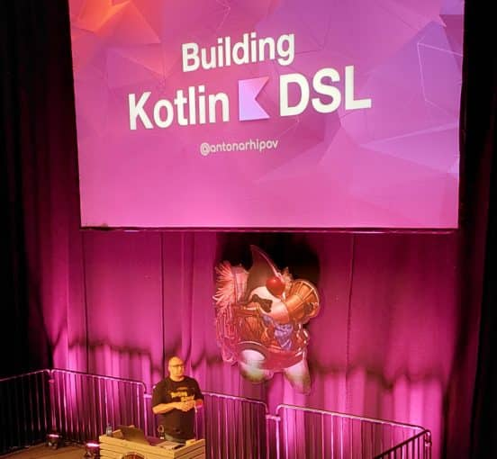

Most people pick null safety, coroutines, multi-platform, syntax etc. as the reason for picking Kotlin. Syntax is really the lead for DSL The DSL lets us build a custom syntax to match domain specific needs. There are two types, external and internal DSL. Building DSLs isn't a new idea. There have been domain specific language tools for ages. Some of these tools are pretty spectacular but the value of adding an internal DSL into Kotlin is that we can build on top of the capabilities that Kotlin already has. We can seamlessly integrate with Kotlin and build complex subsets. We don't need to build a full language, we can build a small feature that's very specific to a domain without solving the entire problem. We can still benefit from compiler unity, checks and extensibility.

DSLs in kotlin tend to look very similar since they're derived from the kotlin syntax of blocks. We can just invoke functions, get syntax highlighting, refactoring and pretty much everything that we need to build a DSL. The syntax takes getting used to but the benefits of the syntax are pretty great. I can think of so many cases where this would be useful for business applications and domain specific code. If there's something that will make me switch to Kotlin it's the DSLs.

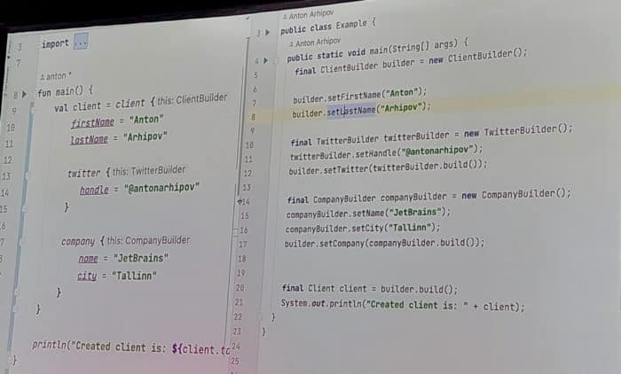

You can follow Anton on twitter [@antonarhipov](https://twitter.com/antonarhipov).

## Deserialization exploits in Java: Why should I care? - Brian Vermeer

I missed this great talk from Brian at previous conferences due to scheduling conflicts. This time around I refused to miss it. This remarkably important talk presented in a compelling fashion is a must. Serialization (and deserialization) is "the gift that keeps giving". At least in terms of security vulnerabilities.

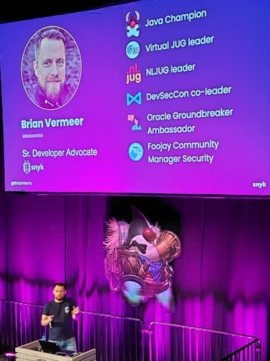

Serialization skips the constructor and lets us inject invalid values to objects. If an object is serialized we can potentially set a variable to any value and mess with application internal state. We can set private variables to anything and completely bypass any validation logic. Imagine a timestamp value that can suddenly go back to epoch or to a future date. Permissions can be elevated and everything can be manipulated.

A gadget lets you run load a different class upon serialization. This will fail later when we downcast but during the read process we can load a different class where we can do arbitrary code execution. `HashMap` is a class that overrides the `readObject` and can be used as part of an exploit chain.  
[ysoserial](https://github.com/frohoff/ysoserial) helps us create a chain of serialization to produce an exploit based on known serialization weaknesses. You can run this project and generate payload ser files that you can pass to exploit potential vulnerabilities.

The Log4Shell vulnerability had a deserialization aspect to it. It's not just a JNDI/LDAP vulnerability. The LDAP server needs to return a gadget class that performs the actual remote code execution. Code execution can be turned to a reverse shell. In records deserialization works using the constructor, so it works around that problem. Records won't solve everything but if we all use them it will reduce some of the problems.

Use `ValidatingObjectInputStream` with JEP 290 and 415 you can use `ObjectInputFilter` to limit the serialization scope.

Default typing in Jackson lets us inject an invalid object type into the JSON even when we don't use traditional serialization. Even if we don't use serialization in the traditional sense we can still be vulnerable because of our dependency graph.

In XML we can refer to an external entity that points to arbitrary files such as `/env/passed` or similar private information and retries such information from the server. This is a vulnerability that exists within all XML parsers builtin to the JDK.

* Do not deserialize input from unknown sources
* Prevent Java custom serialization
* Use filters if you need serialization
* Be aware how your JSON/XML/YAML marshaler work
* Check for insecure default values
* Update insecure libraries

You can follow Brian on twitter [@BrianVerm](https://twitter.com/BrianVerm).

## Myth Busters: Building a High-Performance Database in Java - Vlad Ilyushchenko

Vlad is the creator of the open source [QuestDB](https://github.com/questdb/questdb) project. He used the `sun.misc.Unsafe` class to implement fast memory access in Java and provide native level performance for the DB without GC. You can allocate a massive array in native RAM and traverse it without data copying. This lets Java and C code interact much faster than the typical slow JNI bridge.

After the talk I asked about the `Unsafe` deprecation and Vlad indicated this is something he's greatly concerned about. Afterwards we had some talk about Panama and some other potential approaches (GraalVM etc.). It's a challenging and interesting domain.

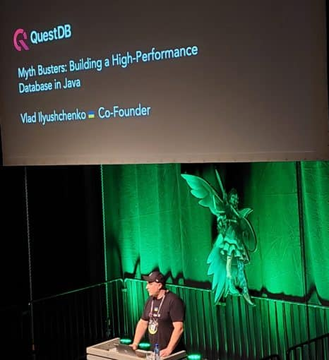

In order to maximize performance we need to minimize GC thrashing which means avoiding allocations. That also means avoiding the Java API as much as possible to reduce allocations as much as possible. When the method doesn't create garbage performance can double with very little impact. In parsing `String` is a source of major performance issues. To solve this the QuestDB team created their own `String` implementation that implements CharacterSet but works around the problems in `String`.

The DB files are accessed via `mmap` which lets us map a file to RAM and get random access to it. This reached a point where IOPS (input/output operations per second) was maxed out. The solution is the IOURing which lets them queue operations to keep the IOPS saturated and use the hardware to the max. But not exceed the max. That's important in cloud environments where you might exceed and fail.

They built their own logging system before newer loggers came out. It has a syntax designed to avoid string concatenation and avoid GC overhead as a result.

You can follow Vlad on twitter [@ilyusvl](https://twitter.com/ilyusvl).

## Event Streaming and Processing with Apache Pulsar - Mary Grygleski

What is an event, generically speaking?
> "The fundamental entity of observed physical reality represented by a point designated by three coordinates of place and one of time in the space-time continuum postulated by the theory of relativity"

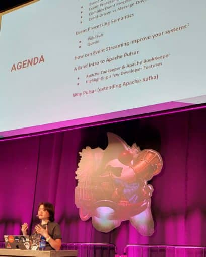

Event streaming is the practice of taking action on a series of data points that originate from a system that continuously creates data. Complex event processing lets you identify opportunities to arrive at some conclusion. A good example is fraud detection which can watch over a stream of events at high volume and detect suspicious pattens as they occur. Recommendation systems can also represent a common use case.

* Event driven - sender emits messages and interested subscribers can subscribe to the message
* Message driven - sender and receiver are known to each other (address is known)

Event approach vs. batch processing. Actor model in Erlang is already doing events. Batch processing lets you perform the data when you have time and not immediately to better use computing resources when they're available to you. The choice depends on how and when you need the data.

Streaming pub/sub - you give the message to the broker which delivers it onward. Similarly to mail systems and the broker is the post-master:

* Publishing client sends the data
* Broker is the middle-person/agent
* Subscribing client receives the data

Message queueing lets us keep messages until they're acknowledged and read. This prevents a system from overloading and guarantees delivery.

Streaming brought the distributed messaging up to a new level. Use realtime data to enhance customer experience. Use data pipeline to build AI/ML models. Scale to meet demands of large data volumes. Pipelines let us chain data through stages where each stage might be written in a different language through brokers along the way and process the different stages. In machine learning this is very useful as we might have very different training/processing stages along the way and some of them might be executable in parallel to increase throughput and scale up.

Apache Pulsar is an open source, unified, distributed messaging and streaming platform. It's kind of like RabitMQ and Kafka combined:

* Created by Yahoo - Apache in 2016 and top level 2018
* Cluster based
* Multi-tenant
* Simple client API (Java, C#, Python, Go,...)
* Separate compute and storage
* Guaranteed message delivery
* Lightweight serverless functions framework
* Tiered storage offloads

Native GEO replication, flexible message processing, and multi-tenancy are the big benefits of Pulsar. Pulsar uses a traditional multi-node architecture with an architecture designed for horizontal scaling and mask complexity from consumers. It has the following components:

* Producer - Client application that sends messages
* Consumer - Client application for reading messages
* Broker - Stateless process that handles incoming messages
* BookKeeper - Persistent message store
* ZooKeeper - Cluster metadata, handles coordination tasks between Pulsar clusters

If you're running JMS or similar older messaging system you can just bolt on Pulsar and migrate into it to gain the benefits of Pulsar (e.g. multi-tenant). The data pipeline is a function that can transform the data in the most efficient way. This is like Java streams API only the stream data source can be at cloud event scale.

Pulsar schema defines the serialization to the data structure you want such as JSON, Avro, Protobuf, primitive, key-value pairs, etc.

You can find Mary on twitter [@mgrygles](https://twitter.com/mgrygles).

## The Secret Life of Maven Central - Steve Poole

At some point we all find ourselves searching for code. So we can add a new dependency. 90% of modern application are open source dependencies. Our applications live or die off dependency management and repositories. Like the stars in the sky, maven central is "just there" and we don't think about it.

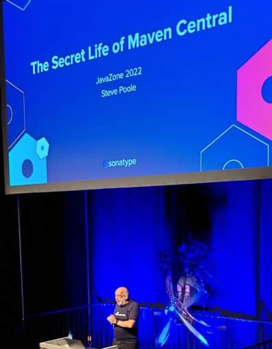

Why is Sonatype funding maven central? Why are they doing this public service?

Maven central outgrew its origins. Three users of maven central:

* Publishers - use nexus repository
* Repo users
* Search users

Maven central sits on AWS. It's an S3 bucket with Fastly in between for the repo users. Maven central publishes a REST API with some simple capabilities for search, etc. There are 27TB of Jar files the cost of S3 storage is remarkably expensive. 496 billion requests in 2021 to maven central. The volume is growing, demand is increasing.

Keeping your application safe is an important aspect for managing a repository. Proof of domain ownership is a part of blocking malicious code. Some potential attacks:

* Creating a package with a very new version to try and grab the people using LATEST when building
* Typo squatting is another danger. Developers can grab a package like `logj4` (instead of `log4j`)
* Typo squatting of the domain e.g. `org.apaceh` instead of `org.apache` this would be legal if we can purchase the domain and prove it to maven central

Python and JavaScript package management systems don't have the same level of domain ownership protections. Bots create such packages with malware. The structured naming in Java lets us skip some potential attacks. Unfortunately, everything else beyond that is hard. Does the package contain vulnerabilities? Malware? How do we figure that out?

Sonatype scans everything that's uploaded and looks for malware. It doesn't block vulnerabilities since some vulnerabilities in some situations might be acceptable. Maven central does show you if it knows there's a vulnerability, it won't block the vulnerable code but it will show you it's there and how critical it is.

Unfortunately, developers are slow to change. We aren't proactive enough. Since the log4shell issue:

* 51M downloads of log4j with 38% vulnerable
* 11,976 downloads in the past 24 hours with 33% vulnerable

Cyber warfare is attacking infrastructure and trying to install exploitable vulnerabilities. This will let them sabotage when they wish. Maven central is trying to add things to maven central to pre-empt such attacks and stop them.

* SBOM across the lifecycle
* SIG store support - central location for signatures
* Cross industry best practices - [openssf.org](https://openssf.org)
* Enhanced developer intelligence - looking for your feedback here

CLOMonitor from CNCF lets you see if some basic stuff related to security is configured correctly in your project. Can you "grade" the security level of a project so maven central can "kick out" projects that "fail" security.

Maven central doesn't have a logo so reach out to Steve on twitter or other channels with logo suggestions... I suggested verbally to use a logo of Atlas carrying a database. Tried to generate it with Dalle but didn't get an ideal result...

For more information and suggestions follow [@spoole167](https://twitter.com/spoole167).

## Thriving on the Cloud-Native path with Java and Kubernetes - Ana-Maria Mihalceanu

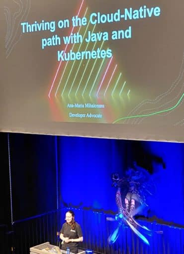  

Cloud native applications is about building architecture open to concurrent changes. Things we should learn fast, iterate on, delight from and still have cost-efficient autoscaling. We need a way to synchronize the data across the distributed stores. We want to control the traffic within Kubernetes but it isn't designed for that so Isto can come into play. But there are still challenges:

* Setting the environment is hard
* Steep learning curve
* Hard to test consistently
* Bloated dependencies
* Configuration might be far from services
* CI/CD isn't enough to scale everyday operations

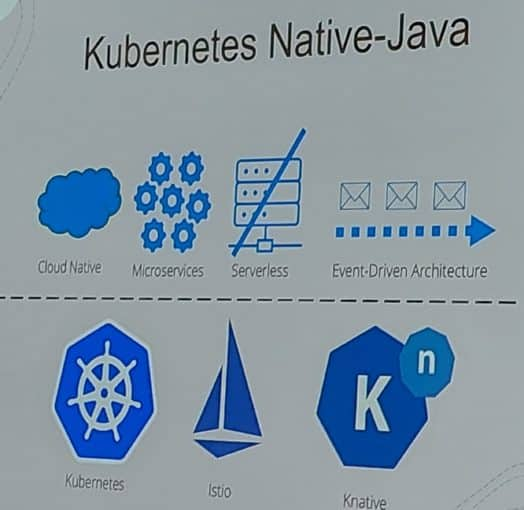

Start small and evolve the dream application. Make objective choices as a team. Envision the product and build a PoC. Gradually evolve the design/implementation. Encourage team knowledge for the full stack.

Quarkus is container first. Fun to develop with and generally complies with the requirements above.

At this point the talk focused on a demo of quarkus which which is pretty impressive. The Dev UI is very cool and the programming experience is very familiar to Spring developers. The advantage of using JVM tooling with quarkus over GraalVM native images is access to auxiliary tooling and capabilities. However, GraalVM is almost 5x smaller than the JVM version and starts faster.

Quarkus includes information about the container/orchestration environment right in the project to make the deployment/debugging experience seamless. You can define a load balancer for Kubernetes right from the Quarkus property file.

You can use quarkus tests to test that a Kubernetes pod is deployed correctly even if it wasn't built as a part of the quarkus deployment. This might not be ideal since this is a job for OPS not for developers but it's still very useful in "real life". You can create serverless Functions in quarkus with the `Func` annotation which seems pretty cool. Mostly remove everything related to the Kubernetes complexity. We can just move the secrets to knative to get this working as expected almost seamlessly.

* Achieve consistent local setup for team
* Instant feedback on local code via tests
* Validate Kubernetes resources by testing YAML content
* Scale up and down quickly with knative and smaller container images
* Deploy smoothly by binding YAML fragments and app configuration

Check out Ana-Maria on twitter [@ammbra1508](https://twitter.com/ammbra1508)

## Secrets of Performance Tuning Java on Kubernetes - Bruno Borges

## Addressing the transaction challenge in a cloud-native world - Grace Jansen

For my last two sessions at JavaZone I just couldn't decide so I broke down and went to the overflow. This is a pretty common scenario of two great speakers talking concurrently. But to my knowledge, JavaZone is the only conference that has some solution for that. Both Bruno and Grace are amazing speakers with fascinating subjects so my indecision resulted in a split understanding of both talks. Luckily JavaZone usually uploads high quality talk videos after the fact so I can catch up later. Hopefully the following two sections aren't too much of a mess.

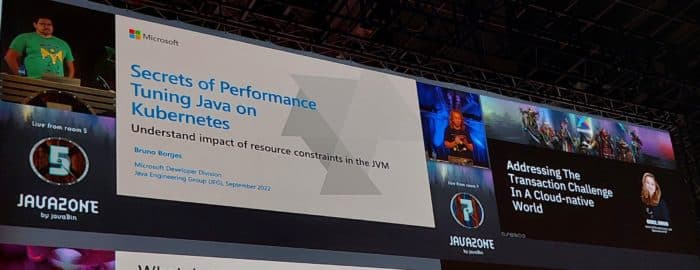

### Grace

Treat backing services as attached resources, stateless microservices == cloud-native. Is this really the case? What does it mean to be cloud native?

Stateless makes scaling and recovering easier since we can just recreate the resource. Stateful is problematic in that sense and makes everything harder. Unfortunately, we don't live in a purist world. In the real world things are stateful. Transaction can impact a single record or multiple records. It depends on how the transaction is set up.

Two phase commit lets us cross between data stores while maintaining ACID properties in a single transaction. 2PC works by converting the transaction to two parts and running a verify stage before running the actual transaction. 2PC is great normally but it isn't ideal for cloud native:

* It's slow since we need to wait for the slowest service to verify the transaction. Not practical in low relioability issues
* Not supported by NoSQL
* We need to lock while running the 2PC

SAGA pattern for consistency in distributed applications. Based on BASE: Atomicity, Durability, Basically Available, Soft State, Eventual consistency. SAGA can be applied via orchestration or choreography. The pattern works by canceling and effectively undoing the action (compensating action) and restore the system to a previous state in this regard.

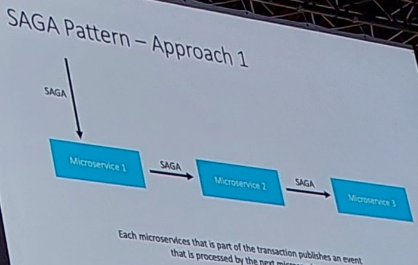

LRA uses annotations for declaring that an LRA transaction in microprofile. You can use `@Complete` for completing the micro transaction and `@Compensate` to implement the undo in case of the failure. There are also `@Forget`, `@Leave` and `@Status`.

* Stateful microservices are still needed in this cloud-native world
* Traditional transactions aren't suitable for cloud-native
* Alternatives like SAGA and MicroProfile LA can help to provide  
  suitable cloud-native transactions for microservices
* OSS tools and technologies are available to try out these alternatives E.g, MicroProfile LRA

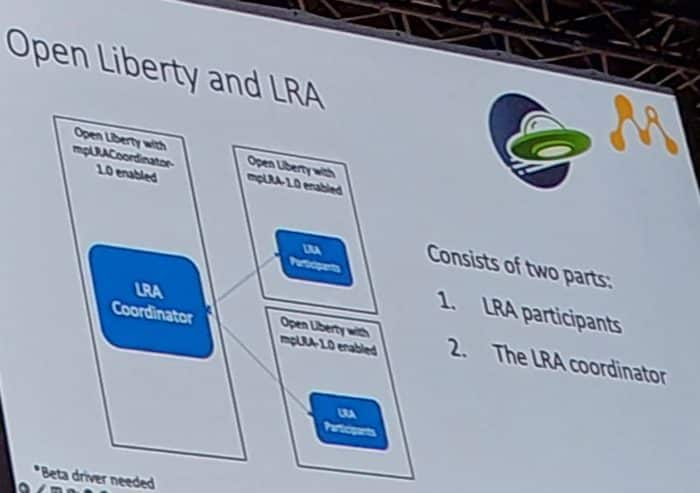

Check out Grace on Twitter [@gracejansen27](https://twitter.com/gracejansen27).

### Bruno

Microsoft uses Java on LinkedIn, Minecraft and many other Microsoft properties.

* JVM default ergonomics
* Garbage Collectors
* Kubernetes

There are more than 4 GCs in a vanilla JDK but a lot of people don't know that and don't understand the system that picks the GC selected by the JVM. The default is picked by CPU and available memory.

Most devs in a survey of 150 are deploying JVM workloads in containers with up to 4 CPUs, 4GB and 50% IO workloads. The default GC when running in a container with one CPU with 1GB or less of RAM. In this case the serial collector is used instead of G1 because of the CPU/RAM limits. When no GC tuning is set there are many settings that make no sense such as reserving memory for the graphics card. This makes no sense for a container running on a headless machine.

Two issues coming up in July/October

* Memory limit not respected in cgroup v2
* Do not use cpu share by default

Do not use `java -jar myApp.jar` !

Tuning the GC is remarkably important when its goal oriented. Not just setting the heap size, but tuning the GC for the goal (throughput, overhead, etc.). ParallelGC might be better in some smaller heaps when compared to G1.

Garbage Collection Recommendations:

* Serial - Best for single core, small heaps.
* Parallel - Best for nulti-core small heaps. Batch jobs with any heap size.
* G1 - Response in medium to large heaps, moderate overhead. High tail latency effect.
* Z - Response in medium to large heaps, moderate overhead. Less than 1ms pauses. Low tail latency effect.
* Shenandoah - Response in medium to large heaps, moderate overhead. Less than 10ms pauses. High tail latency effect.

In the old days we used to have the permgen space. We now have metaspace which is a bit different:

* Native region where class definitions etc. are stored
* Grows as needed
* Cleaned up for classes no longer reachable in stack
* JVM Flags: `MetaspaceSize` (initial) and  
  `MaxMetaspaceSize`
* `MaxMetaspaceSize` is a large number

Multi-threading is problematic with Kubernetes since the CPU cycle might be consumed because of the threads. Kubernetes might throttle an application that doesn't do much because it has multiple threads. The threads combined might consume the CPU time but not complete their tasks.

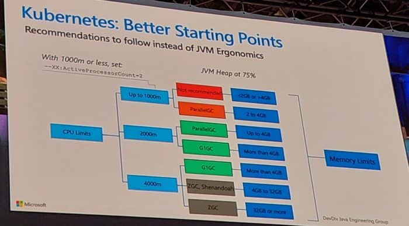

Unfortunately due to time constraints I had to run out before Bruno finished his talk which was slightly longer than Graces talk.

Check out Bruno on Twitter [@brunoborges](https://twitter.com/brunoborges/)

## Finally

As I mentioned at the top, it's been an amazing conference and I had a great time. I'm sorry I missed so many talks that ran concurrently to the ones I attended. I also feel I didn't get as much as I could out of the pavilion and parties because I was so exhausted (and had to rush to the airport). But if JavaZone isn't on your conference schedule you probably should add it. It's a unique gem that never disappoints.

Workshops aren't filmed so my talk won't be available for those of you who might want to check it out. I will have a book coming out soon that will cover the subject of my talk (and MUCH, MUCH more). I also plan to create a video of the subject in the workshop so if you follow the blog (or [follow me on twitter](https://twitter.com/debugagent/)) I'll keep you posted.
