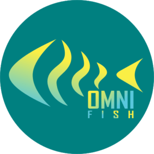

[**OmniFish**](https://omnifish.ee/)**are proud to announce that they have established themselves as a new international company in the field of [Jakarta EE](https://jakarta.ee/) support, specifically supporting the application server Eclipse GlassFish, a new cloud‑native Jakarta EE runtime Piranha Cloud, and their associated components such as Mojarra, the Jakarta Faces implementation.**

OmniFish, based in Estonia, EU, welcomes the new Jakarta EE 10 version. They are going to support Jakarta EE 10 applications on Eclipse GlassFish 7, which will be released later in October 2022. Moreover, OmniFish have recently [joined the Jakarta EE Working Group](https://blogs.eclipse.org/post/tanja-obradovic/welcome-omnifish-jakarta-ee-working-group) and they are strongly committed to contributing to the Jakarta EE standards. Some of the OmniFish founders are well-known Jakarta EE experts, which provides strong guarantees that OmniFish will become one of the key players in evolving and modernizing the Jakarta EE platform.

## OmniFish provide support for the Eclipse GlassFish server and the Piranha Cloud runtime, invest a lot in their development

**Eclipse GlassFish**, with OmniFish providing enterprise support, again becomes a reliable open source Jakarta EE application server backed by a commercial company, which invests heavily into its development. Previously owned and supported by Oracle, and before that by Sun Microsystems, GlassFish has been contributed to the Eclipse Foundation. Since then, OmniFish have significantly contributed to the advancement of Eclipse GlassFish, with well over 1600 code changes (commits), which is more than 60% of all the changes since the contribution.

OmniFish is now leading the development of the final version of Eclipse GlassFish 7, which is planned to be released later in October 2022. For this upcoming release, OmniFish engineers have dramatically increased test coverage, fixed a large number of defects, realized architectural and performance improvements, and added full Jakarta EE 10 and JDK 17 support. Piranha Cloud is a new runtime re-imagining the usage of Jakarta EE APIs in very small, embedded, and highly modular runtimes. This approach is a radical departure from the application server model.

**Piranha Cloud** is developed from scratch but shares many implementation components with Eclipse GlassFish, such as Soteria, Mojarra, Jersey, and many more.

## Quotes from the OmniFish founders:

Ondro Mihályi, OmniFish director and co-founder:
> We at OmniFish are here to support customers that build and maintain systems based on Eclipse GlassFish, need to modernize their Jakarta EE solutions, improve performance or save costs. With Piranha Cloud, we also provide a safe and supported journey from Eclipse GlassFish to cloud-native deployments with a modern and efficient runtime.

Arjan Tijms, OmniFish director and co-founder:
> OmniFish will show its dedication to Jakarta EE by continuing to support Eclipse GlassFish, and additionally bringing Jakarta EE 10 compatibility to Piranha Cloud, which enables a wider range of users to take advantage of the Jakarta EE APIs.

David Matějček, OmniFish director and co-founder:
> Some time ago I contacted Arjan and we started discussing the state of Jakarta EE, Eclipse GlassFish, and other projects. When Ondro joined us later, we decided to start our own company which would boost Eclipse GlassFish and Jakarta EE development to make it modern, useful, and supported for production systems.

## OmniFish aims at the application servers market and fast-growing cloud and serverless markets

OmniFish are the biggest contributor to the Jakarta EE 10 compatible Eclipse GlassFish 7 and a major contributor to the Jakarta EE 10 specifications. They are in a prime position to provide the best professional support for Eclipse GlassFish possible. [It is estimated](https://www.researchandmarkets.com/reports/5351656/application-server-market-size-share-and-trends) that the application servers market size will double by 2028, reaching USD 40.96 billion. According to the [OmniFaces survey](https://arjan-tijms.omnifaces.org/2021/02/jakarta-ee-survey-20202021-results.html), GlassFish is the 3rd most frequently used server, with a 22% share. Even though Eclipse GlassFish is open source and free to use, there's a lot of potential for OmniFish to grow by providing support and services around it.

OmniFish also heavily contributes to the Piranha Cloud runtime, which aims to provide Jakarta EE functionality to build native cloud and serverless applications. As Piranha Cloud builds on the same components as Eclipse GlassFish, it provides a natural transition for Jakarta EE applications to cloud and serverless deployments. [It is estimated](https://www.alliedmarketresearch.com/cloud-services-market) that the cloud services market size will triple by 2030, reaching USD 1620 billion. OmniFish expects that this growth will result in increased interest in cloud-native runtimes like Piranha Cloud and will open opportunities for other OmniFish services and products based on it.

Ondro Mihályi, OmniFish director and co-founder:
> We at OmniFish have put a lot of effort to turn the upcoming Eclipse GlassFish 7 into a modern and reliable application server so that our clients can use it and sleep peacefully. Meanwhile, we're working on Piranha Cloud as a new generation cloud runtime, based on our experience with GlassFish and other Jakarta EE servers. We are 100% dedicated to making our partners and clients successful with Eclipse GlassFish and Piranha Cloud. We aim to provide a cost-efficient and reliable path to modernizing their Jakarta EE applications, should our clients choose on-premise deployments or uplift their applications to cloud.

## Who is behind the OmniFish company?

OmniFish, formal name Omnifish OÜ, was formally established as a company in 2022 by Ondro Mihályi, Arjan Tijms, and David Matějček, with headquarters in Estonia, EU. During the same year, it joined the Eclipse Foundation and the Jakarta EE Working Group as a Participant member. With employees located in several countries in the EU and partners across the world, OmniFish is an international company aiming at the global market.

**Arjan Tijms** is a Java Champion, was Jakarta Faces co-spec lead under the JCP and Mojarra committer, and a Jakarta Faces and Jakarta Security EG member under the JCP, and current project lead of Jakarta Security, Jakarta Authentication, Jakarta Authorization, Jakarta Expression Language, Jakarta Faces, and committer of Eclipse Mojarra, Eclipse Soteria and author of the award-winning OmniFaces library. He has published three books with Apress on the topic of Jakarta EE and has written many articles about Jakarta EE.

**Ondro Mihályi** is a project member of Jakarta Batch, Jakarta Messaging, and Jakarta Config specifications. He was also a core member of the Microprofile team. He's an experienced Jakarta EE lecturer, a frequent conference speaker, a Java Champion, and the leader of the Czech Java User Group. He co-authored the Java EE 8 Microservices book published by Packt.

**David Matějček** is an expert in the Eclipse GlassFish server, he's worked with it and its predecessors and alternatives for more than 15 years. David is a senior software architect and expert in quality assurance, testing, automation, troubleshooting, and fixing defects, he is also a member of the Jakarta Persistence and the Jakarta Faces teams, and contributes to open source projects for many years.

OmniFish can be reached via their [contact page](https://omnifish.ee/contact-us/), or on Twitter at [@OmniFishEE](https://twitter.com/OmniFishEE). More information about the company can be found at <https://omnifish.ee>.

For more information:

* [Original press release published on the OmniFish web site](https://omnifish.ee/2022/09/22/omnifish-announces-support-for-eclipse-glassfish/)
* [Jakarta EE Working Group Releases Jakarta EE 10](https://jakarta.ee/news/jakarta-ee-10-released/)
* [OmniFish joined the Jakarta EE Working Group](https://blogs.eclipse.org/post/tanja-obradovic/welcome-omnifish-jakarta-ee-working-group)
* [Learn more about Jakarta EE 10](https://jakarta.ee/release/10/)
