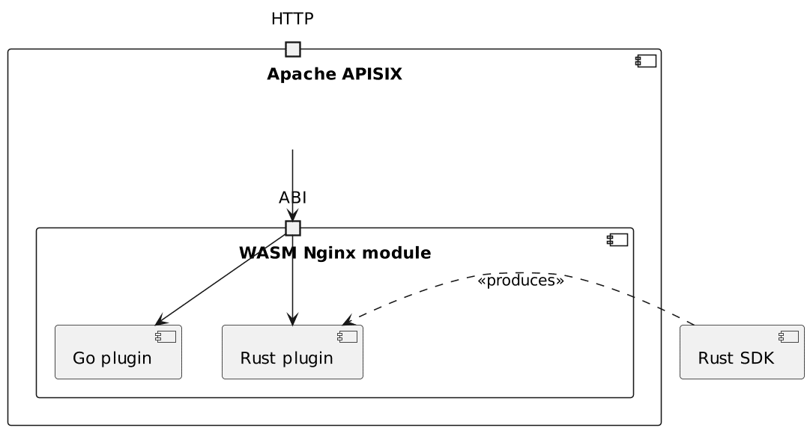
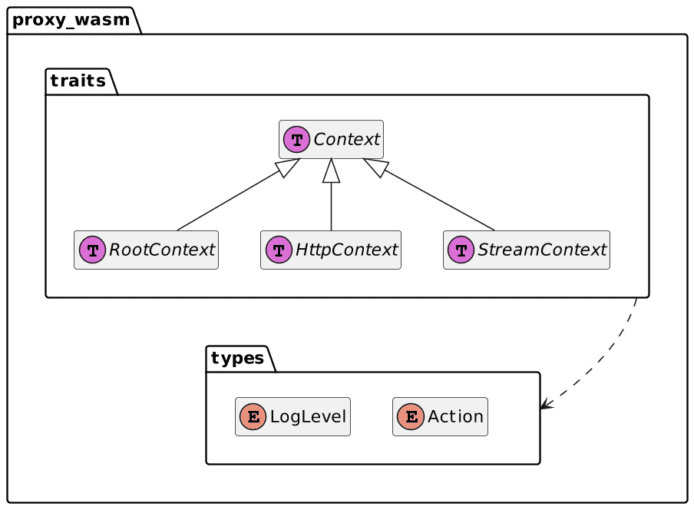

Apache APISIX is built upon the shoulders of two giants:

* [NGINX](https://www.nginx.com/), a widespread Open Source reverse-proxy
* [OpenResty](https://openresty.org/en/), a platform that allows scripting NGINX with the [Lua](https://www.lua.org/) programming language via [LuaJIT](https://luajit.org/)

This approach allows APISIX to provide out-of-the-box Lua plugins that should fit most business requirements. But it always comes a time when generic plugins don't fit your requirements. In this case, you can write your own Lua plugin.

However, if Lua is not part of your tech stack, [diving into a new ecosystem is a considerable investment](https://blog.frankel.ch/on-learning-new-programming-language/). Therefore, Apache APISIX offers developers to write plugins in several other languages. In this post, I'd like to highlight how to write such a plugin with Rust.

A bit of context {#h2-0-a-bit-of-context}
-----------------------------------------

Before I dive into the "how", let me first describe a bit of context surrounding the Rust integration in Apache APISIX. I believe it's a good story because it highlights the power of Open Source.

It starts with the Envoy proxy.
> Envoy is an open source edge and service proxy, designed for cloud-native applications
>
> -- <https://www.envoyproxy.io/>

Around 2019, Envoy's developers realized a simple truth. Since Envoy is a statically compiled binary, integrators who need to extend it must compile it from the modified source instead of using the official binary version. Issues range from supply chains more vulnerable to attacks to a longer drift when a new version is released. For end-users, whose core business is much further, it means having to hire specialized skills for this reason only.

The team considered to solve the issue with C++ extensions, but discarded this approach as neither s nor s were stable. Instead, they chose to provide a stable WebAssembly-based ABI. If you're interested in a more detailed background, you can read the whole piece [on GitHub](https://github.com/proxy-wasm/spec/blob/master/docs/WebAssembly-in-Envoy.md).

The specification is available on [GitHub](https://github.com/proxy-wasm/spec).

* Developers can create SDK for their tech stack
* Proxy and API Gateway providers can integrate `proxy-wasm` in their product

Apache APISIX and proxy-wasm {#h2-1-apache-apisix-and-proxy-wasm}
-----------------------------------------------------------------

The Apache APISIX project decided to integrate `proxy-wasm` into the product to benefit from the standardization effort. It also allows end-users to start with Envoy, or any other `proxy-wasm`-compatible reverse proxy, to migrate to Apache APISIX when necessary.

APISIX doesn't implement `proxy-wasm` but integrates [wasm-nginx-module](https://github.com/api7/wasm-nginx-module). It's an Apache v2-licensed project provided by [api7.ai](https://api7.ai/), one of the main contributors to Apache APISIX. As its name implies, integration is done at the NGINX level.  

Apache APISIX and WebAssemby architecture overview{#caption-attachment-60106}

Let's code! {#h2-2-let-s-code}
------------------------------

Now that we have explained how everything fits together, it's time to code.

### Preparing Rust for WebAssembly {#h3-3-preparing-rust-for-webassembly}

Before developing the first line of code, we need to give Rust compilation capabilities.

<pre class="EnlighterJSRAW" data-enlighter-language="shell">rustup target add wasm32-wasi</pre>

It allows the Rust compiler to output WASM code:

<pre class="EnlighterJSRAW" data-enlighter-language="shell">cargo build --target wasm32-wasi</pre>

The WASM code is found in:

* `target/wasm32-wasi/debug/sample.wasm`
* `target/wasm32-wasi/release/sample.wasm` (when compiled with the `--release` flag)

### Setting up the project {#h3-4-setting-up-the-project}

The setup of the project is pretty straightforward:

<pre class="EnlighterJSRAW" data-enlighter-language="shell">cargo new sample --lib           #1</pre>

1. Create a `lib` project with the expected structure

### The code itself {#h3-5-the-code-itself}

Let me first say that the available documentation is pretty sparse. For example, `proxy-wasm`'s is limited to the [methods' signature](https://github.com/proxy-wasm/spec/tree/master/abi-versions/vNEXT) (think JavaDocs). Rust SDK is sample-based. However, one can get some information from the [C++ SDK](https://github.com/proxy-wasm/proxy-wasm-cpp-sdk/blob/master/docs/wasm_filter.md).
> WASM module is running in a stack-based virtual machine and its memory is isolated from the host environment. All interactions between host and WASM module are through functions and callbacks wrapped by context object.
>
> At bootstrap time, a root context is created. The root context has the same lifetime as the VM/runtime instance and acts as a target for any interactions which happen at initial setup. It is also used for interactions that outlive a request.
>
> At request time, a context with incremental is created for each stream. Stream context has the same lifetime as the stream itself and acts as a target for interactions that are local to that stream.

The Rust code maps to the same abstractions.  

Rust's 'structure diagram'{#caption-attachment-60107}

Here's the code for a **very** simple plugin that logs to prove that it's invoked:

<pre class="EnlighterJSRAW" data-enlighter-language="rust">use log::warn;
use proxy_wasm::traits::{Context, HttpContext};
use proxy_wasm::types::{Action, LogLevel};

proxy_wasm::main! {{
    proxy_wasm::set_log_level(LogLevel::Trace);                                          //1
    proxy_wasm::set_http_context(|_, _| -&gt; Box&lt;dyn HttpContext&gt; { Box::new(HttpCall) }); //2
}}

struct HttpCall;

impl Context for HttpCall {}                                                             //3

impl HttpContext for HttpCall {                                                          //4
    fn on_http_request_headers(&amp;mut self, _: usize, _: bool) -&gt; Action {                 //5
        warn!("on_http_request_headers");                                                //6
        Action::Continue
    }
}</pre>

1. Set the log level to Apache APISIX's default
2. Set the HTTP context to create for *each* request
3. Need to implement `Context`. By default, **all** functions are implemented in `Context`, so implementation is not mandatory
4. Likewise for `HttpContext`
5. Implement the function. Functions in `HttpContext` refer to a phase in the ABI lifecycle when headers are decoded. It should return an `Action`, whose value is either `Continue` or `Pause`.
6. Log - finally

After generating the WebAssembly code (see above), we have to configure Apache APISIX.

Configuring Apache APISIX for WASM {#h2-6-configuring-apache-apisix-for-wasm}
-----------------------------------------------------------------------------

Apache APISIX's [documentation](https://apisix.apache.org/docs/apisix/wasm/) is geared toward Go. Still, since both Go and Rust generate WebAssembly, we can reuse most of it.

We need to declare each WASM plugin:

<pre class="EnlighterJSRAW" data-enlighter-language="yaml">wasm:
  plugins:
    - name: sample
      priority: 7999
      file: /opt/apisix/wasm/sample.wasm</pre>

Then, we can use the plugin like any other:

<pre class="EnlighterJSRAW" data-enlighter-language="yaml">routes:
  - uri: /*
    upstream:
      type: roundrobin
      nodes:
        "httpbin.org:80": 1
    plugins:
      sample:                                #1
       conf: "dummy"                         #2
#END</pre>

1. Plugin name
2. At the moment, the `conf` attribute is mandatory and must be non-empty on the Apache APISIX validation side, even though we don't configure anything on the Rust side

At this point, we can ping the endpoint:

<pre class="EnlighterJSRAW" data-enlighter-language="shell">curl localhost:9080</pre>

The result is as expected:

<pre class="EnlighterJSRAW" data-enlighter-language="generic">rust-wasm-plugin-apisix-1  | 2022/09/21 13:43:14 [warn] 44#44: *286 on_http_request_headers, client: 192.168.128.1, server: _, request: "GET / HTTP/1.1", host: "localhost:9080"</pre>

Conclusion {#h2-7-conclusion}
-----------------------------

In this post, I described the history behind the `proxy-wasm` and how Apache APISIX integrates it via the WASM Nginx module. I explained how to set up your Rust local environment to generate WebAssembly. Finally, I created a dummy plugin and deployed it to Apache APISIX.

In the next post, we'll beef up the plugin to provide valuable capabilities.

The source code is available on [GitHub](https://github.com/ajavageek/apisix-rust-plugin).

**To go further:**

* [proxy-wasm spec](https://github.com/proxy-wasm/spec)
* [WASM Nginx module](https://github.com/api7/wasm-nginx-module)
* [WebAssembly for Proxies (Rust SDK)](https://github.com/proxy-wasm/proxy-wasm-rust-sdk)
* [Apache APISIX WASM](https://apisix.apache.org/docs/apisix/wasm/)

*Originally published at [A Java Geek](https://blog.frankel.ch/rust-apisix/1/) on September 25^th^, 2022*

*[ABI]: Application Binary Interface
*[API]: Application Programmer Interface
*[WASM]: WebAssembly
