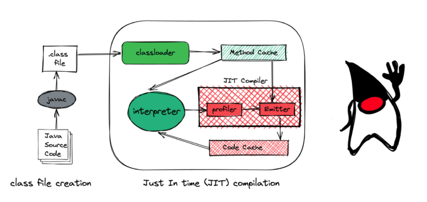

Knowing how to code is fantastic, but it is even more enjoyable if we understand how a specific programming ecosystem works.

I recall the C course I took during my first semester at university. I wanted to learn how C compilers take a program, verify it, and then compile it. As a side project, I wrote a small program that checks another C program to see if there are any syntax errors. I named it **Cyntax**. It didn't accomplish much, but I felt euphoria while doing it.

Since then, I've been curious about the internals of technologies. That way, I'll be able to appreciate it more. On that note, I'd like to talk about how the JVM works internally today.

How the JVM Works
-----------------

Java code is compiled into bytecode, which is then executed by Java's virtual machine. This produces an intermediate language (IL), which is neither human-readable nor machine-executable. As a result, only the virtual machine comprehends it.

The class loader is where the JVM begins and where all of the verification processes begin. Any Java class must pass through the classloader. The JVM just won't run any arbitrary bytecode. Thanks to this, the JVM will be able to avoid any runtime checking in the future. After that, it uses all of the code that is contained within the method cache area.

 

Then, the method cache feeds bytecodes into the interpreter. The Java interpreter converts or translates the bytecode into the machine-understandable format, i.e., machine code; after that, the machine code interacts with the operating system. The interpreter basically executes the byte code, and it keeps doing it. Our Java program can run indefinitely here. Java code does not necessarily require JIT compilation. The interpreter itself is quite capable of running our Java code.

The Just in Time (JIT) Compiler is another component of the JVM. We'll talk about it in a moment.

So, based on our discussion, one might be tempted to conclude that the JVM sacrifices performance because it compiles during execution. This design appears to cause Java to run slowly, based on our understanding of how the interpreter typically works. Assume, on the other hand, that a language executes similar machine instructions but does not require compilation before doing so. In that case, the language is likely to be faster.

This conclusion, while intuitive, is incorrect, but that is where the JIT compiler comes in.

Now the question gets to be, what does the JIT compiler do?

What Does the JIT Compiler Do?
------------------------------

Its first job is to sit around and just watch the code. It profiles code. It watches how the code is being executed. If a particular method always returns the same value, does it require calling the method at all?

What sort of type are we using? If an interface has multiple implementations, which one are we using all the time? How frequently is that particular portion of the code called?

Basically, it observes the runtime characteristics of our application code.

Because JIT collects all statistics, it knows which methods are frequently called and keeps track of the number of times each method is called. When this count reaches a certain threshold, the method's machine code is saved in the Code Cache so that the JIT does not have to compile it again when it is invoked again.

This significantly reduces the cost of translating byte code into machine code. In order to improve performance even further, the JIT optimizes the most frequently used code. According to research, 80% of execution time is spent executing 20% of the code ("hot code"), so optimizing these code sections can result in significant performance gains. The JIT optimizes "hot code," which is code that is executed in a highly optimized manner directly on the operating system.

This is also referred to as [Profile Guided Optimization](https://en.wikipedia.org/wiki/Profile-guided_optimization). We can only learn about this type of optimization by observing an application's runtime characteristics. As developers, we can make educated guesses about how the runtime will behave. Still, we cannot be certain, and neither can the Java compiler when we compile using the Java compiler.

If you enjoyed this brief and introductory article, you might also be interested in how bytecode works, see the related articles listed below.
