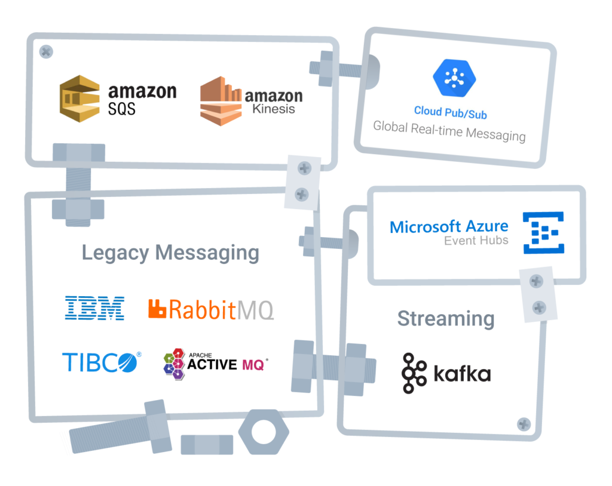
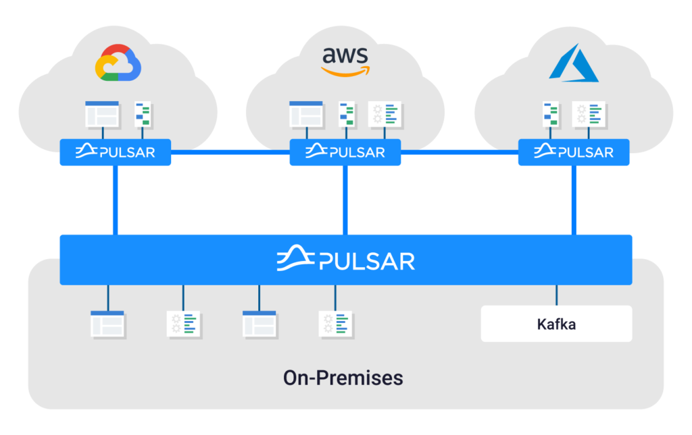

CTOs and enterprise architects have long recognized the importance of event-driven architectures (EDA). While once considered purely a technology concern, the foresight of organizations that have invested in EDA has become readily apparent as the world has shifted around us. In the past decade, we've witnessed changes in nearly every aspect of our technological worlds, and the vast majority of those have been affected in some way by a move toward event-driven, real-time processing.

The way we work has changed. Emails to coordinate and schedule meeting days in the future have been replaced by ad-hoc conversations on tools like Slack, which lead to impromptu video conferences where decisions can be made quickly. The way we eat has changed. No more ordering pizza on a website and sitting around waiting for the delivery driver to arrive. Instead, we see menus for dozens of restaurants, order from our phones and track the driver in real time as the food makes its way to our homes. And behind the scenes, the way businesses are run also has changed. The availability of real-time inventory, sales and demand data is driving real-time optimization of supply chains across the world.

At the same time, advancements in and ever-growing adoption of public cloud technologies has enabled us to apply the same real-time signals to efficiently operate the applications and systems that support all these changes. Containers and VM instances scale in concert with demand, then settle back down as the load abates.

Even for enterprises that have done a good job of building out their EDAs, the onslaught of new demands coupled with the complexity that comes from highly distributed computing in the cloud brings new challenges that require rethinking this critical capability of modern IT.

Frankenstein's Architecture {#h2-0-frankenstein-s-architecture}
---------------------------------------------------------------

One of the most common challenges enterprise architects are struggling with in the EDA space is the proliferation of messaging and streaming technologies. Aging technologies such as JMS and various MQ implementations are deeply entrenched throughout the application landscape. When developers modernize on-prem apps and move them into the cloud, they often swap out legacy messaging systems for cloud native ones like GCP Pub/Sub or AWS Kinesis. Developers and architects focused on greenfield development of new digital experiences often find that platforms like JMS and MQ can no longer keep up with the scale and performance requirements needed to create an engaging customer experience. This, coupled with the desire to retain streams of events for use by data scientists, often leads to the adoption of other specialized platforms such as Kafka. While each of these individual decisions makes sense in a vacuum, when combined they result in a fragmented architecture with limited interoperability and unreasonably high costs that impose both Capex and Opex (capital expenditures and operational expenditures) drawbacks.

The result of all this is an architecture that starts to resemble an abomination of bolted-on technology that hinders, rather than aids, the core tenets of EDA.

Creating a Unified EDA {#h2-1-creating-a-unified-eda}
-----------------------------------------------------

In response to these challenges, a new pattern is emerging within enterprises. This pattern has various names including "unified event fabric" or "enterprise messaging backbone" or even "digital nervous system." All these labels generally aim to provide a common set of characteristics that address the needs of a modern EDA. For simplicity, we'll just call this pattern "unified EDA."

For successful adoption, unified EDA initiatives must first recognize the reality that most enterprises today are not entirely cloud native. The underlying foundation must support systems running on-prem as well as those running in the cloud. From a platform perspective, there should be no distinction between the location of each system. Publishing messages and subscribing to streams of messages should be simple from the perspective of the applications leveraging the unified EDA platform. These systems should not be burdened with understanding details of where upstream or downstream systems are located or the individual messaging platforms that each is using. All of this complexity must be abstracted by the unified EDA platform. From a practical standpoint, this all means that a unified EDA must span multiple data centers and cloud regions and work across disparate networks, all while exposing a simple facade to facilitate ease of use to consumers of the platform.

Unified EDA must also cope with the reality that few enterprises will have the appetite for a "big bang"-style migration. This means that building compatibility and addressing interoperability concerns is another major challenge. While connectors that enable one messaging system to talk to another is a good start, they don't address the underlying complexity and cost of maintaining a sprawling ecosystem of messaging and streaming technologies.

A better approach to unified EDA is to focus on compatibility and strive for drop-in replacements that can drive consolidation, architectural simplification and cost savings as the number of messaging systems in use converges toward one.

Apache Pulsar, the Future of Unified EDA {#h2-2-apache-pulsar-the-future-of-unified-eda}
----------------------------------------------------------------------------------------

Until now, enterprises have struggled to build unified EDA solutions. Platforms such as Kafka were built for streaming and pub/sub, leaving traditional queuing use cases out of scope. Combined with the [foundational architectural challenges of Kafka](https://www.datastax.com/blog/2021/01/four-reasons-why-apache-pulsar-essential-modern-data-stack), enterprises have quickly concluded that Kafka is ill-suited as the foundation for their unified EDA. Likewise, traditional messaging platforms fall short when faced with the streaming use cases that Kafka was built to support. This has often left technology practitioners in search of a better alternative to implementing unified EDA for their organizations and often led them to discover Apache Pulsar.

Pulsar was created precisely to solve all of the challenges that enterprises face when implementing a unified EDA strategy. It was built for multicloud and has built-in geo-replication. It is equally at home running in a traditional enterprise data center as it is on public cloud infrastructure and was built to span across the two in a hybrid runtime configuration. This creates a ubiquitous messaging fabric that applications can use to exchange messages and publish events anywhere within the enterprise.

Pulsar's architecture separates compute and storage concerns, allowing for elastic scalability and support for unbounded message retention on low-cost storage such as AWS S3, HDFS or Google Cloud Storage. This not only reduces the costs of running Pulsar, but creates a natural harmony between EDA and data science, allowing streams of events to be accessible to data scientists to build ML models using their standard tools of the trade.

Pulsar also provides comprehensive functional capabilities that make it suitable for queuing, pub/sub, streaming and stream processing use cases.

All these factors have contributed to an explosion of interest in Apache Pulsar.

Getting Started with Pulsar {#h2-3-getting-started-with-pulsar}
---------------------------------------------------------------

We all know how difficult it can be to learn a new technology. The number of articles, blog posts, books, videos and other content can be overwhelming when you're just starting out. That's why DataStax has created a set of completely free webinars and workshops to make this process quick and easy. Start by signing up for one of our [webinars](https://www.datastax.com/resources/webinar/successfully-migrate-kafka-application-pulsar) to help jumpstart your understanding of Pulsar, or by trying it out on the [Astra Streaming](https://astra.dev/3EmCND8) cloud service.

Conclusion: Getting Event-Driven Right {#h2-4-conclusion-getting-event-driven-right}
------------------------------------------------------------------------------------

Event-driven architectures are more important than ever, but getting them right has never been more challenging. The complexities of today's technology landscape coupled with the demands of modern digital business has strained legacy systems and led to unsustainable, suboptimal architectures. The Apache Pulsar community and DataStax are working to provide enterprises with a purpose-built platform to solve this exact problem.

If your organization doesn't have Apache Pulsar on its radar yet, it's time to start your investigation. Once you do, you'll likely find yourself arriving at the same conclusion as so many others before you: If you need unified EDA, you need Apache Pulsar.
