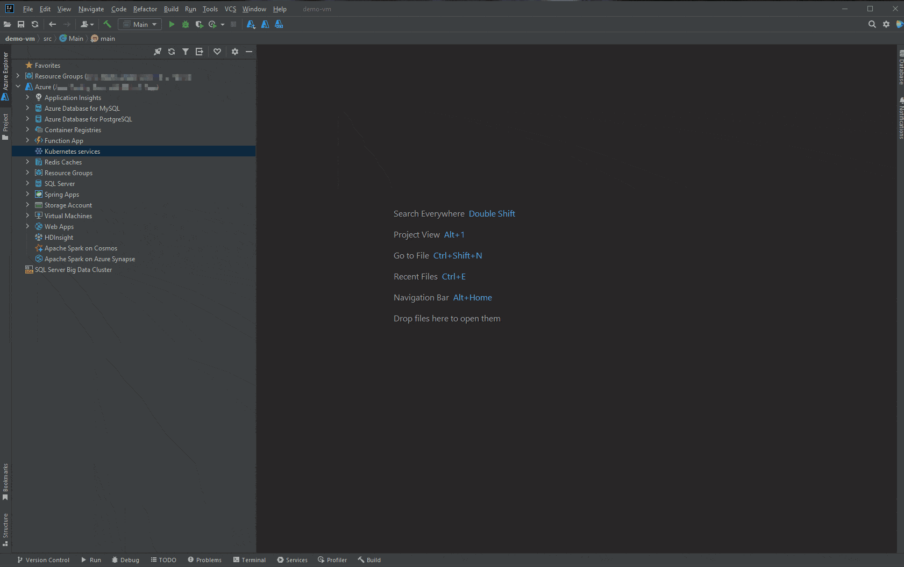
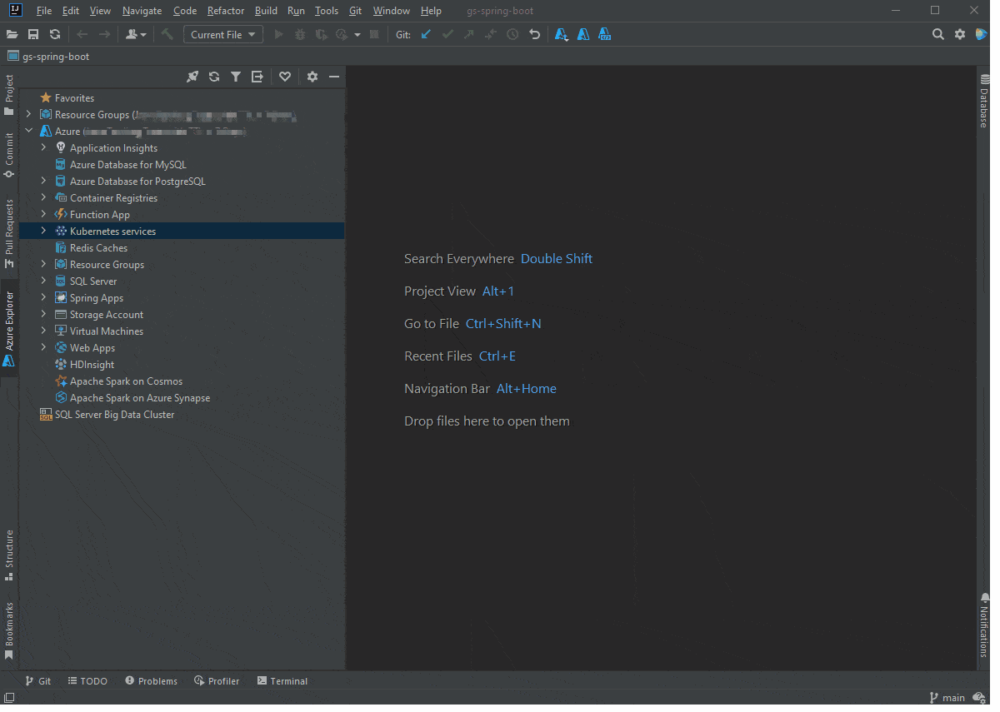
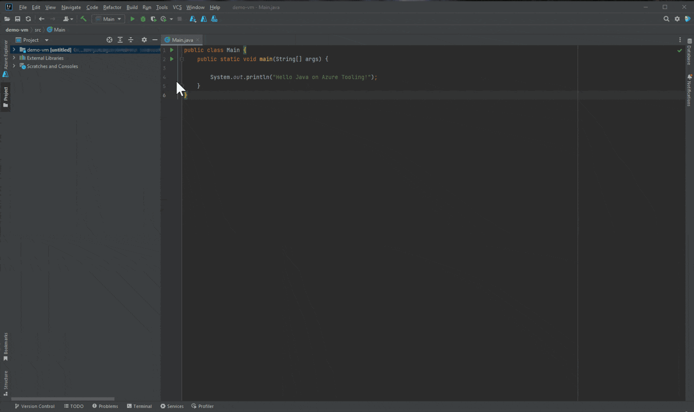
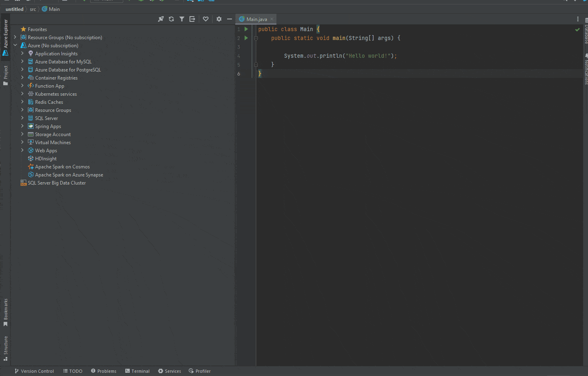
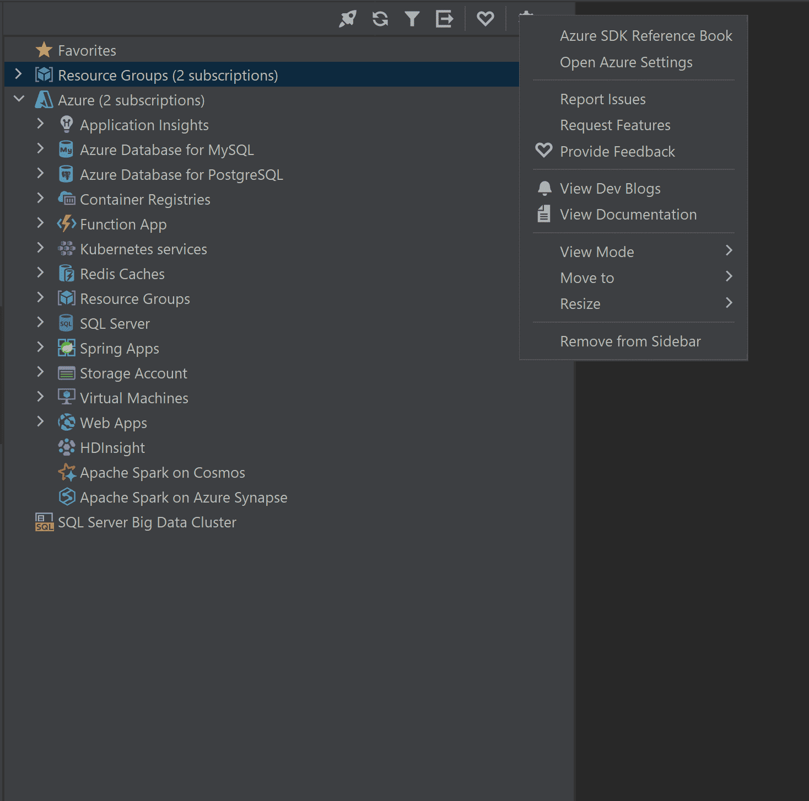
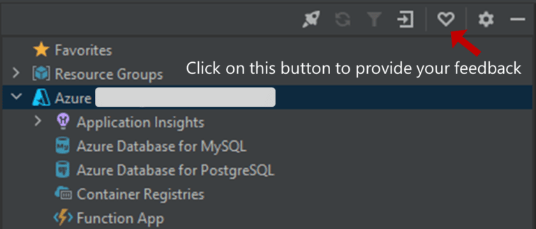

Hi everyone, welcome back to August update of Java on Azure Tooling.

In this update, we will introduce the AKS support and Virtual Machine support.

In addition, we make some improvements for users to search for subscriptions and find our tutorials easily.

We hope these features could improve your user experience. So let us get started.

Azure Toolkit for IntelliJ Improvements {#h2-0-azure-toolkit-for-intellij-improvements}
---------------------------------------------------------------------------------------

### AKS Management Support {#h3-1-aks-management-support}

Azure Kubernetes Service (AKS) simplifies deploying a managed Kubernetes cluster in Azure by offloading the operational overhead to Azure. You can find more details about [Azure Kubernetes Service (AKS)](https://docs.microsoft.com/en-us/azure/aks/ "Azure Kubernetes Service (AKS)").

We have been consistently hearing from our customers that they want better AKS integration to view pod logs, manage cluster and workloads.

In our latest release, Azure Kubernetes Service (AKS) cluster is available on Azure Toolkit for IntelliJ, so that developers can manage Azure Kubernetes Service directly in Azure Explorer.

To create it, you just need to locate the Kubernetes Services and right click it and choose "create" option. It will take several minutes to create the cluster.

After you create a Kubernetes cluster, if you want to connect or interact with your Kubernetes cluster, you could install kubectl on your local machine and use kubeconfig file to configure access to a cluster.

And our plugin also provides the support to download kubeconfig (Admin/User) to the local machine, and set as current cluster(Admin/User).

### Virtual Machine Support {#h3-2-virtual-machine-support}

Azure Virtual Machines (VM) is one of several types of on-demand, scalable computing resources that Azure offers. You can see more details with [the documentation](https://docs.microsoft.com/en-us/azure/virtual-machines/ "the documentation").

We know that running or debugging applications in another environment such as Azure Virtual Machine will be essential for Java developers, if they want to build applications in the cloud or create environments for development and testing.

It will be complex for developers to launch and connect with an Azure Virtual Machine in IntelliJ IDEA with lots of steps. To improve this experience, we have provided the entry of 'Azure Virtual Machine' under 'Run On' targets list of run/debug configurations of IntelliJ IDEA. To create and configure it,

1. From the main menu, select Run \| Edit Configurations. Alternatively, press Alt+Shift+F10, then 0.
2. Select the "Azure Virtual Machine" from the **Run on** menu or click **Manage targets**... to add a new target with "Azure Virtual Machine"

With this new Virtual Machine support, you can directly run or debug applications on Azure Virtual Machine in IntelliJ IDEA. Here is a short demonstration for it.

### Search Subscriptions Easily {#h3-3-search-subscriptions-easily}

When you login in with your Azure account, you need to specify one or more subscriptions to use.

It is common that when you or your organization have multiple subscriptions, it will be time-consuming if you cannot find one or several subscriptions quickly.

To improve this experience, we have added the support that you can use the search box to find it with the subscription name. You can select the subscriptions and change your subscriptions easily with this new feature.

### Explore the Settings Menu {#h3-4-explore-the-settings-menu}

To help developers find official documents and blogs more easily, you can right click the settings button in Azure Explorer and explore more tutorials here.

With this feature, you can not only open the Azure SDK Reference Book to find more support, but also easily contact with us by reporting issues or requesting features, as well as providing feedback.

Besides, the Dev Blogs and Documentation also bring more useful resources.

### Feedback and Suggestions {#h3-5-feedback-and-suggestions}

Please don't hesitate to try our product! Your feedback and suggestions are very important to us and will help shape our product in future.

* Leave your comment on this blog post
* [Create a feature request or submit a bug](https://github.com/microsoft/azure-tools-for-java/issues/new " Create a feature request or submit a bug") on our official GitHub Issues page
* [Fill in our survey](https://microsoft.qualtrics.com/jfe/form/SV_b17fG5QQlMhs2up "Fill in our survey")

### Resources {#h3-6-resources}

Here is a list of links that are helpful to learn Java on Azure Tooling,

* [Azure Toolkit for IntelliJ documentation](https://docs.microsoft.com/en-us/azure/developer/java/toolkit-for-intellij/ "Azure Toolkit for IntelliJ documentation")
* [Azure Toolkit for Eclipse documentation](https://docs.microsoft.com/en-us/azure/developer/java/toolkit-for-eclipse/installation "Azure Toolkit for Eclipse documentation")
* [Maven Plugin for Azure Web Apps/Functions/Spring Cloud](https://github.com/microsoft/azure-maven-plugins/wiki/Azure-Spring-apps "Maven Plugin for Azure Web Apps/Functions/Spring Cloud")
* [Gradle Plugin for Azure Web Apps/Functions](https://github.com/microsoft/azure-gradle-plugins/wiki "Gradle Plugin for Azure Web Apps/Functions")
* [VS Code extension for Azure Spring Cloud](https://code.visualstudio.com/docs/java/java-on-azure "VS Code extension for Azure Spring Cloud")
