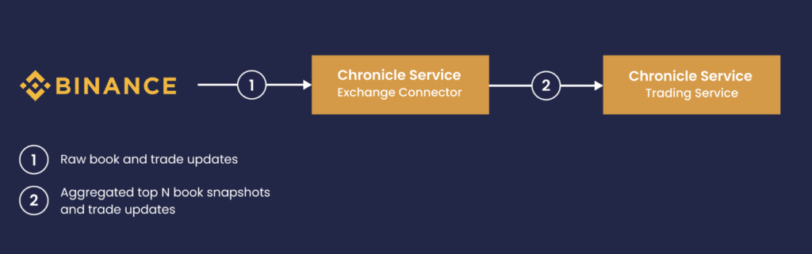
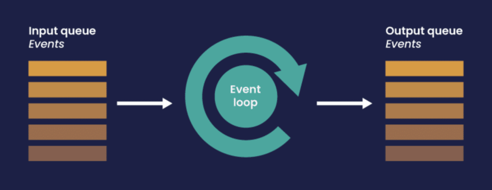
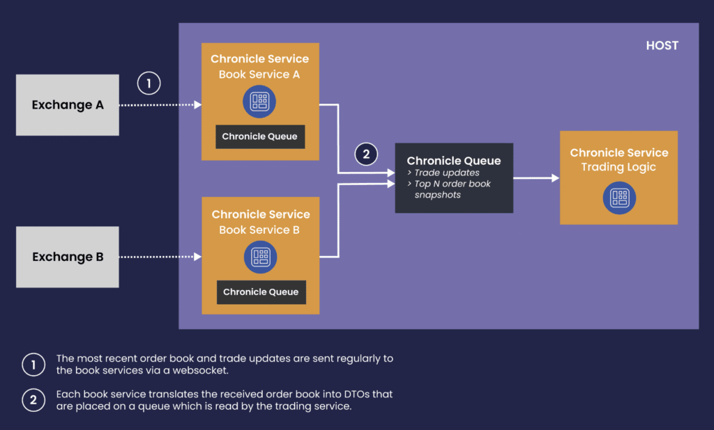

Cryptocurrency trading is an emerging market with its own rules.

However, when it comes to the need for low-latency [arbitrage](https://en.wikipedia.org/wiki/Arbitrage "arbitrage"), that is, being able to react rapidly to changing market prices and placing orders ahead of the competition, there are lessons we can learn from optimizing classic trading systems.

Chronicle Software has a successful track record of designing low-latency trading products. This background enables it to provide optimum performance solutions for Crypto trading systems.

In this article, we'll take a close look at the data flow between a public exchange endpoint and customers trading logic, and demonstrate how this can be optimized with the Chronicle stack.

The proposed scheme may serve as a foundation for crypto-trading projects.

### How Crypto Exchanges Provide Market Data

In this article we'll take a look at the techniques that the Binance exchange uses to provide market data to its customers, but the techniques and patterns used by this exchange are similar to many other exchanges as well.

A partial order book (bid/ask prices and quantities, sorted by the closeness of the price to the market price) is the first thing to maintain locally for the needs of the low-latency trading logic. In practice, only several top positions affect the trading decisions.

The remaining tail is unlikely to participate in the trading and is also too big to spend resources on analyzing.

Exchange updates are provided by a [websocket connection](https://binance-docs.github.io/apidocs/spot/en/#diff-depth-stream "websocket connection"), typically over multiple channels with differing latency characteristics. Binance for example provides the following [channels](https://binance-docs.github.io/apidocs/spot/en/#partial-book-depth-streams "channels"):

* **Low-level per-trade updates:** Lowest latency channel. Users process the individual updates to compose and maintain a local book.
* **Partial order book snapshots containing top N prices:** Self-contained snapshots, but slower due to aggregation overhead at the exchange.
* **[Live Trades](https://binance-docs.github.io/apidocs/spot/en/#trade-streams "Live Trades"):** self-contained messages giving the most accurate information on the market price.  
  Binance sends trade and order book updates as distinct JSON messages. Here is an example message for a book update:

```json
{
  "e": "depthUpdate", // Event type
  "E": 123456789,     // Event time
  "s": "BNBBTC",      // Symbol
  "U": 157,           // First update ID in event
  "u": 160,           // Final update ID in event
  "b": [              // Bids to be updated
    [
      "0.0024",       // Price level to be updated
      "10"            // Quantity
    ]
  ],
  "a": [              // Asks to be updated
    [
      "0.0026",       // Price level to be updated
      "100"           // Quantity
    ]
  ]
}
```


The data flow between the Binance endpoint and the trading logic follows below:  


### Best Practices: Implementing Efficient Market Data Connector

Let's walk through some implementation details which are important for achieving maximum performance, usability and stability.

#### Allocation-free parsing

A classic way of parsing a JSON is delegating it to a library, which returns a structured representation like JSONObject.

This representation is usually an object tree that will be disposed of after the parsing is complete.

Continuous creation of temporary objects causes extra pressure on the JVM garbage collector, which in turn may result in unpredictable latency spikes.

Using the [Chronicle-Wire](https://github.com/OpenHFT/Chronicle-Wire "Chronicle-Wire") open source library for the parsing is an efficient alternative.

It allows retrieval of all the necessary information from the Binance JSON message without creating any additional Java objects.

Primitive data can be parsed without creating a boxed instance and a text can be read into a reused StringBuilder instance.

Arrays can be handled with a sequence call: instead of accumulating elements into an array, it's possible to pass a functional object that will be called for every element.

Below follows a code sample that parses the aforementioned JSON:

```java
public class BookUpdateParser implements ReadMarshallable {
    private final StringBuilder eventType = new StringBuilder();
    private final StringBuilder symbol = new StringBuilder();
    private final StringBuilder doubleText = new StringBuilder();
    private final BookUpdateListener out; // Market data consumer
    private final Wire json = WireType.JSON.apply(Bytes.allocateElasticOnHeap());
    public BookUpdateParser(BookUpdateListener out) {
        this.out = out;
    }
    public void parse(CharSequence message) {
        json.bytes().clear().appendUtf8(message);
        json.getValueIn().marshallable(this);
    }
    @Override
    public void readMarshallable(@NotNull WireIn wire) throws IORuntimeException {
        wire.read("e").textTo(eventType);
        // Reads a text without string allocation
        final long eventTime = wire.read("E").readLong();
        wire.read("s").textTo(symbol);
        final long firstUpdateId = wire.read("U").readLong();
        final long finalUpdateId = wire.read("u").readLong();
        // Pass the parsed data to the consumer
        wire.read("b").sequence(out, this::readPriceLadder);
        // Reads an array without allocation
        wire.read("a").sequence(out, this::readPriceLadder);
    }
    private void readPriceLadder(BookUpdateListener out, ValueIn valueIn) {
        while (valueIn.hasNextSequenceItem())
            valueIn.sequence(out, this::readBidOrAsk);
    }
    private void readBidOrAsk(BookUpdateListener out, ValueIn valueIn) {
        double price = readDoubleInQuotes(valueIn);
        double qty = readDoubleInQuotes(valueIn);
        // Pass price and qty to the consumer
    }
    // Binance provides prices / qtys in escape quotes, so we have to read a text first
    private double readDoubleInQuotes(ValueIn valueIn) {
        doubleText.setLength(0);
        valueIn.text(doubleText);
        // StringUtils from Chronicle-Services allows to avoid allocating a String
        return StringUtils.parseDouble(doubleText);
    }
}
```


#### Determinism and Reproducibility

After the market data is processed and business decisions are applied, it may be desirable to re-run the algorithms on the same input.

The purpose can be either "what-if" [hypothesis testing](https://en.wikipedia.org/wiki/Statistical_hypothesis_testing "hypothesis testing") in order to continuously improve the logic, or post-mortem analysis after an unsuccessful trading decision.

The crucial point is that the algorithms should produce exactly the same output on the same market data.



This works out of the box with the [Chronicle Services](https://chronicle.software/services/ "Chronicle Services") framework. The model for Chronicle microservice design is the Lambda Architecture: if the trading logic is implemented as a Chronicle microservice, it is effectively stateless and the outcome depends only on an immutable ever-growing queue of events.

If the connector saves aggregated market data to a Chronicle-Queue, the trading part can just replay those events from any point in time.

#### Zero-cost Events Serialization

If the market data parsing / aggregation is separated from the trading logic by placing them in distinct microservices, it's crucial to not lose any performance on passing events between them. Using [trivially copyable events](https://chronicle.software/trading-system-innovation-and-trivially-copyable-objects/ "trivially copyable events") as DTOs makes serialization effectively zero-cost.

#### Low Latency Oriented and Flexible Threading Model

The Chronicle-Services framework allows running the market data connectors within a single [event](https://github.com/OpenHFT/Chronicle-Threads "event") loop, which is designed to minimize latency with the help of busy-spinning and affinity locks, preventing a thread from wandering between CPUs and losing time on context switching.

We recommend using the [HttpClient library from Java 11](https://openjdk.org/groups/net/httpclient/intro.html "HttpClient library from Java 11") for handling websocket connections, which uses non-blocking I/O and TCP_NODELAY by default. More than that, it's possible to pass a custom ExecutorService for handling websocket connections.

This works well with the event loop model, as only one thread is needed for all non-blocking operations across all market data feed handlers. It allows to make the aggregation code single-threaded, which frees it from synchronization primitives like locks, polls and CAS operations. Reducing locks and CAS operations will improve overall system performance.

How to arrange your services and cores

* Several microservices can be grouped together to share a single event loop, which gives you full control over CPU consumption. With this approach, you are able to run all exchange adaptors in a single thread.
* Alternatively, you may elect to run just some of your most critical services on their own core giving your microservices a greater degree of separation.

### Resulting Architecture of Crypto Market Data Connectivity Layer

The diagram below just highlights the idea of separating the connector service from the trading service.

You can use this approach to start your project and attach more Chronicle microservices to the data flow as required.



### Demo Project

The demo project connects to Binance and performs simple analytics on the market state.

It's implemented with all the best practices mentioned above.

Access to this project is available upon request to [\[email protected\]](/cdn-cgi/l/email-protection)

#### References:

\[1\] products: [Enterprise -- Chronicle Software](https://chronicle.software/ "Enterprise – Chronicle Software")

\[2\] [Leading North American Stock Exchange Adopts Chronicle's FIX Engine](https://chronicle.software/leading-north-american-stock-exchange-adopts-chronicles-fix-engine/ "Leading North American Stock Exchange Adopts Chronicle’s FIX Engine ")
