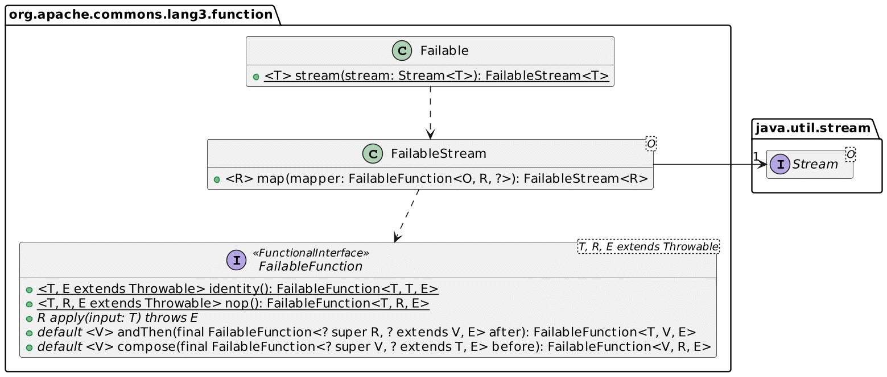
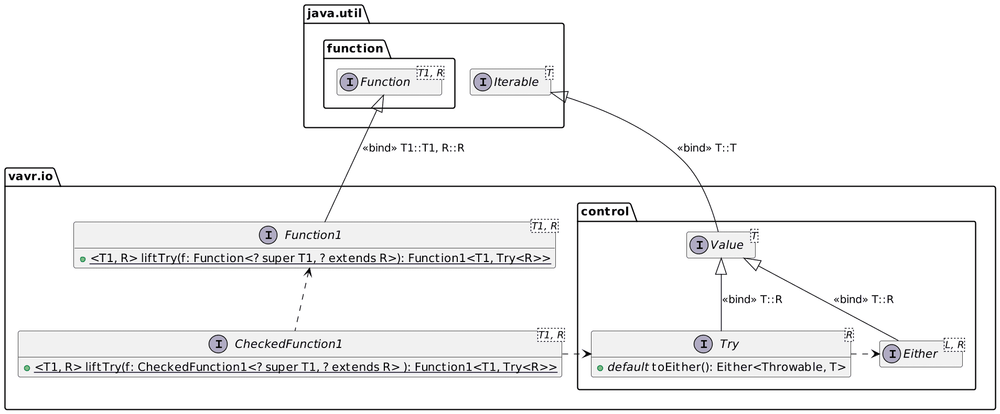

Java introduced the concept of *checked exceptions* . The idea of forcing developers to manage exceptions was revolutionary compared to the [earlier approaches](https://blog.frankel.ch/error-handling/).

Nowadays, Java remains the only widespread language to offer checked exceptions. For example, every exception in Kotlin is unchecked.

Even in Java, new features are at odds with checked exceptions:the signature of Java's built-in functional interfaces doesn't use exceptions.It leads to cumbersome code when one integrates legacy code in lambdas.It's evident in Streams.

In this article, I'd like to dive deeper into how one can manage such problems.

The problem in the code {#h2-0-the-problem-in-the-code}
-------------------------------------------------------

Here's a sample code to illustrate the issue:

```java
Stream.of("java.lang.String", "ch.frankel.blog.Dummy", "java.util.ArrayList")
      .map(it -> new ForNamer().apply(it))                                     // 1
      .forEach(System.out::println);
```


1. Doesn't compile: need to catch the checked `ClassNotFoundException`

We must add a try/catch block to fix the compilation issue.

```java
Stream.of("java.lang.String", "ch.frankel.blog.Dummy", "java.util.ArrayList")
      .map(it -> {
          try {
              return Class.forName(it);
          } catch (ClassNotFoundException e) {
              throw new RuntimeException(e);
          }
      })
      .forEach(System.out::println);
```


Adding the block defeats the purpose of easy-to-read pipelines.

Encapsulate the try/catch block into a class {#h2-1-encapsulate-the-try-catch-block-into-a-class}
-------------------------------------------------------------------------------------------------

To get the readability back, we need to refactor the code to introduce a new class. IntelliJ IDEA even suggests a record:

```java
var forNamer = new ForNamer();                                                // 1
Stream.of("java.lang.String", "ch.frankel.blog.Dummy", "java.util.ArrayList")
      .map(forNamer::apply)                                                   // 2
      .forEach(System.out::println);

record ForNamer() implements Function<String, Class<?>> {

    @Override
    public Class<?> apply(String string) {
        try {
            return Class.forName(string);
        } catch (ClassNotFoundException e) {
            return null;
        }
    }
}
```


1. Create a single record object
2. Reuse it

Trying with Lombok {#h2-2-trying-with-lombok}
---------------------------------------------

Project Lombok is a compile-time annotation processor that generates additional *bytecode*. One uses the proper annotation and gets the result without having to write boilerplate code.
> Project Lombok is a java library that automatically plugs into your editor and build tools, spicing up your java. Never write another getter or equals method again, with one annotation your class has a fully featured builder, Automate your logging variables, and much more.
>
> -- [Project Lombok](https://projectlombok.org/)

Lombok offers the `@SneakyThrow` annotation:it allows one to throw checked exceptions without declaring them in one's method signature.Yet, it doesn't work for an existing API at the moment.

If you're a Lombok user, note that there's an [opened GitHub issue](https://github.com/projectlombok/lombok/issues/3096) with the status parked.

Commons Lang to the rescue {#h2-3-commons-lang-to-the-rescue}
-------------------------------------------------------------

[Apache Commons Lang](https://commons.apache.org/proper/commons-lang/) is an age-old project.It was widespread at the time as it offered utilities that could have been part of the Java API but weren't.It was a much better alternative than reinventing your `DateUtils` and `StringUtils` in every project.While researching this post, I discovered it is still regularly maintained with great APIs.One of them is the `Failable` API.

The API consists of two parts:

1. A wrapper around a `Stream`
2. Pipeline methods whose signature accepts exceptions

Here's a small excerpt:



The code finally becomes what we expected from the beginning:

```java
Stream<String> stream = Stream.of("java.lang.String", "ch.frankel.blog.Dummy", "java.util.ArrayList");
Failable.stream(stream)
        .map(Class::forName)                                                  // 1
        .forEach(System.out::println);
```


Fixing compile-time errors is not enough {#h2-4-fixing-compile-time-errors-is-not-enough}
-----------------------------------------------------------------------------------------

The previous code throws a `ClassNotFoundException` wrapped in an `UndeclaredThrowableException` at *runtime*. We satisfied the compiler, but we have no way to specify the expected behavior:

* Throw at the first exception
* Discard exceptions
* Aggregate both classes and exceptions so we can act upon them at the final stage of the pipeline
* Something else

To achieve this, we can leverage the power of Vavr. Vavr is a library that brings the power of Functional Programming to the Java language:
> Vavr core is a functional library for Java. It helps to reduce the amount of code and to increase the robustness. A first step towards functional programming is to start thinking in immutable values. Vavr provides immutable collections and the necessary functions and control structures to operate on these values. The results are beautiful and just work.
>
> -- [Vavr](https://www.vavr.io/)

Imagine that we want a pipeline that collects both exceptions and classes. Here's an excerpt of the API that describes several building blocks.



It translates into the following code:

```java
Stream.of("java.lang.String", "ch.frankel.blog.Dummy", "java.util.ArrayList")
      .map(CheckedFunction1.liftTry(Class::forName))                          // 1
      .map(Try::toEither)                                                     // 2
      .forEach(e -> {
          if (e.isLeft()) {                                                   // 3
              System.out.println("not found:" + e.getLeft().getMessage());
          } else {
              System.out.println("class:" + e.get().getName());
          }
      });
```


1. Wrap the call into a Vavr `Try`
2. Transform the `Try` into an `Either` to keep the exception. If we had not been interested, we could have used an `Optional` instead
3. Act depending on whether the `Either` contains an exception, *left* , or the expected result, *right*

So far, we have stayed in the world of Java Streams. It works as expected until the `forEach`, which doesn't look "nice".

Vavr does provide its own `Stream` class, which mimics the Java `Stream` API and adds additional features. Let's use it to rewrite the pipeline:

```java
var result = Stream.of("java.lang.String", "ch.frankel.blog.Dummy", "java.util.ArrayList")
        .map(CheckedFunction1.liftTry(Class::forName))
        .map(Try::toEither)
        .partition(Either::isLeft)                                              // 1
        .map1(left -> left.map(Either::getLeft))                                // 2
        .map2(right -> right.map(Either::get));                                 // 3

result._1().forEach(it -> System.out.println("not found: " + it.getMessage())); // 4
result._2().forEach(it -> System.out.println("class: " + it.getName()));        // 4
```


1. Partition the `Stream` of `Either` in a tuple of two `Stream`
2. Flatten the left stream from a `Stream` of `Either` to a `Stream` of `Throwable`
3. Flatten the right stream from a `Stream` of `Either` to a `Stream` of `Class`
4. Do whatever we want

Conclusion {#h2-5-conclusion}
-----------------------------

Java's initial design made plenty of use of checked exceptions. The evolution of programming languages proved that it was not a good idea.

Java streams don't play well with checked exceptions. The code necessary to integrate the latter into the former doesn't look good. To recover the readability we expect of streams, we can rely on Apache Commons Lang.

The compilation represents only a tiny fraction of the issue. We generally want to act upon the exceptions, not stop the pipeline or ignore exceptions.In this case, we can leverage the Vavr library, which offers an even more functional approach.

You can find the source code for this post on [GitHub](https://github.com/ajavageek/lambdas-exceptions).

**To go further:**

* [Exceptions in Java 8 Lambda Expressions](https://www.baeldung.com/java-lambda-exceptions)
* [How to Handle Checked Exceptions With Lambda Expression](https://dzone.com/articles/how-to-handle-checked-exception-in-lambda-expressi)
* ["Stackoverflow: Java 8 Lambda function that throws exception?"](https://stackoverflow.com/questions/18198176/java-8-lambda-function-that-throws-exception)
* [Failable JavaDoc](https://commons.apache.org/proper/commons-lang/apidocs/org/apache/commons/lang3/function/Failable.html)
* [Vavr](https://docs.vavr.io/)
* [Exceptions in Lambda Expression Using Vavr](https://www.baeldung.com/exceptions-using-vavr)
* [Java Streams vs Vavr Streams](https://www.baeldung.com/vavr-java-streams)

*Originally published at [A Java Geek](https://blog.frankel.ch/exceptions-lambdas/) on October 16^th^, 2022*
