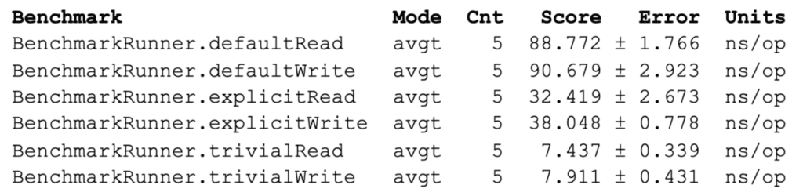
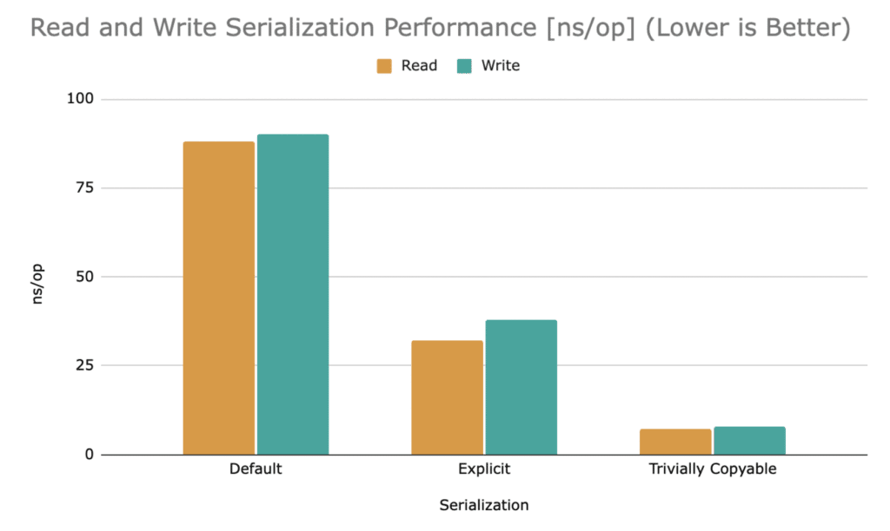

This article elaborates on different ways of serializing Java objects and benchmarks performance for the variants. Read this article and become aware of different ways to improve Java serialization performance.

In a previous article about [open-source Chronicle Queue](https://chronicle.software/queue/ "open-source Chronicle Queue"), there was some benchmarking and method profiling indicating that the speed of serialization had a significant impact on execution performance. After all, this is only to be expected as Chronicle Queue (and other persisted queue libraries) must convert Java objects located on the heap to binary data, which is subsequently stored in files. Even for the most internally efficient libraries, this inevitable serialization procedure will largely dictate performance.

### Data Transfer Object {#h3-0-data-transfer-object}

In this article, we will use a *Data Transfer Object* (hereafter, **DTO** ) named ***MarketData**,* which contains financial information with a relatively large number of fields. The same principles apply to other DTOs in any other business area.

```java
abstract class MarketData extends SelfDescribingMarshallable {

    long securityId;
    long time;

    // bid and ask quantities
    double bidQty0, bidQty1, bidQty2, bidQty3;
    double askQty0, askQty1, askQty2, askQty3;
    // bid and ask prices
    double bidPrice0, bidPrice1, bidPrice2, bidPrice3;
    double askPrice0, askPrice1, askPrice2, askPrice3;

    // Getters and setters not shown for clarity
}
```


### Default Serialization {#h3-1-default-serialization}

Java's *Serializable* marker interface provides a default way to serialize Java objects to/from the binary format, usually via the *ObjectOutputStream* and *ObjectInputStream* classes. The default way (whereby the magic ***writeObject()*** and ***readObject()*** are not explicitly declared) entails reflecting over an object's non-transient fields and reading/writing them one by one, which can be a relatively costly operation.

Chronicle Queue can work with ***Serializable*** objects but also provides a similar but faster and more space-efficient way to serialize data via the *abstract class SelfDescribingMarshallable* . Akin to *Serializable* objects, this relies on reflection but comes with substantially less overhead in terms of payload, CPU cycles, and garbage.

Default serialization often comprises these steps:

* Identifying the non-transient fields using reflection
* Reading/writing the identified non-transient field values using reflection
* Writing/reading the field values to a target format (eg binary format)

The identification of non-transient fields can be cached, eliminating this step to improve performance.

Here is an example of a class using default serialization:

`public final class DefaultMarketData extends MarketData {} `

As can be seen, the class does not add anything over its base class, and so it will use default serialization as transitively provided by SelfDescribingMarshallable.

### Explicit Serialization {#h3-2-explicit-serialization}

Classes implementing *Serializable* can elect to implement two magic private (sic!) methods whereby these methods will be invoked instead of resorting to default serialization.

This provides full control of the serialization process and allows fields to be read using custom code rather than via reflection which will improve performance. A drawback with this method is that if a field is added to the class, then the corresponding logic must be added in the two magic methods above or else the new field will not participate in serialization. Another problem is that private methods are invoked by external classes. This is a fundamental violation of encapsulation.

*SelfDescribingMarshallable* classes work in a similar fashion, but thankfully it does not rely on magic methods and invoking private methods externally. A *SelfDescribingMarshallable* class provides two fundamentally different concepts of serializing: one via an intermediary [Chronicle Wire open-source](https://chronicle.software/wire/ "Chronicle Wire open-source") (which can be binary, text, YAML, JSON, etc.) providing flexibility and one implicitly binary providing high performance. We will take a closer look at the latter in the sections below.

Here is an example of a class using explicit serialization whereby public methods in implementing interfaces are explicitly declared:

```java
public final class ExplicitMarketData extends MarketData {
    @Override
    public void readMarshallable(BytesIn bytes) {
        securityId = bytes.readLong();
        time = bytes.readLong();
        bidQty0 = bytes.readDouble();
        bidQty1 = bytes.readDouble();
        bidQty2 = bytes.readDouble();
        bidQty3 = bytes.readDouble();
        askQty0 = bytes.readDouble();
        askQty1 = bytes.readDouble();
        askQty2 = bytes.readDouble();
        askQty3 = bytes.readDouble();
        bidPrice0 = bytes.readDouble();
        bidPrice1 = bytes.readDouble();
        bidPrice2 = bytes.readDouble();
        bidPrice3 = bytes.readDouble();
        askPrice0 = bytes.readDouble();
        askPrice1 = bytes.readDouble();
        askPrice2 = bytes.readDouble();
        askPrice3 = bytes.readDouble();
    }

    @Override
    public void writeMarshallable(BytesOut bytes) {
        bytes.writeLong(securityId);
        bytes.writeLong(time);
        bytes.writeDouble(bidQty0);
        bytes.writeDouble(bidQty1);
        bytes.writeDouble(bidQty2);
        bytes.writeDouble(bidQty3);
        bytes.writeDouble(askQty0);
        bytes.writeDouble(askQty1);
        bytes.writeDouble(askQty2);
        bytes.writeDouble(askQty3);
        bytes.writeDouble(bidPrice0);
        bytes.writeDouble(bidPrice1);
        bytes.writeDouble(bidPrice2);
        bytes.writeDouble(bidPrice3);
        bytes.writeDouble(askPrice0);
        bytes.writeDouble(askPrice1);
        bytes.writeDouble(askPrice2);
        bytes.writeDouble(askPrice3);
    }
}
```


It can be concluded that this scheme relies on reading or writing each field explicitly and directly, eliminating the need to resort to slower reflection. Care must be taken to ensure fields are referenced in a consistent order, and class fields must also be added to the methods above.

### Trivially Copyable Serialization {#h3-3-trivially-copyable-serialization}

The concept of *Trivially Copyable Java Objects* is derived from and inspired by C++.

As can be seen, the ***MarketData*** class above contains only primitive fields. In other words, there are no reference fields like *String, **List*** or the like. This means that when the JVM lays out the fields in memory, field values can be put adjacent to one another. The way fields are layed out is not specified in the Java standard, which allows for individual JVM implementation optimizations.

Many JVMs will sort primitive class fields in descending field size order and lay them out in succession. This has the advantage that read and write operations can be performed on even primitive type boundaries. Applying this scheme on the ***ExplicitMarketData,*** for example, will result in the long-time field being laid out first and, assuming we have the initial field space 64-bit aligned, allows the field to be accessed on an even 64-bit boundary. Next, the *int securityId* might be laid out, allowing it and all the other 32-bit fields to be accessed on an even 32-bit boundary.

Imagine instead if an initial *byte* field were initially laid out, then subsequent larger fields would have to be accessed on uneven field boundaries. This would add a performance overhead for some operations and would indeed prevent a small set of operations from being performed at all (eg unaligned CAS operations on the ARM architecture).

How is this relevant to high-performance serialization? Well, as it turns out, it is possible to access an object's field memory region directly via *Unsafe* and use ***memcpy*** to directly copy the fields in one single sweep to memory or to a memory-mapped file. This effectively bypasses individual field access and replaces, in the example above, the many individual field accesses with a single bulk operation.

The way this can be done in a correct, convenient, reasonably portable, and safe way is outside the scope of this article. Luckily, this feature is readily available in [Chronicle Queue](https://chronicle.software/queue/ "Chronicle Queue"), [open-source Chronicle Bytes](https://github.com/OpenHFT/Chronicle-Bytes "open-source Chronicle Bytes") and other similar products out-of-the-box.

Here is an example of a class using trivially copyable serialization:

```java
import static net.openhft.chronicle.bytes.BytesUtil.*;

public final class TriviallyCopyableMarketData extends MarketData {

    static final int START = 
            triviallyCopyableStart(TriviallyCopyableMarketData.class);    

    static final int LENGTH = 
            triviallyCopyableLength(TriviallyCopyableMarketData.class);

    @Override
    public void readMarshallable(BytesIn bytes) {
        bytes.unsafeReadObject(this, START, LENGTH);
    }

    @Override
    public void writeMarshallable(BytesOut bytes) {
        bytes.unsafeWriteObject(this, START, LENGTH);
    }
}
```


This pattern lends itself well to scenarios where the DTO is reused. Fundamentally, It relies on invoking *Unsafe* under the covers for improved performance.

### Benchmarks {#h3-4-benchmarks}

Using JMH, serialization performance was assessed for the various serialization alternatives above using this class:

```java
@State(Scope.Benchmark)
@BenchmarkMode(Mode.AverageTime)
@OutputTimeUnit(NANOSECONDS)
@Fork(value = 1, warmups = 1)
@Warmup(iterations = 5, time = 200, timeUnit = MILLISECONDS)
@Measurement(iterations = 5, time = 500, timeUnit = MILLISECONDS)
public class BenchmarkRunner {

    private final MarketData defaultMarketData = new DefaultMarketData();
    private final MarketData explicitMarketData = new ExplicitMarketData();
    private final MarketData triviallyCopyableMarketData = new TriviallyCopyableMarketData();
    private final Bytes toBytes = Bytes.allocateElasticDirect();
    private final Bytes fromBytesDefault = Bytes.allocateElasticDirect();
    private final Bytes fromBytesExplicit = Bytes.allocateElasticDirect();
    private final Bytes fromBytesTriviallyCopyable = Bytes.allocateElasticDirect();

    public BenchmarkRunner() {
        defaultMarketData.writeMarshallable(fromBytesDefault);
        explicitMarketData.writeMarshallable(fromBytesExplicit);
        triviallyCopyableMarketData.writeMarshallable(fromBytesTriviallyCopyable);
    }

    public static void main(String[] args) throws Exception {
        org.openjdk.jmh.Main.main(args);
    }

    @Benchmark
    public void defaultWrite() {
        toBytes.writePosition(0);
        defaultMarketData.writeMarshallable(toBytes);
    }

    @Benchmark
    public void defaultRead() {
        fromBytesDefault.readPosition(0);
        defaultMarketData.readMarshallable(fromBytesDefault);
    }

    @Benchmark
    public void explicitWrite() {
        toBytes.writePosition(0);
        explicitMarketData.writeMarshallable(toBytes);
    }

    @Benchmark
    public void explicitRead() {
        fromBytesExplicit.readPosition(0);
        explicitMarketData.readMarshallable(fromBytesExplicit);
    }

    @Benchmark
    public void trivialWrite() {
        toBytes.writePosition(0);
        triviallyCopyableMarketData.writeMarshallable(toBytes);
    }

    @Benchmark
    public void trivialRead() {
        fromBytesTriviallyCopyable.readPosition(0);
        triviallyCopyableMarketData.readMarshallable(fromBytesTriviallyCopyable);
    }
}
```


This produced the following output on a MacBook Pro (16-inch, 2019) with a 2.3 GHz 8-Core Intel Core i9 CPU under JDK 1.8.0_312, OpenJDK 64-Bit Server VM, 25.312-b07:



Using the various MarketData variants, explicit serialization is more than two times faster than default serialization. Trivially copyable serialization is four times faster than explicit serialization and more than ten times faster than default serialization, as illustrated in the graph below (lower is better):  
  

More fields generally favour trivially copyable serialization over explicit serialization. Experience shows break-even is reached at around six fields in many cases.

Interestingly, the concept of trivially copyable can be extended to hold data normally stored in reference fields such as a *String* or an array field. This will provide an even greater relative performance increase for such classes. [Contact the Chronicle team](https://chronicle.software/contact-us/ "Contact the Chronicle team") if you want to learn more.

### Why Does it Matter? {#h3-5-why-does-it-matter}

Serialization is a fundamental feature of externalizing DTOs to persistent queues, sending them over the wire or putting them in an off-heap **Map** and otherwise handling DTOs outside the Java heap. Such data-intensive applications will almost always gain performance and experience reduced latencies when the underlying serialization performance is improved.

### Resources {#h3-6-resources}

[Chronicle Queue (open-source)](https://chronicle.software/queue/ "Chronicle Queue (open-source)")  
[GitHub Chronicle Bytes (open-source)](https://github.com/OpenHFT/Chronicle-Bytes "GitHub Chronicle Bytes (open-source)")
