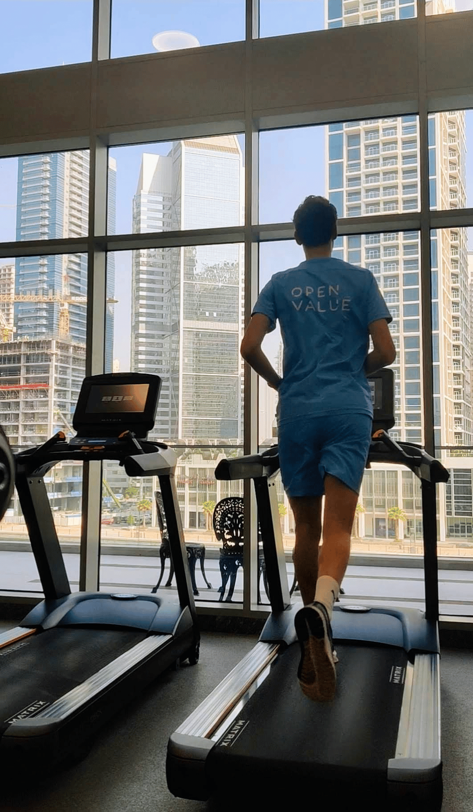
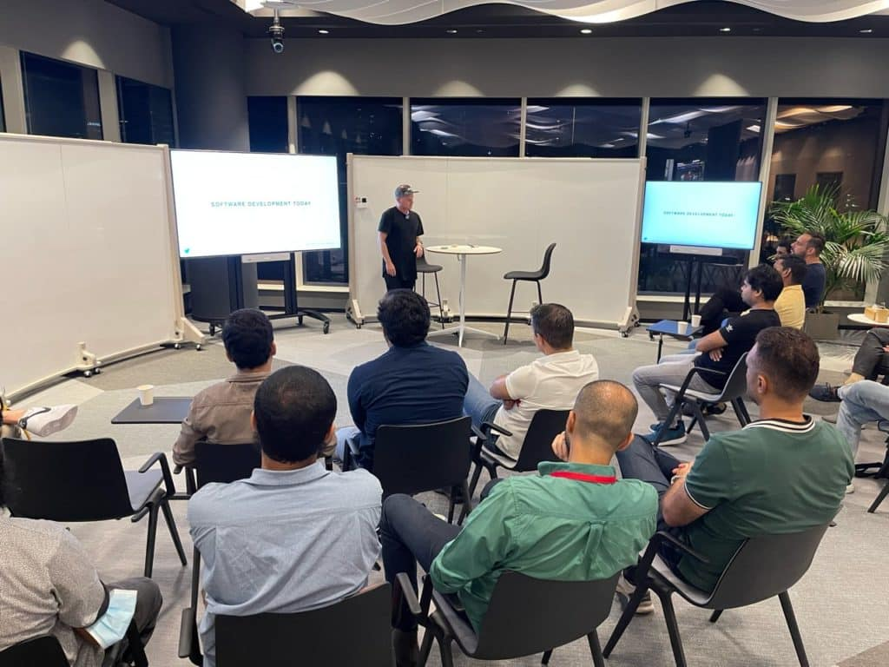
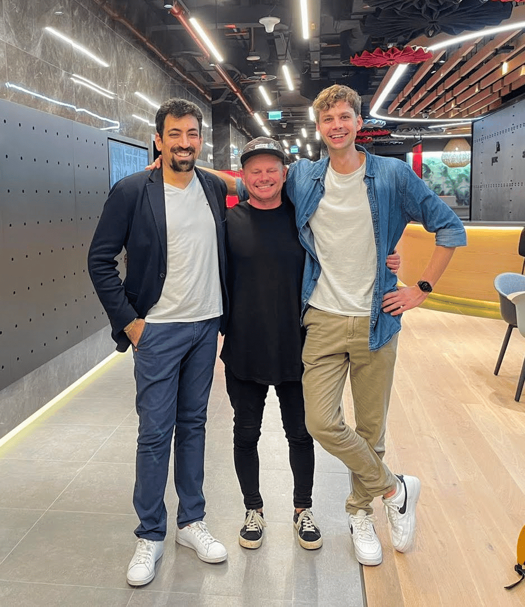

This was the second Dubai JUG meetup, yet the first **real** one. The first meetup was more of a practice team building session. Here is a trip report of the second Dubai JUG meetup at the PWC office.

### First day in Dubai {#h3-0-first-day-in-dubai}

This was my second time in Dubai. I had visited most of the landmarks the first time, making this a more relaxing visit without fear of missing out (FOMO). The temperatures were a lot more pleasant, where in June during my first visit it was above 40 degrees Celcius, this time around it was a more pleasant 30 degrees. I arrived Wednesday night in the hotel. I had set an alarm to make sure I wouldn't miss breakfast and woke up a bit jet lagged. It's surprising what just two hours of time difference can do!

Initially we planned the speaker dinner on Thursday, but Friday was a better fit so I had a free day in Dubai. During the day, I worked for a client from the hotel, with a beautiful and quite distracting view of the skyline. The second day I promised myself to start the day with a run. Not outside, of course, because it was way too hot, but inside the hotel at the comfort of the air conditioning with a nice view.

Meetup day {#h2-1-meetup-day}
-----------------------------

After a late breakfast and some work, I went to the PWC office for the meetup preparations. I met up with Jad Salhani, the JUG organizer, and Chris Thalinger, the other speaker. After testing the equipment, we had some time for lunch and our final preparations. Fun fact: we used an Apple TV for the presentations, quite convenient if you have a speaker that just uses their iPhone for slides.

At 5PM the moment was finally there, the first visitors came in, albeit it a bit too early. We were happy to welcome them with snacks and drinks. Not knowing what to expect, we were really happy with the turnup of about 15 people who managed to find us via the meetup page.

Dubai is a place with many expats but no real developer community, a gap that Jad is trying to fill with the Dubai JUG. You could see it working as there were quite some people that had just arrived in Dubai and were looking for people to connect with. Jad opened the meetup talking about the future of the JUG, followed by Chris with his keynote talk on the impact we developers can have on performance but also the environment. After a short break I talked about mutation testing, followed by Chris announcing Voxxed Dubai!

After everybody left it was time for the speaker dinner in the Marina area where you can get some good food and enjoy the view of the Dubai skyline. All by all a great (first) meetup! With many more to come. Are you interested in joining the Dubai JUG? [Keep an eye out and join the meetup group for future events!](https://www.meetup.com/meetup-group-otgagdwa/)

