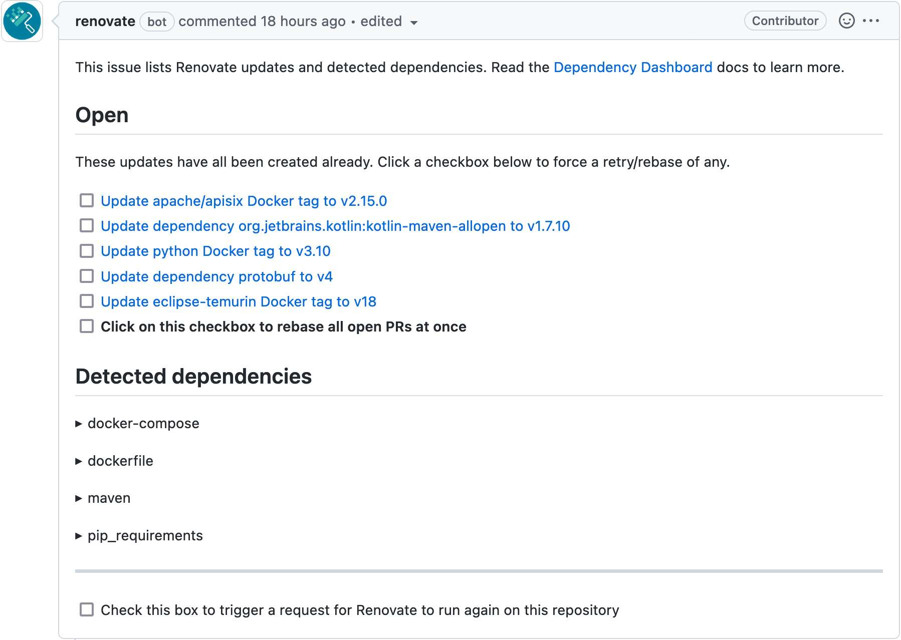

I won't introduce [Dependabot](https://github.com/dependabot). Lots and lots of developers use it daily on GitHub. I do use it as well. However, it suffers from two drawbacks:

* While it's perfectly integrated with GitHub, integrations with other platforms are less seamless.
* It's limited in the list of [ecosystems](https://docs.github.com/en/code-security/dependabot/dependabot-version-updates/configuration-options-for-the-dependabot.yml-file#package-ecosystem) it supports For example, I generally use Docker Compose files for my demos. When necessary, I use Kubernetes. Dependabot supports none.Worse, Dependabot [doesn't accept contributions to add new ecosystems](https://github.com/dependabot/dependabot-core/blob/main/CONTRIBUTING.md#contributing-new-ecosystems).

Recently, I watched Viktor Farcic's [Automate Dependency Management With Renovate](https://www.youtube.com/watch?v=l0YH557eIiE). I found [Renovate](https://www.mend.io/free-developer-tools/renovate/) super neat, thought about using it, and... forgot. Then I stumbled upon another mention of it. It pushed me to implement it in two locations:

* On my blog
* For a demo using Docker Compose

Keeping my blog up-to-date
--------------------------

I've already written multiple times about my blog's infrastructure. In the context of this post, the relevant parts are:

* It's based on Jekyll. Jekyll is a Ruby-based static site generator. To manage Ruby gems dependencies, I use [bundler](https://bundler.io/).
* I generate the site at every push on GitLab. I configured the build via the standard `.gitlab-ci.yml` file.
* Finally, to avoid building the whole infrastructure at each build, I rely on a Dockerfile. It provides the JRuby base image and a couple of required binaries, *e.g.* , `graphviz`. The GitLab build starts from this image.

Renovate offers [instructions](https://gitlab.com/renovate-bot/renovate-runner/) to install the product for GitLab. As I had to understand how Renovate works and how to install it, I had to consult quite a few sites.

Here's a sum-up of my understanding:

* You need to create a dedicated project on GitLab to run Renovate
* The GitLab scheduler should trigger it, *e.g.*, weekly or daily
* Renovate has two configuration types: one that applies to the runner itself *and* one that applies to the project. If you set up parameters on the runner, they will apply to each project Renovate runs on. The documentation recommends that each project should get its specific configuration. Note that Renovate offers a mechanism to factor configuration across different projects.

In the end, I ended up with the following Renovate runner configuration:

```yaml
variables:
  RENOVATE_GIT_AUTHOR: Renovate Bot <<a href="/cdn-cgi/l/email-protection" class="__cf_email__" data-cfemail="60020f142012050e0f160114054e030f0d">[email protected]</a>>
  RENOVATE_REQUIRE_CONFIG: optional

include:
    - project: 'renovate-bot/renovate-runner'
      file: '/templates/renovate-dind.gitlab-ci.yml'                    #1
```


1. The [template](https://gitlab.com/renovate-bot/renovate-runner/-/blob/main/templates/renovate-dind.gitlab-ci.yml) provides a solid set of default values, *e.g.*, environment variables: the platform is GitLab, the log level is info, etc.

By default, Renovate "sniffs" what package managers the project uses. On my blog, it checked HTML files as well. To reduce the scope, I configured only the necessary package managers:

```json
{
  "enabledManagers": ["gitlabci", "dockerfile", "bundler"]
}
```


It allows for managing dependencies of GitLab CI, Docker, and Bundler only.

You may want to set the `LOG_LEVEL` environment variable to `debug`, especially at the beginning; it helps *tremendously* . For example, my first few runs stopped with the cryptic message `Repository is disabled - skipping`. With debug-level logging, I could understand why: `DEBUG: MRs are disabled for the project - throwing error to abort renovation`.

The next step is to achieve the desired results. In my case, Renovator didn't open any merge request.

* GitLab CI:The build file mentions my image with `latest` and the Kaniko image with `debug`. None of them are semantic, and Renovate cannot offer any advice. While I don't care about the former, I do care about the latter. Note to my future self: I need to fix it.
* Docker:The `Dockerfile` uses `jruby:9.3-jre11` as the parent image. Though it's not a semantic version, Renovate can extract the correct semantic version (as seen in the log: `"currentVersion": "9.3",`). Yet, there's no newer version and Renovate correctly does nothing.
* Gems:I'm using Bundler, and dependencies are pinned in a `Gemfile.lock` file. By default, Renovate doesn't propose any upgrade.

For GitLab and Docker, one can expect the results: no semantic versioning and no later version. For Gems, I was a bit puzzled. The reason lies in [how Renovate handles updates](https://docs.renovatebot.com/configuration-options/#rangestrategy).

The default strategy is `replace`:
> Replace the range with a newer one if the new version falls outside it, and update nothing otherwise

Another strategy is `update-lockfile`:
> Update the lock file when in-range updates are available, otherwise replace for updates out of range. Works for `bundler`, `composer`, `npm`, `yarn`, `terraform` and `poetry` so far.

It seems to be much more reasonable. I updated Jekyll's configuration file:

```json
{
  "enabledManagers": ["gitlabci", "dockerfile", "bundler"],
  "packageRules": [
    {
      "matchManagers": ["bundler"],                           #2
      "rangeStrategy": "update-lockfile"                      #1
    }
  ]
}
```


1. Update the range strategy to apply
2. Only for Bundler - it doesn't make any sense for GitLab or Docker

I reran the Renovate job, and I had my Merge Request ready this time! Renovate correctly identified the to-be-updated dependencies, upgraded them, and created the MR.

```
 4 |  4 |   | addressable (2.8.0)
 5 |  5 |   |   public_suffix (>= 2.0.2, < 5.0)
 6 |  6 |   | asciidoctor (2.0.17)
 7 |  7 | - | asciidoctor-diagram (2.2.1)
   |  8 | + | asciidoctor-diagram (2.2.3)
 8 |  9 |   |   asciidoctor (>= 1.5.7, < 3.x)
 9 | 10 |   |   asciidoctor-diagram-ditaamini (~> 1.0)
10 | 11 |   |   asciidoctor-diagram-plantuml (~> 1.2021)
11 |    |   |   rexml
12 |    | - | asciidoctor-diagram-ditaamini (1.0.1)
13 |    | - | asciidoctor-diagram-plantuml (1.2022.1)
   | 12 | + | asciidoctor-diagram-ditaamini (1.0.3)
   | 13 | + | asciidoctor-diagram-plantuml (1.2022.5)
14 | 14 |   |   colorator (1.1.0)
15 | 15 |   |   concurrent-ruby (1.1.10)
16 | 16 |   |   cssminify2 (2.0.1)
```


Here's a log snippet that shows the magic:

```json
{
  "depName": "asciidoctor-diagram",
  "managerData": {"lineNumber": 10},
  "datasource": "rubygems",
  "depTypes": ["jekyll_plugins"],
  "lockedVersion": "2.2.1",
  "depIndex": 7,
  "updates": [
    {
      "bucket": "non-major",
      "newVersion": "2.2.3",
      "newMajor": 2,
      "newMinor": 2,
      "updateType": "patch",
      "isRange": true,
      "isLockfileUpdate": true,
      "branchName": "renovate/asciidoctor-diagram-2.x-lockfile"
    }
  ],
  "warnings": [],
  "versioning": "ruby",
  "currentVersion": "2.2.1",
  "isSingleVersion": true,
  "fixedVersion": "2.2.1"
}
```


Keeping a demo up-to-date
-------------------------

While I host my blog on a private repository on GitLab, all my demos are public repositories on GitHub. As I mentioned, the integration of Dependabot on GitHub is excellent. However, it leaves out a few package managers I'm regularly using, Docker Compose files and Kubernetes manifests. Renovate to the rescue!

It's a breeze to set up Renovate on your repositories. Just browse the [GitHub Renovate app](https://github.com/apps/renovate) and click on the big gree **Install** button in the top right corner. Choose which organization and which repositories you'll install Renovate in.

Renovate will open a [Pull Request](https://github.com/nfrankel/opentelemetry-tracing/pull/1) in every matching repository. The contains a single file, the `renovate.json` configuration file. You can update it according to your needs: [configuration options](https://docs.renovatebot.com/configuration-options/) are many!

From that point on, Renovate will monitor the configured repositories and send PRs, *e.g.*, in:

* [`Dockerfile`](https://github.com/nfrankel/opentelemetry-tracing/pull/5/files)
* [`docker-compose.yml`](https://github.com/nfrankel/opentelemetry-tracing/pull/2)

Even better, Renovate Bot limits the number of PRs to abide by [GitHub rate limiting](https://docs.github.com/en/rest/overview/resources-in-the-rest-api#rate-limiting). For convenience, it sends a [dedicated issue](https://github.com/nfrankel/opentelemetry-tracing/issues/4) titled "Dependency Dashboard", where you can see *all* available dependencies updates.



How to interact with the dashboard is pretty self-explanatory. Just check the relevant checkbox, and it opens a PR regarding the dependency. Renovate will also open PRs if below the rate limit.

Conclusion
----------

Renovate is a great tool. It works seamlessly on GitHub; on GitLab, you need a dedicated runner.

Compared to Dependabot, I love Renovate's capability to update Docker, Docker Compose, and Kubernetes files. I'll use it from now on.

**To go further:**

* [Renovate documentation](https://docs.renovatebot.com/)
* [Renovate managers](https://docs.renovatebot.com/modules/manager/)
* [GitLab Renovate runner](https://gitlab.com/renovate-bot/renovate-runner)

*Originally published at [A Java Geek](https://blog.frankel.ch/renovate-alternative-dependabot/) on August 21^st^, 2022*

*[PR]: Pull Request
