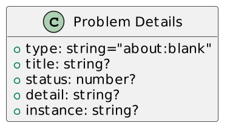
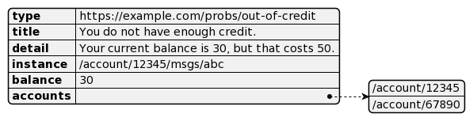
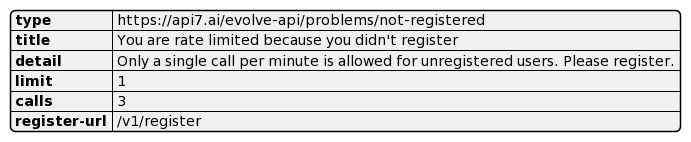

Ever since I started to work on the [Apache APISIX](https://apisix.apache.org/) project, I've been trying to improve my knowledge and understanding of REST RESTful HTTP APIs.

For this, I'm reading and watching the following sources:

* Books. At the moment, I'm finishing [API Design Patterns](https://www.manning.com/books/api-design-patterns). Expect a review soon.
* YouTube. I'd recommend [ErikWilde' channel](https://www.youtube.com/ErikWilde). While some videos are better than others, they all focus on APIs.
* s. Most RFCs are not about APIs, but a friendly person compiled a list of the [ones who are](https://standards.rest/).

Today, I'd like to introduce the "Problem Details for HTTP APIs" RFC, *aka* , [RFC 7807](https://www.rfc-editor.org/rfc/rfc7807).

The problem(s) {#h2-0-the-problem-s}
------------------------------------

REST principles mandate to use HTTP status to communicate.

For errors, HTTP defines two ranges: client errors, `4xx`, and server errors, `5xx`.

Imagine a banking API that allows you to make transfers. It should fail if you try to transfer more funds to your account. A couple of HTTP status codes can fit:

* `400 Bad Request`: The server cannot or will not process the request due to something that is perceived to be a client error
* `402 Payment Required`: The request cannot be processed until the client makes a payment. However, no standard use convention exists, and different entities use it in other contexts.
* `409 Conflict`: The request conflict with the current state of the target resource

Here's the first problem: HTTP status codes were specified for human-to-machine interactions via browsers, not for machine-to-machine interactions via APIs.

Hence, selecting a status code that maps one-to-one to the use case is rarely straightforward. For the record, [Martin Fowler seems to favor 409 in our case](https://martinfowler.com/articles/richardsonMaturityModel.html).

Whatever the status code, the second problem concerns the error payload or, more precisely, its structure. The structure is unimportant if a single organization manages the client and the API provider. Even if a dedicated team develops each of them, they can align. For example, imagine a mobile app that calls its own API.

However, issues arise when a team decides to use a third-party API. The choice of the response structure is significant in this case because it's now considered part of a contract: any change from the provider may break the clients. Worse, the structure is likely different from provider to provider.

Hence, a standardized error reporting structure:

* Provides uniformity across providers
* Increases API stability

RFC 7807 {#h2-1-rfc-7807}
-------------------------

[RFC 7807](https://www.rfc-editor.org/rfc/rfc7807) aims to solve the problem by providing a standardized error structure.

The structure is the following:

The RFC describes the fields:
> * `"type"` (`string`) - A URI reference [\[RFC3986\]](https://www.rfc-editor.org/rfc/rfc3986) that identifies the problem type. This specification encourages that, when dereferenced, it provide human-readable documentation for the problem type (*e.g.* , using HTML [\[W3C.REC-html5-20141028\]](https://www.rfc-editor.org/rfc/rfc7807#ref-W3C.REC-html5-20141028)). When this member is not present, its value is assumed to be `"about:blank"`.
> * `"title"` (`string`) - A short, human-readable summary of the problem type. It SHOULD NOT change from occurrence to occurrence of the problem, except for purposes of localization (*e.g.* , using proactive content negotiation; see [\[RFC7231, Section 3.4\]](https://www.rfc-editor.org/rfc/rfc7231#section-3.4)).
> * `"status"` (`number`) - The ([\[RFC7231\], Section 6](https://www.rfc-editor.org/rfc/rfc7231#section-6)) generated by the origin server for this occurrence of the problem.
> * `"detail"` (`string`) - A human-readable explanation specific to this occurrence of the problem.
> * `"instance"` (`string`) - A URI reference that identifies the specific occurrence of the problem. It may or may not yield further information if dereferenced.
>
> -- [Members of a Problem Details Object](https://www.rfc-editor.org/rfc/rfc7807#section-3.1)

The RFC offers the following sample when there needs to be more funds to make a banking transfer.

An example {#h2-2-an-example}
-----------------------------

I'll use one of my [existing demo](https://github.com/nfrankel/evolve-apis/) as an example.

The demo highlights several steps to ease the process of evolving your APIs.

In step 6, I want users to register, so I limit the number of calls in a time window if they aren't authenticated. I've created a dedicated Apache APISIX plugin for this. After the number of calls has reached the limit, it returns:

<pre class="EnlighterJSRAW" data-enlighter-language="generic">HTTP/1.1 429 Too Many Requests
Date: Fri, 28 Oct 2022 11:56:11 GMT
Content-Type: text/plain; charset=utf-8
Transfer-Encoding: chunked
Connection: keep-alive
Server: APISIX/2.15.0

{"error_msg":"Please register at https:\/\/apisix.org\/register to get your API token and enjoy unlimited calls"}</pre>

Let's structure the message as per RFC 7807.

Conclusion {#h2-3-conclusion}
-----------------------------

RFC 7807 not only helps client developers.

It's a tremendous help for API implementors as it provides quick guidelines to avoid reinventing the wheel on every project.

**Go further:**

* [RFC 7807](https://www.rfc-editor.org/rfc/rfc7807)
* [Standards.REST](https://standards.rest/)
* [HTTP Client Error 4xx](https://httpwg.org/specs/rfc9110.html#status.4xx)

*Originally published at [A Java Geek](https://blog.frankel.ch/structured-errors-http-apis/) on October 30^th^, 2022*

*[IETF]: Internet Engineering Task Force
*[RFC]: Request For Comments
