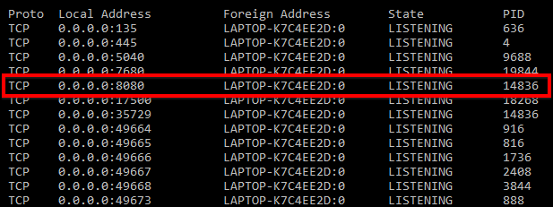
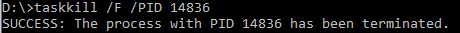
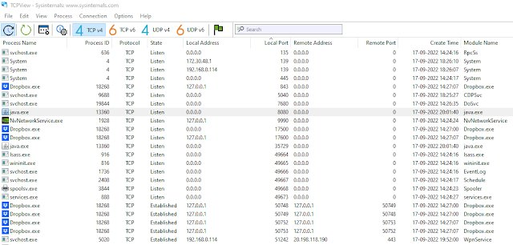
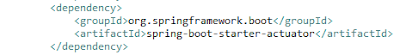
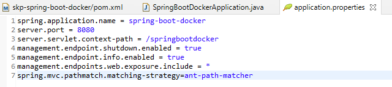
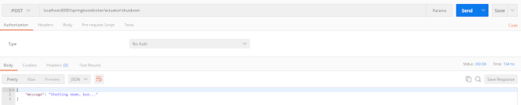
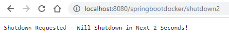
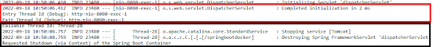
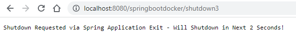
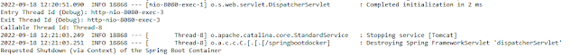

For the last three to four years, I have been working on Spring Boot and its associations, such as Spring Cloud, Spring Data, and Spring Security.

I have always been tempted to use the combination of Ctrl+C and task kill for the purpose of killing Spring Boot applications or processes. It can be automated by a batch script, but usually I was quite lazy to do this myself, as the combination of actions used to serve the purpose!

Almost always on the command line, Ctrl+C kills the Spring Boot application process, although the outcome is very different on Eclipse IDE. The process outlives the Ctrl+C termination of Spring Boot applications, in the case of the IDE.

Anyways, this unreliable and inconsistent outcome across platforms requires us to find standard or clean ways to shutdown Spring Boot applications and processes.

Please note that this article is oriented toward the Windows operating system.

GitHub Link to Clone Repository / Fork Code  
<https://github.com/sumithpuri/skp-spring-boot-shutdown>

Remember this article will explain ways to shutdown a Spring Boot application 'cleanly'. This means that terminating a Spring Boot application will also lead to its process being terminated, immediately.

It is different from a graceful shutdown at the application level, where the application may need to perform certain actions or wait for a certain period of time to gracefully respond to current requests or to end current processing.

**1. Terminate the Application, Kill the Process (Command Line) - IDE**

You can verify this fact by issuing this command on the command-line

```
netstat -ao
```

You will get a screen such as the below. Locate the port on which you had started the Tomcat Server.  


Go ahead and locate the PID and kill the task (Windows/MS-DOS)

```
taskkill /F /PID 14836
```



Note that if you were running the application from the command-line, You can just press \[Ctrl+C\] to terminate the application. In most cases, it will also kill the process. But if it does not kill the process, you should proceed with the above mentioned steps.  
**\[1a\]** ++Automate the writing of Process Id to a File++

\[The above mentioned task of finding out the process id associated with the application can be automated or programmed using the 'ApplicationPidFileWriter' as shown below. In the below example, when the server starts it will write the PID to the file name 'sbshutdownwin.pid'. Later, the same steps as described above can be followed to kill the process. Note that the steps can also be automated via Batch Scripting in Windows/MS-DOS\]

```java
 SpringApplication springBootapplication = new SpringApplication(SpringBootDockerApplication.class);  
 springBootapplication.addListeners(new ApplicationPidFileWriter("sbshutdownwin.pid"));  
 springBootapplication.run();
```

**2. Terminate the Application, Kill the Process (TCPView)**

There is one another way to immediately kill the process via the TCPView tool that is made available by Microsoft. It is available at this [link](https://learn.microsoft.com/en-us/sysinternals/downloads/tcpview) to download.


The next simple method is proposed by me. Beginby clicking on the \[Terminate - Red Square in Eclipse on the Console Tab\] button. You will observer that the application immediately shuts down. But infact at the background, the tomcat server will still be running on the port that it was started!

Use the above TCPView tool to locate the process based on the port on which you started the Tomcat Server/Spring Boot Application. Right Click on the process/row item and click on \[Kill Process...\] and then again Click on \[OK\] to confirm the killing of the operating system process.

This is a very convenient way especially if you are a Software Architect or an Engineer who has lots of Microservices to develop/manage/maintain. It will be useful when you are in depths of testing/debugging/fixing.

**3. Shutdown using Actuator Endpoint**

The most 'cleanest' way among the ones I described until now is the usage of Actuator to shutdown the spring boot applications. You will begin this by making sure to the include the following in your **pom.xml**



Next make sure that you have enabled the shutdown endpoint via actuator using the properties as shown below.



Once you have to shutdown the application, the actuator endpoint /shutdown will also kill the associated process. This is a very clean way to shutdown the Spring Boot applications. You have to make sure that you invoke the actuator endpoint /shutdown via a \[POST\] request only.


If Spring Boot is the root context of your spring boot application, then the invocation will look like the following. The above diagram shows the response from the request sent via Postman.

```batch
 http://localhost:8080/springbootdocker/actuator/shutdown
```

**4. Close the Spring Boot ApplicationContext**

The application context needs to be stored when you start/run the spring boot application in your spring boot application class.

```java
public class SpringBootDockerApplication {  
      // Clean Shutdown Method 2 - Actuator Shutdown Endpoint - Store the Context  
      // Not a Recommended Way to Use public static - Only for the Demo Purposes..  
      public static ConfigurableApplicationContext ctx;  
      public static void main(String[] args) {  
           // Clean Shutdown Method 2 - Actuator Shutdown Endpoint - Store the Context  
           ctx = SpringApplication.run(SpringBootDockerApplication.class, args);  
      }  
 }
```

You may then use the following controller method to close the context asynchronously. Also, note that a PreDestroy method has been added to do any cleanup.

```java
      // Starting Threads using Runnable is Not Always the Best Way..  
      // Do Explore Other Integrated Approaches such as Async Servlet  
      @RequestMapping(value = "/shutdown2", method = RequestMethod.GET, produces = MediaType.APPLICATION_JSON_VALUE)  
      public ResponseEntity<Object> rule() {  
           System.out.println("Entry Thread Id (Debug): " + Thread.currentThread().getName());  
           Runnable runnable= () -> {  
                try {  
                     Thread.sleep(2000);  
                } catch (InterruptedException e) {  

                     System.out.println("Thread was Interrupted! Error in Thread Sleep (2 Seconds!)");  
                }  
                System.out.println("Callable Thread Id: " + Thread.currentThread().getName());  
                SpringBootDockerApplication.ctx.close();            
           };  

           new Thread(runnable).start();  
           System.out.println("Exit Thread Id (Debug): " + Thread.currentThread().getName());  
           return new ResponseEntity<>("Shutdown Requested - Will Shutdown in Next 2 Seconds!", HttpStatus.OK);  
      }  

      @PreDestroy  
      public void requestShutdown2PreDestroy() {  

           System.out.println("Requested Shutdown (via Context) of the Spring Boot Container");  
      }
```

Once the above has been done, built and deployed. You may then close the spring boot using the following browser request.



You will notice that the application has been shutdown when you see the console and also the process has been removed from the operating system processes.



**5. Exit using SpringApplication.exit()**

The other way is use the exit() method of the SpringApplication class, it will also require to use System.exit() for ending the process.

```java
    // Clean Shutdown Method 2 - Actuator Shutdown Endpoint - Store the Context   
    // Not a Recommended Way to Use public static - Only for the Demo Purposes..   
    private static ConfigurableApplicationContext ctx;   

    public static void main(String[] args) {   

       // Clean Shutdown Method 2 - Actuator Shutdown Endpoint - Store the Context   
       ctx = SpringApplication.run(SpringBootDockerApplication.class, args);   
    }   

    public static void exitApplication() {   
       int staticExitCode = SpringApplication.exit(ctx, new ExitCodeGenerator() {   

        @Override   
        public int getExitCode() {   
        // no errors   
        return 0;   
        }   
       });   

       System.exit(staticExitCode );   
    }
```

The controller will look similar to what we had written previously. Once your application is running and you want to shutdown the application 'cleanly', then you may use the following:



You will notice that the application has been shutdown when you see the console and also the process has been removed from the operating system processes.



**\[Reference\]**   
<https://www.javadevjournal.com/spring-boot/shutdown-spring-boot-application/>
