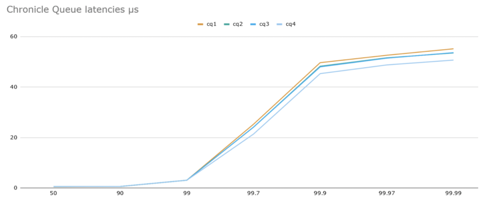
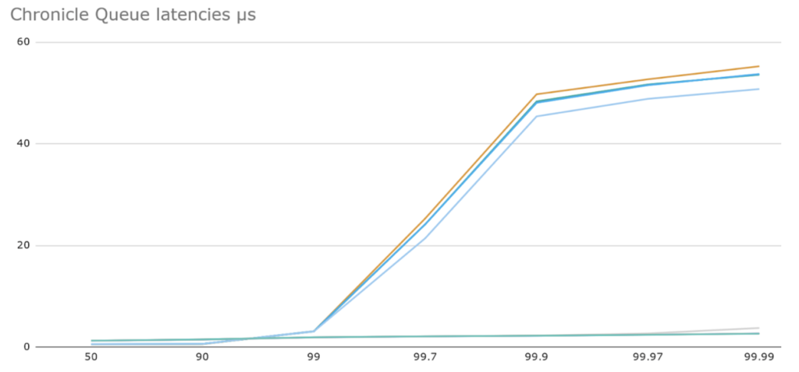

Persistent queue solutions are frequently used when designing low-latency applications.

The problem is that high sustained message rates, or bursty workloads, can lead to delays caused by the OS or hardware which are challenging to mitigate.

In this article, we will describe how [Chronicle Queue Enterprise](https://chronicle.software/queue-enterprise/ "Chronicle Queue Enterprise") solves this.

### Background

When benchmarking Java low-latency persistent queue solutions, latencies tend to be excellent up to high percentiles until sustained throughput limits are reached; these sustained throughput limits are determined by disk performance, OS version, and configuration.

Unfortunately, despite OS virtual memory pages (and the disk) being used in a predictable, forward-only manner, sometimes the OS introduces pauses in processing.

[Open Source Chronicle Queue](https://chronicle.software/queue/ "Open Source Chronicle Queue") is a pure Java low-latency unbounded persisted queue. It works by reading from and writing to memory-mapped files. These files are mapped into the process' address space in fixed-size pages. Pages are loaded on-demand as the queue is read from or written to.

The OS keeps these pages in the page cache in case they will need to be accessed frequently. As system memory is used, it is necessary for the OS to free up space in the page cache, by copying the contents of memory to disk.

### Benchmark Using Open Source Chronicle Queue

Here we are running a benchmark with 4 runs, each of 3M messages of size 140 bytes at a rate of 100K/sec.

The below graph shows latencies at various percentiles in microseconds and we can see that latencies -- while impressive -- climb at the higher percentiles to around 50μs.



*All timings in this article make use of the following benchmarking methodology: using [JLBH](https://github.com/OpenHFT/JLBH "JLBH") we send a sustained number of 140 byte messages per second (accounting for [coordination omission](https://medium.com/@siddontang/the-coordinated-omission-problem-in-the-benchmark-tools-5d9abef79279 "coordination omission")) and these messages are timestamped then written into a Chronicle Queue.*

*Another thread waits for these messages to arrive and reads them, recording the difference between the time after reading vs the writing timestamp and records these in a histogram. All experiments were run on Centos 7 Xeon E5-2650 v4 @ 2.20GHz.*

### Why Do We See These Delays and How to Fix

The short answer is that the OS and hardware are introducing the delays because they are stalling the process while waiting for a page to be read from or written to disk. You can reduce these delays by:

* Making use of Chronicle Queue's [pretoucher](https://github.com/OpenHFT/Chronicle-Queue#pretoucher-and-its-configuration "pretoucher").
* Mapping the queue to /tmpfs removes delays caused by disk I/O, but only if the queue is small enough and you have a suitable replication strategy.
* Tuning of the BIOS and OS is effective, but requires patience and expertise: power states, BIOS, kernel, RAID, and changing to an alternative file system all help.

But, a straightforward way to mitigate this -- if you have [Chronicle Queue Enterprise](https://chronicle.software/services/ "Chronicle Queue Enterprise") -- is to set a few parameters when creating your queue:

```java
builder.readBufferMode(BufferMode.Asynchronous); 
builder.writeBufferMode(BufferMode.Asynchronous);
```


which configures Chronicle Queue Enterprise in asynchronous mode to absorb any latencies from the OS/hardware.

Below we see results with the same workload and asynchronous mode configured (qe1 -- 4) overlaid on the same graph. We can see that latencies are slightly worse at low percentiles but are very well contained at the higher percentiles -- even at 99.99 all latencies are less than 4μs.



### Conclusion

Fed up with pauses at the high percentiles in your application? You may want to consider Chronicle Queue Enterprise.

### Resources

[Chronicle Queue Enterprise](https://chronicle.software/queue-enterprise/ "Chronicle Queue Enterprise")
