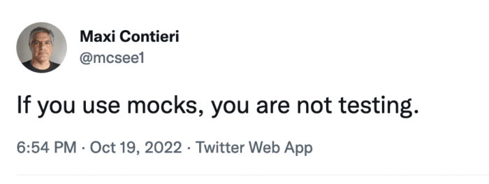
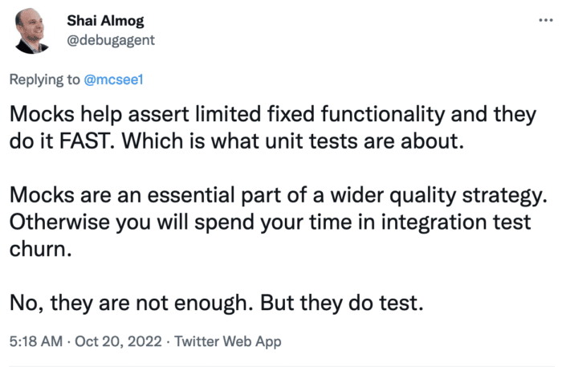

I love contradictions where both states of truth can work at the same time.

Case in point is this tweet about mocking from the other week:


> [If you use mocks, you are not testing](https://twitter.com/mcsee1/status/1582762075289374720)

My answer was:


> \[Mocks help assert limited fixed functionality and they do it FAST.
>
> Which is what unit tests are about. Mocks are an essential part of a wider quality strategy. Otherwise you will spend your time in integration test churn.
>
> No, they are not enough. But they do test.\](<https://twitter.com/debugagent/status/1582919132856864768>)

It would seem we are both saying the exact opposite but in fact that isn't necessarily the case. I get what Maxi is saying here and his point is very valid. Mocks are problematic.

## The Problems with Mocks

Mocks hide external dependencies on the real API and as a result they don't test them.

This limits the scope of the test to a very narrow, hard-coded set.

It relies on internal implementation details such as the dependencies to implement the test, that means the test will probably fail if the implementation changes even though the contract doesn't change e.g. let's look at an example:

```java
public int countUserCities() {
    return db.executeInt(“select count(“city”) from users”);
}
```

We can mock the db function executeInt since the returned result will be bad.

But this will break if we change the original API call to something like this:

```java
public int countUserCities() {
    return db.count(“city”,”users”);
}
```

This covers nothing. A far better approach is to add fake data to a temporary database which is exceedingly easy to do thanks to projects such as [Testcontainers](https://www.testcontainers.org/).

We can spin up containers dynamically and "properly" check the method with a database similar to the one we have in production. This performs the proper check, it will fail for bugs like a typo in the query and doesn't rely on internal implementation.

Unfortunately, this approach is problematic. Loading a fresh database takes time. Even with containers. Doing it for every suite can become a problem as the scope of testing grows. That's why we separate the unit and integration tests. Performance matters.

## The Performance Problem

You know what's the worst type of testing?

The ones you don't run and end up deleting.

Testing frequently is crucial, continuous testing lets us fail quickly during development. A quick failure means our developer mode is still fresh on the change that triggered the failure. You don't need git bisect, you can fix things almost instantly.

For this to work properly we need to run testing cycles all the time. If it takes a while to go through a testing workflow and requires some configuration (e.g. docker etc.) which might collide with CPU architecture too (e.g. M1 Mac), then we might have a problem.

We mock external dependencies for the unit test so performance will improve. But we can't give up on the full call to the actual API because the mocking has issues. However, these can run in the CI process, we don't need to run them all the time. Does this breed duplication: yes. It sucks and I don't like it.

Unfortunately, there's no other way I'm aware of at this time. I tried to think about a way around this with code that would act as a unit test in one execution and as an integration test invoking the real counterpart when running in CI. But I couldn't come up with something workable that didn't make things worse.

Because of this I think it's important to check coverage of integration tests only. The unit test coverage is interesting but not as crucial as the integration coverage. I'm not in favor of 100% coverage. But it is an important statistic to monitor.

## What Should We Mock?

I gave the database example but I'm not in favor of mocking databases. For Java I typically use a light in-memory database which works well with most cases. Fakers accept CSV formats to fill up the database and can even come up with their own fake data. This is better than mocking and lets us get close to integration test quality with unit test performance.

However, we can't constantly connect to Web Service dependencies without mocking. In that sense I think it's a good idea to mock everything that's outside of our control. In that point we face the choice of where to mock. We can use mock servers that include coded requests and responses. This makes sense when working with an integration test. Not so much for a unit test, but we can do it if the server is stateless and local. I'd prefer mocking the call to the API endpoints in this case though. It will be faster than the actual API but it could still cause problems.

Over-mocking is the process of applying mocks too liberally to too many API calls. A developer might engage in that in order to increase the coveted coverage metric. This further strengthens my claim that coverage shouldn't apply to unit tests as it might lead to such a situation. Behavior shouldn't be mocked for most local resources accessed by a framework.

## Finally

I love mocking. It made the development of some features possible. Without it I couldn't properly check plugins, APIs, servers, etc. However, like all good sweets. Too much of a "good thing" can corrupt our code. It's also a small part of a balanced meal (stretching the metaphors but it works). We can just build functional tests and call it the day, we can't just rely on mocking. On the contrary, they aren't the "real" badge of quality we seek.

Integration testing occupies that spot. When we have coverage, there we have important, valuable coverage. Mocking is wonderful for narrowing down problems and avoiding regressions. When I need to check that a fix is still in place, mocked testing is the perfect tool. Development of such components is problematic and fragile. But that's a good thing, we want that code to be tied to the implementation a bit.

Some operations would be difficult to cover without proper mocking. When testing the entire system that might be reasonable to expect but not for functional testing. In these cases, we need a fast response and the actual API might not be enough.
