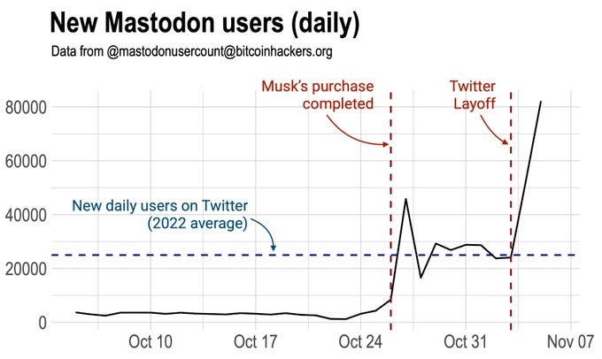

Twitter has been my absolute "source of truth" for many years.

For me, it's the ideal medium to pick up new technologies, learn from experts, meet new people, etc.

It even seemed I was able to "train the model" by carefully selecting the people I follow, as it has never been an abusive or hostile environment as it is perceived by many others.

Many years ago I already created an account on Mastodon, but was not very active on it, as most of the people I follow, weren't active there either.

But all that has changed in the last weeks since Elon Musk became Twitters owner and CEO, and started with some very aggressive changes.
> The goal of this post is not to start a pro or contra Twitter discussion! No, the real goal is to investigate if the Java community is interested in joining a dedicated Mastodon instance.

## What is Mastodon

To be clear: it's not a Twitter replacement! It doesn't have all the same features and doesn't work completely the same. But ... that's actually a good thing!
> How Mastodon explains what they are: "Do you have an email? If you do, you already understand how Mastodon works."

Main facts about Mastodon:

* It's an [open source GitHub project](https://github.com/mastodon/mastodon) created by Eugen "Gargron" Rochko, a German programmer.
* There is no company that controls and owns it.
* It's federated, meaning there is not one single central service. Anyone can host it and use for his/here own use, or open it to others to join
* There are no advertisements.
* Your timeline is not controlled by an algorithm, it's just the people you follow.
* When you want to create a Mastodon account, you have to select a server to join as you can see on [joinmastodon.org/servers](https://joinmastodon.org/servers). Some of these are suffering from growing pains and have become slower the last days as they need to scale up to be able to handle the new members.
* You can move from one server to another (or your own) at any time.
* The owner/administrator of a server can read all your messages. Please consider all your posts as public and readable.
* You can edit your posts! Yes really!!! 😉

Want to learn more? [Jeroen Baert has written this very nice overview](https://www.forceflow.be/2022/11/07/mastodon-qa/).

## Recent growth of Mastodon

Since the last weeks, Mastodon has seen an enormous growth as you can see in the hourly generated graph on [@\[email protected\]](https://mastodon.social/@mastodonusercount@bitcoinhackers.org).



This is an other graph shared by [Mike Masnik](https://twitter.com/mmasnick/status/1589400288712359936), that gives you a similar idea related to what is happening at Twitter:

## Community on Twitter and Mastodon

A list has been created by Marc R. Hoffmann on [javabubble.org](https://javabubble.org/) to keep track of all the people sharing Java-knowledge on Twitter, Mastodon and GitHub.

This is a good starting point if you want to start following some of these people. And you can add yourself or others via the [GitHub project](https://github.com/marchof/javabubble).

## A Mastodon service for the Java community

foojay.io is willing to cover the costs of a Java Mastodon server, if within certain not-yet-defined limits, but how do we handle this?

### Hosting an instance

First things first: to be able to start a Java-community a Mastodon services has to be setup.

Personally I'd prefer to leave this responsibility to someone who has experience, already did this, and can handle the challenge of upgrading or upscaling as needed.

I see two possibilities:

* [masto.host](https://masto.host/)
  * Probably the Mastodon provider with the most experience.
  * Because of the boom of the last weeks, is not accepting new clients...
* [toot.io](https://toot.io/mastodon_hosting.html)
  * Not fully clear what company is behind it, but is responsive in answers.
  * Can host in Europe.

### Managing the instance

If we start a Java-specific Mastodon service, who can join it?

As there is an enormous interest in Mastodon at this moment, and all these new users are looking for free and fast services, we probably need to limit the number of people joining to guarantee a stable performance and reasonable cost.

Keeping the content safe and friendly, might also need some moderators.

Questions to be answered:

* Joining only possible via invite?
* Who gets invited?
* Who wants to monitor the service and be moderator?

## Conclusion

As you understand, no decision has been made yet.

How do you think we should proceed?

Let me know on <https://twitter.com/FrankDelporte> or <https://mastodon.social/@frankdelporte>.
