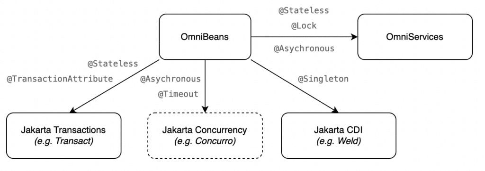

Enterprise Beans was once the face of Java EE, but as we [discussed in the previous article](https://foojay.io/today/the-future-of-ejb/), is currently de-emphasised in Jakarta EE.

However, since there's so much existing code using Enterprise Beans, a certain level of support is still desired.

[Piranha Cloud](https://piranha.cloud), a relatively new runtime supporting Jakarta EE, takes a somewhat novel approach to Enterprise Beans. Instead of implementing a separate container, Piranha Cloud, via the OmniBeans project, maps Enterprise Beans annotations to equivalent functionality in CDI itself, or to technologies in Jakarta EE leveraging CDI (such as Jakarta Transactions).

Enterprise Beans features not currently present in Jakarta EE, such as the pooled concept for Stateless beans, are provided by the OmniServices library.

An overview of the mappings is depicted in the following diagram:

OmniBeans primarily consists out of a CDI extension, that observes the `ProcessAnnotatedType` event. When it encounters say the `@Stateless` annotation on a bean it adds `@Pooled` from OmniServices, and depending on any `@jakarta.ejb.TransactionAttribute` and/or `@jakarta.ejb.TransactionManagement` annotation the `@jakarta.transaction.Transactional` annotation from Jakarta Transactions.

Piranha Cloud uses the standalone and pluggable Jakarta Transactions implementation [Tr](https://github.com/OmniFish-EE/omni-transact)[a](https://github.com/OmniFish-EE/omni-transact)[nsact](https://github.com/OmniFish-EE/omni-transact) (which originates from GlassFish) for the code behind the `@Transactional` annotation. For the `@Asynchronous` annotation OmniServices is currently used, but in the future a pluggable Jakarta Concurrency implementation should be used for this. The "[Concurrency RI](https://github.com/eclipse-ee4j/concurrency-ri)" project is a likely candidate to base such an implementation on (with the proposed name Concurro).

The development of OmniBeans is still in its early days, but it's already able to pass a test taken from the EJB Lite TCK, which is the [stateless-tx test](https://github.com/javaee-samples/jakartaee-samples/tree/main/ee9-tck/ejblite/stateless-tx). This contains beans such as the following:

```java
@Stateless
public class TxBean {

    @PersistenceContext(unitName = "ejblite-pu")
    private EntityManager entityManager;

    /*
     * @testName: supports
     *
     * @test_Strategy:
     */
    @TransactionAttribute(SUPPORTS)
    public void supports(CoffeeEntity coffeeEntity, boolean flush) {
        updatePersist(coffeeEntity, flush);
    }

    // [...]

    protected void updatePersist(CoffeeEntity coffeeEntity, boolean flush) {
        coffeeEntity.setPrice(coffeeEntity.getPrice() + 100);
        entityManager.persist(coffeeEntity);

        if (flush) {
            entityManager.flush();
        }
    }

}
```

and

```java
@Stateless
@TransactionManagement(BEAN)
public class TestBean {

    private EntityManager entityManager;
    private UserTransaction userTransaction;

    private TxBean txBean;

    @PersistenceContext(unitName = "ejblite-pu")
    public void setEm(EntityManager entityManager) {
      this.entityManager = entityManager;
    }

    @Resource
    public void setUt(UserTransaction userTransaction) {
      this.userTransaction = userTransaction;
    }

    @EJB(beanInterface = TxBean.class)
    public void setTxBean(TxBean b) {
        txBean = b;
    }
}
```

As can be seen, those beans are far from trivial from a technical perspective. The fact that OmniBeans is already able to pass such a test bodes well for the future.

Hopefully at some point it will be able to fully pass the entire EJB Lite TCK this way, which would make for a very interesting Enterprise Beans implementation.

More information:

* [Pirahna Cloud runtime](https://piranha.cloud/)
* [Jakarta Enterprise Beans](https://jakarta.ee/specifications/enterprise-beans/) (EJB) specification
* [Jakarta Contexts and Dependency Injection (CDI) specification](https://jakarta.ee/specifications/cdi/)

[This article was originally published on the](https://omnifish.ee/2022/11/01/ejb-support-in-piranha-via-cdi/) [OmniFish blog. For more information about Jakarta EE, Eclipse GlassFish and related topics, subscribe to follow the OmniFish blog here:](https://omnifish.ee/2022/11/01/ejb-support-in-piranha-via-cdi/) <https://omnifish.ee/blog/>.  



## OmniFish - Jakarta EE experts {#more-61006}

* Eclipse GlassFish Production Support
* Jakarta EE Consulting
* Custom Development with Jakarta EE

For more information about OmniFish, contact them at their [contact page](https://omnifish.ee/contact-us/), or Twitter at [@OmniFishEE](https://twitter.com/OmniFishEE).
